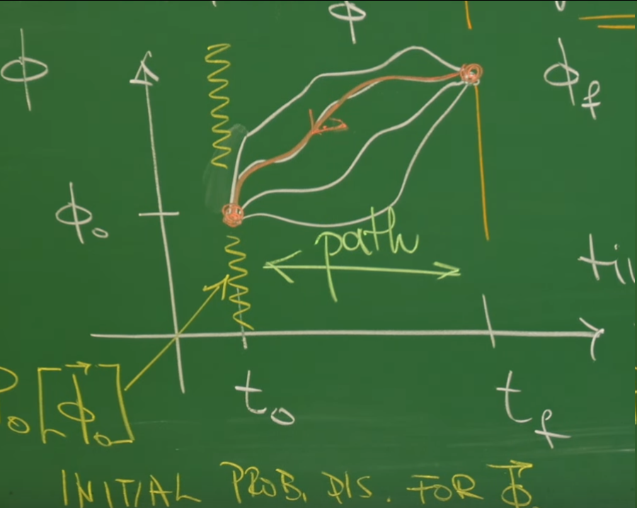
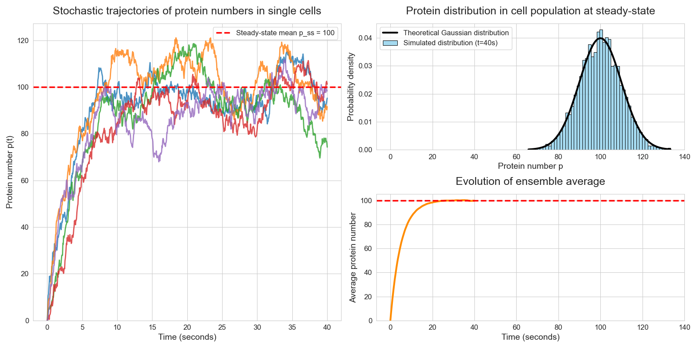

# 引言：从微分演化到历史求和

在先前的课程中，描述随机系统动力学的两大核心框架——朗之万方程与福克-普朗克方程——已被深入探讨。这两个框架与在第20和21讲中建立的随机微分方程(SDE)及伊藤微积分一道，构成了一种“微分”的观点，聚焦于系统状态从一个瞬间到下一个瞬间的演化。

* **轨迹视角 (Trajectory View)**：以**朗之万方程**为代表 (第17讲)，此框架从微观视角出发，追踪系统在确定性力与随机力作用下的**单条特定轨迹** $\vec{x}(t)$。它回答的问题是：“给定一个噪声实现，系统的路径将如何演化？”

* **系综视角 (Ensemble View)**：以**福克-普朗克方程**为代表 (第18讲)，此框架采用宏观统计视角，通过一个确定性的偏微分方程，描述了系统状态**概率密度** $p(\vec{x}, t)$ 的演化。它回答的问题是：“在大量相同的系统中，于$t$时刻在状态$\vec{x}$找到系统的概率是多少？”

尽管这两个框架功能强大，但它们并未直接回答一个更全局性的问题：“系统从初始状态$\vec{\phi}_0$演化至末态$\vec{\phi}_f$时，**遵循某一条特定路径（或称‘历史’）$\vec{\phi}(\vec{x}, t)$** 的概率是多少？” 朗之万方程只给出了一条样本路径，而福克-普朗克方程则聚焦于终点的概率，忽略了过程的细节。

为了填补这一概念上的空白，需要引入一个能为**整个轨迹**分配统计权重的数学工具。这正是**路径积分（Path Integral）方法**的核心目标，该方法在第19讲中已初步引入。特别是在第22讲中，我们已经见识到在处理**乘性噪声**时，由于雅可比行列式的存在，路径积分的构建变得微妙而复杂。本讲将首先聚焦于相对简洁的**加性噪声(Additive Noise)**情形，系统性地构建这一框架。

这节课的核心思想，借鉴了费曼在量子力学中发展的“历史求和”（Sum Over Histories）方法。其目标是构建一个**概率泛函 (Probability Functional)**，记作 $W[\vec{\phi}]$。这个泛函能够为在第23讲中通过“粗粒化”方法得到的**连续场** $\vec{\phi}(\vec{x}, t)$ 在时间区间 $[t_0, t_f]$ 内的任意一条完整演化历史赋予一个概率值。

一旦构建了这个概率泛函，任何可观测量 $\mathcal{O}[\vec{\phi}]$ 的系综平均值便可通过一个**泛函积分 (Functional Integral)** 来计算：

$$
\langle \mathcal{O}[\vec{\phi}] \rangle = \int \mathcal{D}[\vec{\phi}] \, \mathcal{O}[\vec{\phi}] \, W[\vec{\phi}]
$$

这里的积分符号 $\int \mathcal{D}[\vec{\phi}]$ 代表对所有可能的场历史进行“求和”。这种表述方式极其强大，因为它将一个随机动力学问题，转化为了一个统计场论问题。这使得借鉴量子场论中成熟的数学工具（如**微扰理论、重整化群**等）来分析经典随机系统成为可能。这节课将系统性地构建概率泛函 $W[\vec{\phi}]$，并运用它来揭示系统在热平衡状态下深刻的物理对称性，最终推导出与第24讲中昂萨格理论异曲同工的物理定律。




# 1. 构建场轨迹的概率泛函

这节课的核心任务是从已知的噪声统计特性出发，推导出描述场 $\vec{\phi}(\vec{x}, t)$ 任意一条演化历史的概率。其基本思路是在泛函积分中进行一次精妙的变量替换：**从噪声路径 $\vec{\xi}(\vec{x}, t)$ 的“语言”转换到场路径 $\vec{\phi}(\vec{x}, t)$ 的“语言”。**整个推导过程将揭示，一条特定场路径的发生概率，完全继承自驱动它产生的那条唯一噪声路径的概率，并由一个雅可比泛函行列式进行修正。

## 1.1 出发点：朗之万方程与高斯白噪声

理论的出发点是一个普遍的、描述多组分场 $\vec{\phi}(\vec{x}, t)$ 演化的朗之万方程组。这是第17讲中单粒子朗之万方程向连续场论的直接推广：

$$
\partial_t \phi_{\alpha}(\vec{x}, t) = A_{\alpha}[\vec{\phi}] + \xi_{\alpha}(\vec{x}, t)
$$

此方程中的各项具有明确的物理意义：

* **场变量 $\phi_{\alpha}(\vec{x}, t)$** ：这是描述系统状态的连续场，下标 $\alpha$ 代表其不同的组分（例如，在H模型中，$\vec{\phi}$ 可以同时包含粒子密度场和流体速度场）。

* **漂移泛函 $A_{\alpha}[\vec{\phi}]$** ：这是一个确定性的项，描述了系统的“漂移”（drift）。它通常源于系统向自由能更低状态演化的趋势，并依赖于场 $\vec{\phi}$ 的整体构型。例如，在先前讨论的理论模型中：
    * 对于描述非守恒标量场简单弛豫的**模型A**，该项与系统自由能 $F$ 的泛函导数成正比：$A_{\alpha} = -L_{\alpha} \frac{\delta F}{\delta \phi_{\alpha}}$。
    * 对于描述守恒标量场（如粒子密度）的**模型B**，该项则体现为流的散度：$A = \nabla \cdot \left( M \nabla \frac{\delta F}{\delta \phi} \right)$。

* **随机噪声项 $\xi_{\alpha}(\vec{x}, t)$** ：这是驱动系统涨落的随机力。

这节课要介绍的**加性高斯白噪声（additive Gaussian white noise）**，其统计性质由前两阶矩完全定义：

1.  **零均值：**
    $$
    \langle \xi_{\alpha}(\vec{x}, t) \rangle = 0
    $$

2.  **Delta关联的协方差：**
    $$
    \langle \xi_{\alpha}(\vec{x}, t) \xi_{\beta}(\vec{x}', t') \rangle = N_{\alpha\beta} \delta(\vec{x}-\vec{x}') \delta(t-t')
    $$

    * 这里的 $N_{\alpha\beta}$ 是一个常数矩阵，代表噪声的强度。
    * **“白噪声”**的性质体现在两个狄拉克 $\delta$ 函数上，表明噪声在任意两个不同的时间点或空间点上都是完全不相关的，即“无记忆”。
    * **“加性噪声”**意味着噪声强度矩阵 $N_{\alpha\beta}$ 是一个常数，不依赖于场 $\vec{\phi}$ 的值。这与第22讲中讨论的、更为复杂的乘性噪声情况构成了对比。
    


## 1.2 噪声历史的概率

由于假定噪声在每个时空点上都是一个独立的高斯随机变量，因此可以直接写出任意一段噪声历史 $\vec{\xi}(\vec{x}, t)$ 出现的概率泛函。这可被视为将多元高斯分布推广到了无限维的函数空间：

$$
W_{\xi}[\vec{\xi}] \propto \exp\left( -\frac{1}{2} \sum_{\alpha\beta} \int_{t_0}^{t_f} dt \int d^d x \, \xi_{\alpha}(\vec{x}, t) N_{\alpha\beta}^{-1} \xi_{\beta}(\vec{x}, t) \right)
$$

这个表达式的物理意义非常直观：
* **高斯形式**：源于中心极限定理，大量独立的微观碰撞效应叠加后，宏观噪声场趋向于高斯分布。
* **指数部分**：可以看作是这条噪声路径的“代价”或“作用量”。任何偏离零均值的噪声历史都会受到指数级的抑制。噪声越大，其出现的概率就越小。矩阵 $N_{\alpha\beta}^{-1}$ 在此扮演了“度规”的角色，定义了不同噪声分量涨落的相对“代价”。

## 1.3 关键步骤：从噪声到场的变量替换

这是整个推导的核心逻辑。朗之万方程为噪声历史 $\vec{\xi}(t)$ 与场历史 $\vec{\phi}(t)$ 之间建立了唯一的映射（在给定初始条件下）。因此，一条特定场路径 $\vec{\phi}(t)$ 发生的概率，必然等于产生这条路径的那个唯一的噪声历史 $\vec{\xi}(t)$ 发生的概率。

在数学上，这对应于在泛函积分中进行一次变量替换。概率的测度（probability measure）必须保持不变：

$$
W_{\xi}[\vec{\xi}] \mathcal{D}[\vec{\xi}] = W_{\phi}[\vec{\phi}] \mathcal{D}[\vec{\phi}]
$$

由此可得，场路径的概率泛函为：

$$
W_{\phi}[\vec{\phi}] = W_{\xi}[\vec{\xi}(\vec{\phi})] \cdot J[\vec{\phi}]
$$

其中，$\vec{\xi}(\vec{\phi})$ 是通过朗之万方程反解出来的噪声，而 $J[\vec{\phi}]$ 则是这次变量替换的**雅可比泛函行列式 (Jacobian functional determinant)**。

## 1.4 雅可比泛函行列式详解

在普通的多变量积分中，雅可比行列式是描述坐标变换如何改变微元体积的尺度因子。在无限维的函数空间中，其概念是类似的，定义为：

$$
J[\vec{\phi}] = \left| \det\left( \frac{\delta \xi_{\alpha}(\vec{x}, t)}{\delta \phi_{\beta}(\vec{x}', t')} \right) \right|
$$

直接计算这个泛函行列式是困难的。遵循讲座中的方法，先将时间离散化为步长为 $\Delta t$ 的小片段，$t_{\mu} = t_0 + \mu \Delta t$。离散化的朗之万方程可以写成：

$$
\frac{\phi_{\alpha,\mu} - \phi_{\alpha,\mu-1}}{\Delta t} = \Theta A_{\alpha,\mu} + (1 - \Theta) A_{\alpha,\mu-1} + \xi_{\alpha,\mu}
$$

其中，参数 $\Theta \in [0, 1]$ 定义了在时间步内如何评估确定性项 $A_{\alpha}$，这直接关联到在第20和21讲中详细讨论过的随机积分的不同诠释：


* $\Theta = 0$ 对应 **伊藤 (Itô)** 诠释。

  

* $\Theta = 1/2$ 对应 **斯特拉托诺维奇 (Stratonovich)** 诠释。

  

从上式反解 $\xi_{\alpha,\mu}$，可以计算雅可比矩阵的元素 $\frac{\partial \xi_{\alpha,\mu}}{\partial \phi_{\beta,\nu}}$。由于 $\xi_{\alpha,\mu}$ 只依赖于 $\phi$ 在不晚于 $\mu$ 时刻的值，这是一个下三角矩阵，其行列式等于对角元之积。在取 $\Delta t \to 0$ 的连续极限时，这个行列式的对数会给作用量带来一个修正项，其一般形式与 $\int dt \int d^dx \frac{\delta A_{\alpha}}{\delta \phi_{\alpha}}$ 有关。

这个结果看起来相当复杂。然而，本讲所做的**加性噪声**假设极大地简化了问题。


* 对于**乘性噪声**（即 $A$ 或 $N$ 依赖于 $\phi$），雅可比行列式会引入一个依赖于 $\phi$ 的复杂项，导致伊藤和斯特拉托诺维奇等不同诠释之间出现本质差异（如第22讲所示）。

  

* 但对于**加性噪声**，雅可比行列式中的 $\frac{\delta A_{\alpha}}{\delta \phi_{\beta}}$ 项若为常数或零（例如 $A$ 是 $\phi$ 的线性泛函），则雅可比行列式本身变为一个与路径 $\vec{\phi}$ 无关的常数。这个常数可以被吸收到总的归一化因子中，因此在计算相对概率时可以被忽略。

  

这是一个重要的简化，使后续能够专注于路径积分的核心物理，而暂时避开随机微积分的全部复杂性。

# 2. 昂萨格-马赫卢普泛函：随机路径的“作用量”

上一节的推导已经为构建场路径的概率泛函 $W_{\phi}[\vec{\phi}]$ 备齐了所有要素。核心步骤是将噪声的概率泛函 $W_{\xi}[\vec{\xi}]$ 通过朗之万方程这一“翻译器”，改写为场变量的语言。本节将完成这一过程，并阐释其最终结果——昂萨格-马赫卢普泛函——在随机动力学中所扮演的、类似于经典力学中“作用量”角色的物理意义。

## 2.1 组装最终的概率泛函

将朗之万方程重新排列得到的关系式 $\xi_{\alpha} = \partial_t \phi_{\alpha} - A_{\alpha}[\vec{\phi}]$，直接代入1.2节中噪声的概率泛函 $W_{\xi}[\vec{\xi}]$ 的指数部分。同时，如1.4节所讨论，对于加性噪声，雅可比泛函行列式可被视为一个与路径无关的常数，并吸收到总的归一化因子 $N_{\phi}$ 中。

由此，便得到了描述场路径 $\vec{\phi}$ 的最终概率泛函：

$$
W_{\phi}[\vec{\phi}] = N_{\phi} \exp(-G[\vec{\phi}])
$$

其中，$G[\vec{\phi}]$ 被称为**昂萨格-马赫卢普泛函 (Onsager-Machlupp Functional)** ，其具体形式为：

$$
G[\vec{\phi}] = \frac{1}{2} \sum_{\alpha\beta} \int_{t_0}^{t_f} dt \int d^d x \, (\partial_t \phi_{\alpha} - A_{\alpha}[\vec{\phi}]) N_{\alpha\beta}^{-1} (\partial_t \phi_{\beta} - A_{\beta}[\vec{\phi}])
$$


这个泛函是这节课要介绍的数学核心。它为从初始时刻 $t_0$ 到终止时刻 $t_f$ 的任意一条完整的场演化历史 $\vec{\phi}(\vec{x},t)$，赋予了一个标量值，该值的负指数决定了这条历史出现的统计权重。


**昂萨格-马赫卢普泛函**是在1953年由拉尔斯·昂萨格（Lars Onsager）和斯特凡·马赫卢普(Stefan Machlup) 提出的。其**物理本质**是将经典力学中的“最小作用量原理”推广到随机动力学领域，核心思想是：一个系统的随机演化路径虽然有无穷多条，但每一条路径都有一个发生的概率，这个概率正比于 $e^{-S_{OM}}$，其中$S_{OM}$就是昂萨格-马赫卢普作用量。这个作用量不仅量化了路径偏离平均运动轨迹的“代价”，还包含一个与势能景观曲率相关的修正项，从而深刻揭示了非平衡态系统中时间反演对称性的破缺与路径概率的关系。

在**具体应用**上，该泛函已成为理解噪声驱动系统的基础工具，广泛用于物理、生物物理（如分析单分子运动轨迹）、软物质动力学以及路径采样算法的设计中，特别是在计算系统从一个稳定态跃迁到另一个稳定态的“最可几路径”（瞬子）、过渡态和熵产生等关键问题上。

## 2.2 昂萨格-马赫卢普泛函的物理意义

昂萨格-马赫卢普泛函 $G[\vec{\phi}]$ 在随机动力学中的地位，完全类似于作用量 $S$ 在经典力学和量子力学中的地位。它为每一条可能的系统演化路径赋予了一个数值，这个数值决定了该路径的相对概率。

* **路径的“代价”**：观察 $G[\vec{\phi}]$ 的表达式可以发现，括号内的项 $\partial_t \phi_{\alpha} - A_{\alpha}$ 正是产生该路径 $\vec{\phi}(t)$ 所必需的噪声 $\xi_{\alpha}$。因此，$G[\vec{\phi}]$ 本质上是对这条路径所对应的噪声历史“大小”的积分。需要非常剧烈或“不太可能”的噪声才能实现的路径，其 $G[\vec{\phi}]$ 值就很大，其概率 $e^{-G[\phi]}$ 也因此被指数级地抑制了。

* **最可几路径 (Most Probable Path)**：系统的**最可几路径**是使 $G[\vec{\phi}]$ 取最小值的路径。通过变分法，令 $\frac{\delta G}{\delta \vec{\phi}} = 0$，得到的运动方程恰好是使得积分项为零的确定性、无噪声的运动方程：
    $$
    \partial_t \phi_{\alpha} = A_{\alpha}[\vec{\phi}]
    $$
    这与经典力学中的最小作用量原理完全对应，即系统的经典路径是使作用量取极值的路径。在随机动力学中，最可几路径就是那条完全由确定性漂移驱动的“经典”轨迹。

为了更深刻地理解这一概念，可以将不同物理领域的路径积分表述进行对比。

| 特征 | 随机动力学（本讲） | 量子力学（费曼） | 经典力学（哈密顿原理） |
| --- | --- | --- | --- |
| **动力学变量** | 场路径 $\phi(x, t)$ | 粒子路径 $q(t)$ | 经典轨迹 $q_{cl}(t)$ |
| **核心泛函** | Onsager-Machlup泛函 $G[\phi]$ | 作用量 $S[q]$ | 作用量 $S[q]$ |
| **路径权重** | 概率 $P[\phi] \propto \exp(-G[\phi])$ | 概率幅 $A[q] \propto \exp(iS[q]/\hbar)$ | 确定性（只存在一条路径） |
| **基本原理** | 对所有路径求和 | 对所有路径求和（量子叠加） | 最小作用量原理（$\delta S = 0$） |
| **最可几路径** | 使 $G[\phi]$ 最小的路径（经典路径） | 使 $S[q]$ 取极值的路径（经典极限） | 唯一满足 $\delta S = 0$ 的路径 |

这张表展示了昂萨格-马赫卢普泛函作为随机路径“**作用量**”的深刻类比。它将随机过程的研究提升到了一个与经典和量子力学平行的理论高度，为后续利用对称性原理分析系统行为奠定了基础。


# 3. 对称性与推论：细致平衡与时间反演

昂萨格-马赫卢普泛函为分析随机路径提供了一个强大的起点。然而，其真正的威力体现在将它与物理学的基本对称性原理相结合。本节将路径积分形式应用于处于**热平衡 (thermal equilibrium)** 的系统，并运用**时间反演不变性 (time-reversal invariance)** 这一基本原理。这将导出一个关于路径概率的深刻约束——**细致平衡原理 (Principle of Detailed Balance)** ，并最终得到一个连接路径“作用量”与系统热力学性质的核心关系式。

## 3.1 热平衡的物理内涵

热平衡态的一个根本性质是**时间反演不变性**，或称**微观可逆性 (microscopic reversibility)** 。尽管宏观上存在不可逆过程（如热量从高温物体传到低温物体），但控制系统微观粒子运动的基本物理定律（如牛顿力学、薛定谔方程）在时间反演（$t \to -t$）下是不变的。

这一微观对称性在宏观统计层面体现为**细致平衡原理** 。该原理指出，在平衡态下，任何一个元过程（例如，从状态A到状态B的跃迁）的速率都等于其逆过程（从状态B到状态A的跃迁）的速率。对于路径而言，这意味着，在考虑了初末态的平衡概率分布后，观察到一条“前进”轨迹的联合概率，应该等于观察到其时间反演轨迹的联合概率 。

## 3.2 路径的细致平衡表述

为了精确地表述路径的细致平衡条件，首先需要定义一个“前进”路径的**联合概率**。从一个初始场构型 $\vec{\phi}_0$ 开始，演化到末态 $\vec{\phi}_f$ 的联合概率可以写成**条件概率**与**初始概率**的乘积 ：

$$
P(\vec{\phi}_0, t_0; \vec{\phi}_f, t_f) = \langle \vec{\phi}_f | \vec{\phi}_0 \rangle \cdot P_{eq}[\vec{\phi}_0]
$$

其中：

* **$P_{eq}[\vec{\phi}_0]$** 是系统处于初始态 $\vec{\phi}_0$ 的平衡概率。对于一个与温度为 $T$ 的热库接触的系统，它由玻尔兹曼分布给出 ：
    $$
    P_{\text{eq}}[\vec{\phi}] \propto \exp(-\beta F[\vec{\phi}])
    $$
    这里的 $F[\vec{\phi}]$ 是系统的自由能泛函，而 $\beta = 1/(k_B T)$ 。

* **$\langle \vec{\phi}_f | \vec{\phi}_0 \rangle$** 是从 $\vec{\phi}_0$ 到 $\vec{\phi}_f$ 的条件跃迁概率幅。它正是由路径积分给出的，即对所有连接初末态的路径，对其统计权重 $e^{-G[\vec{\phi}]}$ 进行求和：
    
    
    $$
    \langle \vec{\phi}_f | \vec{\phi}_0 \rangle = \int_{\vec{\phi}(t_0)=\vec{\phi}_0}^{\vec{\phi}(t_f)=\vec{\phi}_f} \mathcal{D}[\vec{\phi}] \exp(-G[\vec{\phi}])
    $$


接下来，定义**时间反演路径** $\vec{\phi}^R(t)$。对于一个场分量 $\phi_{\alpha}$，其反演路径为 ：
$$
\phi^R_{\alpha}(\vec{x}, t) = \epsilon_{\alpha} \phi_{\alpha}(\vec{x}, t_f - t)
$$
这里的 $\epsilon_{\alpha} = \pm 1$ 是该场分量在时间反演下的**宇称 (parity)** 。例如，位置和密度是偶宇称（$\epsilon = +1$），而速度和动量是奇宇称（$\epsilon = -1$）。

细致平衡条件要求，前进路径的联合概率等于其时间反演路径的联合概率 ：

$$
\langle \vec{\phi}_f | \vec{\phi}_0 \rangle P_{eq}[\vec{\phi}_0] = \langle \vec{\phi}_0 | \vec{\phi}_f \rangle P_{eq}[\vec{\phi}_f]
$$

注意，根据课堂中的板书，右侧的 $\langle \vec{\phi}_0 | \vec{\phi}_f \rangle$ 是对所有反演路径求和得到的从 $\vec{\phi}_f$ 到 $\vec{\phi}_0$ 的跃迁概率幅 。将概率的指数形式代入，并对两边取对数，便得到一个关于昂萨格-马赫卢普泛函和自由能泛函的核心关系式 ：

$$
G[\vec{\phi}] + \beta F[\vec{\phi}_0] = G_R[\vec{\phi}] + \beta F[\vec{\phi}_f]
$$

这里的 $G_R[\vec{\phi}]$ 是在时间反演路径上计算得到的昂萨格-马赫卢普泛函。这个方程是时间反演对称性在路径概率层面上的直接体现 。它定量地揭示了，为了维持平衡态的对称性，路径的“作用量” $G[\vec{\phi}]$ 在时间反演下的变化，必须与系统边界上自由能的变化精确地相互抵偿。
# 4. 应用：为模型A推导涨落-耗散定理

前几节建立的路径积分形式和细致平衡条件，构成了一个分析近平衡随机动力学的普适框架。为了展示其强大威力，本节将其应用于一个具体的物理模型——**模型A**，并从中推导出非平衡统计物理学的一个基石：**涨落-耗散定理（Fluctuation-Dissipation Theorem）**。

## 4.1 模型A动力学

模型A描述的是一个非守恒序参量（如各向同性铁磁体中的磁化强度）的纯粹弛豫动力学。其朗之万方程为：

$$
\partial_t \phi = -L \frac{\delta F}{\delta \phi} + \xi
$$

这里的确定性漂移项是 $A = -L \frac{\delta F}{\delta \phi}$。
* $L$ 是一个动力学系数，称为昂萨格系数，与系统的迁移率（mobility）或**耗散**强度有关。
* $\xi$ 是高斯白噪声，其强度为 $\langle \xi(\vec{x},t) \xi(\vec{x}',t') \rangle = N \delta(\vec{x}-\vec{x}')\delta(t-t')$。为简化推导，这里考虑的是单分量标量场，因此噪声强度 $N$ 是一个标量。

## 4.2 计算前进与后退路径的“作用量”

首先，将模型A的漂移项 $A$ 代入在2.1节定义的昂萨格-马赫卢普泛函中，得到“前进路径”的“作用量” $G[\phi]$：

$$
G[\phi] = \frac{1}{2N} \int_{t_0}^{t_f} dt \int d^dx \, \left(\partial_t \phi + L \frac{\delta F}{\delta \phi}\right)^2
$$

接下来计算时间反演路径的“作用量” $G_R[\phi]$。对于磁化强度这类序参量，其在时间反演下是偶宇称的，即 $\epsilon = +1$，所以反演路径为 $\phi^R(t) = \phi(t_f - t)$。时间导数项变为 $\partial_t \phi^R(t) = -\partial_{\tilde{t}} \phi(\tilde{t})$（其中 $\tilde{t} = t_f - t$）。因此，反演路径的“作用量”为：

$$
G_R[\phi] = \frac{1}{2N} \int_{t_0}^{t_f} d\tilde{t} \int d^dx \, \left(-\partial_{\tilde{t}} \phi + L \frac{\delta F}{\delta \phi}\right)^2
$$

## 4.3 最终推导：爱因斯坦-昂萨格关系

将上述 $G[\phi]$ 和 $G_R[\phi]$ 的表达式代入3.2节导出的细致平衡核心关系式 $G[\phi] - G_R[\phi] = \beta (F[\phi_f] - F[\phi_0])$ 中：

$$
\frac{1}{2N} \int dt d^dx \left[ \left(\partial_t \phi + L \frac{\delta F}{\delta \phi}\right)^2 - \left(-\partial_t \phi + L \frac{\delta F}{\delta \phi}\right)^2 \right]= \beta (F[\phi_f] - F[\phi_0])
$$


展开平方项，$(\partial_t \phi)^2$ 和 $(L \frac{\delta F}{\delta \phi})^2$ 项相互抵消，只剩下交叉项：

$$
\frac{1}{2N} \int dt d^dx \left[ 4L (\partial_t \phi) \left(\frac{\delta F}{\delta \phi}\right) \right] = \beta (F[\phi_f] - F[\phi_0])
$$

根据泛函分析中的链式法则，被积函数正是自由能泛函 $F[\phi(t)]$ 对时间的全导数：

$$
\int_{t_0}^{t_f} dt \, \int d^dx (\partial_t \phi) \left(\frac{\delta F}{\delta \phi}\right) = \int_{t_0}^{t_f} dt \, \frac{dF[\phi(t)]}{dt} = F[\phi(t_f)] - F[\phi(t_0)]
$$

将此结果代入，得到：

$$
\frac{2L}{N} (F[\phi_f] - F[\phi_0]) = -\beta (F[\phi_f] - F[\phi_0])
$$

由此，便得到了一个极为简洁而深刻的关系，即**爱因STEIN-昂萨格关系 (Einstein-Onsager Relation)** ：

$$
N = 2 L k_B T
$$

这个推导过程展示了物理学研究的一个**核心范式**：**从一个抽象的对称性原理（时间反演不变性）出发，通过一套强大的数学框架（路径积分），应用于一个具体的物理模型（模型A），最终得出了一个连接宏观物理量之间（噪声强度$N$、耗散系数$L$和温度$T$）的、可被实验验证的定量关系。**

该关系式是**涨落-耗散定理**的一种具体表现形式。它揭示了，一个系统的微观随机**涨落**的强度（由噪声振幅 $N$ 量化）并非一个独立的参数，它被系统的宏观**耗散**特性（由昂萨格系数 $L$ 量化）和环境温度 $T$ 完全决定了。一个耗散快（$L$大）的系统，必然也受到更强的热涨落（$N$大）的冲击，这正是系统能够维持热平衡的根本原因。值得注意的是，此推导过程并未对自由能泛函 $F[\phi]$ 的形式做任何线性假设，因此该结论对非线性系统同样成立。

在第24讲中，我们使用了昂萨格的“自上而下”的宏观理论，基于涨落的线性回归假设和关联函数的时间对称性，推导出了涨落-耗散定理。而这节课，从一个完全不同的、基于“对所有历史求和”的路径积分微观视角出发，通过应用同样的时间反演对称性，最终得到了**完全相同的物理定律** 。这两种截然不同的数学框架，最终指向了同一个关于涨落、耗散与温度之间内在联系的深刻物理现实。这一事实再次证明了非平衡统计物理理论的内在和谐与自洽性。


# 5. 代码实践：系统生物学中的内禀噪声

为了展示昂萨格-马赫卢普作用量和路径积分思想在物理学之外的应用，这节笔记的代码实践探索一个系统生物学的核心模型：**单个基因的随机表达**。

即使是细胞内最基本的“生产-降解”过程，也充满了随机涨落。因此，模拟细胞内一种蛋白质数量随时间的随机演化，并将其最终的统计分布与理论预测进行对比。通过这个例子，展示一个由离散、随机的化学反应事件驱动的系统，如何在宏观统计层面被一个带有**加性噪声**的连续随机过程所描述。

## 5.1 基因表达的随机动力学

想象细胞中的一个简单基因表达过程：

1.  **生产 (Production)** ：某个基因被持续激活，以一个恒定的平均速率 $k_s$ （单位：分子/秒）生产出蛋白质分子。

2.  **降解 (Degradation)** ：每个蛋白质分子都有一定的寿命，并以一个与当前蛋白质数量 $p(t)$ 成正比的速率 $\gamma p(t)$ 被降解掉。其中 $\gamma$ 是一阶降解速率常数（单位：1/秒）。

在确定性的世界里，这个过程会达到一个稳定的平衡点，即生产速率等于降解速率：$k_s = \gamma p_{ss}$，得到稳态蛋白质量 $p_{ss} = k_s / \gamma$。

然而，在真实的细胞中，每一次蛋白质的生产和降解都是一个独立的、随机的化学反应事件。这种来自系统内部的、由离散事件引起的随机性被称为**内禀噪声 (intrinsic noise)** 。这种噪声使得蛋白质的实际数量 $p(t)$ 会围绕着稳态平均值 $p_{ss}$ 不停地涨落。

## 5.2 化学朗之万方程 (Chemical Langevin Equation)

为了描述这种涨落，可以使用**化学朗之万方程 (CLE)** ，它是对离散随机过程的一种连续近似。对于这个简单的生产-降解模型，其对应的朗之万方程（即一个带有加性噪声的SDE）可以写作：

$$\frac{dp}{dt} = \underbrace{(k_s - \gamma p)}_{\text{漂移项 A(p)}} + \underbrace{\xi(t)}_{\text{噪声项}}$$

这与我们之前模拟过的模型A以及O-U过程在形式上完全一致！

  * **漂移项** $A(p) = k_s - \gamma p$ 描述了蛋白质数量回归其稳态值 $p_{ss}$ 的确定性趋势。
  
  * **噪声项** $\xi(t)$ 代表了生产和降解事件的随机性。根据涨落-耗散定理的一个推广（将在后续课程中学习），对于这类化学反应系统，噪声的强度 $N$ 与稳态时的总反应速率有关，即 $N \approx 2(k_s + \gamma p_{ss}) / 2 = k_s + \gamma (k_s/\gamma) = 2k_s$。

因此，我们得到了一个描述蛋白质数量涨落的、带有**有效加性噪声**的O-U过程。

## 5.3 Python实现与结果分析

下面的Python代码将模拟大量“虚拟细胞”中该蛋白质的表达过程，并展示其动力学轨迹和最终的稳态分布。

```python
import numpy as np
import matplotlib.pyplot as plt
import seaborn as sns
from scipy.stats import norm

# --- 1. Define biophysical parameters ---
k_s = 20.0     # Protein synthesis rate (molecules/second)
gamma = 0.2    # Protein degradation rate constant (1/second)

# Theoretical steady-state value
p_ss = k_s / gamma # Steady-state average protein number
noise_strength_N = 2 * k_s # Effective noise strength
sigma = np.sqrt(noise_strength_N) # Volatility in SDE

print(f"Theoretical steady-state mean p_ss = {p_ss:.2f} molecules")
print(f"Effective noise strength N = {noise_strength_N:.2f}")

# --- 2. Simulation parameters ---
p0 = 0.0          # Initial protein number
T_total = 40.0    # Total simulation time (seconds)
dt = 0.05         # Time step
n_steps = int(T_total / dt)
num_cells = 5000  # Number of cells to simulate

# --- 3. Run simulation (Euler-Maruyama) ---
# Initialize protein numbers for all cells
p_paths = np.zeros((num_cells, n_steps + 1))
p_paths[:, 0] = p0

# Generate all random increments
dW = np.sqrt(dt) * np.random.randn(num_cells, n_steps)

# Iteratively solve SDE
for i in range(n_steps):
    current_p = p_paths[:, i]
    drift = k_s - gamma * current_p
    diffusion = sigma * dW[:, i] / dt # Convert to Langevin form noise
    p_paths[:, i+1] = current_p + drift * dt + diffusion * dt

# --- 4. Visualization of results ---
sns.set_style("whitegrid")
fig = plt.figure(figsize=(16, 8))
gs = fig.add_gridspec(2, 2, height_ratios=(1, 1))

# Figure 1: Single cell trajectories
ax1 = fig.add_subplot(gs[:, 0])
time_array = np.linspace(0, T_total, n_steps + 1)
for i in range(5): # Plot only 5 trajectories as examples
    ax1.plot(time_array, p_paths[i, :], lw=2, alpha=0.8)

ax1.axhline(p_ss, color='r', linestyle='--', lw=2.5, label=f'Steady-state mean p_ss = {p_ss:.0f}')
ax1.set_title('Stochastic trajectories of protein numbers in single cells', fontsize=18, pad=15)
ax1.set_xlabel('Time (seconds)', fontsize=14)
ax1.set_ylabel('Protein number p(t)', fontsize=14)
ax1.legend(fontsize=12)
ax1.tick_params(axis='both', which='major', labelsize=12)
ax1.set_ylim(bottom=0)

# Figure 2: Steady-state distribution
ax2 = fig.add_subplot(gs[0, 1])
final_p_counts = p_paths[:, -1]
sns.histplot(final_p_counts, bins=50, kde=False, stat='density', ax=ax2, 
             color='skyblue', edgecolor='black', label='Simulated distribution (t=40s)')

# Theoretical Gaussian distribution (steady-state solution of O-U process)
variance_theory = noise_strength_N / (2 * gamma)
std_dev_theory = np.sqrt(variance_theory)
p_range = np.linspace(final_p_counts.min(), final_p_counts.max(), 200)
pdf_theory = norm.pdf(p_range, loc=p_ss, scale=std_dev_theory)
ax2.plot(p_range, pdf_theory, 'k-', lw=3, label='Theoretical Gaussian distribution')

ax2.set_title('Protein distribution in cell population at steady-state', fontsize=18, pad=15)
ax2.set_xlabel('Protein number p', fontsize=14)
ax2.set_ylabel('Probability density', fontsize=14)
ax2.legend(fontsize=12)
ax2.tick_params(axis='both', which='major', labelsize=12)

# Figure 3: Ensemble average evolution
ax3 = fig.add_subplot(gs[1, 1], sharex=ax2)
mean_path = np.mean(p_paths, axis=0)
ax3.plot(time_array, mean_path, color='darkorange', lw=3, label='Ensemble average $\langle p(t) \\rangle$')
ax3.axhline(p_ss, color='r', linestyle='--', lw=2.5)
ax3.set_title('Evolution of ensemble average', fontsize=18, pad=15)
ax3.set_xlabel('Time (seconds)', fontsize=14)
ax3.set_ylabel('Average protein number', fontsize=14)
ax3.tick_params(axis='both', which='major', labelsize=12)
ax3.set_ylim(bottom=0)

plt.tight_layout()
plt.show()

```


**左图 (单细胞轨迹)** ，展示了内禀噪声的效应。每个细胞中的蛋白质数量并不会稳定在平均值 $p_{ss}=100$，而是在其附近剧烈地、永不停歇地涨落。这正是细胞间个体差异（即“表型异质性”）的根源之一。

**右上图 (稳态分布)** ，尽管单个细胞的行为是随机的，但由5000个细胞组成的群体的统计行为却是高度可预测的。模拟得到的蛋白质数量直方图（蓝色）完美地吻合了理论预测的稳态高斯分布（黑色实线）。这证明可以从微观的随机规则（朗之万方程）出发，精确预测宏观的、可测量的统计规律（概率分布）。

**右下图 (系综平均值)** ，将所有细胞的轨迹进行平均，会发现噪声的影响“消失”了，平均路径平滑地从0增长并趋向于理论稳态值。这再次印证了伊藤积分的鞅性质：噪声本身不产生系统性的漂移，只贡献涨落。这个来自系统生物学的例子，揭示了涨落-耗散定理和路径积分思想在理解生命过程中的巨大潜力。


# 结论

这节课，建立了适用于具有加性噪声的随机场论的完整路径积分框架。

* 从噪声的概率泛函出发，通过变量替换，推导出了场构型历史（即路径）的概率泛函 $W[\vec{\phi}] \propto \exp(-G[\vec{\phi}])$。

* 识别出指数上的泛函 $G[\vec{\phi}]$ 就是**昂萨格-马赫卢普泛函**，它扮演了随机路径的“作用量”角色，其最小值对应于系统的经典无噪声轨迹。

* 运用了热平衡态下的时间反演对称性，即**细致平衡原理**，对路径概率施加了强有力的约束。

* 通过将此约束应用于模型A动力学，从第一性原理出发，推导出了著名的**爱因斯坦-昂萨格关系**（$N = 2 L k_B T$）

**加性噪声与第22讲中讨论的乘性噪声的核心区别在于噪声的强度是否依赖于系统自身的状态。**

**加性噪声**可以被理解为一种恒定的、来自外部环境的背景“噪音”，其强度始终不变，无论系统处于何种状态；这在数学上表现为噪声项直接与动力学方程相加（如 $\partial_t\phi = A(\phi) + \xi(t)$），其一大理论优势是在路径积分表述中，雅可比行列式通常为一个可忽略的常数，因此伊藤与斯特拉托诺维奇积分的差别也随之消失。

与此相对，**乘性噪声**的强度是系统状态的函数（如 $dX_t = A(X_t)dt + C(X_t)dW_t$），这意味着噪声的效应会被系统自身放大或缩小；典型的例子包括金融模型中与股价成正比的波动率，或生物系统中与种群规模相关的随机波动。这种状态依赖性导致了更丰富的动力学行为，如模拟中观察到的“扇形展开”现象，并且在数学上使得伊藤与斯特拉托诺维奇积分的选择变得至关重要，因为不同的选择对应着不同的物理假设和最终的动力学方程。

加性噪声是理解随机过程的理想化起点和基准模型。它的数学处理最为简单清晰，是分析源于外部环境、且强度基本恒定的随机干扰时的首选。当你对噪声来源不确定或想构建一个最简单的基线模型时，加性噪声是一个合理的第一步。

乘性噪声则是对现实世界更精细和准确的描述。当随机性的来源与系统自身的状态（如规模、能量、价格）密切相关时，选择乘性噪声是必不可少的。它能捕捉到更丰富、更复杂的动力学行为。选择它意味着用更高的数学复杂性为代价，来换取更深刻的物理真实性。

因此，在应用中，选择哪种噪声模型的决定性因素是：**对所研究系统中随机性来源的物理理解。正确地识别并建模噪声的来源，是成功构建一个随机动力学理论的关键。**

从这节课的昂萨格-马赫卢普泛函（描述“自发”路径的概率）出发，下一步自然是引入MSRJD形式，以便系统地、可计算地研究系统如何“响应”外部探针。我们在下节课将更深入地学习使用场论微扰技术（如费曼图）来计算随机系统关联和响应函数。


