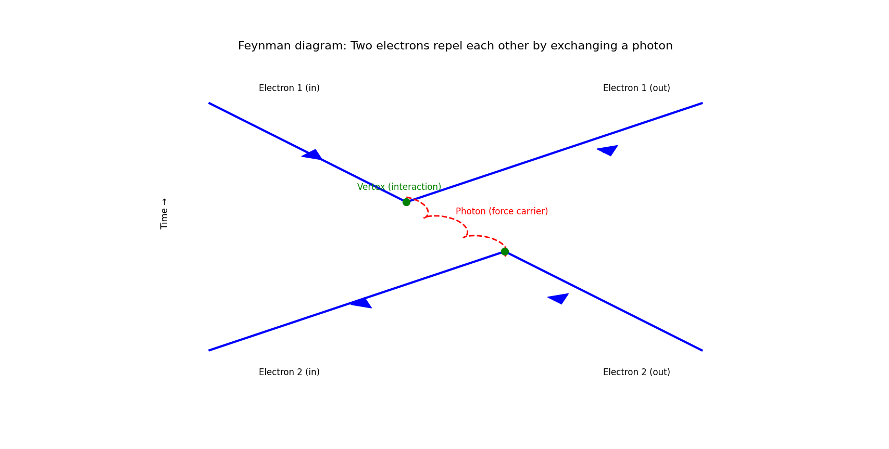
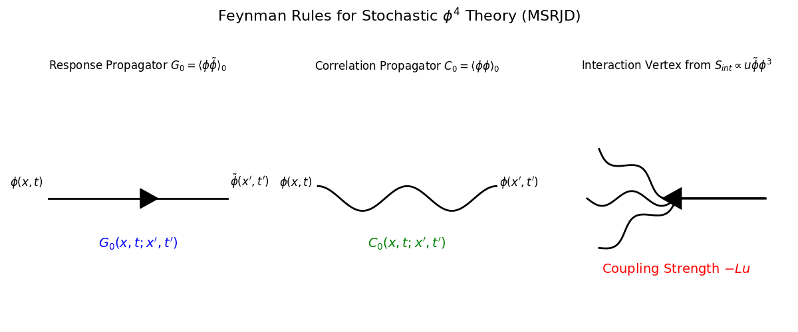

# 引言:从昂萨格-马赫卢普到J-D作用量

上节课(第31讲)成功地为随机过程构建了一个优美的路径积分表述,其核心是**昂萨格-马赫卢普 (Onsager-Machlup) 泛函**。这个泛函扮演了随机路径的"作用量",为从"历史求和"的视角理解细致平衡与涨落-耗散定理提供了深刻的物理洞见。

然而,正如教授在课程开头指出的,昂萨格-马赫卢普泛函在实际应用中存在一个不便之处:它的作用量形式是关于场的时间导数与漂移项之差的**二次方**(即平方项)。这种形式在进行更复杂的计算(例如微扰展开)时会变得非常棘手。
为了克服这一局限,需要引入一个在数学上更便于操作的路径积分框架。其核心目标,是构建一个与昂萨-格马赫卢普泛函物理上等价,但在形式上却是**线性**的新"作用量"。一个线性的作用量将极大地简化后续的微扰计算和理论分析。这个过程将自然地引出这节课的核心——**Janssen-De Dominicis (J-D) 作用量**的推导。

值得注意的是,实现这一目标的核心技巧——通过傅里叶变换引入一个辅助的**响应场 (response field)**来强加动力学约束,从而线性化问题——并非首次出现。这个思想与在第22讲中为处理更复杂的**乘性噪声**系统而构建路径积分时所使用的**MSRJD形式体系**,在方法论上是一脉相承的。这种理论工具上的一致性,不仅展示了随机场论内在的和谐与自洽,更凸显了响应场作为一个普适数学工具的强大威力。


最终,这个更强大的J-D形式体系将不仅仅是一个数学上的美化。它提供了一把"手术刀",能够精确地解剖出系统的**响应函数**与**关联函数**,并以一种前所未有的清晰方式,从第一性原理出发,推导出统计物理学中最深刻的关系之一——**涨落-耗散定理 (Fluctuation-Dissipation Theorem, FDT)** 。


# 1. 回顾:昂萨格-马赫卢普泛函与细致平衡

为了给这节课引入的Janssen-De Dominicis作用量铺平道路,有必要首先回顾上一讲的核心内容:作为随机路径"作用量"的**昂萨格-马赫卢普 (Onsager-Machlup) 泛函**,以及它在热平衡条件下所必须遵循的深刻对称性——**细致平衡 (Detailed Balance)** 。

## 1.1 路径的统计权重

在路径积分的视角下,一个随机系统从初始场构型 $\phi_0$ 演化至末态 $\phi_f$ 的过程,是对所有可能连接这两个端点的"历史"路径进行加权求和的结果。其跃迁概率幅可以写成一个泛函积分:

$$
\langle \phi_f | \phi_0 \rangle = \int_{\phi(0)=\phi_0}^{\phi(t_f)=\phi_f} \mathcal{D}[\phi] \exp\left[-G(\phi; 0, t_f)\right]
$$

这个表达式与量子力学中的费曼路径积分形式上完全对应。这里的关键物理量是**昂萨格-马赫卢普泛函** $G[\phi]$,它为每一条可能的路径 $\phi(t)$ 赋予了一个统计权重。$G[\phi]$ 的值越小,该路径发生的概率就越大,因此它扮演了随机动力学中**作用量 (action)** 的角色。

## 1.2 昂萨格-马赫卢普泛函:路径的"代价"

对于一个由多变量朗之万方程 $\partial_t\phi_\alpha = A_\alpha[\phi] + \xi_\alpha$ 描述的系统,其昂萨格-马赫卢普泛函的具体形式为:

$$
G[\phi] = \frac{1}{2} \int_{x,t} \left(\dot{\phi}_\alpha - A_\alpha[\phi]\right) N_{\alpha\beta}^{-1} \left(\dot{\phi}_\beta - A_\beta[\phi]\right) + (\text{泛函行列式})
$$

这个泛函的物理意义十分清晰:


* **括号内的项 $(\dot{\phi}_\alpha - A_\alpha)$** 正是通过朗之万方程反解出的、驱动系统走出这条特定路径 $\phi(t)$ 所必需的**噪声** $\xi_\alpha$。

  

* **整个泛函** 因此度量了这条噪声历史的"代价"或"大小"。一条需要剧烈、罕见噪声才能实现的路径,其 $G[\phi]$ 的值就很大,其概率 $e^{-G[\phi]}$ 也因此被指数级地抑制了。噪声协方差的逆矩阵 $N^{-1}$ 则扮演了度规的角色,根据噪声各分量的强度来加权这个"代价"。

## 1.3 细致平衡:时间对称性

昂萨格-马赫卢普泛函的真正威力,体现在它与热力学基本原理的结合上。对于一个处于热平衡态的系统,其微观动力学必须满足**时间反演不变性**。这一微观对称性在宏观路径概率上的体现,就是**细致平衡原理**。

在路径积分的语言中,细致平衡被表述为一个关于路径作用量和系统自由能 $F[\phi]$ 的深刻关系式:

$$
\beta F[\phi_0] + G[\phi; 0, t_f] = \beta F[\phi_f] + G_R[\phi; 0, t_f]
$$

其中,$\beta = 1/(k_B T)$ 是逆温度,$G_R$ 是时间反演路径的作用量。这个方程的左侧正比于从 $\phi_0$ 出发、沿着正向路径演化到 $\phi_f$ 的总(对数)概率;而右侧则对应其时间反演过程的总(对数)概率。细致平衡要求这两者之间必须通过系统初末态的自由能差精确地联系起来。

这个看似抽象的对称性关系,对系统的动力学施加了极其严格的物理约束。正如在第31讲末尾所推导的,正是这个关系式,要求系统的确定性漂移项 $A_\alpha$ 必须与耗散过程相关(例如,在模型A中,$A_\alpha = -L \frac{\delta F}{\delta \phi_\alpha}$),并且噪声强度 $N$ 必须与系统的耗散系数 $L$ 和温度 $T$ 直接关联。对于模型A,这个约束最终体现为著名的**爱因斯坦-昂萨格关系**:

$$
N = 2 L k_B T
$$

这正是**涨落-耗散定理**的一种具体形式,它揭示了系统的随机涨落(由 $N$ 或 $T$ 量化)与它对驱动力的耗散响应(由 $L$ 量化)是同一微观过程的一体两面。

# 2. 构建J-D生成泛函:MSRJD形式体系


昂萨格-马赫卢普泛函为近平衡系统提供了一个优美的物理图像,但其适用范围受限于细致平衡条件。为了处理更广泛的、可能远离平衡的非平衡问题,需要一个不依赖于此条件的、更为通用的形式体系。本节的目标,正是要构建这样一个普适的路径积分表述,它适用于任何由加性噪声朗之万方程 $\partial_t \phi = A[\phi] + \xi$ 描述的系统。


这个构建过程,是第19讲中介绍的"为路径赋予权重"这一核心思想的直接应用,而其采用的数学技巧,将与第22讲中为处理更复杂的**乘性噪声**所引入的**MSRJD (Martin-Siggia-Rose-Janssen-De Dominicis)** 形式体系完全一致。这凸显了该方法的普适性。

## 2.1 形式化平均与变量替换的哲学

出发点是对任意可观测量 $\Theta[\phi]$ 求系综平均值。从物理上看,由于场 $\phi(t)$ 的轨迹完全由随机的噪声历史 $\xi(t)$ 唯一确定,因此 $\Theta[\phi]$ 最终也是噪声的泛函。对 $\Theta[\phi]$ 的平均,本质上是对所有可能的噪声历史 $\xi(t)$ 进行加权平均。


然而,噪声 $\xi$ 本身通常是不可直接观测的微观量,而场 $\phi$ 才是关心的宏观物理量。因此,一个核心的策略就是**进行变量替换** :将积分变量从不可观测的噪声场 $\xi$ 转换到可观测的物理场 $\phi$。为了在泛函积分中实现这一点,需要一个数学工具来保证这种替换的合法性,这个工具就是泛函狄拉克$\delta$函数。它可以将平均过程形式化地写成:

$$
\langle \Theta[\phi] \rangle_{\xi} = \left\langle \int \mathcal{D}[\phi] \Theta[\phi] \underbrace{\delta[\phi(t) = \text{朗之万方程的解}]}_{\text{硬约束:只保留物理上有意义的路径}} \right\rangle_{\xi}
$$

这里的路径积分 $\int \mathcal{D}[\phi]$ 遍历了所有可能的场构型历史,无论它们是否符合物理规律。而$\delta$函数的作用就像一个"过滤器"或**硬约束**:它从所有可能的路径中,只挑选出那条唯一满足由特定噪声 $\xi$ 所驱动的朗之万方程的解,确保了只有物理上有意义的路径对最终的平均值有贡献。

## 2.2 MSRJD方法:明确约束

上述表达式在形式上是正确的,但难以直接操作。**MSRJD方法**是一个强大而标准的技术,它将这个抽象的约束条件用具体的动力学方程本身来表达:

$$
\delta[\phi(t) = \text{朗之万方程的解}] \rightarrow \underbrace{J[\phi]}_{\text{雅可比}} \underbrace{\delta(\partial_t \phi - A[\phi] - \xi)}_{\text{用动力学方程表达的约束}}
$$

这里的两个新出现的项具有明确的数学和物理意义:


* **泛函$\delta$函数** :现在它的宗量是朗之万方程本身。这个函数强制要求,对于任何有贡献的路径,其时间演化速率 $\partial_t \phi$ 必须精确地等于确定性漂移 $A[\phi]$ 与随机噪声 $\xi$ 之和。 

  

* **雅可比泛函行列式 $J[\phi]$** :在任何积分的变量替换中,雅可比都是必需的,它描述了积分"微元"的体积是如何变化的。在这里,$J[\phi] = |\det(\delta\xi/\delta\phi)|$。然而,与第22讲中处理乘性噪声时遇到的复杂的、依赖于路径的雅可比不同,对于本讲所关注的**加性噪声**情况,从 $\xi$到 $\phi$ 的变换仅仅是一个"平移",其雅可比是一个与路径无关的常数。因此,它可以被吸收到总的归一化因子中,在计算中可以暂时忽略,这极大地简化了问题。

  

## 2.3 引入响应场 

下一步是利用 $\delta$ 函数的傅里叶积分表示,这是整个形式体系的核心数学技巧,在第22讲中也曾使用过。其基本思想是,任何$\delta$函数都可以表示为一个对所有频率(或模式)的平面波的积分。将其推广到函数空间,就得到:

$$
\delta(\partial_t \phi - A[\phi] - \xi) \propto \int \mathcal{D}[\tilde{\phi}] \exp\left[i \int_{x,t} \tilde{\phi}_\alpha (\partial_t \phi_\alpha - A_\alpha[\phi] - \xi_\alpha)\right]
$$

(注意:为与课程板书及文献习惯保持一致,这里的虚数单位 $i$ 稍后将被吸收到 $\tilde{\phi}$ 的定义中,通过一个"Wick旋转"得到实指数,这在处理统计物理的概率权重时更为自然。)

将此表达式代回,可观测量的平均值变为一个扩展的路径积分,它同时对物理场 $\phi$ 和新引入的辅助场 $\tilde{\phi}$ 进行积分:

$$
\langle \Theta[\phi] \rangle_{\xi} = \left\langle \int \mathcal{D}[\phi] \mathcal{D}[\tilde{\phi}] \Theta[\phi] \exp\left[-\int_{x,t} \tilde{\phi}_\alpha (\partial_t \phi_\alpha - A_\alpha[\phi] - \xi_\alpha)\right] \right\rangle_{\xi}
$$

这个新引入的场 $\tilde{\phi}$ 被称为**响应场 (response field)** 或共轭场 (conjugate field)。初看起来,$\tilde{\phi}$ 似乎只是一个为了表示$\delta$函数而引入的、没有物理实体的"幽灵"场。然而,它具有深刻的物理意义。

这个场直接度量了系统对于外部微扰的**因果响应** 。可以把它想象成一个"探针",它在路径积分的每一点上"测量"着动力学方程被违背的程度。最终,通过这个形式体系计算出的关联函数 $\langle \phi(x,t) \tilde{\phi}(x',t') \rangle$,将被证明正比于系统在 $(x',t')$ 处受到一个无穷小"踢"之后,在 $(x,t)$ 处产生的平均响应。

# 3. Janssen-De Dominicis 作用量

引入响应场后,路径积分的表达式中包含了三个泛函积分:对 $\phi$、$\tilde{\phi}$ 和仍然存在的随机噪声 $\xi$ 的平均。下一步,也是最后一步,就是执行对噪声场 $\xi$ 的平均。由于噪声被假设为高斯白噪声,这个平均可以精确地完成。

Janssen-De Dominicis (J-D) 作用量,通常作为更广泛的MSRJD形式体系的一部分被提及,其历史根植于量子场论,由Martin、Siggia、Rose等人的早期工作发展而来,后被Janssen和De Dominicis系统地应用于经典随机动力学。其**物理本质**是将一个难以直接处理的随机微分方程(如朗之万方程)通过路径积分,精确地转化为一个更便于计算的统计场论问题。这一转换的核心技巧是引入一个辅助的"响应场",它通过傅里叶变换强制施加了系统的动力学约束,从而将原始作用量(如昂萨格-马赫卢普泛函)中不便处理的平方项线性化。最终得到的J-D作用量是一个包含物理场和响应场的泛函,它优雅地将系统的确定性漂移和噪声统计特性编码于一身,作为所有物理可观测量(如关联和响应函数)的生成泛函。**具体的应用场景**极其广泛,它不仅是推导涨落-耗散定理等基本关系的理论基石,更是运用微扰理论、费曼图和重整化群等强大工具来分析复杂非平衡系统的标准起点,尤其在研究相变临界动力学、含乘性噪声的系统以及软物质和生物物理中的随机过程等前沿领域中扮演着核心角色。

## 3.1 对噪声进行积分

路径积分中与噪声$\xi$直接耦合的项是 $\exp[\int \tilde{\phi}_\alpha \xi_\alpha]$。对这个量求高斯噪声的平均值,需要用到高斯积分的一个重要性质:对于一个均值为零的高斯变量 $X$,有 $\langle e^X \rangle = e^{\frac{1}{2} \langle X^2 \rangle}$。将其推广到泛函,具体计算如下:

$$
\left\langle \exp\left[\int_{x,t} \tilde{\phi}_\alpha \xi_\alpha\right] \right\rangle_\xi = \exp\left[\frac{1}{2} \iint \tilde{\phi}_\alpha(x,t) \tilde{\phi}_\beta(x',t') \langle \xi_\alpha(x,t) \xi_\beta(x',t') \rangle\right]
$$

对于高斯白噪声,其关联函数为 $\langle \xi_\alpha(x,t) \xi_\beta(x',t') \rangle = N_{\alpha\beta} \delta(x-x') \delta(t-t')$。代入上式并对 $x'$ 和 $t'$ 进行积分,$\delta$函数使得积分变得平凡,得到:

$$
\langle \exp[\ldots] \rangle_\xi = \exp\left[\frac{1}{2} \int_{x,t} \tilde{\phi}_\alpha N_{\alpha\beta} \tilde{\phi}_\beta\right]
$$

这个结果的物理意义是:**原始的物理噪声场 $\xi$ 被积分掉(平均掉)了,但它的统计特性(由噪声关联矩阵 $N_{\alpha\beta}$ 描述)通过一个关于响应场的二次项,被永久地"烙印"在了系统的有效作用量中。**

## 3.2 最终的路径积分与作用量

将所有部分组合在一起,就得到了可观测量平均值的最终路径积分表达式:

$$
\langle \Theta[\phi] \rangle = \int \mathcal{D}[\phi]\mathcal{D}[\tilde{\phi}] \Theta[\phi] \exp\left(-S[\phi,\tilde{\phi}]\right)
$$

这里的 $S[\phi,\tilde{\phi}]$ 就是**Janssen-De Dominicis (J-D) 作用量**,其具体形式为:

$$
S[\phi,\tilde{\phi}] = \int_{x,t} \left[ \underbrace{\tilde{\phi}_\alpha \left( \dot{\phi}_\alpha - A_\alpha[\phi] \right)}_{\text{动力学约束项}} - \underbrace{\frac{1}{2} \tilde{\phi}_\alpha N_{\alpha\beta} \tilde{\phi}_\beta}_{\text{噪声贡献项}} \right]
$$

现在,系统的全部动力学信息——包括确定性漂移和随机噪声——都被优雅地编码在了一个作用量泛函中。计算任何物理量的平均值,都归结为计算在这个作用量下的路径积分。这个作用量成为了所有关联函数和响应函数的**生成泛函**。

## 3.3 解剖 J-D 作用量

J-D 作用量由两个主要部分组成,每一部分都有清晰的物理含义:


1. **动力学约束项**: $\int \tilde{\phi}_\alpha (\dot{\phi}_\alpha - A_\alpha[\phi])$

   

这个项直接来自于对动力学方程的约束。响应场 $\tilde{\phi}$ 在此扮演了拉格朗日乘子的角色,它在"平均意义上"强制要求物理场 $\phi$ 的演化遵循确定性漂移 $A_\alpha[\phi]$。


2. **噪声贡献项**: $-\frac{1}{2} \int \tilde{\phi}_\alpha N_{\alpha\beta} \tilde{\phi}_\beta$

   

这个项是直接对噪声场 $\xi$ 积分的结果。它的结构——关于响应场的二次型——完全由噪声的统计特性(由关联矩阵 $N_{\alpha\beta}$ 描述)决定。这个项描述了涨落如何影响系统的动力学。

通过对比第31讲的昂萨格-马赫卢普(O-M)作用量,可以更深刻地理解J-D作用量的优势:


**O-M作用量**:形式为 $(\dot{\phi}-A)^2$,物理图像直观(路径偏离的代价),但数学上是二次的,不便计算。


**J-D作用量**:形式为 $\tilde{\phi}(\dot{\phi}-A)$,对动力学部分是线性的,大大简化了微扰计算,代价是引入了辅助的响应场 $\tilde{\phi}$。


这是一种在场论中常见的权衡:**通过引入辅助场来简化作用量的结构**。


为了帮助理解这个形式体系中各个场的角色,下表进行了总结:

| 符号 | 名称 | 物理诠释 | 来源方程 |
|------|------|----------|----------|
| $\phi(x, t)$ | 物理场 | 系统的主要动力学变量(如序参量、浓度场)。 | $\partial_t \phi = \mathcal{L}[\phi] + \xi$ |
| $\tilde{\phi}(x, t)$ | 响应场 | 一个辅助场,度量系统对外部微扰的因果响应。 | $\partial_t \tilde{\phi} = -\mathcal{L}^\dagger[\tilde{\phi}]$ |
| $\xi(x, t)$ | 噪声场 | 代表来自环境的随机驱动力(如热涨落)。 | 涨落-耗散定理 |
| $h(x, t)$ | 外场 | 一个可控的外部微扰,用于探测系统的响应特性。 | 作用于 $\phi$ 的驱动项 |


# 4. 探测系统:响应函数与关联函数

J-D形式体系的强大之处在于,它提供了一个系统性的方法来计算物理上可测量的量。前几节构建的作用量是理论的"引擎",这节将展示如何驾驶它来探索系统的两个核心动态特性:系统如何响应外部的"探针"(由**响应函数**描述),以及系统自身如何在平衡态下"起伏不定"(由**关联函数**描述)。

## 4.1 对系统施加微扰:响应场的物理意义

为了给在数学推导中引入的"幽灵"场 $\tilde{\phi}$ 赋予坚实的物理意义,可以采用一个物理学家最常用的策略:**主动探测**。通过在系统中引入一个微弱的、可控的外部微扰场 $h(x,t)$,观察它在理论框架中与哪个量相互作用。

对于一个接近平衡的系统(如模型A),其漂移项可以从自由能 $F$ 的泛函导数导出:$A[\phi] = -L \frac{\delta F}{\delta \phi}$。外场 $h$ 通常与物理场 $\phi$ 直接耦合,这相当于修改了系统的自由能景观:

$$
F \rightarrow F' = F - \int d^d x dt \, h(x,t) \phi(x,t)
$$

这个自由能的改变会立刻传递到漂移项中:

$$
\frac{\delta F'}{\delta \phi} = \frac{\delta F}{\delta \phi} - h \quad \implies \quad A'[\phi] = -L \frac{\delta F'}{\delta \phi} = A[\phi] + Lh
$$

现在,将这个新的漂移项 $A'$ 代入J-D作用量的动力学约束部分 $\int \tilde{\phi}(\dot{\phi} - A')$,会产生一个与外场相关的额外项:

$$
S \rightarrow S' = S - \int_{x,t} L h(x,t) \tilde{\phi}(x,t)
$$

这个结果揭示了一个至关重要的联系:**物理世界中可控的外部探针 $h$,在J-D作用量中,竟然是与那个看似抽象的辅助场 $\tilde{\phi}$ 相耦合的**。换言之,**外场 $h$ 充当了响应场 $\tilde{\phi}$ 的源 (source)** 。这为 $\tilde{\phi}$ 的"响应"之名提供了最直接的证据。


## 4.2 线性响应函数 $\chi$

线性响应函数 $\chi$ (在磁系统中也称动态磁化率),被定义为系统对一个无穷小外场的响应,具体来说,是物理场平均值对外场的泛函导数,并在外场为零时取值:

$$
\chi(x,t;x',t') = \frac{\delta \langle \phi(x,t) \rangle}{\delta h(x',t')} \Bigg|_{h \rightarrow 0}
$$

使用路径积分表达式 $\langle \phi \rangle = \frac{1}{Z} \int \mathcal{D}[\phi,\tilde{\phi}] \phi e^{-S'}$,可以显式地计算这个导数。对 $e^{-S'}$ 求关于 $h(x',t')$ 的导数,会从指数上带下一个因子 $L \tilde{\phi}(x',t')$。因此,得到:

$$
\chi(x,t;x',t') = L \langle \phi(x,t) \tilde{\phi}(x',t') \rangle
$$

这个方程是响应理论的核心结果之一,也是MSRJD形式体系的强大威力的直接体现。它严格证明了对响应场 $\tilde{\phi}$ 的物理诠释:**物理场 $\phi$ 与响应场 $\tilde{\phi}$ 的时空关联函数,直接给出了系统的线性响应函数** 。一个原本抽象的数学构造,现在与一个可测量的物理量精确地等同了起来。

## 4.3 两点关联函数 $C$ 与因果性

与响应函数不同,两点关联函数 $C$ 描述的是物理场**自身**在不同时空点的统计关联,即系统自发的、内部的涨落之间的统计相关性:

$$
C(x,t;x',t') = \langle \phi(x,t) \phi(x',t') \rangle
$$

必须强调 $C$ 和 $\chi$ 在物理上的根本区别:

* **关联函数 $C$**:描述**平衡态**下的**自发涨落**。它是一个(在时间差上)对称的量,反映的是"相关"而非"因果"。

* **响应函数 $\chi$**:描述一个**非平衡**过程,即一个外部扰动如何**导致**系统在另一个时空点产生响应。它是一个非对称的、具有**因果性**的量。

基本的物理原则——因果性——要求响应函数必须满足 $\chi(x,t;x',t') = 0$ 如果 $t < t'$,即结果不能出现在原因之前。这个原则是如何被自动编码在J-D形式体系中的呢?答案在于作用量的结构。J-D作用量中的**动力学项 $\int \tilde{\phi} \dot{\phi}$** 是关键。在场论计算中,响应函数 $\langle \phi \tilde{\phi} \rangle$ 本质上是由这个作用量导出的格林函数(或传播子)。正是这个包含时间一阶导数的项,保证了计算出的格林函数在时间上是"延迟的"(retarded),即它自然地包含了代表因果性的赫维赛德阶跃函数 $\Theta(t-t')$。因此,**因果性不是被手动加入的,而是从描述时间单向演化的朗之万方程的形式体系中自然涌现的**。

# 5. 涨落-耗散定理:连接响应与涨落

至此,J-D形式体系已经提供了计算响应函数 $\chi$(通过 $\langle \phi \tilde{\phi} \rangle$)和关联函数 $C$(通过 $\langle \phi \phi \rangle$)的系统性工具。对于处于热平衡的系统,这两个看似无关的量之间存在一个深刻而普适的关系,这就是涨落-耗散定理。

## 5.1 FDT的条件

推导FDT的前提是系统处于热平衡状态,即满足**细致平衡条件** 。在J-D形式体系的语言中,这意味着动力学具有特定的结构,这与第31讲的结论完全一致:

1.  **漂移项** $A$ 是保守的,即可以由一个自由能泛函 $F$ 的梯度给出:$A = -L \frac{\delta F}{\delta \phi}$。

2.  **噪声强度** $N$ 与**耗散系数** $L$ 和温度 $T$ 之间满足**爱因斯坦-昂萨格关系**:$N = 2Lk_BT$。

## 5.2 FDT作为作用量的对称性

FDT将**响应**(与 $\langle \phi \tilde{\phi} \rangle$ 相关)和**关联**(与 $\langle \phi \phi \rangle$ 相关)联系起来。这强烈地暗示了,在满足上述平衡条件时,J-D作用量可能存在一种能够联系 $\tilde{\phi}$ 和 $\phi$ 的隐藏对称性。

这种对称性确实存在,并且与系统的时间反演不变性密切相关。虽然完整的推导较为复杂,但其核心思想是,在满足平衡条件时,可以通过一个巧妙的非线性场变换,将J-D作用量改写成一种更对称的形式(在超对称场论中有时被称为BRST对称性)。作用量层面的任何连续对称性,都会通过诺特定理(或在场论中的等价形式,沃德恒等式)导致其导出的关联函数之间存在特定的关系。**涨落-耗散定理,正是对应于这种与时间反演相关的隐藏对称性的沃德恒等式 (Ward identity)**。

## 5.3 FDT的最终形式与物理内涵

对于一个平稳、均匀的平衡系统,涨落-耗散定理的最终形式为:

$$
\chi(x-x',t-t') = \frac{1}{k_B T} \Theta(t-t') \left(-\frac{\partial}{\partial t'} C(x-x',t-t')\right)
$$

由于系统的平稳性,$C$ 只依赖于时间差 $\tau = t-t'$,因此 $\frac{\partial}{\partial t'} C(t-t') = -\frac{dC}{d\tau}(\tau)$。所以上式也可写为:

$$
\chi(\tau) = -\frac{1}{k_B T} \Theta(\tau) \frac{dC}{d\tau}(\tau)
$$

这个方程是统计物理学最深刻的成果之一,其物理意义极为深远:

* **左边 $\chi(\tau)$**:描述了系统的**耗散**行为。它是一个**非平衡**响应,告诉你如果在 $t=0$ 时刻对系统施加一个微扰,系统在未来的 $\tau > 0$ 时刻会如何响应和弛豫。

* **右边 $C(\tau)$**:描述了系统的**涨落**行为。它是一个**平衡态**性质,告诉你即使在没有任何外部干预的情况下,系统的物理量也会自发地涨落,并且这些涨落之间存在时间上的关联。

FDT表明,这两种行为并非独立,而是由同一个微观动力学过程决定的。一个系统的耗散性质(它如何"忘记"一个扰动)被其平衡态下的自发涨落性质(它如何"记忆"自身过去的涨落)完全决定。**要想知道一个系统被"戳"一下会如何反应,只需要静静地观察它自己在平衡态下是如何"抖动"的**。


# 6. 应用实践:J-D作用量与费曼图微扰计算

虽然直接的数值模拟(如之前的双阱势模拟)能够验证理论,但J-D形式体系的真正威力在于它为**解析计算**提供了一个强大的平台。当系统存在非线性相互作用时,精确求解变得不可能,此时**微扰理论**就成为了核心的分析工具。

本节将展示如何将J-D作用量作为起点,运用费曼图的语言,系统地计算非线性相互作用对系统关联函数的一阶修正。这个过程是连接随机动力学与现代统计场论的桥梁。

费曼图是一种直观的图形工具,它将微扰理论中极其复杂的数学表达式描绘成由代表场或粒子传播的"线"和代表它们相互作用的"顶点"构成的图像,从而为计算复杂系统中的相互作用提供了一套清晰的配方。

费曼图最开始是在量子电动力学(QED)中提出的。可以用一个最经典、最简单的例子来说明:两个电子的相互排斥。

想象一下这个物理过程:
两个电子(都带负电)正在相互靠近,因为同性相斥,它们会互相推开对方,然后朝不同的方向飞走。

那么,它们是如何"告诉"对方要推开的呢?在量子场论中,这个"推开"的力是通过交换一个"信使粒子"来传递的,对于电磁力而言,这个信使粒子就是光子。

费曼图就是这个过程的"时空快照"。



横轴时间从左向右流逝,纵轴代表空间位置。图中的蓝色实线代表电子的路径,两个电子从左边(初态)飞入。红色波浪线代表在两个电子之间传递的光子。它是"虚"的,因为它只在相互作用的瞬间存在,作为力的载体。绿色圆点是"顶点",这是图中最重要的部分。它代表一个相互作用事件。在左边的顶点,电子1发射了一个光子;在右边的顶点,电子2吸收了这个光子。在交换完光子后,两个电子的路径都发生了偏折,从右边(末态)飞出,实现了相互排斥。

物理学家看到这张图,就能按照一套严格的"费曼规则",把图的各个部分"翻译"成一个具体的数学积分。计算这个积分,就能得到这个排斥过程发生的概率大小。

因此,费曼图就是把一个复杂的粒子相互作用过程,画成一个简单的"连线图",图中的每一笔每一画都对应着一部分数学公式,让计算变得像看图说话一样直观。

## 6.1 模型:含相互作用的$\phi^4$理论(模型A)

我们回到第25讲的核心模型——**金兹堡-朗道理论**,也常被称为$\phi^4$理论。其朗之万方程为(模型A):

$$
\frac{\partial \phi}{\partial t} = -L(r\phi - c\nabla^2\phi + u\phi^3) + \xi(\mathbf{x}, t)
$$

对应的J-D作用量为:

$$
S[\phi,\tilde{\phi}] = \int d^d x dt \left[ \tilde{\phi} \left( \frac{\partial \phi}{\partial t} + L(r\phi - c\nabla^2\phi) \right) + L u \tilde{\phi}\phi^3 - \frac{1}{2}\tilde{\phi}(2LT)\tilde{\phi} \right]
$$

(这里使用了 $N = 2LT$ 的关系)。

微扰理论的核心思想,是将作用量 $S$ 分解为一个可精确求解的**高斯部分(自由理论)$S_0$** 和一个小的**非线性部分(相互作用)$S_{int}$** 。

* **自由作用量 $S_0$** (所有二次项):
$$
S_0 = \int d^d x dt \left[ \tilde{\phi} \left( \frac{\partial \phi}{\partial t} + Lr\phi - Lc\nabla^2\phi \right) - LT\tilde{\phi}^2 \right]
$$

* **相互作用作用量 $S_{int}$** (高阶项):
$$
S_{int} = \int d^d x dt \, (L u \tilde{\phi}\phi^3)
$$

我们的目标是计算在相互作用 $S_{int}$ 影响下,系统的**真实关联函数** $\langle\phi\phi\rangle$。微扰展开的思想就是将 $e^{-S_{int}}$ 按泰勒级数展开:

$$
\langle \phi\phi \rangle = \frac{\int \mathcal{D}[\phi,\tilde{\phi}] \phi\phi \, e^{-S_0} (1 - S_{int} + \frac{1}{2}S_{int}^2 - \dots)}{\int \mathcal{D}[\phi,\tilde{\phi}] \, e^{-S_0} (1 - S_{int} + \dots)}
$$

这个展开的每一项都可以用一种直观的图形——**费曼图**——来表示和计算。

## 6.2 费曼规则:从作用量到图论

费曼规则是将作用量 $S_0$ 和 $S_{int}$ 翻译成绘图元素和数学表达式的"词典"。

1. **传播子 (Propagators)** :它们是**自由理论**(即只有$S_0$时)中的二点关联函数,代表了场的基本"传播"行为。

**响应传播子 $G_0 = \langle\phi\tilde{\phi}\rangle_0$** :描述了系统对微扰的裸响应。由于因果性($\tilde{\phi}$总是"响应"$\phi$),它在图中通常表示为**带箭头的有向线** 。在频率-动量空间中,它的数学形式为:

$$
G_0(\omega, \mathbf{q}) = \frac{1}{-i\omega + L(r+cq^2)}
$$

**关联传播子 $C_0 = \langle\phi\phi\rangle_0$** :描述了自由场自身的裸涨落关联。它通常表示为**无向的波浪线**。它的数学形式为:

$$
C_0(\omega, \mathbf{q}) = \frac{2LT}{\omega^2 + [L(r+cq^2)]^2}
$$

2. **顶点 (Vertex)**:它代表了粒子间的**相互作用**,其形式由 $S_{int}$ 决定。

在我们的模型中,$S_{int} \propto u \tilde{\phi}\phi^3$。这意味着一个顶点是**一个$\tilde{\phi}$场**和**三个$\phi$场**的相互作用点。因此,它被画成一个**一个箭头指向它($\tilde{\phi}$线),三个波浪线背离它($\phi$线)** 的交汇点。这个顶点的"强度"由相互作用参数 $u$ 决定。

```python
import matplotlib.pyplot as plt
import numpy as np

def plot_feynman_rules(figsize=(12, 5)):
    """
    Plot the basic Feynman rules for phi^4 theory in the J-D formalism.
    """
    fig, (ax1, ax2, ax3) = plt.subplots(1, 3, figsize=figsize)
    fig.suptitle('Feynman Rules for Stochastic $\phi^4$ Theory (MSRJD)', fontsize=16)

    # --- 1. Response Propagator G_0 ---
    ax1.set_title(r'Response Propagator $G_0 = \langle \phi \tilde{\phi} \rangle_0$')
    ax1.plot([0.1, 0.9], [0.5, 0.5], 'k-', lw=2)
    ax1.arrow(0.5, 0.5, 0.01, 0, head_width=0.08, head_length=0.08, fc='k', ec='k')
    ax1.text(0, 0.55, r'$\phi(x,t)$', fontsize=12, ha='center')
    ax1.text(1, 0.55, r'$\tilde{\phi}(x^\prime,t^\prime)$', fontsize=12, ha='center')
    ax1.text(0.5, 0.3, r'$G_0(x,t; x^\prime,t^\prime)$', fontsize=14, ha='center', color='blue')
    ax1.set_xlim(0, 1)
    ax1.set_ylim(0, 1)
    ax1.axis('off')

    # --- 2. Correlation Propagator C_0 ---
    ax2.set_title(r'Correlation Propagator $C_0 = \langle \phi \phi \rangle_0$')
    x = np.linspace(0.1, 0.9, 100)
    y = 0.5 + 0.05 * np.sin(x * 5 * np.pi)
    ax2.plot(x, y, 'k-', lw=2)
    ax2.text(0, 0.55, r'$\phi(x,t)$', fontsize=12, ha='center')
    ax2.text(1, 0.55, r'$\phi(x^\prime,t^\prime)$', fontsize=12, ha='center')
    ax2.text(0.5, 0.3, r'$C_0(x,t; x^\prime,t^\prime)$', fontsize=14, ha='center', color='green')
    ax2.set_xlim(0, 1)
    ax2.set_ylim(0, 1)
    ax2.axis('off')

    # --- 3. Interaction Vertex ---
    ax3.set_title(r'Interaction Vertex from $S_{int} \propto u \tilde{\phi} \phi^3$')
    center = (0.5, 0.5)
    # Vertex
    ax3.plot(center[0], center[1], 'ko', markersize=10)
    # Response field line (incoming)
    ax3.arrow(0.9, 0.5, -0.38, 0, head_width=0.08, head_length=0.08, fc='k', ec='k', lw=2)
    # Three correlation field lines (outgoing)
    angles = [np.pi * 5/6, np.pi, np.pi * 7/6]
    for angle in angles:
        x_end = center[0] + 0.4 * np.cos(angle)
        y_end = center[1] + 0.4 * np.sin(angle)
        x_wave = np.linspace(center[0], x_end, 50)
        y_wave = np.linspace(center[1], y_end, 50)
        offset = 0.03 * np.sin(np.linspace(0, 3*np.pi, 50))
        perp_vec = np.array([-(y_end-center[1]), x_end-center[0]])
        perp_vec /= np.linalg.norm(perp_vec)
        ax3.plot(x_wave + offset*perp_vec[0], y_wave + offset*perp_vec[1], 'k-', lw=2)
    ax3.text(0.5, 0.2, 'Coupling Strength $-Lu$', fontsize=14, ha='center', color='red')
    ax3.set_xlim(0, 1)
    ax3.set_ylim(0, 1)
    ax3.axis('off')

    plt.tight_layout(rect=[0, 0, 1, 0.95])
    plt.show()

# Run the plotting function
plot_feynman_rules()
```


## 6.3 计算一阶修正:Hartree图

现在,利用这些规则来计算对关联函数 $C=\langle\phi\phi\rangle$ 的**一阶微扰修正** 。在零阶,关联函数就是裸关联传播子 $C_0$。一阶修正是由包含一个相互作用顶点的图给出的。对于二点函数,最简单的图(称为**Hartree修正**或"日落图")如下所示:



这张图的物理意义是:一个涨落(左侧的$\phi$)在传播过程中,通过**非线性相互作用**(中间的两个顶点),"分裂"成三个中间涨落,这些中间涨落相互作用后,再"合并"成最终的涨落(右侧的$\phi$)。这个过程修正了原始的、简单的传播行为。

**从图到数学积分**:

根据费曼规则,这张图对应的数学表达式为(在频率-动量空间):

$$
\delta C(\omega, \mathbf{q}) \propto (-Lu)^2 \int \frac{d\omega' d^d\mathbf{k}}{(2\pi)^{d+1}} G_0(\omega, \mathbf{q}) C_0(\omega', \mathbf{k}) C_0(\omega-\omega', \mathbf{q}-\mathbf{k}) C_0(-\omega', -\mathbf{k}) G_0(-\omega, -\mathbf{q})
$$

这是一个需要通过积分来计算的复杂表达式。但关键在于,**费曼图为我们提供了一个清晰、直观的"配方",将一个复杂的物理过程分解为基本组件(传播子和顶点)的组合。**


这个应用实践展示了J-D形式体系如何从一个抽象的理论工具,转变为一个强大的、系统性的计算框架。通过将作用量分解为"自由"和"相互作用"部分,可以导出一套费曼规则,将复杂的微扰展开计算转化为直观的图论问题。这使得研究非线性随机系统中的物理现象(如临界动力学中的标度行为)成为可能,是现代非平衡统计物理学的核心技术之一。


# 结论

这节课介绍了用于研究随机动力学的强大场论工具——Janssen-De Dominicis 形式体系。通过将朗之万方程的约束编码到路径积分的"作用量"中,这个方法为任何具有加性噪声的系统提供了一个统一的理论框架。

核心的构造性步骤是引入了**响应场** $\tilde{\phi}$。这个最初作为数学辅助工具出现的场,被证明具有深刻的物理意义:它直接度量了系统对外部微扰的因果响应,其与物理场 $\phi$ 的关联函数 $\langle \phi \tilde{\phi} \rangle$ 精确地给出了系统的线性响应函数 $\chi$。

这个形式体系的巅峰之作是它为涨落-耗散定理提供了一个清晰而系统的推导路径。FDT 揭示了处于热平衡的系统中,两种看似截然不同的现象——由内部热运动引起的自发**涨落**(由关联函数 $C$ 描述)和系统对外部扰动做出的**耗散**响应(由响应函数 $\chi$ 描述)——实际上是同一枚硬币的两面。J-D 形式体系表明,这种深刻的联系根植于系统在平衡态下所满足的时间反演对称性(细致平衡)。


**涨落-耗散定理是平衡态统计物理的基石之一,但它的辉煌也限定了它的疆域。**当一个系统被强力驱动,远离平衡态时,细致平衡条件被打破,简单的 FDT 就不再成立。例如,当一个胶体颗粒被激光陷阱在流体中快速拖动时,系统的响应和涨落之间会是什么关系?

这正是现代非平衡统计物理学的核心问题之一。下一讲将探讨这个问题的前沿进展,进入**非平衡功和涨落定理**的领域。将要介绍的 Jarzynski 恒等式和 Crooks 涨落定理,是近年来非平衡统计物理最重大的突破之一。它们是第二定律在非平衡过程中的惊人推广,即便在过程高度不可逆、产生大量耗散的情况下,这些定理仍然能够建立起非平衡的物理量(如在非平衡过程中所做的功)与平衡态的热力学量(如自由能差)之间的精确等式关系。这些涨落定理可以被看作是 FDT 在非平衡世界中的继承者和推广者,为理解和操控远离平衡的微观系统提供了全新的理论工具。
