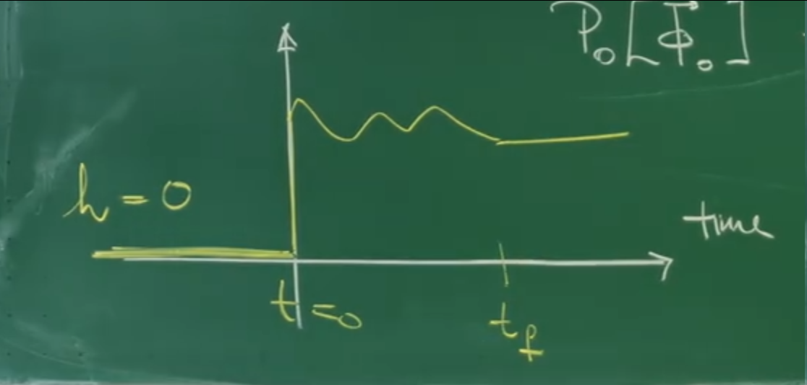
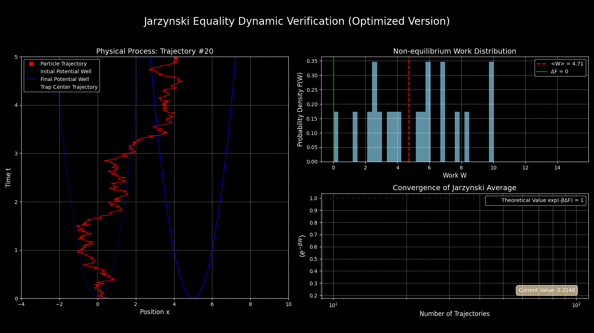
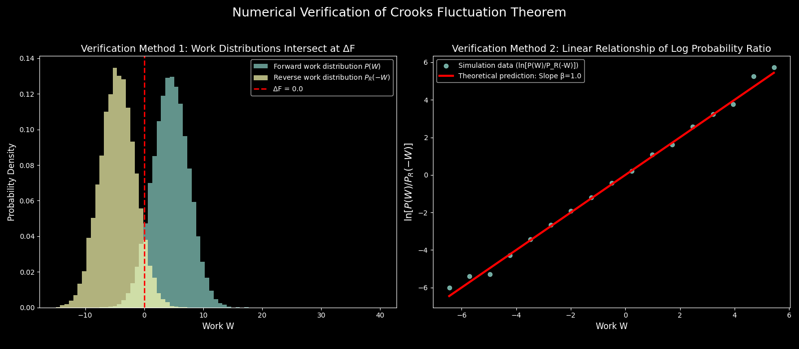

# 引言：从被动响应到主动驱动——开启非平衡世界的大门

前面讲座探讨的核心是**近热平衡的系统**。特别是**第32讲**，课程构建了强大的 **Janssen-De Dominicis (JDD) 路径积分形式体系**，并从中推导出了近平衡统计物理学的基石——**涨落-耗散关系 (Fluctuation-Dissipation Theorem, FDT)**。FDT 提供了一个深刻的见解：系统对微小外部扰动的**被动线性响应**，完全由其在平衡态下的**自发涨落**行为所决定。这一关系深刻地依赖于系统在平衡态下的**时间反演对称性**。

然而，JDD 形式体系和 FDT 的辉煌也限定了其疆域。当目光从实验室的理想条件投向更广阔的真实世界——从细胞内分子马达的持续运转，到实验中被激光快速拖拽的胶体颗粒，再到任何在**有限时间内**经历显著外部参数变化的系统——所面对的将是远离平衡的、具有内在**不可逆性**的复杂过程。对于这些过程，经典热力-学只能给出不完整的描述，通常以不等式的形式出现，例如，非平衡功的平均值总是大于或等于系统平衡自由能的变化量（$\langle W \rangle \geq \Delta F$）。

这节课标志着课程又一个至关重要的**视角转变**：研究将从系统对微小扰动的**被动响应** ，转向分析系统在外部**协议 (protocol)主动、任意**驱动下的非平衡动力学。核心问题是：对于这些远离平衡的、本质上是随机的过程，是否存在能够超越经典不等式的、普适的、**精确的等式关系**，从而为这些过程提供根本性的约束？

答案是肯定的，而关键的突破在于**改变观察尺度**。关注点不再仅仅是功或熵产生等热力学量的**平均值**，而是转向研究由系统无数条**随机轨迹 (stochastic trajectories)** 所产生的这些量的**完整概率分布**。通过分析涨落的全部统计信息，可以从看似混乱的非平衡过程中，精确地“蒸馏”出隐藏的平衡态信息。

这节课将聚焦于推导和理解两个核心的**涨落定理 (Fluctuation Theorems, FTs)**：**Jarzynski 等式 (Jarzynski’s Work Relation)** 和 **Crooks 涨落定理 (Crooks' Fluctuation Theorem)** 。这些定理不仅是近年来非平衡统计物理最重大的突破之一，更是构成了**随机热力学 (Stochastic Thermodynamics)** 这门新兴学科的理论基石。


# 1. 回顾：涨落-耗散关系 (FDT)

为了更好地理解即将到来的非平衡涨落定理，有必要首先回顾描述**近平衡系统**动力学的核心场论工具——**Janssen-De Dominicis (J-D) 作用量**，以及它如何系统性地导出了涨落-耗散关系。

在统计场论的框架下，一个随机过程的所有可能轨迹的统计权重，可以通过一个作用量泛函来描述。J-D 作用量正是为具有加性高斯噪声的随机动力学系统构建的这样一个作用量：

$$S[\phi, \tilde{\phi}] = \int_{x,t} \left[ \tilde{\phi}_\alpha (\dot{\phi}_\alpha - A_\alpha[\phi]) - \frac{1}{2} \tilde{\phi}_\alpha N_{\alpha\beta} \tilde{\phi}_\beta \right]$$

这里的 $\phi(\vec{x},t)$ 是描述系统状态的物理场（例如，粒子浓度场），而 $\tilde{\phi}(\vec{x},t)$ 是一个辅助的**响应场 (response field)** 。这个作用量优雅地将系统的全部动力学信息编码于一身：

**动力学约束项 $\tilde{\phi}_\alpha (\dot{\phi}_\alpha - A_\alpha[\phi])$** ：这一项源于对朗之万方程的严格执行。在路径积分中，响应场 $\tilde{\phi}$ 扮演了拉格朗日乘子的角色，它通过在所有路径上求和，强制要求只有满足确定性运动方程（$\dot{\phi}_\alpha = A_\alpha[\phi]$）的轨迹才会有显著的贡献。

**噪声贡献项 $-\frac{1}{2} \tilde{\phi}_\alpha N_{\alpha\beta} \tilde{\phi}_\beta$** ：这一项则来源于对高斯白噪声的平均。$N_{\alpha\beta}$ 是噪声关联矩阵 $\langle \xi_\alpha(x,t)\xi_\beta(x',t') \rangle = N_{\alpha\beta}\delta(x-x')\delta(t-t')$ 的核心，该项的二次型形式将噪声的统计特性永久地“烙印”在了有效作用量中。

通过对这个作用量泛函进行路径积分，可以计算出任意可观测量。其中，两个核心的物理量是响应函数和关联函数。

1.  **响应函数 (Response Function) $\chi_{\alpha\beta}(x,t;x',t')$** ：它描述了系统在 $(x,t)$ 处的场分量 $\langle \phi_\alpha \rangle$ 如何响应在另一时空点 $(x',t')$ 施加的一个微小外部扰动场 $h_\beta$。在J-D形式体系下，它被精确地表达为物理场与响应场的关联函数：

    $$\chi_{\alpha\beta}(x,t;x',t') = \left.\frac{\delta \langle \phi_\alpha(x,t) \rangle}{\delta h_\beta(x',t')} \right|_{h \to 0} = L \langle \phi_\alpha(x,t) \tilde{\phi}_\beta(x',t') \rangle$$
    
2.  **关联函数 (Correlation Function) $C_{\alpha\beta}(x,t;x',t')$**：它描述了系统在没有任何外部扰动的情况下，其**自发涨落**在不同时空点之间的统计关联程度 ：

    $$C_{\alpha\beta}(x,t;x',t') = \langle \phi_\alpha(x,t) \phi_\beta(x',t') \rangle$$

推导 FDT 的关键，在于利用系统在**热平衡态**下所满足的**时间反演对称性**。正如在第31讲和第32讲中展示的，这一基本对称性对J-D作用量施加了强有力的约束，最终要求噪声强度 $N$ 和耗散系数 $L$ 必须满足**爱因斯坦-昂萨格关系**（$N=2LT$）。这个内置的对称性最终导致响应函数和关联函数之间存在一个精确的关系：

$$\chi(\tau) = -\frac{1}{k_B T} \Theta(\tau) \frac{dC}{d\tau}(\tau)$$

其中 $\tau = t-t'$，$\Theta(\tau)$ 是亥维赛阶跃函数，体现了**因果性**（响应不能发生在扰动之前）。这个关系式就是**涨落-耗散定理**。它深刻地揭示了：一个系统抵抗外部扰动而**耗散**能量的能力（由 $\chi$ 体现），与其内部自发的、热驱动的**涨落**（由 $C$ 体现）是同一个微观物理本质的两个侧面。

这个推导过程不仅为 FDT 提供了一个严格的场论证明，更重要的是，它展示了**时间反演对称性**在连接系统“响应”和“涨落”中的核心作用。正是这一思想，将被推广到远离平衡的系统中，成为推导非平衡涨落定理的基石。


# 2. 非平衡驱动系统与外部协议

上一节回顾的涨落-耗散关系 (FDT) 描述了系统对微小扰动的**被动响应**。现在，将注意力从这种近平衡的线性行为，转向一个被**主动、任意地驱动远离平衡**的系统。这里的核心转变在于，外部参数不再是微小的探针，而是一个随时间显著变化的、预先设定的控制程序。

## 2.1 系统的描述：自由能泛函

考虑一个由场变量 $\vec{\phi}$ 描述的系统，其在给定外部场 $\vec{h}$ 下的平衡态性质由一个**自由能泛函 $F[\vec{\phi}]$** 给出。其形式与在第25讲中探讨的金兹堡-朗道理论一致：

$$F[\vec{\phi}] = \int d^dx \left( f(\vec{\phi}) + \frac{c}{2} (\vec{\nabla} \vec{\phi})^2 - \vec{h} \cdot \vec{\phi} \right)$$

这个泛函的每一项都有清晰的物理意义：

**局域自由能密度 $f(\vec{\phi})$** ：包含了局域的熵贡献和粒子间的平均场相互作用，决定了系统的基本相行为。

**梯度能量项 $\frac{c}{2} (\vec{\nabla} \vec{\phi})^2$** ：它对空间非均匀性施加能量惩罚，是界面张力的微观来源。

**耦合项 $-\vec{h} \cdot \vec{\phi}$** ：这是外部世界与系统相互作用的“把手”。正是通过改变外部场 $\vec{h}$，才能够对系统施加影响并做功。

## 2.2 驱动过程的设定

一个典型的非平衡驱动实验或模拟，其设定如下：

1.  **初始状态** ：在 $t=0$ 时刻，系统与一个初始外部场 $\vec{h}(0)$ 完全达到热平衡。这意味着，系统初始构型 $\vec{\phi}_0$ 的概率分布由玻尔兹曼因子给出：

    $$P_0[\vec{\phi}_0] = \frac{1}{Z_0(T)} \exp \left[ -\beta F_0[\vec{\phi}_0] \right]$$
    
    其中 $\beta = 1/T$ (设玻尔兹曼常数 $k_B=1$)，$F_0$ 是对应于初始外场 $\vec{h}(0)$ 的自由能泛函，而 $Z_0(T)$ 是相应的配分函数。从一个精确定义的平衡态出发，是所有涨落定理的逻辑起点。

2.  **驱动过程** ：在 $t=0$ 到 $t=t_f$ 的时间段内，外部场 $\vec{h}(t)$ 按照一个预先设定的、确定性的时间函数进行演化。这个函数 $\vec{h}(t)$ 被称为**外部协议 (external protocol)** 。如下图所示，协议将系统从一个初始平衡态，经过一系列非平衡态，最终驱动到一个通常也是非平衡的末态。


图示：一个外部协议的例子。外部场$h(t)$在$t=0$之前为常数，在$0$到$t_f$之间按某一函数变化，在$t_f$之后再次变为常数。

* **初始平衡态**：在 $t<0$ 的时间里，外部场 $h=0$ 且保持不变，系统处于初始的平衡状态中。
* **驱动过程**：在 $t=0$ 到 $t=t_f$ 这个有限的时间区间内，外部场 $h(t)$ 按照一个预先设定的（通常是任意的）函数进行演化，将系统主动地带离平衡。
* **末态**：在 $t>t_f$ 后，外部场达到最终值 $h_f$ 并再次保持不变，系统会开始向对应于 $h_f$ 的新平衡态弛豫。

## 2.3 不可逆性的根源：有限时间与弛豫

这个过程的不可逆性，其根源在于协议是在**有限时间** $t_f$ 内完成的。这里存在两种截然不同的极限：

* **准静态极限 ($t_f \to \infty$)** ：如果协议变化得无限缓慢，系统在每个瞬间都有足够的时间通过内部弛豫来适应外部场的微小改变。因此，系统始终保持在与瞬时外场 $\vec{h}(t)$ 相对应的平衡态。这样的过程是**可逆的 (reversible)** ，外界所做的功恰好等于系统始末平衡态之间的自由能差 $\Delta F$。这是经典热力学的理想疆域。

* **有限时间过程 ($t_f < \infty$)** ：对于任何有限的驱动时间，系统内部的弛豫（由动力学系数 $L$ 等决定）需要时间。因此，系统状态的演化总是会**滞后 (lag)** 于外部场的改变。系统的概率分布 $P(\vec{\phi},t)$ 将不再是对应于瞬时外场 $\vec{h}(t)$ 的平衡分布。正是这种滞后，导致了能量的**耗散 (dissipation)** ，通常以热的形式散发到环境中。

因此，外部施加的功的平均值将严格大于自由能的变化，即 $\langle W \rangle > \Delta F$。这个差值，$\langle W_{diss} \rangle = \langle W \rangle - \Delta F$，就是平均**耗散功 (dissipated work)** ，它量化了过程的不可逆程度。

涨落定理的精髓在于，它不仅关注这个平均行为，而是精确地刻画了由无数条随机轨迹所产生的**功的完整概率分布 $P(W)$** 。接下来的任务，就是为这个在单条轨迹上所做的、随机的非平衡功给出一个精确的定义。

# 3. 非平衡功：定义与路径积分计算

为了建立涨落定理，首先必须为“功”在随机、非平衡过程中给出一个精确的物理定义。与宏观热力学中功是一个确定值不同，在随机热力学中，功是在**单条随机轨迹**上定义的、一个依赖于路径的**随机变量** 。

## 3.1 Jarzynski 功的定义

这个定义源于经典力学和热力学的基本思想：对系统做的功，等于系统能量因外部控制参数变化而产生的改变。对于一个由外部场 $\vec{h}(t)$ 驱动的系统，其自由能泛函 $F[\vec{\phi}]$ 会随时间显式地变化。在微小时间间隔 $dt$ 内，外部施动者对系统做的微功 $dW_J$ 就是 $F[\vec{\phi}]$ 由于外部参数 $\vec{h}$ 的变化而产生的改变。这类似于经典热力学中的 $dW = (\partial E / \partial \lambda) d\lambda$。在场论的语言中，这表现为：

$$dW_J = \left( \frac{\partial F[\vec{\phi}(t)]}{\partial t} \right)_{\vec{\phi} \text{ fixed}} dt$$

这里的偏导数 $\partial/\partial t$ 仅作用于自由能泛函中**显式依赖时间**的外部场 $\vec{h}(t)$，而保持瞬时场构型 $\vec{\phi}(t)$ 不变。利用在第2节中给出的自由能泛函形式 $F \propto -\int d^dx (\vec{h} \cdot \vec{\phi})$，可以得到 $\delta F / \delta \vec{h} = -\vec{\phi}$。因此，在整个协议期间（从 $t=0$ 到 $t=t_f$）对系统所做的总功，即 **Jarzynski 功** $W_J[\vec{\phi}]$，便是沿着一条具体的轨迹 $\vec{\phi}(t)$ 对微功进行积分的结果：

$$W_J[\vec{\phi}] := \int_0^{t_f} dt \, \frac{\partial F[\vec{\phi}]}{\partial t} = -\int_0^{t_f} dt \int d^dx \, \vec{\phi}(\vec{x},t) \cdot \frac{\partial \vec{h}(\vec{x},t)}{\partial t}$$

这个定义深刻地揭示了非平衡功的物理本质：


* **功是随机的**：$W_J$ 是一个**泛函** ，它的值取决于系统所经历的具体微观路径 $\vec{\phi}(\vec{x},t)$。由于系统的演化受到热噪声的影响是随机的，不同的轨迹会产生不同的功值。因此，功本身是一个随机变量，具有一个概率分布 $P(W_J)$。

  

* **功的来源** ：功是系统状态场 $\vec{\phi}(t)$ 与**外部协议变化率** $\partial \vec{h} / \partial t$ 耦合的直接结果。如果协议不随时间变化（$\partial \vec{h}/\partial t = 0$），则外界对系统不做功。

  

## 3.2 路径积分下的系综平均

为了计算任意可观测量 $O[\vec{\phi}]$（例如功本身 $W_J$，或其指数函数 $e^{-\beta W_J}$）的系综平均值，需要在第2节定义的非平衡驱动实验的整个路径系综上进行平均。这个平均过程在路径积分形式下，可以被系统性地分解为三个层次的积分：

$$\langle O[\vec{\phi}] \rangle = \int \mathcal{D}[\vec{\phi}_0] \underbrace{P_0[\vec{\phi}_0]}_{\text{初始态权重}} \int \mathcal{D}[\vec{\phi}_f] \int_{\vec{\phi}(0)=\vec{\phi}_0}^{\vec{\phi}(t_f)=\vec{\phi}_f} \underbrace{\mathcal{D}[\vec{\phi}, \tilde{\phi}] \exp(-S[\tilde{\phi}, \vec{\phi}])}_{\text{路径权重}} O[\vec{\phi}]$$

注意：为与课程板书保持一致，这里的响应场积分测度为 $\mathcal{D}[\tilde{\phi}]$，对应于 Wick 旋转后的实数作用量。

这个看似复杂的表达式，实际上是对非平衡过程的一个精确的、分步式的数学模拟：

1.  **初始态平均 (Initial State Averaging)** ：积分 $\int \mathcal{D}[\vec{\phi}_0] P_0[\vec{\phi}_0] \dots$ 对应于实验的第一步：从初始的平衡系综中，按照玻尔兹曼概率 $P_0[\vec{\phi}_0] = \frac{1}{Z_0} e^{-\beta F_0[\vec{\phi}_0]}$ 随机“抽取”一个初始构型 $\vec{\phi}_0$。

2.  **路径平均 (Path Averaging)** ：对于每一个给定的初始构型 $\vec{\phi}_0$ 和最终构型 $\vec{\phi}_f$，内层的积分 $\int \mathcal{D}[\vec{\phi}, \tilde{\phi}] \exp(-S) \dots$ 则是对所有可能连接这两点的、遵循随机动力学的历史路径进行求和。每条路径的统计权重由 **J-D 作用量** $e^{-S[\tilde{\phi}, \vec{\phi}]}$ 给出，该作用量已经将朗之万方程的动力学约束和噪声统计特性完全编码在内。

3.  **末态求和 (Summing over Final States)** ：最外层的积分 $\int \mathcal{D}[\vec{\phi}_f] \dots$ 则是对所有可能的最终构型进行求和，因为在非平衡过程中，即使从同一个初始态出发，不同的随机轨迹也会到达不同的末态。

这个表达式是推导所有涨落定理的坚实数学基础。它将一个非平衡过程的宏观统计平均，精确地分解为了对初始平衡态的抽样和对随机动力学路径的求和。接下来的任务，就是通过对这个路径积分表达式进行一系列巧妙的对称性变换，来揭示隐藏在其中的普适规律。

# 4. 涨落定理的路径积分推导

本节是讲座的数学核心，将详细展示如何通过对 J-D 路径积分作用量进行一系列精妙的变换，从而推导出连接非平衡功和平衡自由能的核心关系。整个推导过程的基石是作用量在**时间反演**下的内在对称性，这正是微观可逆性在路径层面的深刻体现。

为清晰地展示推导，考虑一个由梯度下降主导的系统（如模型A），其漂移项为 $A_\alpha = -L (\delta F / \delta \phi_\alpha)$。根据第32讲，其 J-D 作用量为：

$$S[\tilde{\vec{\phi}}, \vec{\phi}] = \int_{\vec{x}, t} \left[ \tilde{\phi}_{\alpha} \left(\partial_t \phi_{\alpha} + L\frac{\delta F}{\delta \phi_{\alpha}} \right) - \frac{1}{2} \tilde{\phi}_{\alpha} N_{\alpha\beta} \tilde{\phi}_{\beta} \right]$$

根据涨落-耗散定理的要求，在平衡态下噪声强度与耗散系数满足**爱因斯坦-昂萨格关系** $N_{\alpha\beta} = 2LT \delta_{\alpha\beta}$。

## 步骤 1：响应场变量代换——分离热力学项

**物理动机** ：第一步是一个纯粹的数学技巧，但其物理动机非常明确：**重新组织作用量，将与热力学直接相关的量（自由能、功）从复杂的动力学项中显式地分离出来** 。这个变换的设计，正是为了让最终结果能以一种清晰的热力学形式呈现。

定义新的响应场变量 $\bar{\phi}_\alpha$：

$$\bar{\phi}_\alpha(t) \equiv -\tilde{\phi}_\alpha(t) + \frac{1}{T} \frac{\delta F}{\delta \phi_\alpha(t)}$$

这个变换的雅可比行列式为1，因此路径积分的测度不变。将 $\tilde{\phi}_\alpha(t) = -\bar{\phi}_\alpha(t) + \frac{1}{T} \frac{\delta F}{\delta \phi_\alpha(t)}$ 代入作用量 $S$ 中，并利用 $N=2LT$，经过一番代数运算，作用量可以被精确地分解为：

$$S[\tilde{\vec{\phi}}, \vec{\phi}] = \int_{\vec{x}, t} \left[ \bar{\phi}_{\alpha} \left( -\partial_t \phi_{\alpha} + L\frac{\delta F}{\delta \phi_{\alpha}} - LT\bar{\phi}_{\alpha} \right) + \frac{1}{T}\frac{\delta F}{\delta \phi_{\alpha}} \partial_t \phi_{\alpha} \right]$$


这个形式中的最后一项 $\frac{1}{T}\frac{\delta F}{\delta \phi_{\alpha}} \partial_t \phi_{\alpha}$ 是分离热力学量的关键。利用泛函的链式法则，自由能 $F[\vec{\phi}(t)]$ 沿一条轨迹对时间的全导数为：

$$\frac{dF[\vec{\phi}(t)]}{dt} = \int d^dx \frac{\delta F}{\delta \phi_\alpha}\frac{\partial \phi_\alpha}{\partial t} + \frac{\partial F}{\partial t}$$

这里：


* $\frac{dF}{dt}$ 是沿着具体轨迹 $\vec{\phi}(t)$，自由能的总变化率。

  

* 第一项 $\int d^dx \dots$ 是由于系统**内部构型** $\vec{\phi}$ 自身演化所导致的自由能变化。

  

* 第二项 $\frac{\partial F}{\partial t}$ 则是由于**外部协议** $\vec{h}(t)$ 改变了能量景观本身，所导致的自由能的显式时间依赖性。根据第3节的定义，这一项的积分正是 **Jarzynski 功** $W_J[\vec{\phi}]$。

  


因此，最后一项的积分可以精确地写为：

$$
\frac{1}{T} \int_0^{t_f} dt \int d^dx \frac{\delta F}{\delta \phi_\alpha} \partial_t \phi_\alpha =\beta \int_0^{t_f} dt \left( \frac{dF[\vec{\phi}]}{dt} - \frac{\partial F[\vec{\phi}]}{\partial t} \right) = \beta \left( (F_f[\vec{\phi}_f] - F_0[\vec{\phi}_0]) - W_J[\vec{\phi}] \right)
$$

**物理意义** ：这一步代数变换的深刻结果是，它将原来的路径权重因子 $e^{-S}$ 转换为了一个新的形式，其中包含了 $e^{-\beta (F_f - F_0 - W_J)}$ 这一核心的热力学部分。我们成功地在作用量层面“预提取”了最终结果中需要的物理量。


## 步骤 2：时间反演变换——运用核心对称性

**物理动机** ：第二步是整个推导的物理核心。通过对路径积分变量执行时间反演操作，来运用系统的**微观可逆性**这一基本对称性。其思想是比较“正向播放的电影”和“倒带播放的电影”的概率。

定义时间反演后的路径变量为：

$$(\vec{\phi}^R(t), \bar{\vec{\phi}}^R(t)) \equiv (\vec{\phi}(t_f - t), \bar{\vec{\phi}}(t_f - t))$$

同时，外部协议也进行相应的时间反演，即**反向协议 (reversed protocol)** ：$\vec{h}^R(t) = \vec{h}(t_f - t)$。现在考察作用量中的关键项在这个变换下的行为：

* **时间导数项** ：如课程板书所示，$\int dt \, \bar{\phi}_{\alpha} \partial_t \phi_{\alpha}$ 这一项在时间反演下会反号。它代表了作用量中与时间演化方向直接相关的部分。

* **功项** ：需要在**反向协议** $\vec{h}^R(t)$ 下，计算沿着**反向路径** $\vec{\phi}^R(t)$ 所做的功，记为 $W_J^R$。通过变量代换 $\tau = t_f - t$ 可以严格证明：

    $$W_J^R[\vec{\phi}^R] = -\int_0^{t_f} dt \int d^dx \, \vec{\phi}^R(\vec{x},t) \cdot \frac{\partial \vec{h}^R(\vec{x},t)}{\partial t} = - W_J[\vec{\phi}]$$
    
    **物理意义** ：这个结果的物理内涵是：在反向协议下沿反向路径所做的功，恰好是正向协议下沿正向路径所做功的相反数。

经过这些变换，原来的作用量 $S$ 变成了一个新的作用量 $S^R$，其形式与原作用量相似，但描述的是在反向协议下的动力学。


## 步骤 3：整合结果——导出普适关系

**逻辑整合** ：现在，将前两步的变换结果整合到可观测量 $\langle O[\vec{\phi}] \rangle$ 的路径积分表达式中。通过变量代换和利用路径积分测度的不变性（雅可比行列式为1），可以证明一个深刻的对偶关系：

$$\langle O[\vec{\phi}] \rangle = \frac{Z_f(T)}{Z_0(T)} \langle \hat{O}[\vec{\phi}] e^{-\beta W_J^R[\vec{\phi}]} \rangle_R$$


* $\langle \dots \rangle_R$ 表示在**反向协议**下，从末态 $F_f$ 对应的平衡系综开始的系综平均。

* $\hat{O}[\vec{\phi}]$ 是在时间反演路径上计算的可观测量。

* $Z_f$ 和 $Z_0$ 分别是与末态外场 $\vec{h}(t_f)$ 和初态外场 $\vec{h}(0)$ 对应的平衡配分函数。

最后，利用自由能的定义 $\Delta F = F_f - F_0 = -T \ln(Z_f / Z_0)$，以及步骤2中导出的关系 $W_J^R = -W_J[\vec{\phi}]$，便得到了一个普适的涨落关系式：

$$\langle O[\vec{\phi}] \rangle = e^{-\beta \Delta F} \langle \hat{O}[\vec{\phi}] e^{\beta W_J[\vec{\phi}]} \rangle_R$$

**物理意义**：
这个结果是惊人的。它表明，一个在**正向协议**下测量的物理量的平均值（LHS），可以被精确地转化为一个在**反向协议**下、由一个指数功因子 $e^{\beta W_J}$ 加权的、对时间反演后的可观测量进行的平均（RHS）。

这个对偶关系是微观可逆性在非平衡过程中的直接体现。宏观上观察到的不可逆性（如 $\langle W \rangle > \Delta F$），并非源于物理定律本身不满足时间对称性，而是源于过程的**边界条件不对称**：从一个特定的平衡态开始，然后让时间向前演化。涨落定理正是对这种边界条件不对-称性所产生的统计后果的精确量化。

# 5. Jarzynski 功关系

上一节推导出的普适涨落关系式，是连接正向与反向非平衡过程的一座普适桥梁。现在，将通过一个极为简洁而巧妙的选择，从这座桥梁中提取出第一个里程碑式的成果——**Jarzynski 等式 (Jarzynski's Work Relation)** 。

**Jarzynski 等式**由物理学家 Christopher Jarzynski 在 **1997 年**提出。其深刻的**物理本质**在于，它在非平衡统计物理学和平衡态热力学之间建立了一座精确的桥梁。该等式指出，在一个将系统从一个平衡态驱动到另一个状态的任意非平衡过程中，对所做功 $W$ 的指数项进行的系综平均，精确地等于系统始末平衡态之间的自由能差 $\Delta F$ 所对应的玻尔兹曼因子，即 $\langle e^{-\beta W} \rangle = e^{-\beta \Delta F}$。这一定理是对传统热力学第二定律不等式 ($\langle W \rangle \ge \Delta F$) 的惊人强化，因为它将一个依赖于具体动力学路径的非平衡平均值，与一个只取决于平衡态的纯热力学量精确地联系起来。

在**具体应用**上，该等式具有革命性意义，它允许科学家通过快速、不可逆的计算机模拟或单分子实验（如用光镊拉伸RNA发夹或蛋白质）来精确计算平衡态的自由能差，这在传统准静态方法难以实现的生物物理和材料科学领域尤为重要。

## 5.1 从普适关系到精确等式

回顾上一节的最终成果，即普适的对偶关系式：
$$\langle O[\vec{\phi}] \rangle = e^{-\beta \Delta F} \langle \hat{O}[\vec{\phi}] e^{\beta W_J[\vec{\phi}]} \rangle_R$$
这个关系对于任意的可观测量 $O[\vec{\phi}]$ 都成立。为了得到最简洁的关系，可以选择最简单的可观测量，即**恒等算符 $O[\vec{\phi}] = 1$** 。

将这个选择代入普适关系中：

* 在等式左边，由于概率归一化，任何量的平均值 $\langle 1 \rangle$ 都等于 1。

* 在等式右边，时间反演操作不改变常数，因此 $\hat{1} = 1$。

这样，普适关系立刻简化为：

$$1 = e^{-\beta \Delta F} \langle e^{\beta W_J[\vec{\phi}]} \rangle_R$$


这个表达式的左边是**正向过程**的平均（隐含的），右边是在**反向协议**下的系综平均 $\langle \dots \rangle_R$。然而，Jarzynski 等式的标准形式是关于正向过程的。为了得到它，我们运用一个等价的推导：在普适关系中，我们选择一个不同的可观测量 $O'[\phi] = O[\phi] e^{-\beta W_J[\phi]}$。经过代数运算可以得到另一个等价的普适关系：$\langle O[\phi] e^{-\beta W_J[\phi]} \rangle = e^{-\beta \Delta F} \langle \hat{O}[\phi] \rangle_R$。


现在，再次选择 $O[\vec{\phi}] = 1$ 代入这个新关系：

$$\langle 1 \cdot e^{-\beta W_J[\vec{\phi}]} \rangle = e^{-\beta \Delta F} \langle \hat{1} \rangle_R$$

[cite_start]由于 $\langle \hat{1} \rangle_R = 1$，我们便直接得到了最终的 **Jarzynski 等式** ：

$$\langle e^{-\beta W_J[\vec{\phi}]} \rangle = e^{-\beta \Delta F}$$

**物理意义**：
这个等式是随机热力学中最著名的结果之一，它的物理意义极为深刻：

**连接非平衡与平衡** ：等式左边是一个在**非平衡**过程中定义的量——对功的指数进行的系综平均。这个平均值依赖于整个过程的动力学细节（如拖拽速度、耗散系数等）。而等式右边则是一个纯粹的**平衡态**热力学量——仅由始末态的平衡自由能差 $\Delta F$ 决定 。Jarzynski 等式在这两者之间建立了一座精确的、出人意料的桥梁。

**计算自由能的新途径** ：它提供了一种从非平衡实验或模拟中计算平衡自由能差的强大方法 。传统方法（如热力学积分）要求过程必须是准静态的，这对于复杂的生物分子或缓慢的玻璃态系统，在实践中往往难以实现。而 Jarzynski 等式表明，即使过程是快速和高度不可逆的，只要能对足够多的轨迹进行功的测量，并计算其**指数平均**（这是一个非线性的平均，会极大地加权那些稀有的、功值小的轨迹），就能精确地得到平衡自由能差 。

## 5.2 对热力学第二定律的精化

Jarzynski 等式不仅与热力学第二定律完美兼容，更是后者的一个深刻**精化 (refinement)** 。利用数学中的**琴生不等式 (Jensen's inequality)** ，即对于任意凸函数 $f(x)$（如 $f(x)=e^x$），有 $\langle f(x) \rangle \geq f(\langle x \rangle)$。将此应用于 Jarzynski 等式：

$$\langle e^{-\beta W_J} \rangle \geq e^{\langle -\beta W_J \rangle} = e^{-\beta \langle W_J \rangle}$$

将此不等式与 Jarzynski 等式本身相结合：

$$e^{-\beta \Delta F} = \langle e^{-\beta W_J} \rangle \geq e^{-\beta \langle W_J \rangle}$$

对两边取对数并乘以 $-T$（这会反转不等号），便恢复了我们熟悉的热力学第二定律的表述：

$$\langle W_J \rangle \geq \Delta F$$

**物理意义**：
这个推导清晰地表明，Jarzynski 等式是一个比第二定律**更强**的声明。

**第二定律**只约束了功的**平均值** ，它承认在单次实验中功 $W_J$ 可能小于 $\Delta F$（即所谓的瞬时“违背”第二定律），但对这种情况发生的概率保持沉默。

**Jarzynski 等式**则对功的**整个概率分布** $P(W_J)$ 施加了一个精确的积分约束。它表明，那些 $W_J < \Delta F$ 的轨迹确实会发生，但它们的统计权重被指数级地抑制，而那些 $W_J > \Delta F$ 的耗散性轨迹则贡献更大。最终，通过 $e^{-\beta W_J}$ 这一非线性加权平均，所有涨落的贡献被精妙地组合在一起，不多不少，正好等于平衡自由能差所对应的热力学因子。


# 6. 代码实践 I ：验证 Jarzynski 等式

下面将通过 Python 代码模拟一个经典的非平衡物理过程——拖拽一个在谐振子势阱中的过阻尼布朗粒子——来数值验证 Jarzynski 等式。

## 物理模型

考虑一个一维的过阻尼布朗粒子，其动力学由以下**朗之万方程 (Langevin equation)** 描述：

$$\gamma \frac{dx}{dt} = -\frac{\partial V(x,t)}{\partial x} + \eta(t)$$

其中：

* $x(t)$ 是粒子的位置。

* $\gamma$ 是摩擦系数。

* $V(x,t) = \frac{1}{2} k (x - \lambda(t))^2$ 是一个谐振子势阱，其中心位置 $\lambda(t)$ 由外部协议控制。$k$ 是势阱的劲度系数。

* $\eta(t)$ 是高斯白噪声，代表来自热浴的随机碰撞，其统计性质为 $\langle \eta(t) \rangle = 0$ 和 $\langle \eta(t) \eta(t') \rangle = 2 \gamma T \delta(t - t')$，其中 $T$ 是温度。

**非平衡协议：** 势阱中心 $\lambda(t)$ 在时间 $t=0$ 到 $t=t_f$ 内从初始位置 $\lambda_0$ 线性地移动到最终位置 $\lambda_f$：

$$\lambda(t) = \lambda_0 + (\lambda_f - \lambda_0) \frac{t}{t_f}$$

**非平衡功：**根据前面的定义，沿着一条轨迹 $x(t)$ 所做的功为：

$$W_J = \int_0^{t_f} \frac{\partial V(x(t),t)}{\partial \lambda} \frac{d\lambda}{dt} dt = \int_0^{t_f} k (x(t) - \lambda(t)) \frac{d\lambda}{dt} dt$$

**自由能变化**：由于势阱的形状（由 $k$ 决定）没有改变，始末态的平衡自由能差为 $\Delta F = 0$。因此，Jarzynski 等式预测 $\langle e^{-\beta W_J} \rangle = e^0 = 1$。

## Python 实现

下面的代码使用简单的欧拉-丸山方法 (Euler-Maruyama method) 对朗之万方程进行数值积分，并计算多条轨迹的功，最后验证 Jarzynski 等式。

```python
import numpy as np
import matplotlib.pyplot as plt
import matplotlib.animation as animation
from matplotlib.gridspec import GridSpec
from tqdm import tqdm # Import tqdm to show progress bar

# --- 1. Physical Parameters ---
k = 2.0
gamma = 1.0
T = 1.0
beta = 1.0 / T

# --- 2. Simulation Parameters ---
dt = 0.01
t_f = 5.0
num_steps = int(t_f / dt)
num_trajectories = 2000

# --- Optimization: Animation Parameters ---
FRAMES = 100 # We only generate 100 animation frames
TRAJ_PER_FRAME = num_trajectories // FRAMES # How many trajectories per frame

# --- 3. Protocol Definition ---
lambda_0 = 0.0
lambda_f = 5.0
v_lambda = (lambda_f - lambda_0) / t_f

# --- 4. Initialize Data Storage ---
work_values = np.zeros(num_trajectories)
trajectories = np.zeros((num_trajectories, num_steps + 1))
time_array = np.linspace(0, t_f, num_steps + 1)

# --- 5. Main Simulation Loop (Generate All Data) ---
print("Generating all trajectory data...")
for i in tqdm(range(num_trajectories)): # Use tqdm to show progress
    x = np.random.normal(loc=lambda_0, scale=np.sqrt(T / k))
    trajectories[i, 0] = x
    total_work = 0.0
    
    for step in range(num_steps):
        t = step * dt
        lambda_t = lambda_0 + v_lambda * t
        
        force_on_trap = k * (x - lambda_t)
        dW = -force_on_trap * v_lambda * dt # Corrected work calculation
        total_work += dW
        
        force_on_particle = -k * (x - lambda_t)
        noise_term = np.sqrt(2 * gamma * T * dt) * np.random.randn()
        x += (force_on_particle / gamma) * dt + noise_term / gamma
        trajectories[i, step + 1] = x
        
    work_values[i] = total_work

# Pre-calculate convergence process of Jarzynski average
jarzynski_averages = [np.mean(np.exp(-beta * work_values[:(i+1)*TRAJ_PER_FRAME])) for i in range(FRAMES)]

print("Data generation completed, creating animation...")

# --- 6. Create Visualization ---
plt.style.use('dark_background')  # Set black background
fig = plt.figure(figsize=(16, 9))
gs = GridSpec(2, 2, figure=fig)
ax_physics = fig.add_subplot(gs[:, 0])
ax_hist = fig.add_subplot(gs[0, 1])
ax_conv = fig.add_subplot(gs[1, 1])
fig.suptitle('Jarzynski Equality Dynamic Verification (Optimized Version)', fontsize=20, y=0.95)

# Initialize plot elements for efficient updates
line_traj, = ax_physics.plot([], [], 'r-', lw=1.5, alpha=0.8)
point_traj, = ax_physics.plot([], [], 'ro', markersize=8, label='Particle Trajectory')
line_conv, = ax_conv.plot([], [], 'm-', lw=2)

# --- 7. Animation Update Function (Optimized Version) ---
def update(frame):
    # Calculate total number of trajectories for current frame
    num_traj_so_far = (frame + 1) * TRAJ_PER_FRAME
    
    # --- Update Panel 1: Physical Process (Show only the last trajectory of current batch) ---
    ax_physics.clear() # Physics panel structure is complex, easier to clear
    current_traj_index = num_traj_so_far - 1
    current_traj = trajectories[current_traj_index, :]
    ax_physics.plot(current_traj, time_array, 'r-', lw=1.5, alpha=0.8)
    ax_physics.plot(current_traj[-1], time_array[-1], 'ro', markersize=8, label='Particle Trajectory')
    
    x_range = np.linspace(-5, 10, 200)
    ax_physics.plot(x_range, 0.5 * k * (x_range - lambda_0)**2, 'b--', alpha=0.5, label='Initial Potential Well')
    ax_physics.plot(x_range, 0.5 * k * (x_range - lambda_f)**2, 'b-', alpha=0.8, label='Final Potential Well')
    lambda_t_array = lambda_0 + v_lambda * time_array
    ax_physics.plot(lambda_t_array, time_array, 'k--', lw=1, label='Trap Center Trajectory')
    
    ax_physics.set_xlabel('Position x', fontsize=12)
    ax_physics.set_ylabel('Time t', fontsize=12)
    ax_physics.set_title(f'Physical Process: Trajectory #{num_traj_so_far}', fontsize=14)
    ax_physics.set_xlim(-4, 10)
    ax_physics.set_ylim(0, t_f)
    ax_physics.legend(loc='upper left')
    ax_physics.grid(True, linestyle=':')

    # --- Update Panel 2: Work Distribution Histogram ---
    ax_hist.clear()
    current_works = work_values[:num_traj_so_far]
    ax_hist.hist(current_works, bins=50, density=True, alpha=0.7, color='skyblue', range=(0, np.max(work_values)*1.1))
    mean_work = np.mean(current_works)
    ax_hist.axvline(mean_work, color='r', linestyle='--', lw=2, label=f'<W> = {mean_work:.2f}')
    ax_hist.axvline(0, color='g', linestyle='-', lw=2, label='ΔF = 0')
    ax_hist.set_xlabel('Work W', fontsize=12)
    ax_hist.set_ylabel('Probability Density P(W)', fontsize=12)
    ax_hist.set_title('Non-equilibrium Work Distribution', fontsize=14)
    ax_hist.legend()
    ax_hist.grid(True, linestyle=':')
    
    # --- Update Panel 3: Convergence of Jarzynski Average ---
    ax_conv.clear()
    traj_counts = np.arange(1, frame + 2) * TRAJ_PER_FRAME
    ax_conv.plot(traj_counts, jarzynski_averages[:frame+1], 'm-', lw=2)
    ax_conv.axhline(1.0, color='k', linestyle='--', lw=2, label='Theoretical Value exp(-βΔF) = 1')
    ax_conv.set_xlabel('Number of Trajectories', fontsize=12)
    ax_conv.set_ylabel(r'$\langle e^{-\beta W} \rangle$', fontsize=14)
    ax_conv.set_title('Convergence of Jarzynski Average', fontsize=14)
    ax_conv.set_xscale('log')
    ax_conv.legend(loc='upper right')
    ax_conv.grid(True, which="both", linestyle=':')
    current_avg_val = jarzynski_averages[frame]
    ax_conv.text(0.95, 0.05, f'Current Value: {current_avg_val:.4f}', 
                 transform=ax_conv.transAxes, ha='right', va='bottom',
                 bbox=dict(boxstyle='round,pad=0.5', fc='wheat', alpha=0.7))

    plt.tight_layout(rect=[0, 0.03, 1, 0.92])

# --- 8. Create and Save Animation ---
# Create a progress bar to show animation saving progress
ani_pbar = tqdm(total=FRAMES, desc="Rendering animation")
ani = animation.FuncAnimation(fig, update, frames=FRAMES, interval=50, repeat=False)
ani.save('jarzynski_verification_optimized.gif', writer='pillow', fps=20, 
         progress_callback=lambda i, n: ani_pbar.update(1))
ani_pbar.close()
plt.show()
print("Animation 'jarzynski_verification_optimized.gif' saved successfully!")
```


**物理过程**：左侧的物理过程图显示，粒子轨迹（红色实线）总是**滞后**于势阱中心（蓝色虚线代表的初始/最终位置和未显示的移动轨迹）。这正是产生耗散功的物理来源。

**热力学第二定律成立** ：右上方的功分布图显示，平均功$<W>$远大于自由能差 $ΔF = 0$。这验证了热力学第二定律 $⟨W⟩ ≥ ΔF$。

**Jarzynski 平均值的收敛 ：** 
Jarzynski 等式最重要的一个特征：它的收敛速度非常缓慢，并且受到稀有事件的剧烈影响。Jarzynski 平均值是 $⟨e^{-βW}⟩$，一个非线性的指数平均。这个平均对**功 $W$ 值很小甚至为负**的轨迹（即右上图中直方图最左侧的那些事件）极其敏感。这些是“幸运”的轨迹，热涨落恰好帮助粒子跟上了势阱的移动，减少了耗散。然而，这些轨迹非常稀少。在有限的模拟次数（如1480次）中，很可能没有充分地采样到足够多的这类稀有事件。因此，计算出的平均值会存在统计偏差，通常会小于1。图中紫色曲线的剧烈波动正反映了这种对稀有事件的敏感性。如果将模拟的轨迹数量增加到10000甚至更多，会看到这个值会更稳定地接近。

# 7. Crooks 涨落定理：一个更精细的对称性

Jarzynski 等式是对非平衡功的一个积分约束，它作用于功的指数的**平均值**。然而，它源于一个更普适、更精细的关系，即 **Crooks 涨落定理**。该定理不对平均值进行约束，而是直接关联了**正向**和**反向**过程的**整个功分布函数**。

**Crooks 涨落定理**由 Gavin E. Crooks 在1999 年作为 Jarzynski 等式的推广和精化而提出。它的**物理本质**是一种更为精细和强力的对称性关系，它不再局限于对功的某个平均值进行约束，而是直接关联了**正向过程**和**反向过程**的**整个功的概率分布函数**。该定理指出，在正向过程中做出功 $W$ 的概率 $P(W)$，与在反向协议下做出功 $-W$ 的概率 $\tilde{p}(-W)$ 之比，由一个简单的指数关系决定：$P(W)/\tilde{p}(-W) = e^{\beta (W - \Delta F)}$。这个关系定量地解释了瞬时“违背”第二定律（即 $W < \Delta F$）的事件是何等稀少，并揭示了非平衡涨落中深刻的时间反演对称性。

在**具体应用**中，Crooks 定理提供了一种比 Jarzynski 等式在数值上更稳健、更可靠的自由能计算方法，因为它允许通过寻找正向和反向功分布曲线的交点来直接确定 $\Delta F$。这一“交点法”已成为分析单分子力谱实验（如RNA折叠/解折叠）和计算模拟数据的标准工具。

## 7.1 定理的推导与形式

Crooks 定理可以从第4节的普适关系式中推导出来。通过选择一个特殊的可观测量 $O[\vec{\phi}] = \delta(W - W_J[\vec{\phi}])$，这个选择相当于在路径积分中只筛选出所有功值恰好为 $W$ 的轨迹。经过推导，可以得到正向过程的功分布 $P(W_J)$ 与反向过程的功分布 $P_R(-W_J)$ 之间的关系：

$$\frac{P(W_J)}{P_R(-W_J)} = e^{\beta (W_J - \Delta F)}$$


* $P(W_J)$ 是在**正向协议**下，测得做功为 $W_J$ 的概率密度。

* $P_R(-W_J)$ 是在**反向协议**下，测得做功为 $-W_J$ 的概率密度。

这个定理的物理内涵比 Jarzynski 等式更为丰富和深刻：

* **精细的对称性 (Detailed Symmetry)** ：它揭示了非平衡涨落中一种深刻的对称性，可以看作是“功空间”中的一种“细致平衡”。它精确地量化了在正向过程中观察到一个特定功值 $W_J$ 的概率，与在反向过程中观察到“相反”功值 $-W_J$ 的概率之比。

* **量化第二定律的“违背”** ：当一条轨迹的功 $W_J < \Delta F$ 时，这看起来像是对第二定律的瞬时“违背”。Crooks 定理精确地告诉我们这种事件的稀有程度。将公式重写为 $P(W_J) / P_R(-W_J) = e^{\beta (W_J - \Delta F)}$，当 $W_J < \Delta F$ 时，指数项为负，这意味着 $P(W_J)$ 相对于在反向过程中发生相应耗散事件（功为 $-W_J > -\Delta F$）的概率 $P_R(-W_J)$ 而言，是**指数级稀少的** 。

**自由能的几何解释** ：将定理方程两边取对数，得到：
    $$\ln \frac{P(W_J)}{P_R(-W_J)} = \beta (W_J - \Delta F)$$

这个形式揭示了一个惊人的线性关系。它表明，如果将两个功分布的对数比率 $\ln(P/P_R)$ 作为 y 轴，功 $W_J$ 作为 x 轴作图，得到的数据点应该落在一条**斜率为 $\beta=1/T$，且与 x 轴交点恰好为 $\Delta F$** 的直线上。这为通过实验或模拟数据精确确定自由能差，提供了一种极其强大和直观的几何方法。

## 7.2 Crooks 定理蕴含 Jarzynski 等式

Crooks 定理是一个比 Jarzynski 等式更强的结论。我们可以通过对 Crooks 定理进行积分来重新推导出 Jarzynski 等式，证明这一点：

1.  从 Crooks 定理出发：$P(W_J) = P_R(-W_J) e^{\beta (W_J - \Delta F)}$

2.  计算 Jarzynski 平均值：
    $$\langle e^{-\beta W_J} \rangle \equiv \int dW_J \, P(W_J) e^{-\beta W_J}$$
    
3.  代入 $P(W_J)$ 的表达式：
    $$\langle e^{-\beta W_J} \rangle = \int dW_J \, P_R(-W_J) e^{\beta (W_J - \Delta F)} e^{-\beta W_J}$$
    
4.  化简指数项：
    $$\langle e^{-\beta W_J} \rangle = \int dW_J \, P_R(-W_J) e^{-\beta \Delta F} = e^{-\beta \Delta F} \int dW_J \, P_R(-W_J)$$
    
5.  由于 $P_R$ 是一个归一化的概率分布，其积分为1：
    $$\int dW_J \, P_R(-W_J) = 1$$
    
6.  最终得到 Jarzynski 等式：
    $$\langle e^{-\beta W_J} \rangle = e^{-\beta \Delta F}$$

这个推导清晰地表明，Jarzynski 等式是 Crooks 定理在积分层面上的一个直接推论。

# 8.代码实践 || ：可视化 Crooks 定理

为了直观地理解和验证 Crooks 定理，可以扩展之前的 Python 模拟，加入对**反向协议**的模拟，并以两种方式比较正反向过程的功分布。

在之前的代码基础上，增加一个模拟反向过程的循环，并绘制两个验证图。

```python
import numpy as np
import matplotlib.pyplot as plt

# --- 1. Parameter settings (same as before) ---
k = 2.0; gamma = 1.0; T = 1.0; beta = 1.0 / T
dt = 0.01; t_f = 5.0; num_steps = int(t_f / dt)
num_trajectories = 20000 # Increase trajectory count for smoother distribution

# --- 2. Forward protocol simulation ---
lambda_0_fwd = 0.0; lambda_f_fwd = 5.0
v_lambda_fwd = (lambda_f_fwd - lambda_0_fwd) / t_f
work_forward = np.zeros(num_trajectories)

print("Simulating forward protocol...")
for i in range(num_trajectories):
    x = np.random.normal(loc=lambda_0_fwd, scale=np.sqrt(T / k))
    total_work = 0.0
    for step in range(num_steps):
        t = step * dt
        lambda_t = lambda_0_fwd + v_lambda_fwd * t
        force_lambda = k * (x - lambda_t)
        # Key correction: definition of work
        dW = -force_lambda * (v_lambda_fwd * dt)
        total_work += dW
        force_x = -k * (x - lambda_t)
        noise_term = np.sqrt(2 * gamma * T * dt) * np.random.randn()
        x += (force_x / gamma) * dt + noise_term / gamma
    work_forward[i] = total_work

# --- 3. Reverse protocol simulation ---
lambda_0_rev = lambda_f_fwd; lambda_f_rev = lambda_0_fwd
v_lambda_rev = (lambda_f_rev - lambda_0_rev) / t_f # Velocity is negative
work_reverse = np.zeros(num_trajectories)

print("Simulating reverse protocol...")
for i in range(num_trajectories):
    x = np.random.normal(loc=lambda_0_rev, scale=np.sqrt(T / k))
    total_work = 0.0
    for step in range(num_steps):
        t = step * dt
        lambda_t = lambda_0_rev + v_lambda_rev * t
        force_lambda = k * (x - lambda_t)
        # Key correction: definition of work
        dW = -force_lambda * (v_lambda_rev * dt)
        total_work += dW
        force_x = -k * (x - lambda_t)
        noise_term = np.sqrt(2 * gamma * T * dt) * np.random.randn()
        x += (force_x / gamma) * dt + noise_term / gamma
    work_reverse[i] = total_work

# --- 4. Visualizing Crooks Theorem ---
plt.style.use('dark_background')
fig, (ax1, ax2) = plt.subplots(1, 2, figsize=(16, 7))
fig.suptitle('Numerical Verification of Crooks Fluctuation Theorem', fontsize=18)

# --- Figure 1: Intersection point of work distributions ---
delta_F = 0.0
bins = np.linspace(-15, 40, 75)
ax1.hist(work_forward, bins=bins, density=True, alpha=0.7, label=r'Forward work distribution $P(W)$')
# Plot distribution of negative reverse work P_R(-W)
ax1.hist(-work_reverse, bins=bins, density=True, alpha=0.7, label=r'Reverse work distribution $P_R(-W)$')
ax1.axvline(delta_F, color='red', linestyle='--', linewidth=2, label=f'ΔF = {delta_F:.1f}')
ax1.set_xlabel('Work W', fontsize=12)
ax1.set_ylabel('Probability Density', fontsize=12)
ax1.set_title('Verification Method 1: Work Distributions Intersect at ΔF', fontsize=14)
ax1.legend()

# --- Figure 2: Linear relationship of logarithmic probability ratio ---
# Calculate histogram data
hist_fwd, bin_edges = np.histogram(work_forward, bins=bins, density=True)
hist_rev, _ = np.histogram(-work_reverse, bins=bins, density=True)
bin_centers = (bin_edges[:-1] + bin_edges[1:]) / 2

# Avoid division by zero, only select regions where both distributions are non-zero
mask = (hist_fwd > 1e-4) & (hist_rev > 1e-4)
log_ratio = np.log(hist_fwd[mask] / hist_rev[mask])
work_vals = bin_centers[mask]

# Plot scatter diagram
ax2.scatter(work_vals, log_ratio, alpha=0.8, label='Simulation data (ln[P(W)/P_R(-W)])')

# Plot theoretical prediction line
w_theory = np.linspace(np.min(work_vals), np.max(work_vals), 100)
log_ratio_theory = beta * (w_theory - delta_F)
ax2.plot(w_theory, log_ratio_theory, 'r-', lw=3, label=f'Theoretical prediction: Slope β={beta:.1f}')

ax2.set_xlabel('Work W', fontsize=12)
ax2.set_ylabel(r'$\ln[P(W) / P_R(-W)]$', fontsize=14)
ax2.set_title('Verification Method 2: Linear Relationship of Log Probability Ratio', fontsize=14)
ax2.legend()
plt.tight_layout(rect=[0, 0.03, 1, 0.95])
plt.show()
```



左图展示了正向功分布 $P(W)$（蓝色）和反向功的相反数分布 $P_R(-W)$（橙色）。正向过程平均是耗散的，所以 $P(W)$ 的峰值在正功区域。反向过程平均也是耗散的（$W_R > \Delta F_{rev} = -\Delta F = 0$），所以 $-W_R$ predominantly 是负的，其分布 $P_R(-W)$ 的峰值在负功区域。**最关键的特征是两个分布的交点**。根据 Crooks 定理，这个交点应该精确地位于 $W = \Delta F$ 处。在模拟中，由于 $\Delta F = 0$，两个直方图的曲线在 $W = 0$ 的红色虚线处相交。

右图提供了更严格、更定量的验证。它直接测试了  
$$
  \ln\left[\frac{P(W)}{P_R(-W)}\right] = \beta (W - \Delta F)
$$
这个线性关系。模拟数据点（蓝色散点）清晰地落在一条直线上，与理论预测的红线高度吻合。这条直线的斜率正是 $\beta = 1/T = 1.0$，x轴截距也精确地位于 $\Delta F = 0$ 处。

# 结论

在这节课的结尾，Erwin Frey 教授推荐了一篇该领域的权威综述文章：

**Seifert U. Stochastic thermodynamics, fluctuation theorems and molecular machines[J]. Reports on progress in physics, 2012, 75(12): 126001.**

这篇综述系统性地构建了**随机热力学 (Stochastic Thermodynamics)** 的理论框架。其核心思想是将经典热力学的宏观概念，如功、热和熵产生，**成功地扩展到了单个微观随机轨迹的层面**。对于一个与恒温热库耦合的非平衡系统（无论是用朗之万方程描述的连续系统，还是用主方程描述的离散系统），如何在单条涨落轨迹上建立第一定律般的能量平衡关系。文章展示了如何从一个“主定理” (master theorem) 出发，以一种统一的方式推导出这节课学习的 Jarzynski 等式、Crooks 定理以及其他多种积分和精细涨落定理 (IFT & DFT)。论文涵盖了大量的 paradigmatic systems（典范系统），包括我们模拟过的胶体颗粒、生物聚合物、分子马达以及小型生化网络等。正如Frey教授所言，这是一篇“...beautiful review of all the different aspects of stochastic thermodynamics...”。

**这节课标志着这系列课程从近平衡向非平衡领域的关键转折。**从回顾近平衡系统的涨落-耗散关系出发，将统计物理学的视野拓展到了由任意外部协议驱动的、远离平衡的随机过程。通过运用强大的 JDD 路径积分工具，最终证明了即使在系统经历高度不可逆的过程时，依然能够找到超越经典热力学不等式的、普适且精确的等式关系。

核心内容可以总结为以下四点：

1.  **非平衡功是随机变量**：在微观尺度，由于热涨落的存在，对系统所做的功不再是一个确定值，而是一个依赖于系统具体演化轨迹的随机变量，因此必须用其完整的概率分布来描述。

2.  **Jarzynski 等式**：功的指数平均值，这个在非平衡过程中测量的量，被证明精确地等于系统始末平衡态之间的自由能差所对应的热力学因子，即 $\langle e^{-\beta W_J} \rangle = e^{-\beta \Delta F}$。这一定理为从不可逆过程中提取平衡态信息提供了坚实的理论基础。

3.  **Crooks 涨落定理**：这是一个更为精细和强大的“细致”对称关系。它通过公式 $\frac{P(W_J)}{P_R(-W_J)} = e^{\beta (W_J - \Delta F)}$，精确地关联了正向和反向过程的整个功分布，从而定量地解释了瞬时“违背”第二定律事件的稀有性。

4.  **时间反演对称性的核心作用**：所有这些非平衡定理的根本来源，是底层微观动力学的**时间可逆性**。宏观上观察到的不可逆性源于不对称的边界条件（即从一个确定的平衡态开始并让时间向前流逝），而涨落定理正是对这种边界条件不对称性所产生的统计后果的精确描述。

这节课关注的是一个系统在**有限时间**内从一个平衡态被驱动到另一个状态的**瞬态 (transient)** 非平衡过程。然而，非平衡世界还包含另一类极为重要的系统：那些在持续的能量或物质流驱动下，能够达到**非平衡稳态 (Non-Equilibrium Steady State, NESS)** 的系统。

接下来的课程将转向对 NESS 的研究，特别是将以**有向渗流 (Directed Percolation)** 作为研究非平衡相变的典范模型。与平衡相变（如伊辛模型）不同，有向渗流模型中内含了一个“时间”或优先方向，使其本质上是动态和不可逆的。**它描述了诸如流行病传播、催化剂表面反应等多种系统中从活跃态到“死亡”（吸收）态的临界行为。**

研究这类系统，也预示着分析工具的转变。对于 NESS 的长时间行为、弛豫速率以及涨落的谱特性，**光谱方法 (Spectral Method)** 将成为核心工具。该方法通过分析系统演化算符（如福克-普朗克算符）的本征值和本征函数来揭示系统的动力学特性。因此，后续课程的视角将从本讲的**路径积分方法**，转向使用**算符理论**来剖析非平衡系统的动力学。

