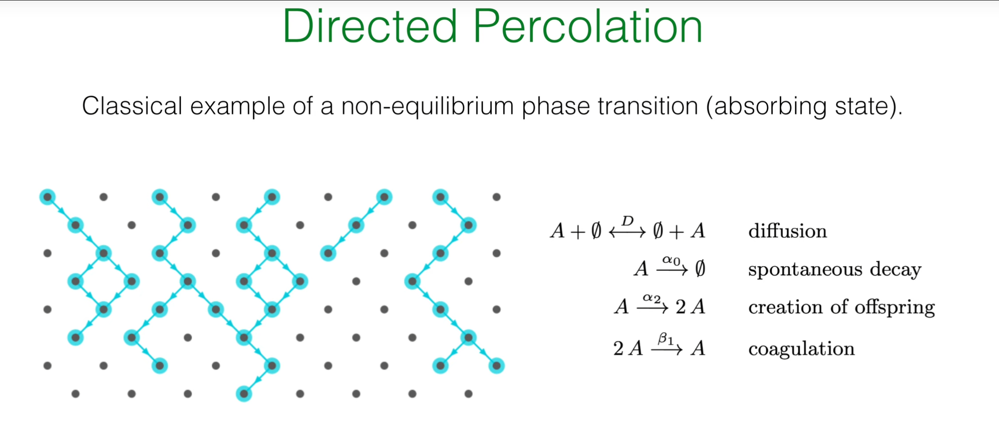
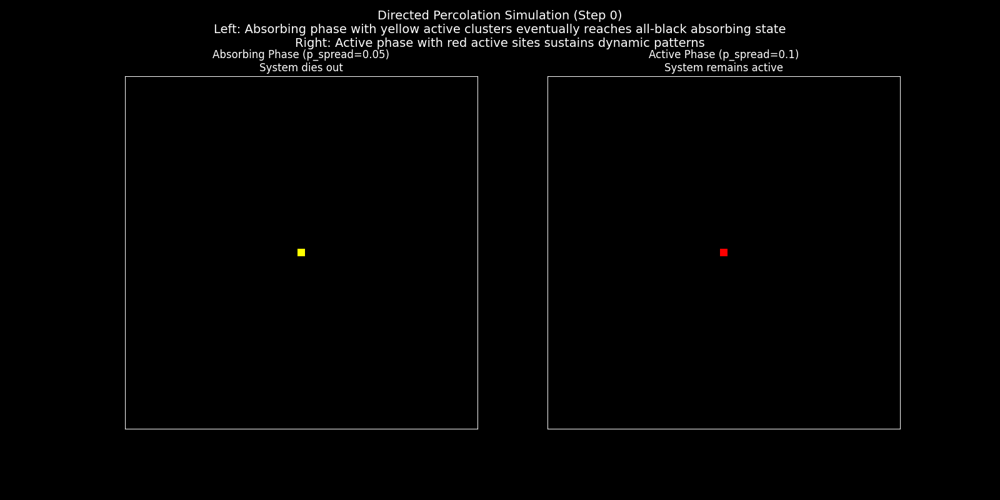
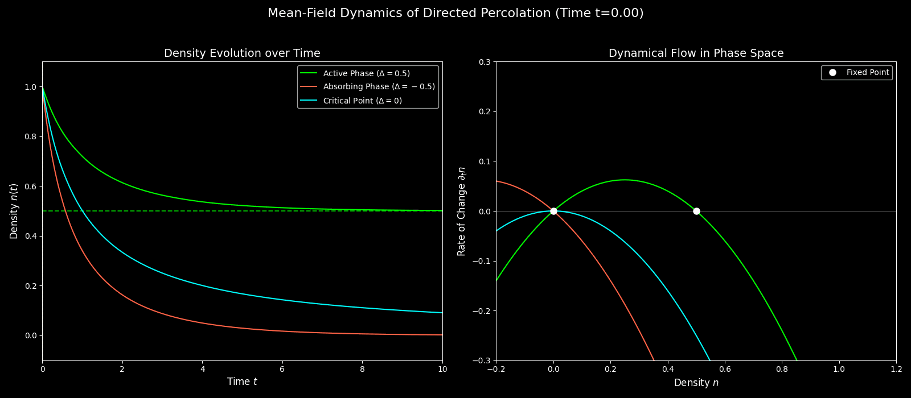
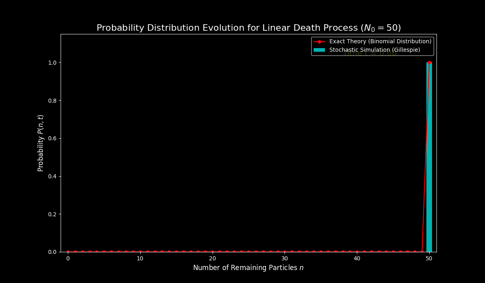

# 引言:迈向非平衡世界

在先前的课程中,已经建立了一套复杂的场论框架来描述近平衡态系统的动力学。从**昂萨格-马赫卢普泛函**出发,引入了功能更强大的**Janssen-De Dominicis (J-D) 作用量**,并以此为基础,系统性地推导了作为近平衡统计物理基石的**涨落-耗散关系 (FDT)**。随后的第32节则将视野拓展至远离平衡的领域,通过**Jarzynski等式**与**Crooks涨落定理**,揭示了在任意外部协议驱动下的非平衡瞬态过程中,非平衡功与平衡态自由能之间存在的深刻等式关系。这些理论虽然强大,但其关注点主要在于系统如何响应外部扰动,或是在两个平衡态之间被瞬时驱动。

这节课标志着课程视角的又一次关键转变:从瞬态的非平衡过程,转向那些被持续驱动、并能达到**非平衡稳态 (Non-Equilibrium Steady States, NESS)** 的系统。这里的核心问题不再是弛豫过程本身,而是系统在持续的能量或物质流下,是否会展现出类似于平衡态系统中的**相变**行为。这些非平衡相变不由自由能最小化所支配,而是源于驱动与耗散之间复杂的动态平衡,往往会涌现出全新的临界现象。

现实世界中充满了这样的系统。一个活着的细胞便是维持在**非平衡稳态 (NESS)** 最直观的例子,它通过持续的能量与物质交换,维持着一个远离热力学平衡的高度有序状态。而许多非平衡相变,其核心特征正是系统从一个动态涨落的"活跃相"到一个不可逆的"死寂"**吸收态**的转变。

一个典型的例子是**流行病的传播**:当传染病在人群中蔓延时,系统处于感染人数不断变化的"活跃相";而当最后一个感染者康复或被隔离后,系统便进入了病毒无法再自行产生的"零感染"吸收态。这场从流行到消亡的相变,由基本再生数 $R_0$ 是否超过临界点1所决定。类似的模型可以用来描述**森林火灾**的蔓延,其"活跃相"是燃烧的火焰,而"吸收态"是火焰的完全熄灭,这场相变则由树木的密度是否超过"渗流阈值"所控制。这种从活跃到永久"沉寂"的转变甚至可以在微观化学世界中找到对应,例如在**催化剂表面**,持续进行的化学反应是"活跃相",而当所有活性位点都被不可逆吸附的"毒物"覆盖后,反应便永久停止,系统进入了"中毒"的吸收态。这些例子清晰地表明,从宏观生态到微观反应,向吸收态的相变是自然界中一类极为普遍且重要的非平衡现象。

在此类非平衡相变的研究中,一个核心概念是**吸收态 (absorbing state)** 。吸收态是指系统一旦进入,就再也无法从中逃逸的一个或一组特殊状态。这个概念在之前的线性出生-死亡过程中已有涉及,其中种群数量为零的状态便是一个典型的吸收态,一旦种群灭绝,若无外部干预,其数量将永远为零。吸收态的存在从根本上打破了细致平衡,为系统注入了强烈的不可逆性。从一个动态涨落的活跃相到一个静止死寂的吸收相的转变,定义了一类独特而重要的非平衡相变。

为了具体地研究这类现象,需要一个原型模型。在非平衡相变领域,**有向渗流 (Directed Percolation, DP)** 所扮演的角色,堪比伊辛模型 (Ising model) 在平衡态相变理论中的基石地位。它以最简洁的形式,捕捉了从一个活跃的、持续波动的相到一个死寂的、静止的吸收相的连续相变。这节课的目标,便是深入剖析DP模型,首先通过一种简化的平均场方法来理解其基本的物理图像。然而,正如先前课程所强调的,平均场理论忽略了临界点附近至关重要的涨落。因此,为了构建更完善的理论,有必要重新审视并发展处理离散随机过程的数学工具——**主方程 (Master Equation)** 及其求解方法,为后续建立能够精确描述涨落的场论模型奠定坚实的基础。


# 1. 有向渗流的平均场理论

**有向渗流(Directed Percolation, DP)** 是一个描述具有内在方向性的涨落过程如何在媒介中传播的范式模型。与普通渗流(如水渗透多孔介质)不同,"有向"这一约束强调了过程的不可逆性,通常对应于时间的单向流逝。该模型精确地捕捉了一类非平衡相变的本质,即系统从一个能够自我维持、持续进行的**活跃相(Active Phase)**到一个动态最终会完全停止的**吸收相(Absorbing Phase)**的临界行为。现实世界中,此类现象屡见不鲜:例如**流行病的传播**,其活跃相是疾病在人群中的蔓延,而吸收相则是感染人数为零的"无病"状态;**森林火灾**的蔓延同样遵循此模式,燃烧的火势为活跃相,而火焰的完全熄灭则对应吸收相。因此,理解有向渗流模型是研究这类非平衡临界现象的理论起点。

为了从数学上捕捉吸收态相变的本质,需要构建一个能够体现粒子生、灭和相互作用的动力学模型。这小节的目标,是首先建立有向渗流模型(DP)的微观规则,然后通过**平均场近似**这一简化手段,忽略随机涨落和空间细节,推导出一个确定性的宏观动力学方程。通过分析这个方程的稳态解,揭示DP模型中从"活跃"到"死寂"的相变是如何发生的。

## 1.1 微观反应机制




考虑一个定义在格点上的粒子系统,粒子(标记为A)在其中经历一系列随机的生灭过程。这些过程构成了模型的微观动力学规则,可以被概括为以下三种基本的化学反应式:

1.**自发衰变 (Spontaneous Decay)**: $A \xrightarrow{\alpha_0} \varnothing$

一个粒子A以速率 $\alpha_0$ 自发地消失或死亡。这里的 $\varnothing$ 代表一个空格点或零粒子状态。这是驱动系统走向"死寂"的衰减机制。


2. **后代繁殖 (Offspring Creation)**: $A \xrightarrow{\alpha_2} 2A$

   

一个粒子A以速率 $\alpha_2$ 产生一个新的粒子,使得粒子总数增加一。这代表了系统的增长机制,是维持系统"活性"的源泉。


3.**凝聚 (Coagulation)**: $2A \xrightarrow{\beta_1} A$


两个相邻的粒子A以速率 $\beta_1$ 合并成一个粒子。这个过程在高密度时变得重要,它模拟了由于资源竞争等因素导致的增长抑制效应,起到了稳定粒子数量、防止其无限增长的作用。

这套简单的规则包含了生命(繁殖)、死亡(衰变)和相互作用(凝聚)这三个核心要素。它们之间的竞争与平衡,将共同决定整个系统的宏观命运。

## 1.2 确定性速率方程

为了从这些微观的、随机的规则过渡到对系统宏观行为的描述,首先采用**平均场近似 (mean-field approximation)** 。该近似的核心思想是:

**忽略空间关联**:假设系统是"充分混合"的,粒子在任何位置出现的概率都相同。

**忽略随机涨落**:用一个连续的宏观平均量——**粒子密度 $n(t)$** ——来代替离散、随机的粒子数,从而描述整个系统的状态。

在这种近似下,粒子密度的随时间演化遵循一个确定性的常微分方程,即**速率方程**:

$$
\frac{\partial n(t)}{\partial t} = (\alpha_2 - \alpha_0)n(t) - \beta_1 n^2(t)
$$

这个方程实际上是化学反应动力学中**质量作用定律 (law of mass action)** 的一个直接应用。它的每一项都有清晰的物理来源:

**线性项 $(\alpha_2 - \alpha_0)n(t)$** :代表了单粒子过程的净效应。

$+\alpha_2 n(t)$: 粒子总数的增加率。它正比于现存的、可以进行繁殖的粒子密度 $n(t)$。

$-\alpha_0 n(t)$: 粒子总数的减少率。它正比于现存的、可能发生衰变的粒子密度 $n(t)$。

**非线性项 $-\beta_1 n^2(t)$** :代表了双粒子过程的效应。

在平均场近似下,两个粒子相遇的概率正比于粒子密度的平方 $n^2(t)$。这一项是非线性的,它对于防止粒子数爆炸性增长至关重要,体现了高密度下的抑制作用。

通过平均化处理,这个方程将离散的粒子生灭事件转化为了一个连续变量 $n(t)$ 的确定性演化。这种简化虽然忽略了涨落(fluctuations)的关键作用,但它能够以最小的代价揭示出系统可能存在的不同宏观相。

## 1.3 稳态分析与吸收态相变

系统的长期行为由其**稳态 (steady state)** 决定,即粒子密度不再随时间变化的状态,此时 $\frac{\partial n(t)}{\partial t} = 0$。通过求解代数方程 $(\alpha_2 - \alpha_0)n - \beta_1 n^2 = 0$,可以找到系统的所有不动点(稳态解)。

分析的关键在于引入一个**控制参数** $\Delta = \alpha_2 - \alpha_0$。这个参数具有明确的物理意义:它代表了在没有相互作用时(即密度极低,$n \to 0$),单个粒子的**净增长率** 。根据 $\Delta$ 的符号,系统展现出两种截然不同的宏观行为:


1.**吸收相 (Absorbing Phase, $\Delta < 0$)**


当衰变速率 $\alpha_0$ 大于繁殖速率 $\alpha_2$ 时,净增长率为负。此时,速率方程的唯一物理稳态解是 $n_{ss} = 0$。

**物理意义**:这意味着任何初始的粒子布居最终都会消亡,系统不可避免地进入一个没有任何粒子的"死寂"状态。这个 $n = 0$ 的状态正是一个**吸收态 (Absorbing State)**,因为一旦进入,繁殖过程便无法启动,系统再也无法从中逃逸。


2.**活跃相 (Active Phase, $\Delta > 0$)**


当繁殖速率 $\alpha_2$ 超过衰变速率 $\alpha_0$ 时,净增长率为正。此时,除了 $n = 0$ 这个(现在不稳定的)解之外,出现了一个新的、稳定的非零稳态解:
$$
n_{act} = \frac{\Delta}{\beta_1} = \frac{\alpha_2 - \alpha_0}{\beta_1}
$$


**物理意义**:在这个相中,系统能够维持一个有限的、动态平衡的粒子密度。粒子的净增长被高密度下的凝聚过程所平衡,形成一个持续存在、不断涨落的"活"的状态。

在 $\Delta = 0$ 这个点,系统恰好处于从活跃相到吸收相的临界点。这是一个**连续相变**,活跃相的稳态密度 $n_{act}$ 在此相变中扮演了**序参数 (order parameter)** 的角色,它从零开始连续增长。这种从一个动态活跃状态到一个静止吸收状态的转变,被称为**吸收态相变**。


# 2. 平均场理论下的临界现象

在确定了系统存在两种宏观相之后,下一步是深入研究相变临界点附近的行为。物理学中,临界点附近的动力学和标度行为往往揭示了系统的普适规律,这些规律不依赖于模型的微观细节。这小节将分析平均场速率方程的动力学解,从中揭示**临界慢化**这一普适现象,并引入**临界指数**来定量刻画临界行为,最终提出**有向渗流普适类**这一重要猜想。

## 2.1 动力学弛豫与临界慢化

除了稳态性质,系统如何趋近于稳态的动力学过程也包含了相变的重要信息。上述的非线性速率方程是一个伯努利方程 (Bernoulli equation),可以被精确求解。给定初始密度 $n(t=0) = n_0$,其解为:

$$
n(t) = \frac{n_0 n_{act}}{n_0 + (n_{act} - n_0)e^{-\Delta t}}
$$

当 $t \to \infty$ 时,指数项消失,分式化简为 $\frac{n_0 n_{act}}{n_0} = n_{act}$,正确地趋向于活跃相的稳态密度。

从这个解中可以分析系统的**弛豫 (relaxation)** 行为:

**指数弛豫 ($\Delta > 0$)**

在活跃相内部,系统会以指数形式趋近于稳态密度 $n_{act}$。从解的分母可以看出,其特征弛豫时间为:


$$
\tau_{RELAX} = \frac{1}{\Delta} = \frac{1}{\alpha_2 - \alpha_0}
$$


这个弛豫时间尺度衡量了系统从一个微扰状态恢复到稳态的速度。

**临界慢化 (Critical Slowing Down)**

当系统从活跃相趋近于临界点时,即 $\Delta \to 0^+$,弛豫时间 $\tau_{RELAX} \to \infty$。这意味着在临界点附近,系统的演化变得极其缓慢,对初始状态的"记忆"会持续非常长的时间。

**物理根源**:这是所有连续相变的普适特征之一。在物理上,这源于驱动系统恢复到稳态的"力"(在此处由 $\Delta$ 体现)在临界点消失了,导致系统对扰动的响应变得无限缓慢。

**临界点的幂律弛豫 ($\Delta = 0$)**

恰好在临界点上,动力学行为发生质变。指数弛豫被一种更慢的**代数弛豫**(或称**幂律弛豫**)所取代。此时速率方程简化为 $\frac{\partial n(t)}{\partial t} = -\beta_1 n^2(t)$,其解为:

$$
n(t) = \frac{n_0}{1 + \beta_1 n_0 t} \sim t^{-1} \quad (\text{for large } t)
$$

系统密度随时间以 $t^{-1}$ 的幂律形式衰减,这远比任何指数衰减都要慢。

## 2.2 临界指数与普适类

为了更普适地、定量地刻画临界点附近的行为,物理学家引入了一套不依赖于具体参数的**临界指数 (critical exponents)** 。

**序参数指数 $\beta$** : 描述了当控制参数 $\Delta$ 趋于零时,序参数(这里是 $n_{act}$)如何消失。其定义为 $n_{act} \sim |\Delta|^\beta$。根据平均场理论的结果 $n_{act} = \Delta/\beta_1$,可以得到 $\beta = 1$。


**弛豫时间指数 $\nu z$** : 描述了弛豫时间的发散行为,定义为 $\tau_{RELAX} \sim |\Delta|^{-\nu z}$。根据 $\tau_{RELAX} = 1/\Delta$,得到 $\nu z = 1$。

为了使模型更贴近真实物理系统,需要考虑空间维度和粒子的扩散。这可以通过在速率方程中加入一个**扩散项**来实现,从而得到一个**反应-扩散方程 (reaction-diffusion equation)** :

$$
\frac{\partial n(\mathbf{x}, t)}{\partial t} = (\alpha_2 - \alpha_0)n(\mathbf{x}, t) - \beta_1 n^2(\mathbf{x}, t) + D \nabla^2 n(\mathbf{x}, t)
$$

其中 $D$ 是扩散系数,$n(\mathbf{x}, t)$ 是依赖于空间和时间的密度场。扩散引入了一个新的特征尺度——**关联长度 $\xi$**,它描述了系统中涨落的空间关联范围。在临界点附近,关联长度也发散,$\xi \sim |\Delta|^{-\nu}$。而时间尺度和长度尺度通过**动力学指数 $z$** 关联起来,$\tau \sim \xi^z$。对上述反应-扩散方程的分析可以得到完整的有向渗流平均场临界指数:

$$
\beta = 1, \quad \nu = \frac{1}{2}, \quad z = 2
$$

至此,提出了一个深刻的物理学猜想:**所有具有单个吸收态、标量序参数和短程相互作用的非平衡相变,都属于有向渗流(DP)普适类**  。这意味着,无论系统的微观细节如何(例如具体的反应速率、格点结构等),只要它满足上述基本条件,其在临界点附近的行为就应该由与DP相同的临界指数所描述。

然而,精确的数值模拟和实验表明,DP的真实临界指数(例如在1+1维中,$\beta \approx 0.276$)与平均场理论的预测值有显著差异。这揭示了平均场近似的局限性:**它完全忽略了在临界点附近至关重要的涨落**。为了超越平均场理论,必须建立一个能够恰当处理随机涨落的场论描述,而这一切的起点,正是**主方程**。

# 3. 离散随机过程的数学工具

平均场理论为有向渗流(DP)提供了一幅宏观的、确定性的图像,但它最大的缺陷在于完全忽略了随机涨落——而这恰恰是临界现象的核心。为了建立一个更基本、更准确的理论,必须回到对离散粒子随机生灭过程的直接描述,其数学语言正是**主方程 (Master Equation)**。

然而,直接处理包含非线性相互作用(如DP中的凝聚过程)的主方程极其困难。因此,在挑战DP模型之前,本部分将采取"迂回"策略:首先,通过分析一个最简单的、精确可解的随机模型——**线性死亡过程**,来系统性地发展和掌握求解主方程所必需的数学工具箱。

## 3.1 理论框架回顾与挑战

在深入研究离散粒子系统的主方程之前,有必要回顾一下之前讲座(如第31讲)中为**连续随机变量**建立的理论框架。这个框架构成了一个层次分明的体系:

**微观层面** : **朗之万方程 (Langevin Equation)** ,如 $dx = A(x)dt + C(x)dW$,它描述了单个随机轨迹的演化。

**介观层面** : **福克-普朗克方程 (Fokker-Planck Equation)** ,它描述了概率分布函数 $P(\mathbf{x}, t)$ 的确定性演化。

**全局层面** : **路径积分表述** ,将概率演化表示为对所有可能路径的泛函积分,其中作用量 $S$ 包含了系统的动力学信息。

当前面临的挑战是为**离散变量**(如粒子数 $n \in \{0, 1, 2, \ldots\}$)系统构建一个类似的强大框架。对于这类系统,其动力学的出发点不再是朗之万方程,而是主方程。


## 3.2 线性死亡过程与主方程

为了发展求解主方程的数学工具,从最简单的非平凡随机过程开始:**线性死亡过程 (linear death process)** 。这个过程对应于自发衰变反应:$A \xrightarrow{\lambda} \varnothing$,其中每个粒子都以恒定的人均速率 $\lambda$ 独立地消失。

主方程描述的是系统在时刻 $t$ 恰好有 $n$ 个粒子的概率 $P_n(t)$ 的时间演化。它是一个关于概率流的平衡方程,其形式如下:

$$
\frac{d P_n(t)}{dt} = \lambda(n+1)P_{n+1}(t) - \lambda n P_n(t)
$$

这个方程的物理意义,正是第7讲中建立的"增益-损失"平衡思想的体现:

**增益项 (Gain Term)** : $+\lambda(n+1)P_{n+1}(t)$

系统进入状态 $n$ 的唯一途径是从状态 $n+1$ 跃迁而来。当系统中有 $n+1$ 个粒子时,总死亡速率为 $\lambda(n+1)$。因此,从状态 $n+1$ 流入状态 $n$ 的总概率流,正比于源状态的概率 $P_{n+1}(t)$ 和转移速率之积。

**损失项 (Loss Term)** : $-\lambda n P_n(t)$

如果系统处于状态 $n$,它会因其中任何一个粒子衰变而离开此状态。总的离开速率是 $\lambda n$。因此,从状态 $n$ 流出的总概率流,正比于当前状态的概率 $P_n(t)$ 和这个速率之积。

这个方程实际上是一个无限维的、耦合的线性常微分方程组,直接求解相当繁琐。

## 3.3 生成函数方法:从无限到单一

为了解决上述问题,引入一个在第4讲中已经使用过的强大数学工具——**生成函数 (generating function)** $G(x, t)$。它将无穷序列的概率 $P_n(t)$ 编码为一个关于辅助变量 $x$ 的单一函数:

$$
G(x, t) = \sum_{n=0}^{\infty} P_n(t) x^n
$$

这个函数的优点在于,它可以将主方程中涉及不同 $n$ 值的**差分运算** ,转化为对生成函数的**连续微分运算** 。对主方程两边同乘 $x^n$ 并对所有 $n$ 求和,可以得到一个关于生成函数的、单一的一阶偏微分方程:

$$
\frac{\partial G(x, t)}{\partial t} = \lambda(1 - x)\frac{\partial G(x, t)}{\partial x}
$$

**左侧** : $\sum_n \frac{dP_n}{dt} x^n = \frac{\partial}{\partial t} \sum_n P_n x^n = \frac{\partial G}{\partial t}$。

**损失项** : $\sum_n (-\lambda n P_n) x^n = -\lambda x \frac{\partial}{\partial x} \sum_n P_n x^n = -\lambda x \frac{\partial G}{\partial x}$。

**增益项** : $\sum_n \lambda(n+1)P_{n+1}x^n = \lambda \frac{\partial}{\partial x} \sum_{n+1} P_{n+1}x^{n+1} = \lambda \frac{\partial G}{\partial x}$。

通过引入生成函数,成功地将一个无限维的常微分方程组转化为了一个简洁的偏微分方程,为问题的解析求解铺平了道路。

# 4. 谱方法求解与物理诠释

上一部分成功地将线性死亡过程的主方程转化为了一个关于生成函数的偏微分方程。现在,将引入一种更为深刻和强大的求解方法——**谱方法 (spectral method)** 。其核心思想是借鉴量子力学中的算符理论,将求解偏微分方程的问题转化为一个寻找算符本征值和本征函数的问题。这种方法不仅能给出最终解,更能揭示系统动力学背后深刻的代数结构。

## 4.1 算符形式与量子力学类比

可以将关于生成函数的偏微分方程改写成算符形式。定义一个线性算符 $\mathcal{H}$:

$$
\mathcal{H} = \lambda(x - 1)\frac{\partial}{\partial x}
$$

于是,方程可以写成一个与(虚时间下的)薛定谔方程形式上非常相似的方程:

$$
\frac{\partial G(x, t)}{\partial t} = -\mathcal{H} G(x, t)
$$

这个方程的形式解是 $G(t) = e^{-\mathcal{H}t}G(0)$。为了得到具体解,需要求解算符 $\mathcal{H}$ 的本征值问题:

$$
\mathcal{H} \varphi_j(x) = \lambda_j \varphi_j(x)
$$

其中 $\lambda_j$ 是本征值,$\varphi_j(x)$ 是对应的本征函数。

**物理意义** :这里的 $\mathcal{H}$ 虽然形式上类似哈密顿算符,但它描述的是经典概率的演化,而非量子波函数。这种类比的价值在于,可以借用量子力学中成熟的代数工具来解决经典随机过程问题。


## 4.2 升降算符与本征谱

为了代数化地解决这个本征问题,引入一对**升降算符 (ladder operators)** ,这与量子谐振子的处理方式如出一辙:

**湮灭算符 (Annihilation operator)** : $a := \frac{\partial}{\partial x}$

**产生算符 (Creation operator)** : $a^\dagger := (x - 1)$

这两个算符满足一个类似于玻色子算符的**对易关系 (commutation relation)** :

$$
[a, a^\dagger] = a a^\dagger - a^\dagger a = \partial_x(x-1) - (x-1)\partial_x = 1
$$

利用这两个算符,哈密顿算符 $\mathcal{H}$ 可以被简洁地表示为:

$$
\mathcal{H} = \lambda a^\dagger a
$$

通过分析算符 $\mathcal{H}$ 与升降算符的对易关系,可以证明 $a^\dagger$ 会将本征值升高 $\lambda$,而 $a$ 会将本征值降低 $\lambda$。由于概率必须有界,本征值谱必须有下界,因此必然存在一个被湮灭算符"杀死"的**基态** $\varphi_0$:

$a \varphi_0(x) = \frac{\partial \varphi_0(x)}{\partial x} = 0 \implies \varphi_0(x) = \text{const}$。不妨取 $\varphi_0(x) = 1$。

对应的基态本征值为 $\lambda_0 = 0$。

从基态出发,通过不断作用产生算符 $a^\dagger$,就可以构建出整个本征谱:

**本征值** : $\lambda_j = j \lambda$, for $j \in \mathbb{N}_0 = \{0, 1, 2, \ldots\}$

**本征函数** : $\varphi_j(x) \propto (a^\dagger)^j \varphi_0 \propto (x - 1)^j$

## 4.3 完整的时变解与物理诠释

有了完整的本征谱,就可以将生成函数 $G(x, t)$ 在这个本征函数基上展开:

$$
G(x, t) = \sum_{j=0}^{\infty} G_{j0} e^{-\lambda_j t} \varphi_j(x) = \sum_{j=0}^{\infty} G_{j0} e^{-j \lambda t} (x - 1)^j
$$

其中系数 $G_{j0}$ 由初始条件决定。假设系统在 $t = 0$ 时刻有确定的 $N$ 个粒子,即 $P_n(0) = \delta_{n,N}$,对应的初始生成函数为 $G(x, 0) = x^N$。

为了求出系数 $G_{j0}$,巧妙地利用二项式定理,将 $x^N$ 在 $(x-1)$ 处展开:

$$
x^N = (1 + (x - 1))^N = \sum_{j=0}^{N} \binom{N}{j} (x - 1)^j
$$

通过比较系数,立刻得到 $G_{j0} = \binom{N}{j}$ for $j \leq N$,且当 $j > N$ 时 $G_{j0} = 0$。

将系数代回时变解,并再次利用二项式定理求和,得到生成函数的最终紧凑形式:

$$
G(x, t) = \sum_{j=0}^{N} \binom{N}{j} e^{-j \lambda t} (x - 1)^j = \left(1 + (x-1)e^{-\lambda t}\right)^N
$$

最后一步,是从生成函数中提取出我们真正关心的概率 $P_n(t)$。根据生成函数的定义,$P_n(t)$ 就是 $G(x,t)$ 展开式中 $x^n$ 项的系数。对上式再次使用二项式定理展开:

$$
G(x, t) = \left((1 - e^{-\lambda t}) + x e^{-\lambda t}\right)^N = \sum_{n=0}^{N} \binom{N}{n} (x e^{-\lambda t})^n (1 - e^{-\lambda t})^{N-n}
$$

由此,直接读出概率分布:

$$
P(n, t | N, 0) = \binom{N}{n} (e^{-\lambda t})^n (1 - e^{-\lambda t})^{N-n}
$$

这是一个**二项分布 (Binomial Distribution)** 。


这个精确解具有极其优美和直观的物理内涵。在时刻 $t$,初始 $N$ 个粒子中的每一个,都有 $p = e^{-\lambda t}$ 的概率存活下来(这是单个粒子存活概率的解),有 $1 - p = 1 - e^{-\lambda t}$ 的概率已经衰变。由于每个粒子的衰变是相互独立的事件(这是"线性"过程的根本假设),那么在时刻 $t$ 恰好有 $n$ 个粒子存活的概率,就等同于在 $N$ 次独立的伯努利试验中,取得 $n$ 次"成功"(存活)的概率——这正是二项分布的定义。这个精确解完美地验证了谱方法这一抽象数学工具的威力,并深刻地揭示了**微观过程的独立性**是如何在宏观概率分布上体现为**二项统计**的。

# 5. 代码实践


## 5.1 代码实践 I:可视化有向渗流过程 (格子模型 vs. 平均场)

为了建立对有向渗流(DP)的直观理解,首先通过一个2D的**格子模型 (Lattice Model)** 来直接观察"渗流"的动态过程。这个随机模拟展示了"活跃"的粒子如何在空间上传播和消亡。随后,将展示平均场理论是如何在忽略空间细节的更高抽象层次上,来描述这个复杂过程的宏观平均行为的。

下面的代码模拟了一个简化版的有向渗流过程(也称为接触过程)。在一个二维网格上,每个"活跃"(红色)的格子会尝试激活其邻居,同时自身也有一定概率变为"不活跃"(黑色)。我们将对比两种不同传播概率下的系统演化:一种最终会消亡(吸收相),另一种则能够持续传播(活跃相)。

```python
import numpy as np
import matplotlib.pyplot as plt
from matplotlib.animation import FuncAnimation, PillowWriter

# --- Use dark background for plots ---
plt.style.use('dark_background')

def run_dp_simulation(grid_size, p_spread, p_death, steps):
    """Runs a single 2D Directed Percolation (Contact Process) simulation."""
    # Initialize grid with a small active cluster in the center
    grid = np.zeros((grid_size, grid_size), dtype=int)
    center = grid_size // 2
    grid[center-1:center+1, center-1:center+1] = 1
    
    history = [grid.copy()]
    
    for _ in range(steps):
        new_grid = grid.copy()
        active_sites = np.argwhere(grid == 1)
        
        if active_sites.size == 0: # Extinction
            for _ in range(steps - len(history) + 1):
                history.append(new_grid.copy())
            break

        for r, c in active_sites:
            # Spread to neighbors
            for dr in [-1, 0, 1]:
                for dc in [-1, 0, 1]:
                    if dr == 0 and dc == 0:
                        continue
                    
                    nr, nc = r + dr, c + dc
                    # Check boundaries and if neighbor is inactive
                    if 0 <= nr < grid_size and 0 <= nc < grid_size and new_grid[nr, nc] == 0:
                        if np.random.rand() < p_spread:
                            new_grid[nr, nc] = 1
            
            # Spontaneous death
            if np.random.rand() < p_death:
                new_grid[r, c] = 0
        
        grid = new_grid
        history.append(grid.copy())
        
    return history

# --- Simulation Parameters ---
GRID_SIZE = 100
ANIMATION_STEPS = 200

# --- Case 1: Absorbing Phase (low spread probability) ---
p_spread_abs = 0.05
p_death_abs = 0.2
history_abs = run_dp_simulation(GRID_SIZE, p_spread_abs, p_death_abs, ANIMATION_STEPS)

# --- Case 2: Active Phase (high spread probability) ---
p_spread_act = 0.1
p_death_act = 0.2
history_act = run_dp_simulation(GRID_SIZE, p_spread_act, p_death_act, ANIMATION_STEPS)

# --- Create Animation ---
fig, (ax1, ax2) = plt.subplots(1, 2, figsize=(12, 6))

def update(frame):
    ax1.clear()
    ax1.imshow(history_abs[frame], cmap='hot', vmin=0, vmax=1)
    ax1.set_title(f'Absorbing Phase (p_spread={p_spread_abs})', fontsize=12)
    ax1.set_xticks([])
    ax1.set_yticks([])

    ax2.clear()
    ax2.imshow(history_act[frame], cmap='hot', vmin=0, vmax=1)
    ax2.set_title(f'Active Phase (p_spread={p_spread_act})', fontsize=12)
    ax2.set_xticks([])
    ax2.set_yticks([])
    
    fig.suptitle(f'2D Directed Percolation Simulation (Step {frame})', fontsize=16)

# --- Generate and save the animation ---
ani = FuncAnimation(fig, update, frames=ANIMATION_STEPS, interval=50)
ani.save("dp_lattice_simulation.gif", writer=PillowWriter(fps=20))
plt.show()
```




**左图 (吸收相)** :传播概率较低。初始的活跃团簇(亮黄色)虽然在早期有所扩张,但死亡的速率超过了传播的速率。最终,所有活跃点都消失了,系统进入了全黑的、静止的**吸收态**。

**右图 (活跃相)** :传播概率较高。初始的活跃团簇成功地向外蔓延,形成了一个持续存在、不断变化的动态斑图。尽管局部有生有灭,但整体上系统保持"活着",这便是**活跃相**。

这个模拟显示了系统存在一个临界传播概率,跨越这个临界点,系统的长期行为会发生质变。


## 5.2 代码实践 II: 平均场动力学与相流 (GIF动画)

现在,回到平均场理论。它忽略了上述模拟中的所有空间结构和随机细节,只关注系统整体的**平均密度** $n(t)$。下面的动画.在相空间中可视化了平均密度的演化,展示宏观层面上的动态规律。

```python
import numpy as np
import matplotlib.pyplot as plt
from scipy.integrate import solve_ivp
from matplotlib.animation import FuncAnimation, PillowWriter

# --- Use dark background for plots ---
plt.style.use('dark_background')

# --- Parameter setup ---
beta1 = 1.0
n0 = 1.0
t_span = [0, 10]
t_eval = np.linspace(t_span[0], t_span[1], 200)

def rate_equation(t, n, delta, beta1):
    """The mean-field rate equation for DP."""
    return delta * n - beta1 * n**2

# --- Solve for the three cases ---
delta_active = 0.5
sol_active = solve_ivp(rate_equation, t_span, [n0], args=(delta_active, beta1), t_eval=t_eval)
n_act_theory = delta_active / beta1

delta_absorbing = -0.5
sol_absorbing = solve_ivp(rate_equation, t_span, [n0], args=(delta_absorbing, beta1), t_eval=t_eval)

delta_critical = 0.0
sol_critical = solve_ivp(rate_equation, t_span, [n0], args=(delta_critical, beta1), t_eval=t_eval)

# --- Create Animation ---
fig, (ax1, ax2) = plt.subplots(1, 2, figsize=(16, 7))

def update_mean_field(frame):
    # --- Clear canvases for new frame ---
    ax1.clear()
    ax2.clear()
    
    # --- Panel 1: Density vs. Time ---
    ax1.plot(sol_active.t, sol_active.y[0], label=f'Active Phase ($\\Delta={delta_active}$)', color='lime')
    ax1.axhline(y=n_act_theory, linestyle='--', color='lime', alpha=0.7)
    ax1.plot(sol_absorbing.t, sol_absorbing.y[0], label=f'Absorbing Phase ($\\Delta={delta_absorbing}$)', color='tomato')
    ax1.plot(sol_critical.t, sol_critical.y[0], label=f'Critical Point ($\\Delta=0$)', color='cyan')
    
    # Dynamic timeline
    current_time = t_eval[frame]
    ax1.axvline(current_time, color='yellow', linestyle='--', lw=1)
    
    ax1.set_xlabel('Time $t$', fontsize=12)
    ax1.set_ylabel('Density $n(t)$', fontsize=12)
    ax1.set_title('Density Evolution over Time', fontsize=14)
    ax1.legend()
    ax1.set_xlim(t_span)
    ax1.set_ylim(-0.1, 1.1)

    # --- Panel 2: Phase Space Flow ---
    n_range = np.linspace(-0.2, 1.2, 200)
    ax2.axhline(0, color='gray', lw=0.5)
    
    # Plot phase flow curves
    ax2.plot(n_range, rate_equation(0, n_range, delta_active, beta1), color='lime')
    ax2.plot(n_range, rate_equation(0, n_range, delta_absorbing, beta1), color='tomato')
    ax2.plot(n_range, rate_equation(0, n_range, delta_critical, beta1), color='cyan')

    # Plot fixed points
    ax2.plot(0, 0, 'wo', markersize=8, label='Fixed Point')
    ax2.plot(n_act_theory, 0, 'wo', markersize=8)

    # Plot dynamic evolution points
    ax2.plot(sol_active.y[0, frame], rate_equation(0, sol_active.y[0, frame], delta_active, beta1), 'o', color='lime', markersize=10)
    ax2.plot(sol_absorbing.y[0, frame], rate_equation(0, sol_absorbing.y[0, frame], delta_absorbing, beta1), 'o', color='tomato', markersize=10)
    ax2.plot(sol_critical.y[0, frame], rate_equation(0, sol_critical.y[0, frame], delta_critical, beta1), 'o', color='cyan', markersize=10)

    ax2.set_xlabel('Density $n$', fontsize=12)
    ax2.set_ylabel('Rate of Change $\\partial_t n$', fontsize=12)
    ax2.set_title('Dynamical Flow in Phase Space', fontsize=14)
    ax2.legend()
    ax2.set_xlim(-0.2, 1.2)
    ax2.set_ylim(-0.3, 0.3)
    
    fig.suptitle(f'Mean-Field Dynamics of Directed Percolation (Time t={current_time:.2f})', fontsize=16)
    plt.tight_layout(rect=[0, 0, 1, 0.95])

# --- Generate and save the animation ---
ani_mf = FuncAnimation(fig, update_mean_field, frames=len(t_eval), interval=50)
ani_mf.save("dp_mean_field_dynamics.gif", writer=PillowWriter(fps=20))
plt.show()
```


这个相空间流动画是对2D格子模拟中宏观行为的抽象总结。展示了平均场理论所预测的系统命运:

**活跃相 (绿色)** :系统存在一个稳定的非零密度不动点,动力学流将系统"推"向这个状态。

**吸收相 (红色)** :系统唯一的稳定不动点是密度为零,所有初始状态都会"流"向灭绝。

**临界点 (蓝色)** :系统演化到零附近时,恢复力(即$\partial_t n$)变得极小,导致了**临界慢化** 。

## 5.3 代码实践 III:线性死亡过程的动态概率分布

对于随机过程,我们更关心的是整个概率分布的演化。以下代码将模拟线性死亡过程,并动态展示其概率分布 $P(n, t)$ 如何从一个初始的确定状态($\delta$分布)演变为最终的吸收态(所有粒子死亡)。

这个动画将直观地展示主方程的解,并将其与我们推导出的二项分布理论解进行实时对比。

```python
import numpy as np
import matplotlib.pyplot as plt
from scipy.special import comb
from matplotlib.animation import FuncAnimation, PillowWriter

# --- Use dark background for plots ---
plt.style.use('dark_background')

# --- Simulation Parameters ---
N = 50                 # Initial number of particles
lambda_rate = 0.1      # Per-capita death rate
t_final = 30.0         # Total simulation time
num_trials = 20000     # Number of independent simulations

# --- Run full Gillespie simulations to get all trajectories ---
all_trajectories_n = []
all_trajectories_t = []

# This loop pre-calculates all data needed for the animation
for _ in range(num_trials):
    n, t = N, 0.0
    ns, ts = [n], [t]
    while n > 0:
        total_rate = lambda_rate * n
        # Draw time step from exponential distribution
        dt = np.random.exponential(1.0 / total_rate)
        t += dt
        n -= 1 # Only death events
        ns.append(n)
        ts.append(t)
    all_trajectories_n.append(np.array(ns))
    all_trajectories_t.append(np.array(ts))

# --- Create Animation ---
fig, ax = plt.subplots(figsize=(12, 7))
n_values = np.arange(0, N + 1)

# Initialize plot elements
bar_container = ax.bar(n_values, np.zeros(N + 1), width=0.8, label='Stochastic Simulation (Gillespie)', color='cyan', alpha=0.7)
line, = ax.plot(n_values, np.zeros(N + 1), 'ro-', label='Exact Theory (Binomial Distribution)', markersize=5)
time_text = ax.text(0.75, 0.9, '', transform=ax.transAxes, fontsize=14, color='yellow')

def get_pop_at_time(t_point, traj_t, traj_n):
    """Helper function to find the population at a specific time from a trajectory."""
    idx = np.searchsorted(traj_t, t_point, side='right') - 1
    return traj_n[idx]

def update_death_process(frame):
    """Update function for the animation."""
    current_time = frame * t_final / 100
    
    # Get particle counts at the current time from all trajectories
    pops_at_time_t = [get_pop_at_time(current_time, T, n) for T, n in zip(all_trajectories_t, all_trajectories_n)]
    
    # Calculate simulated probability distribution
    counts_sim, _ = np.histogram(pops_at_time_t, bins=np.arange(0, N + 2) - 0.5)
    freq_sim = counts_sim / num_trials
    
    # Update the bar chart heights
    for count, rect in zip(freq_sim, bar_container.patches):
        rect.set_height(count)
    
    # Calculate theoretical probability distribution (Binomial)
    p_survival = np.exp(-lambda_rate * current_time)
    prob_theory = comb(N, n_values) * (p_survival**n_values) * ((1 - p_survival)**(N - n_values))
    
    # Update the theoretical curve
    line.set_ydata(prob_theory)
    
    # Update time text
    time_text.set_text(f'Time t = {current_time:.2f}')
    
    # Dynamically adjust y-axis limit for better visibility
    max_prob = max(np.max(freq_sim), np.max(prob_theory)) if freq_sim.size > 0 else 0.1
    ax.set_ylim(0, max_prob * 1.15)
    
    return bar_container.patches + [line, time_text]

# --- Setup plot aesthetics ---
ax.set_xlabel('Number of Remaining Particles $n$', fontsize=12)
ax.set_ylabel('Probability $P(n, t)$', fontsize=12)
ax.set_title(f'Probability Distribution Evolution for Linear Death Process ($N_0={N}$)', fontsize=16)
ax.legend()
ax.set_xlim(-1, N + 1)

# --- Generate and save the animation ---
ani_death = FuncAnimation(fig, update_death_process, frames=100, interval=100, blit=True)
ani_death.save("linear_death_distribution.gif", writer=PillowWriter(fps=10))
plt.show()

```



这个动画展示了主方程所描述的核心过程——**概率分布的演化**。
**初始状态**:在 $t=0$ 时,概率分布是一个尖锐的峰($\delta$函数),所有概率都集中在初始粒子数 $N=50$ 处。

**演化过程**:随着时间推移,这个概率峰开始向左移动(平均粒子数减少)并逐渐展宽(随机性导致结果的不确定性增加)。可以看到概率是如何从高粒子数状态"流动"到低粒子数状态的。

**理论与模拟的吻合**:在动画的每一步,由上万次随机模拟统计出的柱状图(青色)都与我们用谱方法推导出的二项分布理论解(红色曲线)完美吻合。这强有力地证明了理论的正确性。

**趋向吸收态**:当时间足够长时,整个概率分布最终会完全汇集到 $n=0$ 这个吸收态上,对应于种群的完全灭绝。

通过这个动态可视化,我们不再是观察单条随机轨迹,而是鸟瞰了整个随机过程的系综行为,这正是主方程和谱方法所要描述的物理现实。

#  总结:迈向非线性随机场论

这节课深入探讨了非平衡统计物理中的两个核心主题:一是物理模型,二是数学方法。通过将理论与代码实践相结合,加深了对这些概念的理解。

1.  **吸收态相变的物理学**: 通过对有向渗流(DP)模型的平均场分析,揭示了一类重要的非平衡相变——吸收态相变的基本特征。其关键物理现象包括存在一个从活跃相到吸收相的连续相变点,以及在临界点附近表现出的**临界慢化 (Critical Slowing Down)** 和**幂律动力学行为 (Power-Law Dynamics)** 。更重要的是,DP普适类猜想的提出,暗示了这类相变背后存在深刻的普适规律,这促使物理学家寻求超越平均场理论的、能够描述涨落的更精确理论。

2.  **主方程的数学方法** : 为了处理离散随机过程,引入了主方程这一基本工具。对于像线性死亡过程这样的简单线性主方程,本讲展示了如何通过**生成函数 (Generating Function)** 和**谱方法 (Spectral Method)** (特别是借鉴量子力学的算符代数)获得其精确解。这种方法不仅优雅,而且其结果具有清晰的物理诠释,完美地连接了抽象的数学推导与底层的随机事件。

然而,这节课也揭示了未来的挑战。谱方法之所以能成功应用于线性死亡过程,关键在于其哈密顿算符 $\mathcal{H}$ 是线性的(在 $\frac{\partial}{\partial x}$ 上是一阶的)。对于像有向渗流这样包含非线性项(如 $2A \to A$ 对应于 $n^2$ 的项)的系统,其主方程将导致一个在生成函数空间中包含高阶导数(如 $\frac{\partial^2}{\partial x^2}$)的、更复杂的算符,使得谱方法通常难以直接应用。

对于连续变量系统,从朗之万方程到福克-普朗克方程,再到路径积分,已经建立了一条成熟的路径。对于离散变量系统,从主方程出发,虽然可以通过 Kramers-Moyal 展开将其近似为福克-普朗克方程,再构建路径积分,但这条近似路径会丢失变量的离散性信息,且不总是适用于强噪声或远离平衡的系统。

一个更根本、更强大的方法是:**直接从主方程出发,为离散随机过程构建路径积分表示**。这正是下一讲的主题。届时将介绍一种名为**Doi-Peliti 路径积分**的技术,它能够将离散主方程直接转化为一个连续场论的有效作用量。这个框架不仅能够自然地处理非线性相互作用,还能系统地计入涨落效应,是使用**重整化群 (Renormalization Group)** 等现代场论工具研究有向渗流及其他非平衡临界现象的理论基石。

