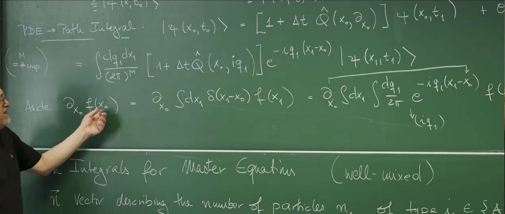

# 引言：超越谱方法——为何需要场论？

上一讲(第34讲)探讨了有向渗流(Directed Percolation)这一典型的、具有吸收态相变的非平衡系统。通过分析其主方程的转移矩阵 $\mathcal{W}$，谱方法被用来理解系统的长时间行为。谱方法的核心在于求解转移矩阵的本征值和本征矢。特别是,零本征值对应的稳态揭示了系统的吸收态特性,而当系统参数(如粒子产生率)跨越临界点时,本征谱中出现一个趋近于零的"慢"模式,其弛豫时间发散,标志着相变的发生。

然而,谱方法虽然强大,却有其固有的局限性。对于包含多种粒子、多种反应通道或复杂相互作用的系统,其状态空间维度会呈指数级膨胀。在这种情况下,转移矩阵 $\mathcal{W}$ 会变得异常巨大和复杂,直接对其进行对角化或求解其完整的本征谱在分析上和计算上都变得不切实际。更根本的是,谱方法虽然能指认出临界点慢化模式的存在,但它在系统地处理涨落、空间关联以及推导临界指数等普适行为方面显得力不从心。临界现象的物理本质在于涨落的集体行为,而谱方法本质上是一种线性分析工具,难以捕捉这些非线性的、跨越所有尺度的复杂相互作用。

因此,为了克服这些困难,需要一个更强大、更具扩展性的理论框架。这个框架应该能够从微观的随机规则出发,系统地推导出宏观的、普适的物理行为,尤其是在临界点附近。

这节课的目标正是构建这样一个框架,即为由主方程(Master Equation)描述的通用随机过程推导出一个**路径积分(Path Integral)**表示。这一方法论的转变意义深远:它将一个求解大规模耦合常微分方程组(即主方程)的"微分"演化问题,转化为一个对系统所有可能"历史"进行求和的统计场论问题。

这种转变的优势在于,可以借鉴和应用在量子场论和平衡态统计物理中发展起来的成熟工具,例如鞍点近似(对应于平均场理论)、微扰展开(费曼图)、以及重整化群等。这些工具正是为处理由大量自由度相互作用产生的集体行为和临界现象而设计的。

这个思路并非凭空而来,它与先前课程中建立的理论框架形成了完美的平行。在第31讲和第32讲中,已经为由朗之万方程(Langevin Equation)描述的**连续随机过程**建立了场论框架,即马丁-西贾-罗斯(Martin-Siggia-Rose, MSR)或杨森-德多米尼西斯(Janssen-De Dominicis, JDD)响应泛函。该理论描述的是状态变量连续变化且受到高斯白噪声驱动的系统。

然而,许多物理、化学和生物系统,其基本过程是**离散**的"生"与"死"或状态的跳跃,例如化学反应中的分子数变化、流行病传播中的感染人数、或基因表达中的蛋白质数量。这些过程的自然语言是主方程,而非朗之万方程。因此,这节课的任务就是为这些离散的、基于计数的随机过程建立一个与之平行的场论形式,最终得到一个功能上与JDD泛函等价的路径积分作用量(Action),从而完成随机过程场论化理论的另一块重要拼图。


# 1. 泊松表示:从离散粒子到连续场

从朗之万方程到路径积分的道路,是为状态变量**连续**的系统铺设的。然而,主方程描述的是粒子数 $n$ 这样**离散**的、取整数值的随机变量。场论强大的微积分工具(如泛函导数、泛函积分)无法直接应用于离散空间。因此,在构建路径积分之前,必须首先解决这个根本性的障碍:如何将离散的粒子数空间,映射到一个等效的连续场空间中。这小节引入的**泊松表示(Poisson Representation)** ,正是实现这一目标的关键数学桥梁。

## 1.1 主方程:随机过程的起点

考虑一个充分混合(well-mixed)的系统,其状态由一个向量 $\vec{n}$ 描述,其中分量 $n_i$ 代表第 $i$ 种粒子的数量。系统的概率分布 $P(\vec{n},t)$ 随时间的演化由主方程(Master Equation)决定:

$$
\partial_t P(\vec{n}, t) = \sum_{\vec{n}' \neq \vec{n}} \left[ W(\vec{n}|\vec{n}')P(\vec{n}',t) - W(\vec{n}'|\vec{n})P(\vec{n},t) \right]
$$

这个方程是概率守恒的体现。左侧是状态 $\vec{n}$ 的概率随时间的变化率。右侧是流入和流出该状态的总概率流,由两部分组成:

**增益项 (Gain Term)** : $\sum_{\vec{n}'} W(\vec{n}|\vec{n}')P(\vec{n}',t)$,代表从所有其他状态 $\vec{n}'$ 跃迁到状态 $\vec{n}$ 的总概率流。$W(\vec{n}|\vec{n}')$ 是系统从状态 $\vec{n}'$ 跃迁到状态 $\vec{n}$ 的转移速率。

**损失项 (Loss Term)** : $-\sum_{\vec{n}'} W(\vec{n}'|\vec{n})P(\vec{n},t)$,代表从状态 $\vec{n}$ 跃迁到任何其他状态 $\vec{n}'$ 的总概率流。

为了书写方便,可以将其写成更紧凑的矩阵形式:

$$
\frac{d}{dt}|\vec{P}(t)\rangle = \hat{Q} |\vec{P}(t)\rangle
$$

这里 $|\vec{P}(t)\rangle$ 是一个列向量,其分量为在所有可能状态 $\vec{n}$ 上的概率 $P(\vec{n},t)$,而 $\hat{Q}$ 则是转移矩阵(即第7讲中引入的Q矩阵)。

为简化后续推导,首先考虑只含有一种粒子的系统,因此状态向量 $\vec{n}$ 简化为标量 $n$。关注的核心物理量是条件概率 $p(n,t|n_0,t_0)$,即在 $t_0$ 时刻系统处于状态 $n_0$ 的条件下,在 $t$ 时刻发现其处于状态 $n$ 的概率。

## 1.2 离散性的挑战与泊松变换的引入

主方程本质上是一个无限维的、耦合的常微分方程组,其状态变量 $n$ 是一个离散的整数。这构成了直接应用场论方法的根本障碍。我们需要一种方法来"架桥",将这个离散的粒子数空间映射到一个连续的场空间中。

解决这个问题的关键技巧是**泊松表示(Poisson Representation)** 。其核心思想是,不再直接处理单个的条件概率 $p(n,t|n_0,t_0)$,而是构造一个新的对象 $p(n,t|x,t_0)$。这个新对象是通过对一个特殊的初始条件分布求平均(边缘化)得到的:假设在初始时刻 $t_0$,系统的粒子数 $n_0$ 并非一个确定值,而是服从一个**均值为 $x$ 的泊松分布** 。

通过将原始的条件概率 $p(n,t|n_0,t_0)$ 与这个泊松分布加权求和,定义了新的概率函数:

$$
p(n, t | x, t_0) = \sum_{n_0=0}^{\infty} p(n, t | n_0, t_0) \frac{x^{n_0}}{n_0!} e^{-x}
$$

这个变换在数学上被称为**泊松变换** 。它将一个依赖于离散初始值 $n_0$ 的函数族 $\{p(n, t | n_0, t_0)\}_{n_0=0}^\infty$,通过泊松核函数 $\frac{x^{n_0}}{n_0!} e^{-x}$ 进行积分(求和),从而转化为一个依赖于 **连续变量 $x$** 的单一函数 $p(n, t | x, t_0)$。


## 1.3 连续场 $x$ 的物理内涵

新引入的变量 $x$ 是什么?它不是一个物理空间坐标,也不是粒子数。$x$ 是一个抽象的、连续的(甚至可以是复的)**辅助场**,其本质是一个**生成函数(Generating Function)**的参数。

这个变换的精妙之处在于:

1.  **编码信息** :它将关于离散变量 $n_0$ 的全部信息(即所有 $p(n,t|n_0,t_0)$ 的值)完整地编码进了一个关于连续变量 $x$ 的单一函数 $p(n,t|x,t_0)$ 中。这与在第4讲中用生成函数 $\sum_n P_n x^n$ 来编码整个概率分布 $\{P_n\}$ 的思想是一脉相承的。

2.  **物理直觉** :引入泊松分布并非偶然。可以想象在一个大体积中随机放置粒子,使得平均粒子数为 $x$。那么,在该体积中找到恰好 $n_0$ 个粒子的概率就服从泊松分布。因此,变量 $x$ 可以被直观地理解为**初始粒子数分布的平均值**。

3.  **代数便利性** :选择泊松分布作为"基底",是因为它与导数算子有非常简洁的代数关系,这将在后续的推导中发挥至关重要的作用。

因此,$x$ 应该被理解为一个"**生成场**",它的引入纯粹是为了数学上的便利,目的是将一个离散的随机变量问题转化为一个连续的场论问题,从而为使用微积分和路径积分等工具铺平道路。

## 1.4 算符形式与信息恢复

为了使这个变换更加规范,可以引入量子力学中常用的狄拉克符号(bra-ket)。定义一个依赖于连续变量 $x$ 的"**泊松基底态**" $|n_0\rangle_x$,其函数形式就是一个泊松分布:

$$
\langle x | n_0 \rangle \equiv |n_0\rangle_x := \frac{x^{n_0}}{n_0!} e^{-x}
$$

那么,经过泊松变换后的系统状态可以被看作一个"**态矢量**" $|\Psi(x,t)\rangle$,它是这些基底态的线性叠加,其系数为相应的条件概率:

$$
|\Psi(x,t)\rangle := p(n, t | x, t_0) = \sum_{n_0=0}^{\infty} p(n,t|n_0,t_0) |n_0\rangle_x
$$

这个 $|\Psi(x,t)\rangle$ 就是理论的核心对象。它是一个关于连续变量 $x$ 的函数,并且完整地携带了系统在 $t_0$ 时刻的所有初始条件信息。

当然,这个变换必须是可逆的,否则就会丢失信息。必须能够从 $|\Psi(x,t)\rangle$ 中恢复出任意指定初始条件 $n_0$ 所对应的原始概率 $p(n,t|n_0,t_0)$。这可以通过一个巧妙的算符来实现:

$$
p(n,t|n_0,t_0) = \left. (\partial_x + 1)^{n_0} |\Psi(x,t)\rangle \right|_{x=0}
$$

这个公式是泊松变换的逆变换。算符 $(\partial_x + 1)^{n_0}$ 作用在函数 $|\Psi(x,t)\rangle$ 上,并最后取 $x=0$,其效果等同于从生成函数中"投影"或"筛选"出与初始粒子数为 $n_0$ 相对应的那一项。这确保了新的表示法没有丢失任何物理信息,为后续的动力学演化推导奠定了坚实的基础。


# 2. 主方程的薛定谔形式

引入泊松表示的最终目的,是将主方程本身从一个操作离散概率分布 $P(n,t)$ 的矩阵方程,转变为一个操作连续函数 $|\Psi(x,t)\rangle$ 的偏微分方程(PDE)。这一步是通往路径积分的关键,因为它将问题转化到了微积分和泛函分析的领域。

## 2.1 转移算符的变换与正规排序

这一步的核心任务,是将主方程中的离散转移矩阵 $\hat{Q}$ 变换为一个作用于连续 $x$ 空间的微分算符,记为 $\hat{Q}(x, \partial_x)$。这个映射过程遵循一个关键规则:**正规排序(Normal Ordering)**。

- **物理动机**:在粒子系统中,基本过程是粒子的产生(creation)和湮灭(annihilation)。在泊松表示中,这两个基本操作分别由乘法算符 $x$ 和微分算符 $\partial_x$ 来代表(这将在下一讲的Doi-Peliti形式中被严格化)。正规排序是一个规定,旨在确保这种算符替换能够忠实地再现原始主方程所描述的离散粒子数变化。

- **数学规则**:正规排序规定,在构建算符 $\hat{Q}(x, \partial_x)$ 时,所有与粒子产生相关的算符(即 $x$)都必须写在所有与粒子湮灭相关的算符(即 $\partial_x$)的**右边**。换句话说,所有的导数算符 $\partial_x$ 都必须被移动到所有 $x$ 算符的**左边**。

这个规则是后续推导能够顺利进行的关键技术前提。

## 2.2 实例:粒子衰变过程 ($A \xrightarrow{k} \emptyset$)

为了让这个抽象的规则变得具体,考虑一个最简单的随机过程:粒子以速率 $k$ 发生衰变。其主方程为:

$$
\frac{d}{dt} P(n,t) = k[(n+1)P(n+1,t) - nP(n,t)]
$$

现在,将这个过程翻译成泊松表示下的算符 $\hat{Q}(x, \partial_x)$。为此,需要建立一个基本操作的"翻译词典":
- **湮灭一个粒子**($n \to n-1$)的操作,在泊松表示中对应于算符 $\partial_x$。

- **产生一个粒子**($n \to n+1$)的操作,对应于算符 $x$。

- **测量粒子数 $n$** 的操作,对应于算符 $x\partial_x$。

在衰变过程中,$n \rightarrow n-1$。这个跃迁的速率正比于当前的粒子数 $n$。因此,对应的算符 $\hat{Q}$ 应该由代表"测量粒子数 $n$"的算符和代表"湮灭一个粒子"的算符组合而成。根据正规排序规则,我们得到:

$$
\hat{Q}(x, \partial_x) = k(\partial_x - 1)x
$$

这个算符虽然简洁,但完整地编码了衰变过程。

  - $k(\partial_x)x$ 部分对应于增益项 $k(n+1)P_{n+1}$。
  
  - $-kx$ 部分对应于损失项 $-knP_n$。
    

经过严格推导可以证明,将这个算符作用于泊松基底态,能够精确地再现主方程的离散差分结构。讲座中的板书也明确给出了这个形式。

## 2.3 演化方程:类薛定谔方程

一旦获得了算符 $\hat{Q}$,整个主方程的演化就可以用一个作用于态矢量 $|\Psi(x,t)\rangle$ 的偏微分方程来描述。讲座中给出的方程是关于初始时间 $t_0$ 的**后向主方程(Backward Master Equation)**,其演化算符是 $\hat{Q}$。与之等价的**前向主方程(Forward Master Equation)**的演化算符是 $\hat{Q}$ 的厄米共轭。为与后续路径积分推导保持一致,我们采用前向演化的形式:

$$
\frac{\partial}{\partial t} |\Psi(x,t)\rangle = \hat{Q}(x,\partial_x) |\Psi(x,t)\rangle
$$

这个方程在形式上与量子力学中的**虚时薛定谔方程(imaginary-time Schrödinger equation)**完全同构。

**物理意义与类比**:这种对应关系并非巧合,它揭示了经典随机过程与量子系统之间深刻的数学联系:

  - **态矢量 $|\Psi(x,t)\rangle$** 扮演了量子力学中"**波函数**"的角色,它包含了系统概率分布的全部信息。
    
  - **算符 $\hat{Q}(x, \partial_x)$** 扮演了"**哈密顿量**"的角色,它生成了系统的时间演化。
    
  - **时间 $t$** 对应于量子力学中的"**虚时间**" $\tau = it$。

这个类比的意义是革命性的。它意味着,为求解量子系统而发展起来的整个数学武库——特别是费曼的**路径积分方法**——现在可以被直接"移植"过来,用于解决主方程问题。

**一个重要的区别:非厄米性**

值得注意的是,这里的"哈密顿量" $\hat{Q}$ 通常**不是厄米的(non-Hermitian)**。在量子力学中,哈密顿量的厄米性保证了总概率 $\int |\psi|^2 dx$ 守恒。然而,在经典随机过程中,守恒的量是总概率 $\sum_n P(n,t) = 1$。我们构造的"波函数" $|\Psi(x,t)\rangle$ 的某种范数(如 $\int |\Psi(x,t)|^2 dx$)并不需要守恒。$\hat{Q}$ 的非厄米性正反映了随机过程的**耗散性质**和概率的单向流动(例如,流向吸收态),这是经典随机过程与标准量子力学的本质区别之一。
    

# 3. 路径积分的推导

上一节成功地将离散的主方程映射为了一个形式上与薛定谔方程同构的偏微分方程(PDE)。现在,便可以遵循费曼的经典步骤,从这个PDE出发,一步步构建出其等价的路径积分表示。这个过程的核心思想是,将有限时间的演化过程看作是无数个无穷小时间步演化的"串联",并通过对所有中间状态求和,最终得到一个对完整"历史路径"的积分。下面的推导将详细解释讲座黑板上的每一个步骤。

## 3.1 时间离散化与单步演化

从初始时刻 $t_0$ 到最终时刻 $t_N=t$,将整个时间区间分割成 $N$ 个微小的时间步长 $\Delta t = (t - t_0)/N$。讲座中的推导基于**后向主方程** $\partial_{t_0} |\Psi(x, t_0)\rangle = \hat{Q}(x, \partial_x) |\Psi(x, t_0)\rangle$。对于一个从 $t_0$ 到 $t_1 = t_0 + \Delta t$ 的微小时间步,其解可以形式上写为 $|\Psi(x_0, t_0)\rangle = e^{\hat{Q}\Delta t} |\Psi(x_1, t_1)\rangle$。当 $\Delta t \to 0$ 时,可以做一阶泰勒展开:

$$
|\Psi(x_0, t_0)\rangle \approx \left[1 + \Delta t \hat{Q}(x_0, \partial_{x_0})\right] |\Psi(x_1, t_1)\rangle + O(\Delta t^2)
$$


这个方程将初始时刻 $t_0$ 的状态 $|\Psi(x_0, t_0)\rangle$ 与一个微小时间步之后 $t_1$ 的状态 $|\Psi(x_1, t_1)\rangle$ 联系起来。它构成了连接不同时间点的"**无穷小传播子** (infinitesimal propagator)"。

## 3.2 引入傅里叶恒等式:将算符代数化

上式中含有微分算符 $\partial_{x_0}$,这使得后续的代数处理和指数化变得困难。这里的核心技巧是,通过插入一个傅里叶变换形式的恒等算符,**将微分算符转化为一个普通的代数变量**。




正如讲座的旁注(Aside)所示,任何函数 $f(x_1)$ 都可以通过狄拉克 $\delta$ 函数写成 $f(x_0) = \int dx_1 \delta(x_1 - x_0) f(x_1)$。再利用 $\delta$ 函数的傅里叶表示 $\delta(x) = \int \frac{dq}{2\pi} e^{-iqx}$,我们可以将作用在 $|\Psi(x_0, t_1)\rangle$ 上的算符 $\partial_{x_0}$ 变换为一个积分核内的代数因子 $iq_1$:


$$
\partial_{x_0} |\Psi(x_1, t_1)\rangle = \partial_{x_0} \int dx_1 \int \frac{dq_1}{2\pi} e^{-iq_1(x_1-x_0)} |\Psi(x_1, t_1)\rangle= \int dx_1 \int \frac{dq_1}{2\pi} (iq_1) e^{-iq_1(x_1-x_0)} |\Psi(x_1, t_1)\rangle
$$

**物理意义**: 这个操作引入了一个新的积分变量 $q_1$。这个变量可以被看作是与场 $x$ 共轭的"**响应场**"或"动量场",其作用是"测量"场 $x$ 的时间变化。这与第32讲中为朗之万方程引入响应场 $\tilde{\phi}$ 的思想异曲同工。

将这个技巧应用于演化方程,算符 $\hat{Q}(x_0, \partial_{x_0})$ 就变成了函数 $\hat{Q}(x_0, iq_1)$。于是得到:

$$
|\Psi(x_0, t_0)\rangle\approx \int \frac{dx_1 dq_1}{(2\pi)^M} \left[1 + \Delta t \hat{Q}(x_0, iq_1)\right] e^{-iq_1(x_1-x_0)} |\Psi(x_1, t_1)\rangle
$$

这里的 $M$ 是场分量的个数(在单粒子例子中 $M=1$)。通过这个变换,原来包含微分算符的复杂表达式,变成了一个对普通函数进行积分的、更容易处理的形式。

## 3.3 指数化与单步传播子

注意到对于无穷小的 $\Delta t$,方括号中的项是指数函数的一阶近似:$1 + \Delta t \hat{Q}(x_0, iq_1) \approx \exp[\Delta t \hat{Q}(x_0, iq_1)]$。将其代回,并将两个指数项合并,我们得到了从时刻 $t_1$ 到 $t_0$ 的单步传播子(propagator)的积分表示:

$$
|\Psi(x_0, t_0)\rangle
$$

$$
\approx \int \frac{dx_1 dq_1}{(2\pi)^M} \exp\left[-iq_1(x_1-x_0) + \Delta t \hat{Q}(x_0, iq_1)\right] |\Psi(x_1, t_1)\rangle
$$
## 3.4 迭代与连续极限

现在,将这个单步过程迭代 $N$ 次,将 $t_N=t$ 的状态一路传播回 $t_0$。每一步都插入一个类似的积分,最终得到一个包含 $N$ 次积分的表达式:


$$
|\Psi(x_0, t_0)\rangle =\left(\int \prod_{i=1}^{N} \frac{dx_i dq_i}{(2\pi)^M}\right) \exp\left[\sum_{j=1}^{N} \left(-iq_j(x_j-x_{j-1}) + \Delta t \hat{Q}(x_{j-1}, iq_j)\right)\right] |\Psi(x_N, t_N)\rangle
$$
**物理意义**: 这个表达式是在时间离散化的情况下,对所有可能的中间路径 $(x_1, x_2, \dots, x_{N-1})$ 和所有可能的响应场历史 $(q_1, q_2, \dots, q_N)$ 的求和。

接下来,取连续极限 $N \to \infty, \Delta t \to 0$,同时保持总时间 $t - t_0$ 固定。在这个极限下:

连乘的积分测度 $\prod_{i=1}^{N} \frac{dx_i dq_i}{(2\pi)^M}$ 变成了泛函积分的测度 $\int \mathcal{D}[x]\mathcal{D}[q]$。


求和 $\sum_{j=1}^{N} \dots \Delta t$ 变成了时间积分 $\int_{t_0}^{t} d\tau \dots$。


差商 $\frac{x_j - x_{j-1}}{\Delta t}$ 变成了时间导数 $\partial_\tau x(\tau)$。

## 3.5 最终的路径积分与作用量

经过上述步骤,最终得到了从初始泊松分布(由 $x_0$ 参数化)演化到最终状态 $|\Psi(x_N, t_N)\rangle$ 的概率的路径积分表示:
$$
|\Psi(x_0, t_0)\rangle = \int_{x(t_0)=x_0} \mathcal{D}[x(\tau)] \mathcal{D}[q(\tau)] \exp\left(-S'[x, q]\right) |\Psi(x(t), t)\rangle
$$
其中,积分是对所有满足边界条件 $x(t_0) = x_0$ 的场 $x(\tau)$ 和响应场 $q(\tau)$ 的历史路径求和。指数中的 $S'[x,q]$ 就是路径积分的**作用量(Action)** ,其形式为:

$$
S'[x,q] = \int_{t_0}^{t} d\tau \left[iq(\tau) \partial_\tau x(\tau) - \hat{Q}(x(\tau), iq(\tau))\right]
$$
**作用量的物理内涵**: 这个作用量是整个理论的核心。它是一个泛函,为每一条可能的系统历史 $(x(\tau), q(\tau))$ 赋予一个复数权重。它完整地编码了微观的随机动力学规则。

**动力学项 $iq(\tau) \partial_\tau x(\tau)$** : 这一项是所有这类路径积分中普遍存在的"贝里相位"项,它关联了场 $x$ 的时间变化率和其共轭场 $q$。

**哈密顿项 $-\hat{Q}(x(\tau), iq(\tau))$** : 这一项源于主方程的演化算符,包含了系统的具体物理过程(如出生、死亡、相互作用等)。

为了帮助理解这个复杂的推导过程,下表总结了其中的关键步骤及其概念目的。

| 步骤 | 数学工具 | 概念目的 |
| :--- | :--- | :--- |
| 1. 时间离散化 | $e^{\Delta t \hat{Q}} \approx 1 + \Delta t \hat{Q}$ | 将连续的时间演化分解为一系列微小的、可处理的步骤。 |
| 2. 傅里叶恒等式 | $\partial_x f(x) \to \int (iq) e^{\dots}$ | 将微分算符 $\partial_x$ 转化为一个代数变量 $iq$,从而可以将其放入指数中。 |
| 3. 指数化 | $1+\epsilon \approx e^\epsilon$ | 将单步演化写成指数形式,形成传播子(Propagator)的核。 |
| 4. 迭代 | $\int \prod_i dx_i dq_i$ | 对所有中间状态求和,将单步传播子"链接"成有限时间的演化。 |
| 5. 连续极限 | $\sum \Delta t \to \int d\tau$ | 对所有可能的场演化历史路径求和,得到完整的泛函积分和作用量。 |


# 4. 代码实践:双稳态系统中的随机跳跃

为了展示路径积分理论在处理复杂非线性随机过程中的威力,这次的代码实践探索一个非平衡态统计物理中的经典模型——**Schlögl模型**。这个模型描述了一个可以展现**双稳态(Bistability)**的化学反应系统,即系统存在两个不同的宏观稳定状态。

这个模型由主方程严格描述,随机"跳跃"事件在路径积分理论中有极其深刻的对应物,称为**"瞬子"(Instanton)** ,即系统克服势垒的最可几路径,因此这个例子能与更高等的场论概念建立直观联系。

## 4.1 Schlögl化学反应模型

该模型由两对正向和逆向的化学反应组成:

1.  **三体自催化与衰变**: $A + 2X \underset{k_2}{\stackrel{k_1}{\rightleftharpoons}} 3X$

2.  **产生与线性衰变**: $B \underset{k_4}{\stackrel{k_3}{\rightleftharpoons}} X$

其中 $A, B$ 的浓度被视为由外部环境维持的常数,而 $X$ 的粒子数 $n$ 是我们关心的随机变量。通过调整反应速率,这个系统可以被设计成在平均场层面拥有两个稳定的不动点和一个不稳定的不动点。

对于Gillespie模拟,我们需要每个反应通道的倾向性(propensity):
$$
A + 2X \to 3X: a_1 = k_1 [A] \frac{n(n-1)}{2}
$$

$$
3X \to A + 2X: a_2 = k_2 \frac{n(n-1)(n-2)}{6}
$$

$$
B \to X: a_3 = k_3 [B]
$$

$$
X \to B: a_4 = k_4 n
$$

## 4.2 代码实现

```Python
import numpy as np
import matplotlib.pyplot as plt
from mpl_toolkits.mplot3d import Axes3D
import matplotlib.animation as animation
from matplotlib.colors import LightSource

# --- Use dark theme ---
plt.style.use('dark_background')

def gillespie_schlogl_single(n0, k, t_max):
    """Single Gillespie simulation of Schlogl model"""
    t, n = 0.0, float(n0) # Ensure n is a float
    times, populations = [t], [n]
    k1, k2, k3, k4 = k
    
    while t < t_max:
        if n < 0: n = 0 # *** Added robustness: prevent negative particle count ***
            
        # Propensity calculations (for simplicity, constant concentrations are absorbed into rate constants)
        a1 = k1 * n * (n - 1) / 2
        a2 = k2 * n * (n - 1) * (n - 2) / 6
        a3 = k3
        a4 = k4 * n
        
        a_total = a1 + a2 + a3 + a4
        if a_total <= 1e-9:
            # If total rate is extremely small, jump forward a small step to avoid infinite loop
            t += 0.1 
            if t > t_max: break
            times.append(t)
            populations.append(n)
            continue

        dt = -np.log(np.random.rand()) / a_total
        t += dt
        if t > t_max: break
            
        # Determine which reaction occurs
        rand_val = np.random.rand() * a_total
        if rand_val < a1:
            n += 1  # A + 2X -> 3X
        elif rand_val < a1 + a2:
            n -= 1  # 3X -> A + 2X
        elif rand_val < a1 + a2 + a3:
            n += 1  # B -> X
        else:
            n -= 1  # X -> B
            
        times.append(t)
        populations.append(n)
        
    return times, populations


k_params = [3e-7, 1e-4, 1e-3 * 105, 1.0] 
N_TRAJECTORIES = 10000
T_MAX_SHORT = 50.0
TIME_SLICES = 100
N_BINS = 500
N0_short = 100

print("Running large-scale simulations for probability landscape...")
final_trajectories = np.zeros((N_TRAJECTORIES, TIME_SLICES))
time_points = np.linspace(0, T_MAX_SHORT, TIME_SLICES)

for i in range(N_TRAJECTORIES):
    if i % 1000 == 0:
        print(f"Simulating trajectory {i}/{N_TRAJECTORIES}")
    t, p = gillespie_schlogl_single(N0_short, k_params, T_MAX_SHORT)
    interp_p = np.interp(time_points, t, p, right=p[-1])
    final_trajectories[i, :] = interp_p

print("Building probability distribution surface P(n,t)...")
prob_surface = np.zeros((N_BINS, TIME_SLICES))
n_values = np.arange(N_BINS)
for i in range(TIME_SLICES):
    counts, _ = np.histogram(final_trajectories[:, i], bins=np.arange(N_BINS + 1) - 0.5)
    prob_surface[:, i] = counts / N_TRAJECTORIES

# --- 3D Visualization (corrected) ---
fig2 = plt.figure(figsize=(16, 12))
ax2 = fig2.add_subplot(111, projection='3d')

# *** Fix: Adjust meshgrid input order to match prob_surface dimensions ***
# prob_surface dimensions are (N_BINS, TIME_SLICES) -> (n, t)
# We need T_mesh and N_mesh to have the same dimensions
T_mesh, N_mesh = np.meshgrid(time_points, n_values)

ls = LightSource(azdeg=20, altdeg=45)

def update_surface(frame):
    ax2.clear()
    
    # Slice to get current frame and previous data
    current_T = T_mesh[:, :frame+1]
    current_N = N_mesh[:, :frame+1]
    current_P = prob_surface[:, :frame+1]
    
    # Apply lighting effects only when there is sufficient data
    if current_P.shape[1] > 1:
        rgb = ls.shade(current_P, cmap=plt.cm.magma, vert_exag=0.1, blend_mode='soft')
        surf = ax2.plot_surface(current_T, current_N, current_P, 
                               rstride=1, cstride=1, facecolors=rgb,
                               linewidth=0, antialiased=True, alpha=1.0)
    else: # For the first frame, use colormap without lighting
        surf = ax2.plot_surface(current_T, current_N, current_P, 
                               rstride=1, cstride=1, cmap=plt.cm.magma,
                               linewidth=0, antialiased=True, alpha=1.0)

    ax2.set_title(f'Emergence of Bistability: $P(n,t)$ at t={time_points[frame]:.2f}', fontsize=20, pad=20)
    # Swap X and Y axis labels to match the new grid
    ax2.set_xlabel('Time (t)', fontsize=15, labelpad=20)
    ax2.set_ylabel('Particle Number (n)', fontsize=15, labelpad=20)
    ax2.set_zlabel('Probability P(n,t)', fontsize=15, labelpad=20)
    
    ax2.set_xlim(0, T_MAX_SHORT)
    ax2.set_ylim(0, N_BINS)
    ax2.set_zlim(0, np.max(prob_surface) * 1.1 if np.max(prob_surface) > 0 else 0.1)
    ax2.view_init(elev=25, azim=-150 + frame * 0.5) 

    ax2.xaxis.set_pane_color((0.0, 0.0, 0.0, 1.0))
    ax2.yaxis.set_pane_color((0.0, 0.0, 0.0, 1.0))
    ax2.zaxis.set_pane_color((0.1, 0.1, 0.1, 1.0))

ani = animation.FuncAnimation(fig2, update_surface, frames=TIME_SLICES, interval=80)

print("Saving animation... (This may take a moment)")
ani.save('schlogl_bistability_evolution.gif', writer='pillow', fps=15)
```


**初始状态 (t=0)** :概率分布是一个位于 $n=100$ 的尖锐"脉冲"(在图中表现为一个在时间轴起点处的尖锐"山脊"),代表所有模拟轨迹都从一个确定的初始条件出发。

**演化过程与分裂**:随着时间的推移,这个单一的概率"山峰"迅速展宽并移动。最引人注目的是,在经过一段短暂的时间后,这个单峰分布**分裂成了两个独立的峰**。这正是**双稳态(Bistability)**在概率分布层面上的直接体现。

**双稳态的涌现**:一个峰逐渐形成并稳定在低粒子数区域($n \approx 85$),另一个峰则在高粒子数区域($n \approx 380$)形成。这表明,随着时间的演化,从同一个初始点出发的系统,最终会以一定的概率分布在这两个状态中的任何一个。

**稳态分布**:随着动画的进行,两个峰的高度和形状逐渐稳定下来,形成了系统的最终稳态概率分布——一个典型的**双峰分布**。其中,低位稳定态的峰更高,表明这个状态更稳定(其"势阱"更深),系统长时间后停留在该状态的概率更大。

主方程描述了概率如何在状态空间中"流动"和重新分布。而**路径积分**,正是计算这种"流动"的传播子、并最终描绘出整个演化景观的根本性理论工具。

#  结论

这节课从一个基本的**主方程**到一个**路径积分表示**的过程,核心思想是通过**泊松表示**,巧妙地将一个描述离散粒子数的系统,映射到一个由连续场 $x(t)$ 和其共轭场 $q(t)$ 构成的场论框架。

**关键步骤**:

1.  **泊松变换**:将离散的概率分布 $P(n,t)$ 编码为连续函数 $|\Psi(x,t)\rangle$,这一步将原始主方程中的离散转移矩阵 $\hat{Q}$ 转化为作用于连续空间的微分算符 $\hat{Q}(x, \partial_x)$。

2.  **类薛定谔方程**:由此得到一个形式上与虚时薛定谔方程同构的演化方程 $\frac{\partial}{\partial t} |\Psi(x,t)\rangle = \hat{Q}(x,\partial_x) |\Psi(x,t)\rangle$。这一类比揭示了经典随机过程与量子力学之间深刻的数学联系,为后续借用量子场论工具奠定了基础。

3.  **路径积分推导**:利用时间离散化和傅里叶恒等式等一系列巧妙的数学技巧,最终将微分方程的解表示为对所有场历史路径的积分。其权重由核心的**作用量** $S'[x,q] = \int d\tau [iq(\tau)\partial_\tau x(\tau) - \hat{Q}(x(\tau), iq(\tau))]$ 决定。这个作用量完整地编码了微观的随机动力学规则,包含了一个描述时间演化的动力学项 $iq(\tau)\partial_\tau x(\tau)$ 和一个包含了系统具体物理过程的哈密顿项 $-\hat{Q}(x(\tau), iq(\tau))$。

它为分析复杂的**非平衡随机过程**提供了一个系统性的、第一性的出发点。有了这个作用量 $S'[x,q]$,就可以使用统计场论的全部工具箱:

**鞍点近似**:可以方便地导出系统的**平均场行为**(速率方程),例如在随机逻辑斯蒂增长中,鞍点近似恢复了确定性逻辑斯蒂方程。

**高斯积分(单环近似)**:在鞍点附近展开作用量,可以系统地计算围绕平均场的**涨落和关联函数**。

**重整化群**:对于**临界现象**,可以使用重整化群方法来分析作用量,从而计算临界指数等普适量,克服了传统谱方法在处理涨落和空间关联方面的局限。

这个场论框架将原本看似只能通过数值模拟处理的复杂随机问题,带入了分析计算的范畴,为理解从化学反应网络到流行病传播、再到生态系统动态等众多领域中的**集体行为和相变现象**开辟了道路。例如,本讲通过Schlögl模型的可视化,生动地展示了系统如何在随机涨落的驱动下,从单一稳定态演变为**双稳态**,形成动态的概率景观,这是平均场理论无法完全捕捉的丰富现象。

这节课所介绍的泊松表示和其衍生的路径积分形式,实际上是一个更深层、更普适的代数结构的一个具体实现。这个潜在的结构与量子力学中处理谐振子和多体系统的产生(creation)和湮灭(annihilation)算符的代数惊人地相似。

在**下一讲(第36讲)**中,将深入探讨这个代数基础,即所谓的**多伊-佩利蒂(Doi-Peliti)形式主义** 。届时会发现:

* 生成场 $x$ 可以被严格地等同于一个**产生算符 $a^\dagger$** 。

* 求导算符 $\partial_x$ 可以被等同于一个**湮灭算符 $a$** 。

* 它们之间的基本对易关系 $[\partial_x, x] = 1$ 正是**玻色子产生-湮灭算符**的基本对易关系 $[a, a^\dagger] = 1$ 的体现。

从这个更基本的算符代数出发,将重新推导路径积分,得到所谓的**相干态路径积分(Coherent State Path Integral)**。这种方法不仅在形式上更为优雅和强大,还能更清晰地揭示理论的深层结构,并自然地解释在某些问题中出现的所谓"**虚噪声"(imaginary noise)**项的来源。


