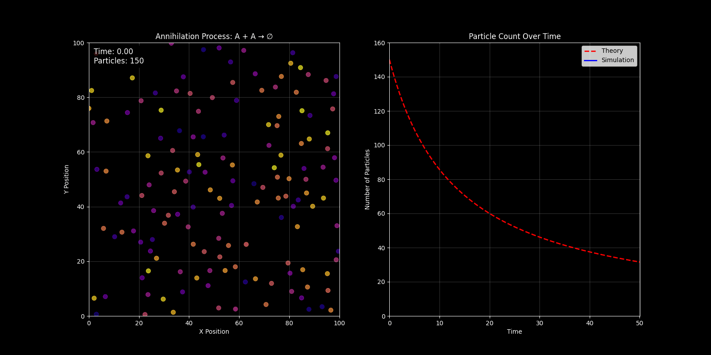
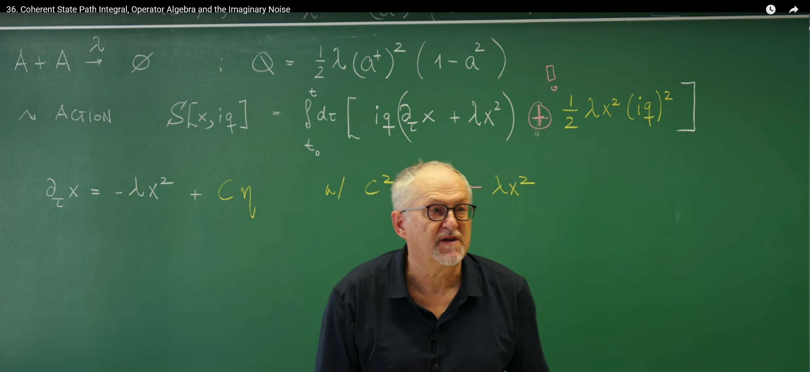

# 引言：寻求更系统性的路径积分

在第35讲中，一个基于泊松表示的路径积分框架被成功构建出来，从而将主方程所描述的离散随机过程，转化为了“历史求和”的语言。该方法虽然有效，但也揭示了一个方法论上的挑战：其作用量（Action）的构建过程显得有些启发式，对于每一个新的反应系统，似乎都需要一定程度的重新构造。这引出了一个关键问题：是否存在一个更基本、更系统性的理论框架——一个理论“机器”——能够接收任意给定的反应网络，并自动地生成其对应的路径积分作用量？

为此，需要建立这样一种框架。其核心策略是进行一次深刻的范式转换：不再直接从概率本身出发，而是首先将描述离散随机过程的主方程，映射到一个**算符代数（Operator Algebra）**的框架中。在此代数结构内，主方程呈现出一种与量子力学中的薛定谔方程惊人相似的形式。这种类比并非浅尝辄止，它揭示了经典随机过程与量子系统之间深刻的结构性对应关系，并构成了在第34讲中为求解线性死亡过程而引入的谱方法和升降算符思想的有力推广。

为实现这一目标，将发展以下几个核心概念：

1.  **泊松表示（Poisson Representation）**：为离散粒子数系统建立一套完备的“态”基矢，为所有后续的代数运算提供舞台。

2.  **产生与湮灭算符（Creation and Annihilation Operators）**：将化学反应中粒子数量的增减，从具体的计数操作抽象为简洁的代数运算。

3.  **算符形式的主方程**：将主方程重写为一个描述“态矢量”在算符作用下进行时间演化的动力学方程。

4.  **相干态路径积分（Coherent State Path Integral）**：从这种基于算符的动力学出发，系统性地推导出一个路径积分。该积分不再是对离散的粒子数路径求和，而是对一个连续辅助场的所有可能轨迹进行积分，这个场的动力学将完美地编码原始离散系统的全部随机信息。

这种从概率描述到动力学场论的转变，其意义远超数学上的便捷。它使得那些在量子场论中发展起来的强大分析工具——例如费曼图和重整化群，这些工具也是第32讲中J-D形式体系分析连续系统的核心——现在可以被用来系统地分析经典的反应系统。这节课所构建的相干态路径积分，正是连接这两个宏伟理论世界的关键桥梁。

# 1. 泊松表示：粒子系统的自然基底

为了将主方程代数化，首要任务是为系统的状态——即不同粒子数 $n$ 的概率分布 $P(n,t)$——找到一个合适的数学表示。由于主方程的变量是离散的整数，无法直接应用场论中强大的微积分工具。因此，需要一座数学的桥梁，将这个离散的粒子数空间映射到一个等效的、由连续变量描述的希尔伯特空间中。借鉴量子力学的思想，此处引入一套特殊的基矢，称为**泊松基矢（Poisson basis）**，它构成了后续所有代数运算的舞台。

## 1.1 基矢与算符的定义

对于一个包含 $n$ 个粒子的状态，其对应的泊松基矢 $|n\rangle_x$ 定义为一个关于连续变量 $x$ 的函数：
$$
|n\rangle_x := \frac{x^n}{n!} e^{-x}
$$
这个表达式的选择并非偶然。它正是均值为 $x$ 的泊松分布的概率质量函数。因此，变量 $x$ 可以被直观地理解为一个泊松过程的平均粒子数或生成场参数。

接下来，定义作用在这套基矢上的两种基本算符：**产生算符 $a^+$** 和 **湮灭算符 $a$** 。它们对变量 $x$ 的操作被定义为：
$$
a^+ \equiv x, \quad a \equiv \partial_x + 1
$$
这两个算符是整个代数框架的基石。这里的湮灭算符定义包含了一个 +1 的项，这被称为“**Doi-shift**”。这是一种数学上的约定，其目的是使算符的代数关系（如下文所示）与量子力学中标准的玻色子算符代数完全一致，从而极大地简化理论框架。

它们之所以被称为“产生”和“湮灭”算符，是因为它们作用在基矢 $|n\rangle_x$ 上时，其效果分别是使粒子数增加或减少一个单位。通过直接计算可以严格验证：

**产生算符的作用**:
$$
a^+ |n\rangle_x = x \left( \frac{x^n}{n!} e^{-x} \right) = \frac{x^{n+1}}{n!} e^{-x} = (n+1) \frac{x^{n+1}}{(n+1)!} e^{-x} = (n+1) |n+1\rangle_x
$$

可以看到，$a^+$ 将态 $|n\rangle_x$ 提升到了 $|n+1\rangle_x$，并伴随一个因子 $(n+1)$。

**湮灭算符的作用**:
$$
a |n\rangle_x = (\partial_x + 1) \left( \frac{x^n}{n!} e^{-x} \right) = \left[ \frac{\partial}{\partial_x}\left( \frac{x^n}{n!} e^{-x} \right) \right] + \frac{x^n}{n!} e^{-x}
$$

$$
= \left[ \frac{nx^{n-1}}{n!}e^{-x} - \frac{x^n}{n!}e^{-x} \right] + \frac{x^n}{n!}e^{-x} = \frac{nx^{n-1}}{n!}e^{-x}= \frac{x^{n-1}}{(n-1)!}e^{-x} = |n-1\rangle_x
$$
在Doi-shift的定义下，湮灭算符 $a$ 能简洁地将态 $|n\rangle_x$ 降低到 $|n-1\rangle_x$。这种简洁性正是采用该约定的核心优势。

## 1.2 核心代数关系

这些算符满足一个至关重要的**对易关系（Commutation Relation）** 。对于任意函数 $f(x)$：
$$
[a, a^+] f(x) = (a a^+ - a^+ a) f(x) = (\partial_x + 1)(x f(x)) - x(\partial_x + 1)f(x)
$$
$$
= (f(x) + x f'(x) + x f(x)) - (x f'(x) + x f(x)) = f(x)
$$
由于 $f(x)$ 是任意的，因此可以得到算符的对易关系：
$$
[a, a^+] = 1
$$
**物理意义**：这个关系与量子力学中描述玻色子（如光子）的产生和湮灭算符的对易关系**完全相同**。这一深刻的数学同构性，是能够将量子场论工具应用于经典随机过程的根本原因。它暗示了无论是在量子世界还是经典随机世界中，描述“粒子”增减的基本代数结构是统一的。

利用这些算符，还可以构建一个**粒子数算符（Number Operator）$\hat{n}$** ，其定义为：
$$
\hat{n} \equiv a^+ a
$$
将它作用在基矢 $|n\rangle_x$ 上：

$$
\hat{n} |n\rangle_x = a^+ (a |n\rangle_x) = a^+ |n-1\rangle_x= x \left( \frac{x^{n-1}}{(n-1)!} e^{-x} \right) = n \left( \frac{x^n}{n!} e^{-x} \right) = n |n\rangle_x
$$

**物理意义**：这个结果表明，泊松基矢 $|n\rangle_x$ 是粒子数算符 $\hat{n}$ 的本征态，其本征值恰好是粒子数 $n$。这完美地证明了这套代数语言的自洽性：它不仅能增减粒子，还能精确地“测量”出任何给定状态下的粒子数。

最后，考察 $n = 0$ 的情况，即**真空态（Vacuum State）** 。其基矢为 $|0\rangle_x = e^{-x}$。湮灭算符作用在真空态上得到：

$$
a |0\rangle_x = (\partial_x+1)e^{-x} = -e^{-x} + e^{-x} = 0
$$
这符合物理直觉：无法从一个空无一物的状态中再移走任何粒子。$a |0\rangle_x = 0$ 是定义真空态的核心属性，它为所有粒子态的构建提供了逻辑起点。

综上所述，泊松表示之所以是描述这类系统的“自然”选择，并非偶然。它是唯一能够让湮灭算符（微分）和产生算符（乘法）拥有如此简洁的、与玻色子代数同构的数学结构的表示。整个理论框架正是建立在这一坚实的数学基础之上。

# 2. 算符形式的主方程与路径积分作用量

在上一节建立了完备的算符代数后，现在便可以运用这套工具，将经典的主方程从一个描述概率演化的方程，重铸为一个描述抽象“态矢量”在希尔伯特空间中演化的动力学方程。这一步是通往路径积分的关键，因为它将问题转化到了更适合使用场论工具的数学领域。

## 2.1 从概率到态矢量：类薛定谔方程

首先，将系统的整个概率分布 $P(n,t)$ 提升为一个在泊松基矢上展开的**态矢量** $|\Phi(t)\rangle$：
$$
|\Phi(t)\rangle = \sum_{n=0}^{\infty} P(n,t) |n\rangle_x
$$
这个态矢量 $|\Phi(t)\rangle$ 是一个包含了系统在时刻 $t$ 处于所有可能粒子数 $n$ 的全部概率信息的数学对象。它本质上是概率分布 $P(n,t)$ 的一种**生成函数**，只不过被写成了更具物理直觉的狄拉克“右矢”（ket）形式。

主方程描述了 $P(n,t)$ 的时间演化。其一般形式包含增益项和损失项。通过上一节建立的代数规则，每一个具体的跃迁过程（例如，$k$ 个粒子反应生成 $\ell$ 个粒子）都可以被精确地翻译成一个由产生算符 $a^+$ 和湮灭算符 $a$ 构成的算符。将系统中所有反应对应的算符加总，便得到一个总的**跃迁算符** $\hat{Q}(a^+, a)$。

于是，整个主方程就可以被重写为一个极其简洁且强大的算符方程：
$$
\frac{\partial}{\partial t} |\Phi(t)\rangle = \hat{Q}(a^+, a) |\Phi(t)\rangle
$$
**物理意义**：这个方程在形式上与量子力学中**虚时间下的薛定谔方程**（$\partial_\tau |\psi\rangle = -\hat{H}|\psi\rangle$）完全同构。


* **态矢量 $|\Phi(t)\rangle$** 扮演了量子力学中“波函数”的角色。

  

* **跃迁算符 $\hat{Q}$** 扮演了“**哈密顿量**”的角色，它封装了系统的全部动力学规则，生成了系统的时间演化。

  

这个深刻的类比意味着，为求解量子系统而发展起来的整个数学武库——特别是费曼的路径积分方法——现在可以被直接“移植”过来，用于解决主方程问题。

## 2.2 路径积分的推导与作用量

一旦有了形如 $\partial_t |\Psi\rangle = \hat{H} |\Psi\rangle$ 的动力学方程，就可以通过一套标准流程推导出其路径积分表示。这个过程在概念上与量子力学中的推导完全一致，其核心思想是“**时间切片**”：

1.  将总时间区间 $t_f - t_0$ 分割成 $N$ 个微小的时间片 $\Delta\tau$。

2.  在每个时间片之间，插入一套完备的基矢（在此即相干态基矢）。

3.  利用基矢之间的内积关系，将整个演化过程表示为一系列短时演化矩阵元的乘积。

4.  在 $N \to \infty$ 的极限下，这个乘积就变成了一个对所有可能路径的泛函积分。

对于相干态路径积分，这个过程会自然地引入一个与场 $x$ 共轭的“动量”场 $q$。最终，描述系统从初始分布演化到末态的跃迁概率幅，可以表示为如下的路径积分形式：
$$
\langle \phi_f, t_f | \phi_0, t_0 \rangle = \int_{x(t_0)=x_0}^{x(t_f)=x_f} \mathcal{D}[x, q] \, \exp\left( -S[x, iq] \right)
$$
其中，作用量 $S[x, iq]$ 由拉格朗日量 $\mathcal{L}[x, iq]$ 的时间积分给出：
$$
S[x, iq] = \int_{t_0}^{t_f} d\tau \, \mathcal{L}[x, iq]
$$
而拉格朗日量 $\mathcal{L}[x, iq]$ 的一般形式为：
$$
\mathcal{L}[x, iq] = iq \partial_\tau x(\tau) - Q(x, iq + 1)
$$
这个拉格朗日量是本讲的核心结果，其结构值得深入解读：

* **动力学项 (Kinetic Term) $iq \partial_\tau x$** ：这一项在场论中常被称为“贝里相位”（Berry phase）项。它并非源于具体的物理反应，而是产生于在微小时间步长中，不同时刻相干态基矢之间的数学交叠。它确保了路径积分正确地描述了时间的连续演化，并将场 $x$ 与其共轭场 $iq$ 动态地联系起来。

* **反应项 (Reaction Term) $Q(x, iq + 1)$** ：这一项是跃迁算符 $\hat{Q}(a^+, a)$ 在路径积分中的“经典”对应物，在数学上被称为算符的“**符号**”（symbol）。它是通过在算符 $\hat{Q}$ 中进行如下的代数替换得到的：
    
    
    
    $$a^+ \to x \quad \text{and} \quad a \to iq + 1$$
    
    
    
    （注意这里的替换已经包含了Doi-shift）。这一项包含了所有关于化学反应动力学的物理信息，例如反应速率和化学计量数。

共轭场 $iq$ 并非仅仅是一个数学计算中的辅助工具。在场的语言中，它扮演着**响应场（response field）**的角色，这与第32讲中为连续朗之万系统引入的响应场 $\tilde{\phi}$ 在功能上是完全一致的。$iq$ 的引入，本质上是通过拉格朗日乘子的方法，在路径积分中强制系统在平均意义上满足由哈密顿量 $Q$ 所生成的动力学约束。因此，这个路径积分不仅是对系统“状态”变量 $x(\tau)$ 的所有可能轨迹求和，也是对所有可能“响应”轨迹 $q(\tau)$ 的求和。正是这种双变量的表述，使得该框架能够在统一的作用量中同时捕捉到系统的确定性漂移和随机涨落。

# 3. 案例研究 I：一般反应 $kA \xrightarrow{\lambda} \ell A$

为了展示前述形式化理论的威力，现将其应用于一个一般的化学反应：$k$ 个 $A$ 粒子以微观速率 $\lambda$ 反应生成 $\ell$ 个 $A$ 粒子。这个例子将完整地演示，该理论框架如何像一部“机器”一样，将具体的微观反应规则，一步步、系统性地转化为一个可在路径积分中使用的作用量。

## 3.1 从反应规则到跃迁算符 $\hat{Q}$

**第一步：写出反应速率（Propensity）**

对于一个含有 $n$ 个粒子的系统，要发生一次 $kA \xrightarrow{\lambda} \ell A$ 的反应，首先需要从 $n$ 个粒子中选出 $k$ 个作为反应物。根据组合学，选择的方式共有 $\binom{n}{k}$ 种。因此，从 $n$ 粒子态跃迁到 $m = n - k + \ell$ 粒子态的宏观反应速率为：
$$
\omega_{n \to m} = \lambda \binom{n}{k} = \frac{\lambda}{k!} n(n-1)\cdots(n-k+1)
$$
这个表达式中的连乘积 $n(n-1)\cdots(n-k+1)$ 被称为“**下降阶乘幂**”。为了简化符号，定义 $\tilde{\lambda} = \lambda/k!$。

**第二步：将速率翻译成算符**

现在需要找到一个算符，当它作用在粒子数本征态 $|n\rangle_x$ 上时，其本征值恰好是这个下降阶乘幂。回顾上一节定义的算符，可以发现，一个**正常排序（normal-ordered）**的算符乘积——即所有产生算符 $a^+$ 都在湮灭算符 $a$ 的左边——恰好满足这个要求：
$$
(a^+)^k a^k |n\rangle_x = n(n-1)\cdots(n-k+1) |n\rangle_x
$$
**物理意义**：这个代数关系是整个理论框架精妙之处的核心体现。它表明，反应速率中看似复杂的组合计数因子，被优雅地内嵌在了产生与湮灭算符的基本代数结构之中。这并非巧合，而是该数学形式能够完美描述粒子系统的根本原因。

**第三步：构建跃迁算符 $\hat{Q}$**

主方程的算符形式 $\partial_t |\Phi\rangle = \hat{Q} |\Phi\rangle$ 中，$\hat{Q}$ 算符描述了态矢量 $|\Phi\rangle$ 的总变化率。对于 $kA \to \ell A$ 这个反应，它包含两个过程：
* **增益（Gain）**：系统从某个状态跃迁**进入**当前状态。这对应于粒子数从 $n-k+\ell$ 变为 $n$ 的逆过程，即一个从 $n$ 粒子态跃迁到 $n-k+\ell$ 粒子态的过程。这可以被看作是先通过算符 $a^k$ 湮灭 $k$ 个粒子，再通过算符 $(a^+)^\ell$ 产生 $\ell$ 个粒子。
* **损失（Loss）**：系统**离开**当前 $n$ 粒子态。其速率由 $\tilde{\lambda} n(n-1)\cdots(n-k+1)$ 决定，对应的算符为 $\tilde{\lambda} (a^+)^k a^k$。

因此，该反应对应的总跃迁算符 $\hat{Q}_{k \to \ell}$ 是增益项减去损失项：
$$
\hat{Q}_{k \to \ell} = \tilde{\lambda} \left[ (a^+)^{\ell} a^k - (a^+)^k a^k \right]
$$
这个算符完整地编码了反应 $kA \to \ell A$ 对系统概率分布的全部影响。

## 3.2 从跃迁算符 $\hat{Q}$ 到作用量 $S$

有了算符 $\hat{Q}_{k \to \ell}$，就可以根据上一节建立的替换规则，系统性地得到它在拉格朗日量中的对应项 $Q(x, iq + 1)$。

**第四步：应用替换规则**

规则如下：
$$
a^+ \to x, \quad a \to iq + 1
$$
将此规则应用于跃迁算符 $\hat{Q}_{k \to \ell}$。课程中采用的特定对应法则（Doi-Peliti formalism的一种常见形式）将增益和损失项最终组合为如下形式：
$$
Q_{k \to \ell}(x, iq + 1) = \tilde{\lambda} x^k \left[ (iq + 1)^{\ell} - (iq + 1)^k \right]
$$
这个形式可以通过更严格的生成函数演化推导得出，它直观地表示：反应的发生速率与 $x^k$（初始粒子数的组合）成正比，而状态的变化则由 $(iq+1)$ 的幂次差来体现。

**第五步：写出完整作用量**

将此项代入总的拉格朗日量表达式 $\mathcal{L} = iq\partial_\tau x - Q$，就得到了该反应的路径积分作用量：
$$
S[x, iq] = \int d\tau \left[ iq\partial_\tau x - \tilde{\lambda} x^k \left( (iq + 1)^{\ell} - (iq + 1)^k \right) \right]
$$
这个作用量表达式完美地体现了该框架的系统性。整个推导过程如同一条定义清晰的流水线：
1.  **写出反应化学计量式**（$k \to \ell$）。

2.  **根据组合学写出反应速率**（$\propto n(n-1)\cdots$）。

3.  **将其翻译成正常排序的算符**（$\propto (a^+)^k a^k$）。

4.  **构建增益-损失形式的跃迁算符** $\hat{Q}$。

5.  **应用代数替换规则得到** $Q(x, iq + 1)$ 并构建作用量。

这个流程将任何一个具体的物理反应规则，系统性地转化为了一个可以在路径积分中进行分析和计算的数学对象，为后续使用场论工具（如鞍点近似、微扰展开等）进行定量分析铺平了道路。

# 4. 案例研究 II：湮灭反应 $A + A \xrightarrow{\lambda} \emptyset$

现在，将上一节建立的通用框架应用于一个具体的、非平凡的例子：双分子湮灭反应 $A + A \to \emptyset$。这个例子至关重要，因为它不仅将清晰地展示理论框架如何与可计算、可模拟的物理现象联系起来，更将通过对其作用量的结构分析，最终引出“**虚噪声**”这一核心概念。

## 4.1 理论表述：从反应到作用量

将严格遵循上一节总结的“流水线”步骤，为该反应构建路径积分作用量。

1.  **反应化学计量式**: $A + A \to \emptyset$ 对应于通用模型中的 $k = 2, \ell = 0$。

2.  **反应速率**: 从一个有 $n$ 个粒子的系统中，选出两个粒子进行反应，有 $\binom{n}{2} = \frac{n(n-1)}{2}$ 种方式。因此，跃迁速率为：
    $$
    \omega_{n \to n-2} = \lambda \binom{n}{2} = \frac{\lambda}{2} n(n-1)
    $$
    对应的速率常数 $\tilde{\lambda} = \lambda/2$。

3.  **跃迁算符 $\hat{Q}$**: 根据通用公式 $\hat{Q} = \tilde{\lambda} [ (a^+)^{\ell} a^k - (a^+)^k a^k ]$，代入 $k=2, \ell=0$ 得到：
    $$
    \hat{Q} = \frac{\lambda}{2} \left[ (a^+)^0 a^2 - (a^+)^2 a^2 \right] = \frac{\lambda}{2} \left[ a^2 - (a^+)^2 a^2 \right]
    $$

4.  **应用替换规则得到 $Q(x, iq + 1)$**:
    根据课程中采用的对应法则，得到：
    $$
    Q(x, iq + 1) = \frac{\lambda}{2} x^2 \left[ (iq + 1)^0 - (iq + 1)^2 \right] = \frac{\lambda}{2} x^2 \left[ 1 - (iq + 1)^2 \right]
    $$

5.  **扩散近似与最终作用量**: 为了与连续的朗之万方程建立联系，通常将 $Q(x, iq + 1)$ 对 $iq$ 做泰勒展开，并保留至二阶。这对应于一种**扩散近似（diffusion approximation）**，在粒子数较大时非常有效。
    $$
    1 - (iq + 1)^2 = 1 - (1 + 2iq + (iq)^2) = -2iq - (iq)^2
    $$
    将此展开代入 $Q(x, iq+1)$：
    $$
    Q(x, iq+1) = \frac{\lambda}{2} x^2 \left[-2iq - (iq)^2\right] = -\lambda x^2 (iq) - \frac{\lambda}{2} x^2 (iq)^2
    $$
    最后，将此结果代入拉格朗日量 $\mathcal{L} = iq\partial_\tau x - Q(x, iq + 1)$：
    $$
    \mathcal{L} = iq\partial_\tau x - \left( -\lambda x^2 (iq) - \frac{\lambda}{2} x^2 (iq)^2 \right) = iq(\partial_\tau x + \lambda x^2) + \frac{\lambda}{2} x^2 (iq)^2
    $$
    由此得到最终的作用量：
    $$
    S[x, iq] = \int d\tau \left[ iq(\partial_\tau x + \lambda x^2) + \frac{1}{2} \lambda x^2 (iq)^2 \right]
    $$
    这个作用量是本讲后半部分分析的核心。它将一个离散的粒子湮灭过程，在扩散近似下，精确地映射到了一个连续场 $x(\tau)$ 的随机动力学上。其中，与 $iq$ 线性相关的项 $iq(\partial_\tau x + \lambda x^2)$ 编码了系统的确定性演化，而与 $(iq)^2$ 相关的项则编码了系统的随机涨落。


## 4.2 数值验证：二维空间中的随机湮灭

为了建立更深刻的物理直觉，并将理论与空间维度联系起来，可以模拟一个更真实的场景：粒子在二维空间中**扩散**并**反应** 。下面的Python代码模拟了大量粒子在一个方形区域内进行布朗运动，当任意两个粒子足够靠近时，它们就会发生湮灭（$A+A -> ∅$）。这个过程在数值上精确地捕捉了**反应-扩散系统（reaction-diffusion system）**的随机动力学本质。


```python
import numpy as np
import matplotlib.pyplot as plt
from matplotlib.animation import FuncAnimation
from matplotlib.colors import ListedColormap

def initialize_particles(N0, size=100):
    """Initialize particle positions, ensuring sufficient distance between particles"""
    x = []
    y = []
    
    attempts = 0
    max_attempts = N0 * 100  # Prevent infinite loop
    
    while len(x) < N0 and attempts < max_attempts:
        # Generate candidate position
        new_x = np.random.uniform(0, size)
        new_y = np.random.uniform(0, size)
        
        # Check if it's far enough from existing particles
        valid = True
        min_distance = 3.0  # Minimum distance
        
        for i in range(len(x)):
            distance = np.sqrt((new_x - x[i])**2 + (new_y - y[i])**2)
            if distance < min_distance:
                valid = False
                break
        
        if valid or len(x) == 0:  # First particle is always valid
            x.append(new_x)
            y.append(new_y)
        
        attempts += 1
    
    return np.array(x), np.array(y)

def find_annihilation_pairs(x, y, radius=2.0):
    """Find pairs of particles close enough to annihilate"""
    pairs = []
    used = set()
    
    for i in range(len(x)):
        if i in used:
            continue
        for j in range(i+1, len(x)):
            if j in used:
                continue
            # Calculate distance between particles
            distance = np.sqrt((x[i] - x[j])**2 + (y[i] - y[j])**2)
            if distance <= radius:
                pairs.append((i, j))
                used.add(i)
                used.add(j)
                break
    
    return pairs

def simulate_annihilation_2d(N0, lambd, t_max, size=100):
    """
    Simulate annihilation process in 2D space
    
    Parameters:
    N0: Initial number of particles
    lambd: Reaction rate constant
    t_max: Maximum simulation time
    size: Simulation area size
    """
    # Initialize particles
    x, y = initialize_particles(N0, size)
    
    # Store trajectory data
    frames = []
    times = [0.0]
    particle_counts = [N0]
    
    t = 0.0
    frames.append((x.copy(), y.copy()))
    
    while t < t_max and len(x) > 1:
        # Calculate reaction propensity
        N = len(x)
        propensity = 0.5 * lambd * N * (N - 1)
        
        if propensity == 0:
            break
            
        # Generate random number to calculate next reaction time
        r1 = np.random.rand()
        dt = (1.0 / propensity) * np.log(1.0 / r1)
        
        # Update time
        t += dt
        
        # Particle random movement (diffusion)
        diffusion_step = np.sqrt(2 * dt) * 0.5  # Slow down diffusion
        x += np.random.normal(0, diffusion_step, len(x))
        y += np.random.normal(0, diffusion_step, len(y))
        
        # Handle boundary conditions (periodic boundaries)
        x = x % size
        y = y % size
        
        # Find and annihilate close particle pairs
        pairs = find_annihilation_pairs(x, y)
        
        # Remove annihilated particles
        if pairs:
            indices_to_remove = []
            for i, j in pairs:
                indices_to_remove.extend([i, j])
            
            # Sort in descending order for easier deletion
            indices_to_remove.sort(reverse=True)
            for idx in indices_to_remove:
                x = np.delete(x, idx)
                y = np.delete(y, idx)
        
        # Save frame data
        times.append(t)
        particle_counts.append(len(x))
        frames.append((x.copy(), y.copy()))
    
    return times, particle_counts, frames, size

# Main program
if __name__ == "__main__":
    # Simulation parameters
    N0 = 100          # Initial particle count
    lambd = 0.001     # Reaction rate
    t_max = 50.0      # Maximum simulation time
    size = 100        # Simulation area size
    
    print("Starting simulation...")
    times, particle_counts, frames, size = simulate_annihilation_2d(N0, lambd, t_max, size)
    print(f"Simulation completed with {len(frames)} frames")
    
    # Create side-by-side animation
    fig = plt.figure(figsize=(16, 8))
    
    # Left: Particle motion animation
    ax1 = fig.add_subplot(121)
    ax1.set_xlim(0, size)
    ax1.set_ylim(0, size)
    ax1.set_xlabel('X Position')
    ax1.set_ylabel('Y Position')
    ax1.set_title('Annihilation Process: A + A → ∅')
    ax1.grid(True, alpha=0.3)
    
    # Set black background
    ax1.set_facecolor('black')
    fig.set_facecolor('black')
    ax1.tick_params(colors='white')
    ax1.spines['bottom'].set_color('white')
    ax1.spines['top'].set_color('white')
    ax1.spines['left'].set_color('white')
    ax1.spines['right'].set_color('white')
    ax1.xaxis.label.set_color('white')
    ax1.yaxis.label.set_color('white')
    ax1.title.set_color('white')
    
    # Right: Particle count over time
    ax2 = fig.add_subplot(122)
    ax2.set_xlim(0, max(times) if times else t_max)
    ax2.set_ylim(0, N0 + 10)
    ax2.set_xlabel('Time')
    ax2.set_ylabel('Number of Particles')
    ax2.set_title('Particle Count Over Time')
    ax2.grid(True, alpha=0.3)
    
    # Set black background
    ax2.set_facecolor('black')
    ax2.tick_params(colors='white')
    ax2.spines['bottom'].set_color('white')
    ax2.spines['top'].set_color('white')
    ax2.spines['left'].set_color('white')
    ax2.spines['right'].set_color('white')
    ax2.xaxis.label.set_color('white')
    ax2.yaxis.label.set_color('white')
    ax2.title.set_color('white')
    
    # Plot theoretical curve
    t_theory = np.linspace(0, max(times) if times else t_max, 200)
    N_theory = N0 / (1 + N0 * lambd * t_theory)
    ax2.plot(t_theory, N_theory, 'r--', linewidth=2, label='Theory')
    ax2.legend()
    
    # Particle scatter plot (colored particles)
    scat = ax1.scatter([], [], s=50, alpha=0.7)
    
    # Particle count curve
    line2, = ax2.plot([], [], 'b-', linewidth=2, label='Simulation')
    ax2.legend()
    
    # Particle count text
    text = ax1.text(0.02, 0.98, '', transform=ax1.transAxes, fontsize=12, 
                   verticalalignment='top', color='white', 
                   bbox=dict(boxstyle='round', facecolor='black', alpha=0.8))
    
    def animate(frame_idx):
        if frame_idx >= len(frames):
            return [scat, line2, text]
        
        x, y = frames[frame_idx]
        
        # Update particle scatter plot
        points = np.column_stack((x, y)) if len(x) > 0 else np.empty((0, 2))
        scat.set_offsets(points)
        scat.set_color(plt.cm.plasma(np.linspace(0, 1, max(1, len(x)))))
        
        # Update particle count curve
        line2.set_data(times[:frame_idx+1], particle_counts[:frame_idx+1])
        
        # Update text
        text.set_text(f'Time: {times[frame_idx]:.2f}\nParticles: {len(x)}')
        
        return [scat, line2, text]
    
    # Create animation
    anim = FuncAnimation(fig, animate, frames=min(len(frames), 200), interval=200, blit=True, repeat=True)
    
    # Save animation
    print("Saving animation...")
    anim.save('annihilation_colored.gif', writer='pillow', fps=5)
    print("Animation saved as annihilation_colored.gif")
    
    plt.show()
```




每个彩色圆点代表一个粒子，它们不停地进行随机的布朗运动（扩散）。当两个粒子因随机运动而进入彼此的“反应半径”内时，它们便会瞬时湮灭并从系统中消失。蓝色曲线追踪了左侧图中粒子总数随时间的变化。这条曲线并非平滑下降，而是呈现出阶梯状或锯齿状的**随机轨迹**。 红色虚线（平均场理论）是确定性速率方程 $\dot{N} = -\lambda N^2$ 的解。这个方程描述了一个“平均场”或“充分混合”的理想系统，它忽略了所有空间涨落和粒子分布的不均匀性，假设任意两个粒子相遇的概率都完全相同。

模拟的随机轨迹（蓝色曲线）大体上遵循平均场理论（红色曲线）的趋势，但又在其周围不断涨落。这正是理论与现实的关键区别：**平均场理论给出了系统演化的平均期望**，而随机模拟则揭示了任何单次实验都会经历的、不可避免的随机涨落。因此，路径积分作用量中的**确定性漂移项**（对应红色曲线）和**随机噪声项**（对应蓝色曲线与红色曲线的差异）共同构成了对真实物理过程的完整描述。


下表将Gillespie模拟中的直观概念与路径积分作用量中的抽象理论精确地联系起来，这是理解该形式主义的关键一步：

| **Gillespie模拟中的概念** | **数学表示** | **路径积分作用量中的对应项** | **物理释义** |
|---|--------------|-------|--------|
| 反应倾向（速率）         | $a(N) = \frac{\lambda}{2} N(N - 1) \approx \frac{\lambda}{2} N^2$ | $iq(\lambda x^2)$ | 系统的**确定性漂移项**，对应于平均场动力学。 |
| 粒子数变化               | $\Delta N = -2$ | 算符 $a^2$ | 描述单次反应事件的**化学计量**。 |
| 事件的随机性             | 指数分布的等待时间 | $\frac{1}{2} \lambda x^2 (iq)^2$ | 系统的**随机涨落项**（噪声），源于粒子离散性和反应的概率性。 |

这张表展示了路径积分作用量中每一项的物理来源。它告诉我们，这个看似抽象的场论作用量，实际上是对微观随机事件（Gillespie模拟）的一种高度凝练和精确的数学编码。

# 5. 虚噪声：连接离散与连续的代价

在上一节中为 $A + A \to \emptyset$ 湮灭反应构建了路径积分作用量。这一数学形式隐藏着深刻的物理内涵。这小节的核心任务，就是通过将其与描述标准连续随机过程的作用量进行对比，来“解剖”这个表达式，并揭示一个结论——为了用连续的场论语言精确描述离散的粒子生灭过程，必须引入“虚噪声”的概念。




## 5.1 作用量的结构对比

首先，回到 $A + A \to \emptyset$ 反应在扩散近似下的作用量表达式：

$$
S[x, iq] = \int d\tau \left[ iq(\partial_\tau x + \lambda x^2) + \frac{1}{2} \lambda x^2 (iq)^2 \right]
$$

这个表达式的结构，与在第32讲中为通用朗之万方程推导出的**马丁-西贾-罗斯-杨森-德多米尼西斯（MSRJD）作用量**非常相似。一个由以下通用朗之VAN方程（采用 Itô 约定）描述的连续随机过程：

$$
dx = A(x)\,dt + \sqrt{B(x)}\,dW(t)
$$

其中 $A(x)$ 是漂移项，$B(x)$ 是扩散系数（噪声强度），$dW(t)$ 是维纳过程的增量。其对应的MSRJD作用量为：

$$
S_{\text{MSRJD}}[x, iq] = \int d\tau \left[ iq(\partial_\tau x - A(x)) - \frac{1}{2} B(x) (iq)^2 \right]
$$
现在，将从主方程推导出的作用量与这个标准形式进行逐项比较：

* **有效漂移项 (Effective Drift)** ：通过对比 $iq\partial_\tau x$ 之后的线性项，可以识别出 $A(x) = -\lambda x^2$。

* **有效扩散项 (Effective Diffusion)** ：通过对比 $(iq)^2$ 的系数，可以识别出 $B(x) = \lambda x^2$。

## 5.2 物理内涵的解读

这个对比结果的物理意义非常深刻：

1.  **漂移项捕捉了平均场动力学**：有效漂移项 $A(x) = -\lambda x^2$ 正是描述该系统宏观行为的**平均场（mean-field）速率方程**。这表明，路径积分框架正确地捕捉了系统的平均确定性动力学，这与Gillespie模拟中的系综平均行为相符。

2.  **扩散项捕捉了内禀涨落**：有效扩散项 $B(x) = \lambda x^2$ 描述了系统中的噪声。这个噪声具有两个关键特征：

    * **乘性噪声（multiplicative noise）**，因为其强度 $B(x)$ 依赖于系统当前的状态 $x$。当粒子数 $x$ 越多时，涨落也越大，这符合化学反应的基本直觉。
    
    * **内禀噪声（intrinsic noise）**或**散粒噪声（shot noise）**。这种噪声并非来自外部环境（如热浴），而是源于系统内部粒子数量的**离散性**和化学反应本身的**概率性**。它是系统不可分割的一部分。

## 5.3 关键的符号差异：虚噪声的起源

然而，在比较两个作用量时，一个至关重要的符号差异浮现了出来。在标准的MSRJD作用量中，$(iq)^2$ 项的系数是**负的**（$-\frac{1}{2} B(x)$），而在我们从主方程推导的作用量中，该项的系数是**正的**（$+\frac{1}{2} \lambda x^2$）。

这个正号正是“**虚噪声（imaginary noise）**”概念的来源。为了使我们推导的作用量形式上等价于一个朗之万过程，其对应的等效朗之万方程中的噪声项必须是纯虚数。也就是说，描述离散粒子湮灭过程的等效连续随机微分方程应该是：
$$
\partial_\tau x = -\lambda x^2 + \sqrt{-\lambda x^2} \cdot \eta(\tau) = -\lambda x^2 + i\sqrt{\lambda x^2} \cdot \eta(\tau)
$$
其中 $\eta(\tau)$ 是一个标准的高斯白噪声。显然，这并不是一个描述物理世界中真实随机力的方程。它是一个纯粹的**数学构造**。

**“虚噪声”的物理意义**：
“虚噪声”的出现，是连续场论在描述离散随机湮灭过程时所付出的“代价”，同时也是其成功的关键。它并非真实的物理噪声，而是一种**数学标记**，它精确地编码了由离散跳跃过程产生的**非高斯统计特性**（特别是泊松统计特性）。


* 一个带有**实数噪声**的朗之万方程，通过路径积分，会生成一个近似**高斯过程**的概率分布。

  

* 而一个带有**虚噪声**的等效朗之万方程，通过路径积分，却能正确地生成描述**离散粒子数**演化的**主方程**的解。

  

因此，虚噪声是理解如何用连续的场论语言来精确描述离散随机世界的关键概念。它提醒我们，尽管数学形式相似，但由主方程导出的场论与由朗之万方程导出的场论在物理根源上存在本质区别。

# 结论

这节课介绍了一种强大而系统的方法——**相干态路径积分**——用于分析随机化学反应动力学。通过引入**泊松表示**和**算符代数**，将离散、概率性的主方程，转化为了一个形式上与量子力学薛定谔方程高度相似的算符动力学方程。这一转变深化了对经典随机过程数学结构的理解，也为后续分析提供了强大的场论工具。

从这个算符方程出发，系统性地推导出了一个普适的路径积分作用量。该作用量依赖于一个连续的辅助场 $x(\tau)$ 及其共轭的响应场 $q(\tau)$。此框架的威力在于其**通用性**：对于任何给定的反应网络，都存在一套明确的规则来构建其对应的作用量，这克服了以往启发式构建作用量所面临的局限。

通过对双分子湮灭反应 $A + A \to \emptyset$ 的深入案例分析，揭示了该理论框架的深刻物理内涵：

1.  **连接宏观与微观**: 该框架完美地连接了描述微观离散事件的随机模拟（例如Gillespie算法）和描述宏观连续演化的场论。作用量中的**漂移项**精确对应于系统的平均场速率方程，而**扩散项**则捕捉了源于粒子离散性本身的内禀涨落效应。

2.  **虚噪声的物理意义**: 作用量中扩散项的正号，揭示了描述离散生灭过程的等效连续理论中必须包含“**虚噪声**”。这并非物理世界中真实的随机力，而是一种必要的数学构造，它使得连续的路径积分能够精确地重现离散主方程所描述的**非高斯统计特性**（特别是泊松统计特性），从而弥合了离散跳跃过程与连续场论之间的差距。

总而言之，这节课所建立的理论框架，不仅为解决复杂随机动力学问题提供了新的计算工具，更重要的是，它为理解经典统计物理与量子场论之间深刻的结构性联系提供了宝贵的视角。

这节课为离散粒子系统（主方程）构建了相干态路径积分。在之前的课程中（例如第19、22和31讲），也学习了用于描述连续随机过程（例如福克-普朗克方程）的路径积分。一个自然而然的问题是：这两种路径积分之间存在何种联系？

第37讲将致力于回答这个问题。核心的数学工具将是**Kramers-Moyal 展开**。这是一个可以将主方程（一个积分-微分方程）形式上展开为一个无穷阶偏微分方程的技术。这个展开的前两项，恰好对应于福克-普朗克方程中的漂移项和扩散项。在**低噪声极限**下，例如当系统尺寸或粒子数非常大时，Kramers-Moyal展开中的高阶项可以被忽略。在这种近似下，离散的主方程可以有效地约化为一个连续的福克-普朗克方程。

因此，第37讲将探讨在这个极限下，本讲推导的相干态路径积分如何过渡到我们熟悉的、描述实噪声朗之万过程的Onsager-Machlup路径积分（第31讲）。这将最终完成从微观离散随机过程到宏观连续随机动力学描述的理论闭环，并阐明不同路径积分表述之间的内在关系。
