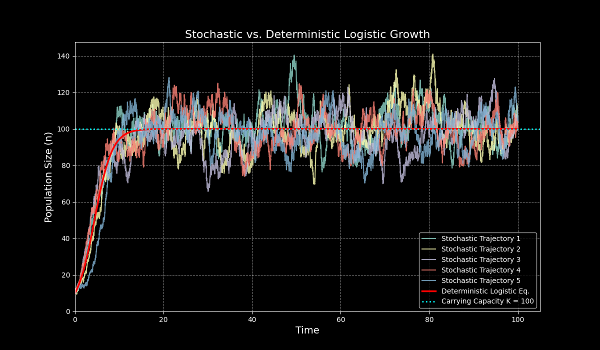

# 引言：连接离散跳跃与连续描述的另一座桥梁

在第36讲中，一个系统性的框架——相干态路径积分（Coherent State Path Integral, CSP）——被成功构建出来。该框架以算符代数为基石，通过引入泊松表示与产生-湮灭算符，将描述离散粒子生灭过程的主方程，精确地转化为一个可在其中运用场论工具的路径积分范式。这种代数方法为处理随机化学动力学提供了坚实的理论基础。

这节课将从一个不同的、物理上更为直观的视角出发，探寻连接离散与连续描述的另一条路径。其核心问题保持不变：如何从一个描述微观、离散“跳跃”事件（例如，粒子数从 $n$ 变为 $n + \Delta n$）的主方程出发，系统性地推导出一个等效的连续描述，例如福克-普朗克方程（Fokker-Planck Equation）或与之对应的朗之万方程（Langevin Equation）？

为实现这一目标，这节课将引入的关键数学工具是**克莱默-莫亚尔展开（Kramers-Moyal Expansion）**。它是一种对主方程进行的形式化泰勒级数展开，能够将一个积分-微分形式的主方程，转化为一个无限阶的偏微分方程。此展开的前两项，将自然地对应于福克-普朗克方程中的漂移项和扩散项，从而在“低噪声极限”（low noise limit）下，为从离散主方程到连续朗之万动力学的过渡提供了严格的数学依据。

因此，这节课旨在建立一个强有力的对比：一边是第36讲中源于算符代数的相干态路径积分（CSP），另一边则是本讲将要构建的、源于概率论展开的克莱默-莫亚尔路径积分（Kramers-Moyal Path Integral, KMPI）。最终的目标是展示，这两种截然不同的理论视角如何在适当的极限下收敛于相同的物理描述。这种不同形式主义之间的对偶性揭示了随机过程理论内在的深刻统一性。CSP方法在场论分析（如重整化群）中极其强大，而KMPI方法则为连接漂移、扩散等物理概念提供了更直接的桥梁。理解这种对偶性，是掌握本讲内容的关键。

# 1. Kramers-Moyal 展开：从主方程到偏微分方程

在前面的课程中，主方程被确立为描述离散状态（如粒子数）随机过程的基础。然而，其积分-微分的形式和离散的变量给直接应用场论的分析工具带来了挑战。这节课的目标便是要搭建一座从主方程的离散世界通往连续场论描述的桥梁。第一个关键步骤，就是通过**克莱默-莫亚尔（Kramers-Moyal）展开**，将主方程转化为一种更易于分析的偏微分方程形式。

Kramers-Moyal 展开由荷兰物理学家 Hendrik Anthony Kramers 和后来的 Josef L. Moyal 在 20 世纪 40 年代（Kramers, 1940; Moyal, 1949）系统性地建立与发展，其历史根源可追溯至早期统计物理对随机过程（如布朗运动）演化的研究。该展开的物理本质是提供了一个精确的数学框架，用于描述任意马尔可夫随机过程（包括非高斯、非扩散过程）的概率密度函数随时间的演化：它将概率分布函数的时变率表达为对其所有阶矩（即 Kramers-Moyal 系数）的无穷阶偏微分方程，即

$$\partial_t p(x, t) = \sum_{n=1}^{\infty} (-\partial_x)^n \left[ D^{(n)}(x, t) p(x, t) \right]$$

其中系数 $D^{(n)}$ 直接关联于随机增量的矩。

在具体应用上，Kramers-Moyal 展开是推导 Fokker-Planck 方程（当展开在第二阶截断时）的理论基础，并被广泛用于从实验或模拟数据中提取动力学的漂移和扩散项（即 $D^{(1)}$ 和 $D^{(2)}$），从而在神经科学（分析神经元放电）、流体湍流、金融时间序列分析以及单分子生物物理等领域中，为识别潜在的随机动力学规律提供了关键工具。

## 1.1 通用主方程

考虑一个由单个随机变量 $n$（例如粒子数）描述的系统。系统的状态通过一系列瞬时的“跳跃”事件发生改变，每次跳跃都使粒子数从 $n$ 变为 $n+\Delta n$。对于一个只涉及一种跳跃过程（步长为 $\Delta n$）的系统，其概率分布 $p(n,t)$ 的时间演化由以下主方程描述：

$$
\partial_t p(n,t) = \lambda(n - \Delta n) p(n - \Delta n, t) - \lambda(n) p(n,t)
$$

这个方程精确地描述了概率在离散状态空间中的守恒流动：


* **增益项 (Gain Term)**: $\lambda(n - \Delta n) p(n - \Delta n, t)$ 代表从状态 $n-\Delta n$ 跳跃到状态 $n$ 的总概率流。$p(n - \Delta n, t)$ 是系统处于源状态的概率，而 $\lambda(n - \Delta n)$ 是从该源状态出发的转移速率（Propensity）。

  

* **损失项 (Loss Term)**: $-\lambda(n) p(n,t)$ 代表从状态 $n$ 跳跃出去的总概率流。$\lambda(n)$ 是当前状态 $n$ 发生跳跃的总速率。

  

这个形式虽然精确，但其“差分”的性质（即同时涉及 $p(n,t)$ 和 $p(n-\Delta n, t)$）使其难以直接处理。

## 1.2 泰勒级数展开

Kramers-Moyal展开的核心思想，是将主方程中的增益项（一个关于 $n-\Delta n$ 的函数）在点 $n$ 附近进行形式化的泰勒级数展开。将函数 $f(n) = \lambda(n)p(n,t)$ 在 $n$ 点展开，可以得到 $f(n-\Delta n)$ 的表达式：

$$
\lambda(n - \Delta n) p(n - \Delta n, t) = \sum_{\mu=0}^{\infty} \frac{(-\Delta n)^{\mu}}{\mu!} \frac{\partial^{\mu}}{\partial n^{\mu}} \left[ \lambda(n) p(n,t) \right]
$$

将这个无限级数代回主方程。一个关键的简化随之发生：


* 当 $\mu = 0$ 时，展开式的第一项是 $\frac{(-\Delta n)^0}{0!} \frac{\partial^0}{\partial n^0}[\lambda(n)p(n,t)] = \lambda(n)p(n,t)$。

  

* 这一项恰好与主方程中的损失项 $-\lambda(n)p(n,t)$ 相互抵消。

  

因此，主方程被精确地重写为一个从 $\mu=1$ 开始的、无限阶的偏微分方程，这便是**Kramers-Moyal展开**：

$$
\partial_t p(n,t) = \sum_{\mu=1}^{\infty} \frac{(-\Delta n)^{\mu}}{\mu!} \frac{\partial^{\mu}}{\partial n^{\mu}} \left[ \lambda(n) p(n,t) \right]
$$

这个方程在数学上与原始主方程是等价的，但其形式发生了根本性的转变。它将一个离散的差分方程，转化为了一个将 $n$ 视为连续变量的、包含各阶导数的偏微分方程，为后续的分析铺平了道路。

## 1.3 Pawula 定理及其物理意义

这个无限阶的展开引出了一个至关重要的问题：在何种情况下可以对这个级数进行截断？**Pawula定理**给出了一个非平凡的、具有深刻物理含义的答案：Kramers-Moyal展开要么在二阶（$\mu = 2$）之后的所有高阶项都严格为零，要么它必须包含无穷多个非零项。不允许在第三阶或更高阶截断。

这个定理将随机过程清晰地划分为两大类：

1.  **纯扩散过程 (Fokker-Planck Processes)** ：如果展开在 $\mu = 2$ 处精确停止，那么主方程就严格等价于一个**福克-普朗克方程**。这对应于那些状态变量可以连续变化的随机过程，例如布朗运动。在这种情况下，福克-普朗克方程是对系统动力学的**精确描述**。

2.  **跳跃过程 (Jump Processes)** ：如果展开在二阶之后并不停止，那么根据Pawula定理，它必然有无穷多项。这意味着任何有限阶的截断（例如，只保留到二阶）都只能是一个**近似**。这对应于那些具有内禀离散跳跃特性的过程，例如化学反应中的分子数变化或种群动力学。

因此，对于任何由离散事件驱动的真实物理系统（如化学反应网络），将其简化为福克-普朗克方程本质上都是一种近似。这种近似的有效性依赖于一个核心的物理假设：单次跳跃的步长 $\Delta n$ 相对于系统的宏观状态（如总粒子数 $n$）非常小。当系统尺度很大，且跳跃事件频繁发生时，大量微小、离散的跳跃的累积效应，在宏观上看起来就像是一个连续的扩散过程。这正是所谓的“**低噪声极限**”或“**系统大小展开**”（system size expansion）的精髓，也是后续将主方程与朗之万方程联系起来的理论基石。

# 2. 跳跃过程的路径积分表示

上一节通过Kramers-Moyal展开，成功将主方程从一个离散的差分形式转化为了一个连续的、无限阶的偏微分方程。这一步虽然在数学上是等价的，但其真正的目的是为构建一个更强大的理论框架——**路径积分**——铺平道路。这节课的目标，便是将这个偏微分方程转化为路径积分的形式，从而提供一种全局的、基于“作用量”的动力学视角，这与第31讲和第32讲为朗之万方程建立的场论框架遥相呼应。

## 2.1 引入响应场 $\tilde{n}$

转化的第一步，是通过一系列数学技巧，将Kramers-Moyal展开这个偏微分方程重写为一个积分形式。这个过程的核心是引入一个辅助的**响应场 (response field)** $\tilde{n}$。

首先，利用狄拉克 $\delta$ 函数的性质，将偏微分方程的右侧（一个关于 $n$ 的函数）写成一个积分形式。这是一个恒等变换，目的是为了引入一个积分变量 $m$：

$$
\partial_t p(n,t) = \int dm\ \delta(m-n) \sum_{\mu=1}^{\infty} \frac{(-\Delta n)^{\mu}}{\mu!} \frac{\partial^{\mu}}{\partial m^{\mu}} [\lambda(m) p(m,t)]
$$

接下来，利用 $\delta$ 函数的傅里叶积分表示，这是引入响应场的关键一步：

$$
\delta(m-n) = \int \frac{d\tilde{n}}{2\pi} e^{-i\tilde{n}(n-m)}
$$

将此表示代入，主方程的演化被写成了一个在物理场 $m$ 和新引入的响应场 $\tilde{n}$ 上的双重积分：

$$
\partial_t p(n,t) = \int dm \int \frac{d\tilde{n}}{2\pi} e^{-i\tilde{n}(n-m)} \sum_{\mu=1}^{\infty} \frac{(-\Delta n)^{\mu}}{\mu!} \frac{\partial^{\mu}}{\partial m^{\mu}} [\lambda(m) p(m,t)]
$$

这个形式的优势在于，原来作用于概率密度项 $\lambda(m)p(m,t)$ 的微分算符 $\partial_m^\mu$ 现在位于一个积分内部。因此，可以通过**分部积分 (integration by parts)** 将这些导数从复杂的概率密度项上转移开。对 $m$ 进行 $\mu$ 次分部积分，每次都会将 $\partial_m$ 作用到指数项 $e^{i\tilde{n}m}$ 上，并产生一个因子 $i\tilde{n}$。重复 $\mu$ 次后，得到：

$$
\partial_t p(n,t) = \int dm\ p(m,t)\lambda(m) \int \frac{d\tilde{n}}{2\pi} e^{-i\tilde{n}(n-m)} \sum_{\mu=1}^{\infty} \frac{(\Delta n)^{\mu}}{\mu!} (i\tilde{n})^{\mu}
$$

通过这个操作，原来复杂的微分算符被转化为了关于响应场 $\tilde{n}$ 的简单代数乘积。响应场 $\tilde{n}$ 在此扮演的角色，与第32讲的J-D形式体系中的响应场完全一致，它是一个与主状态变量 $n$ 共轭的场。

## 2.2 重求和与路径积分的构建

观察上式中关于 $\mu$ 的求和，可以发现它是一个具有明确数学结构的级数：

$$
\sum_{\mu=1}^{\infty} \frac{(i\tilde{n}\Delta n)^{\mu}}{\mu!} = \left( \sum_{\mu=0}^{\infty} \frac{(i\tilde{n}\Delta n)^{\mu}}{\mu!} \right) - 1 = e^{i\tilde{n}\Delta n} - 1
$$

这个级数正是指数函数 $e^{i\tilde{n}\Delta n}$ 的泰勒展开减去其第一项（$\mu = 0$ 项）。因此，整个无限阶的Kramers-Moyal展开，在引入响应场后，可以被**精确地重求和**为一个紧凑的指数形式。将此结果代回，主方程的积分形式变为：

$$
\partial_t p(n,t) = \int dm\ p(m,t)\lambda(m) \int \frac{d\tilde{n}}{2\pi} e^{-i\tilde{n}(n-m)} \left( e^{i\tilde{n}\Delta n} - 1 \right)
$$

这个方程是原始主方程的一个精确的积分重写，它构成了构建路径积分的坚实起点。

为了构建路径积分，遵循标准的“**时间切片**”方法。在一个微小的时间步长 $\Delta t$ 内，概率分布的演化可以近似为：

$$
p(n,\tau + \Delta t) \approx p(n,\tau) + \Delta t\, \partial_\tau p(n,\tau)
$$

将上面推导的 $\partial_\tau p$ 的积分形式代入，并将 $1 + x\Delta t$ 近似为 $e^{x\Delta t}$，可以将单步演化算子写成指数形式。这个表达式描述了从时间 $\tau$ 到 $\tau + \Delta t$ 的“无穷小传播子”。通过将从初始时间 $t_0$ 到最终时间 $t$ 的整个过程分解为一系列无穷小的时间步，并在每一步之间对所有中间状态进行积分，便可以得到条件概率 $p(n,t|n_0,t_0)$ 的路径积分表示：

$$
p(n,t|n_0,t_0) = \int_{n(t_0)=n_0}^{n(t)=n} \mathcal{D}[n,\tilde{n}] e^{iS[n,\tilde{n}]}
$$

这里的积分测度 $\mathcal{D}[n,\tilde{n}]$ 代表对所有可能的历史路径 $n(\tau)$ 和所有可能的响应场历史 $\tilde{n}(\tau)$ 进行求和。

## 2.3 跳跃过程的作用量

上述路径积分由一个**作用量 (Action)** $S$ 控制，其对应的拉格朗日量 $\mathcal{L}$ 为：

$$
S[n,\tilde{n}] = \int_{t_0}^{t} d\tau\ \mathcal{L}[n,\tilde{n}] = \int_{t_0}^{t} d\tau\ \left[ \tilde{n} \partial_\tau n - i\lambda(n) \left(e^{i\tilde{n}\Delta n}-1\right) \right]
$$

为了与统计物理中常用的实数作用量（对应概率权重 $e^{-S'}$）保持一致，可以通过一个Wick旋转（令 $\tilde{n} \to i\tilde{n}'$）得到：

$$
S'[n,i\tilde{n}] = \int_{t_0}^{t} d\tau\ \left[ i\tilde{n} \partial_\tau n - \lambda(n) \left(e^{i\tilde{n}\Delta n}-1\right) \right]
$$

这个作用量概括了跳跃过程的全部动力学信息：

**动力学项 $i\tilde{n} \partial_\tau n$**: 这是一个在MSRJD类型的作用量中普遍存在的“动能”或“贝里相位”项。它在数学上将响应场 $\tilde{n}$ 确立为变量 $n$ 的共轭动量，确保了路径积分正确地描述了时间的连续演化。

**哈密顿量项 $-\lambda(n)(e^{i\tilde{n}\Delta n} - 1)$**: 这一项可以被看作是系统的“哈密顿量” $H(n, i\tilde{n})$，它生成了系统的随机跳跃。它包含了所有关于物理过程的具体信息：

**$\lambda(n)$**: 跳跃发生的速率。
    
**$e^{i\tilde{n}\Delta n} - 1$**: 描述跳跃事件本身的算符，其中 $\Delta n$ 是跳跃的步长。

至此，一个从离散主方程出发，经由Kramers-Moyal展开，最终得到的路径积分表示被完整地构建了出来。这个框架为后续在“低噪声极限”下分析系统行为，并将其与朗之万方程建立联系奠定了基础。

# 3. 低噪声极限与Fokker-Planck作用量

上一节推导出的路径积分作用量，虽然在数学上是精确的，但其包含的指数项 $\exp(i\tilde{n}\Delta n)$ 使得直接进行解析计算变得十分困难。为了从中提取有用的物理信息，需要引入一个合理的近似。这个近似的物理基础，正是第1节末尾提到的“**低噪声极限**”。


“低噪声极限”在物理上对应于系统尺寸非常大（即平均粒子数 $n \gg 1$）的情景。在这种情况下，单次跳跃的步长 $\Delta n$（通常是1或2这样的小整数）相对于总粒子数 $n$ 是一个微小的扰动。这个物理图像为在数学上对作用量进行系统性近似提供了坚实的依据。这节课的目标，就是执行这个近似，并揭示离散跳跃过程在宏观尺度下如何自然地过渡到一个由福克-普朗克方程或朗之万方程描述的连续扩散过程。

## 3.1 作用量的展开

在低噪声极限下，可以对作用量中的哈密顿量部分 $H(n, i\tilde{n}) = \lambda(n)(e^{i\tilde{n}\Delta n} - 1)$，按照小参数 $\Delta n$ 的幂次进行泰勒展开。具体来说，将指数项 $e^{i\tilde{n}\Delta n}$ 展开至二阶：

$$
e^{i\tilde{n}\Delta n} \approx 1 + (i\tilde{n}\Delta n) + \frac{1}{2}(i\tilde{n}\Delta n)^2 + \mathcal{O}((\Delta n)^3)
$$

将这个近似代入哈密顿量：

$$
\lambda(n)\left(e^{i\tilde{n}\Delta n} - 1\right) \approx \lambda(n)\left[ (i\tilde{n}\Delta n) + \frac{1}{2}(i\tilde{n})^2 (\Delta n)^2 \right]
$$

现在，将这个展开后的哈密顿量代回完整的拉格朗日量 $\mathcal{L}' = i\tilde{n} \partial_\tau n - H(n, i\tilde{n})$ 中：

$$
\mathcal{L}' \approx i\tilde{n} \partial_\tau n - \lambda(n)\left[ i\tilde{n}\Delta n + \frac{1}{2}(i\tilde{n})^2 (\Delta n)^2 \right]
$$

对各项重新组合，将与 $i\tilde{n}$ 线性相关的项和二次相关的项分开：

$$
\mathcal{L}' \approx i\tilde{n} \left( \partial_\tau n - \lambda(n) \Delta n \right) - \frac{1}{2} \lambda(n) (\Delta n)^2 (i\tilde{n})^2
$$

对这个拉格朗日量进行时间积分，就得到了近似后的**福克-普朗克作用量**：

$$
S_{\text{FP}}[n,i\tilde{n}] \approx \int_{t_0}^{t} d\tau\ \left[ i\tilde{n} \left( \partial_\tau n - \lambda(n) \Delta n \right) - \frac{1}{2} (i\tilde{n})^2 \lambda(n) (\Delta n)^2 \right]
$$

**物理意义**：这个近似操作的意义是革命性的。原来的作用量包含了无穷阶的 $i\tilde{n}$ 项（隐藏在指数函数中），对应于Kramers-Moyal展开中的无穷阶导数。而截断到二阶后，得到的作用量在响应场 $i\tilde{n}$ 中是**二次的（高斯的）**。这种形式的作用量在随机场论中极为重要，这就是之前介绍过多次的**MSRJD作用量**，并且与一个连续的朗之万随机微分方程有着直接且深刻的对应关系，这在第32讲中已有详细探讨。

## 3.2 与Langevin方程的联系

一个描述连续随机变量 $n(\tau)$ 的通用**朗之万方程**可以写为：

$$
\partial_\tau n = V(n) + \sqrt{2D(n)}\, \eta(\tau)
$$

其中：


* $V(n)$ 是确定性的**漂移 (Drift)** 项。

  

* $D(n)$ 是依赖于状态的**扩散 (Diffusion)** 系数。

  

* $\eta(\tau)$ 是标准高斯白噪声，满足 $\langle \eta(\tau) \rangle = 0$ 和 $\langle \eta(\tau)\eta(\tau') \rangle = \delta(\tau - \tau')$。

  

正如在第32讲中建立的，这样一个朗之万方程所对应的MSRJD作用量具有如下通用形式：

$$
S_{\text{Langevin}}[n,i\tilde{n}] = \int d\tau\ \left[ i\tilde{n} \left( \partial_\tau n - V(n) \right) - D(n) (i\tilde{n})^2 \right]
$$

现在，只需将上一小节推导出的福克-普朗克作用量 $S_{\text{FP}}$ 与这个通用形式进行逐项比较：

$$
\begin{aligned}
S_{\text{FP}} &= \int d\tau\ \left[ i\tilde{n} \left( \partial_\tau n - \underline{\lambda(n) \Delta n} \right) - \underline{\frac{1}{2} \lambda(n) (\Delta n)^2} (i\tilde{n})^2 \right] \\
S_{\text{Langevin}} &= \int d\tau\ \left[ i\tilde{n} \left( \partial_\tau n - \underline{V(n)} \right) - \underline{D(n)} (i\tilde{n})^2 \right]
\end{aligned}
$$

通过比较下划线标出的部分，可以立刻识别出等效朗之万方程中的漂移项 $V(n)$ 和扩散项 $D(n)$：

**漂移 (Drift)**: $V(n) = \lambda(n)\Delta n$

**扩散 (Diffusion)**: $D(n) = \frac{1}{2}\lambda(n)(\Delta n)^2$

这一结果极为重要，它提供了一个从微观跳跃过程到宏观连续随机微分方程的系统性推导方法。它清晰地揭示了：

宏观的**确定性漂移** $V(n)$，源于微观跳跃的**平均效应**（速率 $\lambda(n)$ 乘以步长 $\Delta n$）。

宏观的**随机扩散** $D(n)$，源于微观跳跃的**二阶矩或涨落**（与步长的平方 $(\Delta n)^2$ 成正比）。

这套方法论构成了连接离散主方程世界和连续朗之万方程世界的坚实桥梁，使得能够运用连续场论的强大工具来分析本质上由离散事件驱动的复杂系统。

# 4. 再探湮灭过程与随机逻辑斯蒂增长

在第36讲中，双分子湮灭反应 $A+A \to \emptyset$ 被用作展示相干态路径积分（CSP）和“虚噪声”概念的范例。这节课将再次审视这个模型，但这一次的目的是展示Kramers-Moyal路径积分（KMPI）如何通过一种更直接的、物理上更直观的路径，在低噪声极限下导出一个标准的朗之万方程。这种对比将深刻地揭示两种理论框架的异同。随后，为了展示该方法的广泛应用，将把代码实践部分替换为一个全新的模型——随机逻辑斯蒂增长。

## 4.1 两种路径积分的对比：湮灭过程 $A+A \to \emptyset$

简要回顾，对于反应 $A+A \to \emptyset$，我们已经通过两种不同的路径推导了其场论描述：

1.  **相干态路径积分 (CSP)** ：

    通过算符代数方法，得到了一个**精确**的作用量，它对应于一个包含**虚噪声**的等效朗之万方程。作用量中的噪声项为 $+(λ/2)x²(iq)²$，这个正号是虚噪声的来源，它使得连续场论能够精确重现离散跳跃的泊松统计特性。

2.  **Kramers-Moyal路径积分 (KMPI)** ：

    通过对主方程进行K-M展开并取低噪声极限，我们得到了一个**近似**的朗之万方程 $\partial_t n = -λn(n-1) + \sqrt{4λn(n-1)}η(t)$。其对应的MSRJD作用量中的噪声项为 $-D(n)(i\tilde{n})^2 = -2λn(n-1)(i\tilde{n})^2$。这个负号对应于一个标准的**实数噪声**。

**核心区别与联系**：

CSP提供了一个**精确但抽象**的映射，其代价是引入了非物理的“虚噪声”。它在形式上更优雅，是进行严格场论分析（如重整化群）的起点。

KMPI的低噪声极限提供了一个**近似但直观**的映射，它直接通向了物理学家所熟悉的、描述真实涨落的朗之万方程，并清晰地将漂移和扩散与微观过程联系起来。

这两种方法殊途同归，从不同侧面描述了同一个物理系统的行为，体现了理论物理框架的丰富性和内在一致性。

## 4.2 应用实例：随机逻辑斯蒂增长

现在，将KMPI的配方应用于一个在生态学和人口动力学中极为重要的模型：**逻辑斯蒂增长**。该模型包含两种基本反应：

1.  **繁殖 (Birth)**: $A \xrightarrow{\mu} 2A$ (一个生物体以速率 $\mu$ 分裂成两个)

2.  **竞争/死亡 (Competition/Death)**: $A+A \xrightarrow{\lambda/2} A$ (两个生物体竞争资源，导致其中一个死亡，速率为 $\lambda/2$)

这个模型描述了种群在资源有限的情况下的增长过程。

**1. 定义微观事件**:

**繁殖**: $\Delta n = +1$, 速率 $\lambda_1(n) = \mu n$。

**竞争**: $\Delta n = -1$, 速率 $\lambda_2(n) = (\lambda/2)n(n-1)$。

**2. 计算总漂移与扩散**:

由于两个过程独立发生，总的漂移 $V(n)$ 和扩散 $D(n)$ 是两个过程贡献的和：

**总漂移** :

$$
V(n) = V_1(n) + V_2(n) = (\mu n)(+1) + \left(\frac{\lambda}{2}n(n-1)\right)(-1)= \mu n - \frac{\lambda}{2}n(n-1)
$$
**总扩散** :
$$
D(n) = D_1(n) + D_2(n) = \frac{1}{2}(\mu n)(+1)^2 + \frac{1}{2}\left(\frac{\lambda}{2}n(n-1)\right)(-1)^2 = \frac{1}{2}\mu n + \frac{1}{4}\lambda n(n-1)
$$
**3. 构建Langevin方程**:
代入 $\partial_t n = V(n) + \sqrt{2D(n)}η(t)$，得到随机逻辑斯蒂增长的Langevin方程：
$$
\partial_t n = \left( \mu n - \frac{\lambda}{2}n(n-1) \right) + \sqrt{\mu n + \frac{\lambda}{2}n(n-1)}\, \eta(t)
$$
在 $n \gg 1$ 的近似下，方程简化为：
$$
\partial_t n = \mu n \left(1 - \frac{n}{K}\right) + \sqrt{\left(\mu + \frac{\lambda}{2}n\right)n}\, \eta(t)
$$
其中 $K = 2\mu/\lambda$ 是著名的**环境承载量 (Carrying Capacity)** 。

## 4.3 Python模拟：人口涨落与环境承载量

下面的代码将模拟这个随机逻辑斯蒂增长过程，并与确定性的逻辑斯蒂方程解进行对比。

```python
import numpy as np
import matplotlib.pyplot as plt

# --- 1. Parameter Settings ---
n0 = 10.0         # Initial population size
mu = 0.5          # Birth rate
lambda_rate = 0.01 # Competition rate
T_max = 100.0     # Total simulation time
dt = 0.01         # Time step
n_steps = int(T_max / dt)
n_traj = 5        # Number of stochastic trajectories

# Carrying capacity K
K = 2 * mu / lambda_rate

# --- 2. Time Axis ---
t = np.linspace(0, T_max, n_steps + 1)

# --- 3. Simulate Stochastic Trajectories ---
plt.figure(figsize=(12, 7))
# Set black background
plt.style.use('dark_background')

for j in range(n_traj):
    n_stochastic = np.zeros(n_steps + 1)
    n_stochastic[0] = n0
    for i in range(n_steps):
        n = n_stochastic[i]
        if n <= 0:
            n_stochastic[i+1:] = 0
            break
        
        # Drift term V(n)
        drift = mu * n - (lambda_rate / 2) * n * (n - 1)
        
        # Diffusion term D(n)
        diffusion_term_squared = mu * n + (lambda_rate / 2) * n * (n - 1)
        
        # Noise amplitude sqrt(2D(n))
        noise_amp = np.sqrt(diffusion_term_squared) if diffusion_term_squared > 0 else 0
        
        # Euler-Maruyama step
        noise = np.random.normal(0, 1)
        n_stochastic[i+1] = n + drift * dt + noise_amp * np.sqrt(dt) * noise
        
    plt.plot(t, n_stochastic, lw=1.5, alpha=0.8, label=f'Stochastic Trajectory {j+1}')

# --- 4. Calculate Deterministic (Mean Field) Solution ---
# Solution to dn/dt = μn(1 - n/K)
n_deterministic = K / (1 + (K/n0 - 1) * np.exp(-mu * t))
plt.plot(t, n_deterministic, 'r-', lw=2.5, label='Deterministic Logistic Eq.')

# --- 5. Plotting ---
plt.axhline(K, color='cyan', linestyle=':', lw=2, label=f'Carrying Capacity K = {K:.0f}')
plt.xlabel('Time', fontsize=14)
plt.ylabel('Population Size (n)', fontsize=14)
plt.title('Stochastic vs. Deterministic Logistic Growth', fontsize=16)
plt.legend()
plt.grid(True, linestyle='--', alpha=0.5)
plt.ylim(bottom=0)
plt.xlim(left=0)
plt.savefig('LogisticGrowth.png')
plt.show()
```


**确定性逻辑斯蒂曲线（红色实线）**：这条经典的S型曲线是平均场方程 $\frac{dn}{dt} = \mu n\left(1 - \frac{n}{K}\right)$ 的解。它描述了一个种群从初始数量平滑增长，并最终饱和于环境承载量 $K$ 的理想过程。

**环境承载量（青色虚线）**：$K$ 代表了在给定资源下，环境能稳定支持的最大种群规模。

**随机轨迹**：这些曲线展示了有限种群的真实动态。种群数量并不会稳定在 $K$ 值上，而是在其周围永不停歇地涨落。这种源于个体出生和死亡事件离散性的涨落，被称为“人口噪声（demographic noise）”。在某些情况下，这些涨落甚至可能导致种群意外地灭绝，即使 $K$ 值很高。

这个例子展示了 KMPI 到 Langevin 方程的推导“配方”的通用性，它不仅适用于物理化学中的湮灭过程，同样适用于生态学中的种群动态，以及涨落在大自然中的普遍性和重要性。

# 5. 应用II：再探有向渗流——从格子到场的视角

在第34讲中，有向渗流（DP）模型被作为非平衡相变的范式引入，其相变行为通过平均场理论得到了初步的阐释。这节课将重返DP模型，但视角已截然不同。这里的目标不再是介绍DP是什么，而是将其作为一个“试金石”，来检验在第36讲和第37讲中发展的强大随机场论工具——相干态路径积分（CSP）与Kramers-Moyal路径积分（KMPI）——的一致性。

这小节从DP的微观反应规则出发，通过KMPI的系统性“配方”，推导出一个包含涨落效应的宏观随机动力学方程。

## 5.1 从微观规则到0维Langevin方程

首先，简要回顾从DP的微观反应规则到其在“0维”（即充分混合，无空间维度）系统中的Langevin方程的推导过程。根据课程板书，DP模型由增殖、死亡和凝聚三种反应构成。通过KMPI框架和低噪声展开，可以得到其漂移项$V(n)$与扩散项$D(n)$：

* **漂移项**: $V(n) = (\mu-\lambda)n - \gamma n(n-1)$

* **扩散项**: $D(n) = \frac{1}{2} \left[ (\mu+\lambda)n + \gamma n(n-1) \right]$

这对应于描述总粒子数$n(t)$随时间演化的0维Langevin方程：
$$
\frac{d n}{d t} = V(n) + \sqrt{2D(n)}\, \eta(t)
$$
这个方程描述了一个孤立点上的粒子数涨落，但未能体现“渗流”所蕴含的空间传播特性。

## 5.2 从0维到(2+1)维：随机偏微分方程（SPDE）

为了描述一个在二维空间中演化的真实物理系统，需要将上述方程推广为一个**随机偏微分方程（SPDE）**，其中粒子数$n$变为一个连续的密度场$n(x, y, t)$。为此，需要加入两个关键的空间项：

1.  **空间扩散 (Spatial Diffusion)** ：粒子会自发地从高密度区域扩散到低密度区域。这一过程由一个拉普拉斯项 $D_{\text{space}} \nabla^2 n$ 来描述，其中$D_{\text{space}}$是空间扩散系数。

2.  **定向传播 (Advection)** ：为了体现“有向”渗流的本质——即活性在一个优选方向（通常被视为“时间”）上的不可逆传播——引入一个**平流项 $-v_y \frac{\partial n}{\partial y}$** 。这相当于施加了一股恒定的“风”，强制整个密度场以速度$v_y$沿着$y$轴负方向（即**从上到下**）流动。

将这些项组合起来，就得到了描述(2+1)维（2个空间维度+1个时间维度）有向渗流的完整场方程：


$$
\frac{\partial n}{\partial t} = \underbrace{V(n)}_{\text{反应}} + \underbrace{D_{\text{space}} \nabla^2 n}_{\text{横向扩散}} \underbrace{- v_y \frac{\partial n}{\partial y}}_{\text{纵向平流}} + \underbrace{\sqrt{2D(n)}\, \eta(\mathbf{x},t)}_{\text{时空噪声}}
$$


这个SPDE是本讲理论推导在时空中的最终体现，它提供了一个既包含内部反应动力学，又包含空间传播特性的完整场论模型。

## 5.3 代码实践：有向渗流的场论可视化

以下代码正是对上述SPDE的直接数值模拟。它不再追踪离散的粒子，而是求解一个连续密度场$n(x,y,t)$的演化。初始条件设置为在空间顶端的一条“活性”细线，以观察其如何向下“渗流”。

```python
import numpy as np
import matplotlib.pyplot as plt
from scipy.ndimage import laplace
from matplotlib.animation import FuncAnimation, PillowWriter

# --- 1. Parameter Settings ---
grid_size = 128
# Reaction parameters
lambda_death = 1.0
gamma_coag = 0.1
mu_active = 1.15   # Active phase (slightly increased for clearer pattern)
mu_absorbing = 0.95 # Absorbing phase
# Simulation parameters
D_space = 0.2      # Spatial diffusion coefficient (horizontal)
v_y = 15.0         # !!! New: Vertical advection velocity !!!
dt = 0.01
total_time = 10
n_steps = int(total_time / dt)

def run_directed_spde_simulation(mu_rate):
    """ Numerically simulate the "directed" SPDE """
    # Initialization: Activate a thin line at the top
    n_field = np.zeros((grid_size, grid_size))
    start_row = 5
    n_field[start_row, grid_size//2 - 10 : grid_size//2 + 10] = 1.0
    
    history = [n_field.copy()]
    # Spatial step size
    dy = 1.0 

    for i in range(n_steps):
        # Reaction term
        reaction_drift = (mu_rate - lambda_death) * n_field - gamma_coag * n_field * (n_field - 1)
        
        # Noise term
        noise_strength_sq = (mu_rate + lambda_death) * n_field + gamma_coag * n_field * (n_field - 1)
        noise_strength = np.sqrt(np.maximum(0, noise_strength_sq))
        space_time_noise = np.random.normal(0, 1, (grid_size, grid_size)) * noise_strength / np.sqrt(dt)

        # Spatial diffusion term (Laplacian operator)
        laplacian = laplace(n_field, mode='wrap') # Periodic boundary conditions
        
        # !!! New: Advection term (using simple upwind scheme) !!!
        # np.roll(n_field, 1, axis=0) shifts entire rows down by one, simulating flow from above
        advection = -v_y * (n_field - np.roll(n_field, 1, axis=0)) / dy
        
        # Euler method to update field
        n_field += (reaction_drift + D_space * laplacian + advection + space_time_noise) * dt
        n_field = np.maximum(0, n_field) # Density cannot be negative
        
        # Save a frame every few steps
        if (i+1) % 2 == 0: 
            history.append(n_field.copy())
            
    return history

# --- 2. Run simulations for two scenarios ---
print("Running simulation for active phase...")
history_active = run_directed_spde_simulation(mu_active)
print("Running simulation for absorbing phase...")
history_absorbing = run_directed_spde_simulation(mu_absorbing)

# --- 3. Create animation ---
fig, (ax1, ax2) = plt.subplots(1, 2, figsize=(10, 5))
fig.patch.set_facecolor('black')
vmax = np.max(history_active) * 0.7 # Unified color range

def update(frame):
    ax1.clear()
    im1 = ax1.imshow(history_active[frame], cmap='hot', vmin=0, vmax=vmax)
    ax1.set_title(f'Active Phase (μ={mu_active})', color='white')
    ax1.set_xticks([])
    ax1.set_yticks([])

    ax2.clear()
    im2 = ax2.imshow(history_absorbing[frame], cmap='hot', vmin=0, vmax=vmax)
    ax2.set_title(f'Absorbing Phase (μ={mu_absorbing})', color='white')
    ax2.set_xticks([])
    ax2.set_yticks([])
    
    fig.suptitle(f'Field Simulation of Directed Percolation (Time: {frame*dt*2:.2f})', color='white', fontsize=16)
    
    # Force aspect ratio to stretch image, better reflecting "directed" nature
    ax1.set_aspect(0.5)
    ax2.set_aspect(0.5)
    
    return [im1, im2]

# --- 4. Generate and save animation ---
frames_to_render = min(len(history_active), len(history_absorbing))
ani = FuncAnimation(fig, update, frames=frames_to_render, interval=40, blit=False)
ani.save("directed_percolation_field.gif", writer=PillowWriter(fps=25))
plt.show()
```


**定向传播**：强制性的向下平流项 $(-v_y \cdot \partial n / \partial y)$ 主导了系统的整体运动方向，形成了从上到下传播的经典“渗流锥”。

**横向扩展**：空间扩散项 $(D_{\text{space}} \cdot \nabla^2 n)$ 使得渗流锥在传播的同时向两侧（空间维度）扩展，形成了锥形的边界。

**左图（活性相, $\mu > \lambda$）**：在渗流锥内部，反应项的增殖占优，使得密度场能够维持并发展出复杂的、动态涨落的内部结构。活性成功地传播到系统的“未来”。

**右图（吸收相, $\mu < \lambda$）**：尽管也形成了初始的渗流锥，但内部的死亡率过高，导致密度场迅速衰减。噪声项虽能引起暂时的局部亮起，但无法改变整体消亡的命运，最终活性将在有限的“时间”内完全熄灭。


## 5.4 理论的统一：科尔-霍普夫变换

在分别从概率论（KMPI）和算符代数（CSP）两个截然不同的角度构建了路径积分之后，一个至关重要的问题是：它们之间存在何种联系？答案在于一个深刻的非线性场变换——**科尔-霍普夫（Cole-Hopf）变换**，在随机过程的文献中，它也常被称为**格拉斯伯格（Grassberger）变换**。

### 变换的核心

科尔-霍普夫变换在当前语境下的核心作用，是建立KMPI框架中的场变量 $(n, \tilde{n})$ 与CSP框架中算符的“符号” $(x, iq+1)$ 之间的精确数学映射。根据课程板书，其关键对应关系为：

1.  **跳跃算符与湮灭算符的等价**:

$$
e^{i\tilde{n}} \quad \longleftrightarrow \quad \hat{a} \quad (\text{其符号为 } iq+1)
$$
这个关系是整个变换的基石。它揭示了在KMPI中描述一次粒子“跳跃”的算符 $e^{i\tilde{n}}$，在代数结构上等价于CSP中“湮灭”一个粒子的算符 $\hat{a}$。

2.  **粒子数场与粒子数算符的等价**:
    $$
    n \quad \longleftrightarrow \quad \hat{a}^\dagger \hat{a} \quad (\text{其符号为 } x(iq+1))
    $$

这表明KMPI中的基本变量——粒子数 $n$——在CSP框架中是一个复合量，即粒子数算符 $\hat{a}^\dagger \hat{a}$。


这个变换的意义远不止是数学上的符号替换，它揭示了理论的深层统一性：

* **统一物理图像** ：它证明了“概率论”的视角（KMPI关注粒子数 $n$ 的变化）和“代数”的视角（CSP关注产生 $\hat{a}^\dagger$ 和湮灭 $\hat{a}$ 的基本事件）在描述同一个物理现实时是完全等价的。


* **化非线性为线性** ：从历史上看，科尔-霍普夫变换最著名的应用是将在流体力学中描述冲击波的**非线性伯格斯方程（Burgers' equation）**精确地转化为**线性的热传导方程**。这种化繁为简、揭示复杂非线性问题背后隐藏的线性结构的能力，正是它在理论物理中如此强大的原因。

在本节课中，科尔-霍普夫变换扮演了“翻译器”的角色。尽管推导路径不同，但KMPI和CSP在低噪声极限下必然会收敛到同一个描述宏观物理的朗之万方程。为根据问题的具体情况选择最合适的场论工具（KMPI更直观，CSP更便于使用重整化群等高等工具）提供了理论依据。

KMPI 提供了一条从概率论出发、物理直观的路径，直达朗之万方程；而 CSP 则提供了一条从算符代数出发、形式更优美的路径，便于使用更高等的场论工具。两者的最终汇合，以及它们共同导出的、能够被直观可视化的 SPDE。

# 结论

这节课系统性地介绍了如何从描述离散跳跃过程的主方程出发，构建一个等效的连续随机场论描述，并最终揭示了随机过程理论框架内在的统一性。


**从离散到连续的桥梁**：**克莱默-莫亚尔（Kramers-Moyal）展开**被确立为一座关键的数学桥梁。它提供了一种系统性的方法，将离散的、积分-微分形式的主方程，转化为一个将状态变量视为连续的、无限阶的偏微分方程。

**精确的路径积分表述**：基于K-M展开，一个精确代表原始主方程的**克莱默-莫亚尔路径积分（KMPI）**被构建出来。其作用量 $S[n,\tilde{n}]$ 优雅地将跳跃速率 $\lambda(n)$ 和步长 $\Delta n$ 编码在一个紧凑的指数“哈密顿量” $\lambda(n)(e^{i\tilde{n}\Delta n} - 1)$ 中，保留了跳跃过程完整的非高斯统计特性。

**低噪声极限的物理意义**：通过在物理上合理的**低噪声极限**（等价于系统大小展开）下对作用量进行展开，自然地得到了一个高斯形式的福克-普朗克（或MSRJD）作用量。这一过程不仅为从主方程近似得到福克-普朗克方程提供了理论依据，更重要的是，它建立了一个从微观跳跃规则（速率与步长）到宏观朗之万动力学（漂移与扩散系数）的系统性推导“配方”。

**理论的统一性**：这节课的最高潮，在于通过有向渗流（DP）模型的分析，揭示了理论的深刻统一性。结果表明，在低噪声极限下，由概率论方法（KMPI）推导出的宏观Langevin方程，与在第36讲中由完全不同的算符代数方法（相干态路径积分, CSP）推导出的结果**完全一致**。**Cole-Hopf变换**揭示了这两种看似无关的形式主义之间的深层对偶性，证明了无论是从哪个基本视角出发，所描述的普适宏观物理都是相同的。

这节课发展的单物种理论框架 $(n, \tilde{n})$ 为研究更复杂的系统奠定了坚实的基础。下一步自然是将这些技术推广到包含多种相互作用物种的系统。届时，将不再只有一个粒子数密度 $n$ 及其响应场 $\tilde{n}$，而是为每个物种 $i$ 都引入一组场 $\{n_i, \tilde{n}_i\}$。

作用量（无论是KMPI还是CSP形式）的结构将变得更加丰富，除了描述每个物种自身动力学的项之外，还会出现**耦合项**，用于描述物种间的相互作用，例如：

* **捕食-被捕食**：$A + B \to 2A$

* **竞争**：$A + B \to A$ 或 $A + B \to B$

* **循环主导**：$A + B \to 2B$, $B + C \to 2C$, $C + A \to 2A$

这种推广将能够用于研究远比简单衰减/增长过程更为丰富的动力学现象，例如在**捕食者-被捕食者模型（Lotka-Volterra）**中出现的种群数量的持续振荡，或是在**循环竞争模型（如“石头-剪刀-布”游戏）**中自发涌现的追逐-逃逸螺旋斑图。这将带领我们从单变量的随机过程，进入到由多场耦合驱动的、迷人的复杂种群动力学与时空斑图形成的世界。

