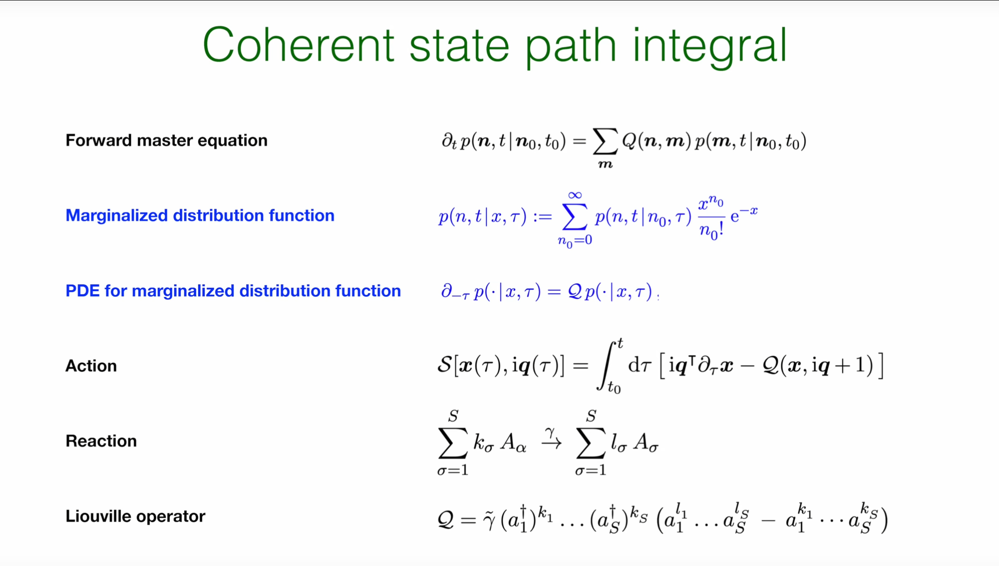
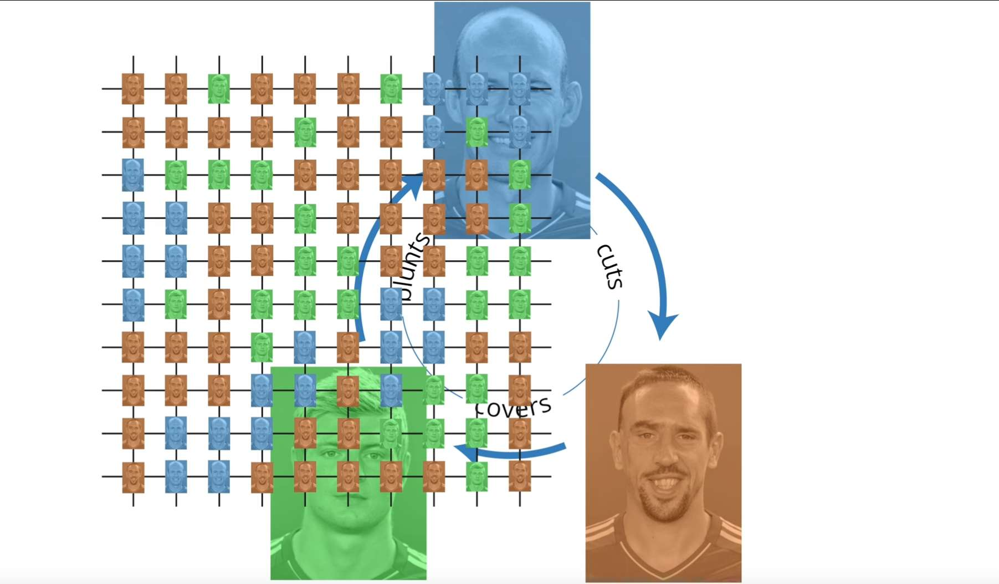
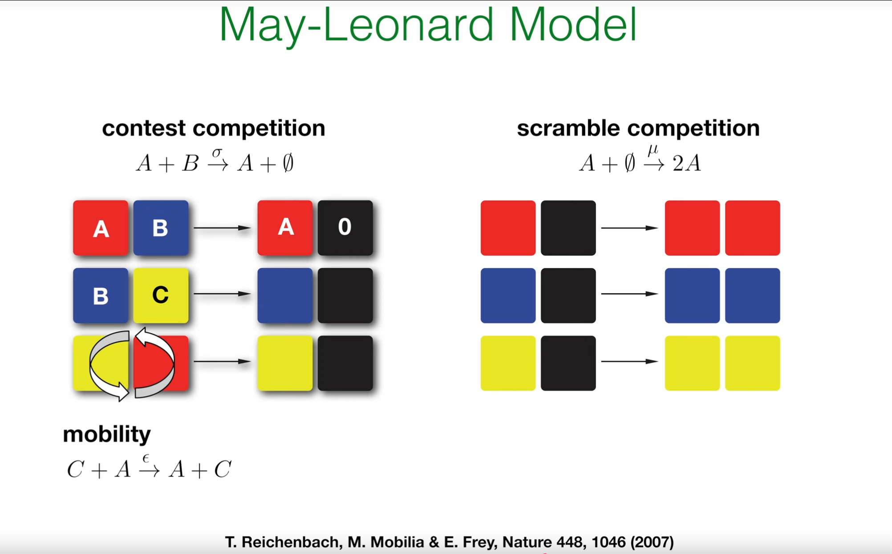
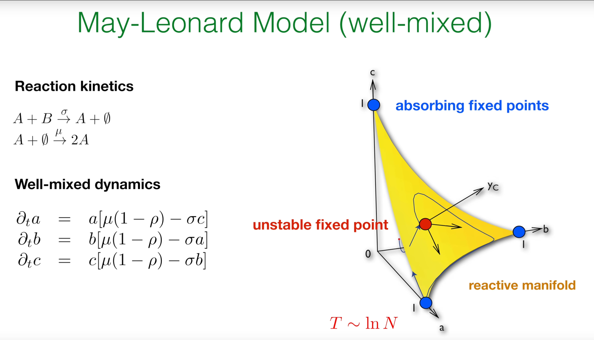
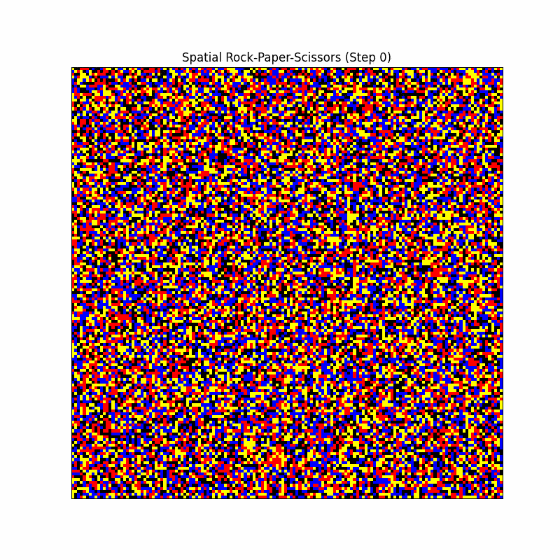
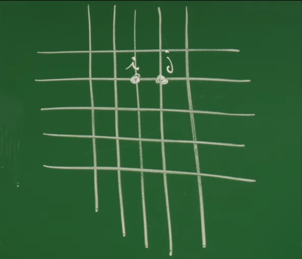
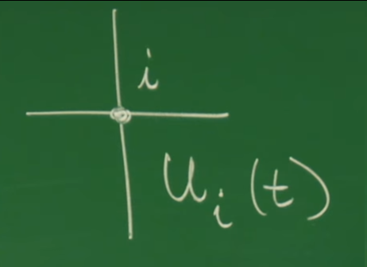

# 引言：从单物种到复杂生态系统

在前面的讲座中（特别是第35至37讲），一个用于描述**单个物种**随机过程的强大理论框架已被系统性地建立起来。无论是通过基于概率论的克莱默-莫亚尔展开（Kramers-Moyal Expansion），还是通过基于算符代数的相干态路径积分（Coherent State Path Integral），描述离散粒子生灭过程的主方程（Master Equation）都已被精确地转化为了一个可以运用场论工具的路径积分范式。

然而，自然界中绝大多数有趣的现象——无论是生态系统中的物种竞争、流行病学中的疾病传播，还是生物化学中的反应网络——都涉及**多个相互作用的物种**。因此，单物种理论虽然是坚实的起点，但为了描述真实世界的复杂性，必须将其进行推广。

这节课的核心目标，正是将先前发展的路径积分形式从单物种系统推广到更为复杂和现实的**多物种系统**。通过这一推广，将为包含任意数量物种和任意复杂反应网络的系统构建一个统一的随机动力学理论。

为了具体展示这一推广的威力，将以一个经典且非平凡的模型作为案例研究：**石头-剪刀-布（Rock-Paper-Scissors）模型**，在生态学中也称为 **May-Leonard模型**。这个模型是研究**循环主导（cyclic dominance）** 和非平衡动力学的范式。它虽然规则简单，却能展现出复杂的时空动力学行为，如持续的种群振荡和螺旋波的形成，这些都是简单的平衡态统计力学无法描述的丰富现象。

这节课也标志着课程从构建抽象的数学工具转向其在复杂非平衡系统中的直接应用。先前讲座（第31–37讲）中精心构建的理论机器——包括Janssen-De Dominicis响应泛函、Onsager-Machlup泛函以及相干态路径积分——在处理像石头-剪刀-布模型这样具有**复杂非线性相互作用**的非平衡问题时，其必要性和强大之处将得到充分的证明。

# 1. 回顾：单物种系统的相干态路径积分框架

为了将理论从单物种推广至多物种系统，首先必须回顾在之前讲座（特别是第36和37讲）中为单物种随机过程建立的核心概念与数学结构。这个基于相干态路径积分的框架，是从主方程出发、通往场论分析的坚实桥梁。

## 1.1 从主方程到生成函数





随机生灭过程的理论起点是**前向主方程 (Forward Master Equation)** 。它描述了系统在时刻 $t$ 处于具有 $n$ 个粒子的状态的概率 $p(n, t \mid n_0, t_0)$ 的时间演化：
$$
\partial_t p(n, t \mid n_0, t_0) = \sum_m Q(n, m) p(m, t \mid n_0, t_0)
$$


* $p(n, t \mid n_0, t_0)$ 是条件概率，即在初始时刻 $t_0$ 有 $n_0$ 个粒子的前提下，在时刻 $t$ 发现有 $n$ 个粒子的概率。

* $Q(n, m)$ 是转移速率矩阵的元素，代表系统从具有 $m$ 个粒子的状态以单位速率转移到具有 $n$ 个粒子状态的概率。这个方程本质上是概率在不同粒子数状态之间流动的详细记账。

直接求解这个无限维的耦合常微分方程组通常非常困难。为了简化问题，第36讲引入了**相干态表象 (Coherent State Representation)**，其核心是定义一个**边缘化分布函数 (Marginalized Distribution Function)** 。它本质上是关于初始粒子数 $n_0$ 的一种生成函数：

$$
p(n, t \mid x, \tau) := \sum_{n_0=0}^{\infty} p(n, t \mid n_0, \tau) \frac{x^{n_0}}{n_0!} e^{-x}
$$


* 这个变换将一个依赖于离散初始值 $n_0$ 的函数族，通过泊松核函数 $\frac{x^{n_0}}{n_0!} e^{-x}$，转化为一个依赖于**连续变量 $x$** 的单一函数 。

  

* 这里的初始时间被记为 $\tau$。需要特别强调的是，变量 $x$ 并非物理量（如粒子密度或位置），而是一个用于生成矩的数学辅助变量。

这个变换的威力在于，它将主方程从一个无限维的常微分方程组，转化为了一个更易于处理的单一偏微分方程（PDE）：

$$
\partial_{-\tau} p(\cdot \mid x, \tau) = \mathcal{Q} p(\cdot \mid x, \tau)
$$

其中 $\mathcal{Q}$ 是在相干态表象下的演化算符，通常被称为**刘维尔算符 (Liouville Operator)** 。

刘维尔算符得名于法国数学家约瑟夫·刘维尔，其思想渊源可追溯至他19世纪30年代对经典力学相空间守恒规律的研究，但该算符在现代理论物理中的系统形式化则由约翰·冯·诺依曼等人在于20世纪30年代建立的量子统计力学中完成。其物理本质是描述系统在相空间（经典）或希尔伯特空间（量子）中概率分布或密度矩阵随时间演化的生成元：在经典力学中，刘维尔算符 L 由哈密顿量通过泊松括号定义为 $L \cdot = i \{H, \cdot\}$，它生成相空间流的时间演化；在量子力学中，它则由哈密顿量通过对易关系定义为 $L \hat{\rho} = [H, \hat{\rho}] / i\hbar$，支配着密度矩阵 $\hat{\rho}$ 的动力学（即冯·诺依曼方程）。其核心应用贯穿于统计物理的各个前沿领域，包括作为线性响应理论（如久保公式）的基石、构建非平衡统计物理的主方程框架、分析混沌系统的动力学的特征值（Pollicott-Ruelle共振子）、以及在量子信息和开放系统动力学中描述退相干过程。


## 1.2 单物种路径积分作用量

从这个形式上与（虚时间）薛定谔方程同构的偏微分方程出发，通过标准的路径积分构造方法（如时间切片），可以得到系统演化传播子的路径积分表示。其核心是**作用量 (Action)** $\mathcal{S}$，它为系统在由辅助变量 $x(\tau)$ 构成的状态空间中的每一条可能路径赋予一个复数权重：

$$
\mathcal{S}[x(\tau), iq(\tau)] = \int_{t_{0}}^{t} d\tau \left[ iq(\tau) \partial_{\tau} x(\tau) - \mathcal{Q}(x, iq + 1) \right]
$$


这个作用量的结构由两部分组成，这与第32讲中为连续朗之万系统推导的J-D作用量具有相似的逻辑结构 ：

1.  **动力学项 (Kinetic Term)** $iq \partial_\tau x$：这一项在场论中常被称为“贝里相位”（Berry phase）项。它不依赖于系统的具体反应，而是产生于不同时刻相干态基矢之间的数学交叠。它确保了路径积分正确地描述了时间的连续演化，并将场 $x(\tau)$ 与其共轭的**响应场** $q(\tau)$ 动态地联系起来。


2.  **哈密顿量/刘维尔量 (Hamiltonian/Liouvillian)** $\mathcal{Q}(x, iq + 1)$：这一项是主方程演化算符 $\hat{\mathcal{Q}}$ 在路径积分中的“经典”对应物（在数学上称为算符的“符号”）。它包含了系统的全部动力学信息，即所有的生死反应及其速率。它的具体形式由系统的反应网络决定。例如，对于一个泛型反应 $\sum kA \to \sum lA$，其对应的刘维尔算符部分为：

    $$
    \mathcal{Q} = \tilde{\gamma} \left( (a^\dagger)^k (a^l - a^k) \right)
    $$
    其中 $a^\dagger$ 和 $a$ 是在相干态表象下的创生和湮灭算符，在路径积分中它们分别被替换为 $x$ 和 $(iq+1)$。

这个从“**主方程 → 生成函数 → 偏微分方程 → 路径积分作用量**”的推导流程，为单物种系统建立了一个完整的理论框架。接下来的核心任务，就是展示这个方法如何被系统地推广到包含任意多个物种的系统。

# 2. 推广至多物种系统

在回顾了单物种路径积分之后，现在可以开始核心的推广工作。其关键思想在于，相干态路径积分的数学框架具有强大的普适性。从单物种到多物种的跨越，本质上是将理论中的标量（如粒子数 $n$，辅助场 $x$）提升为向量，而作用量的基本结构保持不变。

## 2.1 多物种态空间与算符

首先，需要扩展描述系统状态的数学空间。

在多物种系统中，系统的微观状态不再由单个整数 $n$ 描述，而是由一个**粒子数向量** $\boldsymbol{n} = (n_1, n_2, \ldots, n_S)$ 描述，其中 $n_\sigma$ 是物种 $\sigma$ 的粒子数。

**物理意义**：
系统的状态空间因此从一维的整数轴，扩展为一个 $S$ 维的离散格点空间 $\mathbb{N}_0^S$。这个高维空间中的每一个点，都代表了生态系统或化学反应网络的一次完整“普查”，即一个特定的种群构成。

相应地，相干态表象也需要进行推广。多物种的相干态可以被构建为单物种相干态的**张量积（tensor product）**。这意味着每个物种都有自己独立的相干态基底，而整个系统的基底是它们的组合：

$$
|\boldsymbol{n}\rangle_\boldsymbol{x} = |n_1, n_2, \ldots, n_S\rangle_{\{x_1, x_2, \ldots, x_S\}} = |n_1\rangle_{x_1} \otimes \cdots \otimes |n_S\rangle_{x_s}
$$

* $\boldsymbol{x} = (x_1, x_2, \ldots, x_S)$ 是一个包含 $S$ 个形式变量的向量。

* 张量积 $\otimes$ 是组合独立空间的自然数学语言，它意味着在不考虑相互作用时，每个物种的状态是相互独立的。

创生和湮灭算符现在也需要带上物种标签 $\sigma$。它们在多物种泊松基底上的作用被定义为：

$$
a^\dagger_\sigma = x_\sigma, \quad a_\sigma = \partial_{x_\sigma} + 1
$$

​	**物理意义**：$a^\dagger_\sigma$ 的作用是在系统中增加一个 $\sigma$ 物种的粒子（在泊松表象中等价于乘以 $x_\sigma$），而 $a_\sigma$ 的作用是移除一个 $\sigma$ 物种的粒子（在泊松表象中等价于作用一个微分算子）。

这些算符只作用于它们对应物种的子空间。属于不同物种的算符相互对易，例如 $[a_\sigma, a_\tau^\dagger] = \delta_{\sigma\tau}$，这再次体现了各物种自由度的独立性。

## 2.2 多物种作用量

有了向量化的态空间和算符，遵循单物种情况的蓝图，可以直接写出多物种系统的路径积分作用量。其形式与单物种情况惊人地相似，只是所有的标量都被替换为了向量：

$$
S[\boldsymbol{x}(\tau), i\boldsymbol{q}(\tau)] = \int_{t_0}^{t} d\tau \left[ i\boldsymbol{q}(\tau)^\top \partial_\tau \boldsymbol{x}(\tau) - \mathcal{Q}(\boldsymbol{x}, i\boldsymbol{q} + 1) \right]
$$


$\boldsymbol{x}(\tau) = (x_1(\tau), \ldots, x_S(\tau))$ 和 $\boldsymbol{q}(\tau) = (q_1(\tau), \ldots, q_S(\tau))$ 现在是随时间演化的 $S$ 维向量场。


$i\boldsymbol{q}^\top \partial_\tau \boldsymbol{x}$ 是向量的内积，即 $\sum_{\sigma=1}^S i q_\sigma(\tau) \partial_\tau x_\sigma(\tau)$，代表了所有物种动力学项的总和。


$\mathcal{Q}(\boldsymbol{x}, i\boldsymbol{q} + 1)$ 是多物种的刘维尔量，它现在是 $S$ 对变量 $(\boldsymbol{x}, \boldsymbol{q})$ 的函数，并且包含了物种间相互作用的全部信息。

从标量到向量的转变不仅仅是记号上的变化，它蕴含着深刻的物理和几何图像。单物种系统的状态空间是一维的。而对于一个三物种系统（如石头-剪刀-布），状态空间就是一个三维的种群格点空间 $\mathbb{N}_0^3$。路径积分的本质，就是对所有可能穿行于这个高维“种群空间”的随机轨迹 $\boldsymbol{n}(t)$ 进行加权求和。相干态路径积分中的场 $\boldsymbol{x}(\tau)$ 和 $\boldsymbol{q}(\tau)$ 正是这些离散轨迹的连续场论对应物。因此，作用量 $S[\boldsymbol{x}, i\boldsymbol{q}]$ 描述了在这一高维种群空间中一条特定演化路径的“代价”或概率权重。这一几何直觉为理解抽象的场论形式提供了强大的支撑。

这个推广揭示了一个核心原理：**多物种相互作用的全部复杂性，都被优雅地封装在了多物种刘维尔算符 $\mathcal{Q}$ 的具体形式中，而路径积分的基本框架本身保持不变。这意味着，不需要为每一种新的多物种系统都重新发明一套理论；只需要学会如何为给定的反应网络正确地“构建”其对应的刘维尔算符。**这正是下一节的核心任务。

# 3. 构建化学反应网络的刘维尔算符

在上一节中，理论框架已经从单物种的标量形式成功推广到了多物种的向量形式。这个推广揭示了一个核心原理：多物种相互作用的全部复杂性，都被优雅地封装在了多物种刘维尔算符 $\mathcal{Q}$ 的具体形式中。

现在的问题是，如何根据一个给定的反应网络，系统性地构建出这个至关重要的刘维尔算符 $\mathcal{Q}$？这节课将提供一个通用的“配方”或“算法”，它能够将任何物理、化学或生物过程（表现为一系列反应规则）精确地翻译成一个生成其完整随机动力学的数学对象（即刘维尔算符）。

考虑一个一般的化学反应，其中 $k_\sigma$ 个物种 $A_\sigma$ 的分子作为反应物，以速率 $\gamma$ 转化为 $l_\sigma$ 个物种 $A_\sigma$ 的分子作为产物：

$$
\sum_{\sigma=1}^{S} k_\sigma A_\sigma \xrightarrow{\gamma} \sum_{\sigma=1}^{S} l_\sigma A_\sigma
$$

## 3.1 从反应规则到转移矩阵

在构建算符之前，首先回顾主方程中的转移速率矩阵 $Q(\boldsymbol{n}, \boldsymbol{m})$ 是如何从基本反应规则中产生的。


假设系统当前状态为 $\boldsymbol{m} = (m_1, \ldots, m_S)$。为了发生反应，需要从 $m_1$ 个 $A_1$ 粒子中选出 $k_1$ 个，从 $m_2$ 个 $A_2$ 粒子中选出 $k_2$ 个，以此类推。总的反应速率正比于这些组合方式的乘积。反应发生后，系统状态从 $\boldsymbol{m}$ 跳转到 $\boldsymbol{n} = \boldsymbol{m} - \boldsymbol{k} + \boldsymbol{l}$。综合起来，转移矩阵元的形式为：

$$
Q(\boldsymbol{n}, \boldsymbol{m}) = \tilde{\gamma} (m_1)_{k_1} \cdots (m_S)_{k_S} \left[ \delta_{\boldsymbol{n}, \boldsymbol{m}-\boldsymbol{k}+\boldsymbol{l}} - \delta_{\boldsymbol{n},\boldsymbol{m}} \right]
$$


$(m_\sigma)_{k_\sigma} = m_\sigma(m_\sigma - 1)\cdots(m_\sigma - k_\sigma + 1)$ 是下降阶乘幂，代表组合选择数。

$\tilde{\gamma} = \gamma / (\prod_\sigma k_\sigma!)$ 是包含了组合对称因子的速率常数。

$[...]$ 中的第一项 $\delta_{\boldsymbol{n}, \boldsymbol{m}-\boldsymbol{k}+\boldsymbol{l}}$ 描述了状态从 $\boldsymbol{m}$ 跳转**进入**新状态 $\boldsymbol{n}$ 的“增益”过程。

第二项 $-\delta_{\boldsymbol{n},\boldsymbol{m}}$ 描述了概率从原状态 $\boldsymbol{m}$ **流出**的“损失”过程。


## 3.2 刘维尔算符的通用形式

关键的一步是将上述离散的转移矩阵，翻译成在相干态表象下作用于连续函数的算符形式。通过利用创生算符 $a^\dagger_\sigma$ 和湮灭算符 $a_\sigma$ 的代数性质，可以得到一个极其优美的通用公式：

$$
\hat{\mathcal{Q}} = \tilde{\gamma} \left( (a^\dagger_1)^{k_1} \cdots (a^\dagger_S)^{k_S} \right) \left( a_1^{l_1} \cdots a_S^{l_S} - a_1^{k_1} \cdots a_S^{k_S} \right)
$$


这个公式的结构可以被直观地解读为：**速率因子 × (跳转操作)** 。

**速率因子 (Rate Factor)**: $\tilde{\gamma} (a^\dagger_1)^{k_1} \cdots (a^\dagger_S)^{k_S}$

这部分对应于反应的宏观速率。在相干态表象中，创生算符 $a^\dagger_\sigma$ 在路径积分中最终对应于辅助场 $x_\sigma$。因此，这部分在作用量中将变为 $\tilde{\gamma} x_1^{k_1} \cdots x_S^{k_S}$，这精确地再现了确定性化学动力学中的**质量作用定律 (Law of Mass Action)** 。它表明，一个反应发生的总倾向性，正比于各反应物浓度的幂次乘积。

**跳转操作 (Jump Operation)**: $(a_1^{l_1} \cdots a_S^{l_S} - a_1^{k_1} \cdots a_S^{k_S})$

这部分是执行反应的核心，它精确地编码了粒子数向量的变化。它首先通过项 $-a_1^{k_1} \cdots a_S^{k_S}$ **湮灭**掉反应物构成的态，然后通过项 $a_1^{l_1} \cdots a_S^{l_S}$ **创生**出产物构成的态。这一“减一加”的结构，对应了主方程中的“损失-增益”形式。

这个公式将刘维尔算符的构建变成了一个“通用编译器”。任何一个基于经验观察的反应列表（物理的“源代码”），都可以通过这个公式被机械地、无歧义地翻译成一个唯一的数学算符（动力学的“可执行文件”），而这个算符生成了系统的全部随机动力学。

## 3.3 实例分析：将规则转化为算符

通过教授在课上给出的几个简单例子，可以更好地理解这个构造过程。


1.  **死亡 (Death)** ：$A \xrightarrow{\mu} \emptyset$

**识别**: 物种A: $k_A = 1$, $l_A = 0$。速率 $\tilde{\gamma} = \mu$。

**应用公式**: $\hat{\mathcal{Q}}_{\text{death}} = \mu (a^\dagger)^1 (a^0 - a^1) = \mu a^\dagger (1 - a)$。

2.  **繁殖 (Birth)** ：$B \xrightarrow{\sigma} B + B$

**识别** : 物种B: $k_B = 1$, $l_B = 2$。速率 $\tilde{\gamma} = \sigma$。

**应用公式** : $\hat{\mathcal{Q}}_{\text{birth}} = \sigma (b^\dagger)^1 (b^2 - b^1) = \sigma b^\dagger (b^2 - b)$。

3.  **捕食 (Predation)** ：$A + B \xrightarrow{\lambda} A + A$

**识别**: 物种A: $k_A = 1, l_A = 2$。物种B: $k_B = 1, l_B = 0$。速率 $\tilde{\gamma} = \lambda$。

**应用公式**: $\hat{\mathcal{Q}}_{\text{pred}} = \lambda (a^\dagger)^1 (b^\dagger)^1 (a^2 b^0 - a^1 b^1) = \lambda a^\dagger b^\dagger (a^2 - ab)$。

对于一个包含多个反应的复杂系统，其总的刘维尔算符就是所有单个反应算符的简单加和：
$$\hat{\mathcal{Q}}_{\text{total}} = \sum_{\text{all reactions}} \hat{\mathcal{Q}}_{\text{reaction}}$$
这种**模块化**的特性使得该框架极其强大，能够系统地处理任意复杂的反应网络，为下一节分析“石头-剪刀-布”模型奠定了基础。

# 4. May-Leonard模型的石头-剪刀-布动力学

在上一节中，一个强大的“编译器”被建立起来，能够将任意反应网络翻译成其对应的刘维尔算符。现在，是将这个形式体系应用到一个具体的、非平凡的生态学模型上的时候了：**May-Leonard模型**。

May-Leonard模型由生态学家Robert May和Joseph Leonard于1975年共同提出，其历史背景源于对"竞争排斥原理"的反思——即生态位完全相同的物种无法稳定共存。**该模型的物理本质是通过构建一个三维（或更高维）的非线性动力系统（常微分方程组），描述三种物种间存在的循环竞争关系（即A胜B、B胜C、C胜A，形成"石头-剪刀-布"式的非传递性竞争）**，其核心特征是在确定性的微分方程框架下，由于不存在稳定的不动点，系统会展现出持续振荡和物种丰度的自发随机交替等非平衡行为。该模型的具体应用已远超理论生态学，成为解释生物多样性和空间自组织模式的典范工具，广泛应用于微生物实验系统（如大肠杆菌的循环竞争）、珊瑚礁生态系统演化分析，以及演化博弈论中维持合作行为的机制研究，并为非线性动力学和非平衡统计物理提供了展示中性稳定性、极限环和随机性如何共同维持生物多样性的关键数学模型。


这个简单的游戏规则——石头胜剪刀，剪刀胜布，布胜石头——在自然界中有着广泛的类比。例如，在某些大肠杆菌菌株中，一些菌株产生毒素（石头），杀死敏感菌株（剪刀）；敏感菌株生长速度更快，能胜过产生毒素但生长缓慢的菌株（布）；而第三种菌株则对毒素免疫，但生长速度不如敏感菌株（布胜石头）。





May-Leonard模型因能够产生丰富的、远离平衡态的时空结构而闻名，是检验随机种群动力学理论的理想“试金石”。

模型包含三个物种 A、B、C（可类比为石头、剪刀、布），它们之间的相互作用遵循循环主导的规则。根据教授在课堂上展示的PPT，这些相互作用可以分为三类：




1.  **竞争 (Contest Competition / Predation)**: 捕食者与猎物相遇，猎物被移除。
    * $A + B \xrightarrow{\sigma} A + \emptyset$ (A 捕食 B)
    * $B + C \xrightarrow{\sigma} B + \emptyset$ (B 捕食 C)
    * $C + A \xrightarrow{\sigma} C + \emptyset$ (C 捕食 A)
    
2.  **繁殖 (Scramble Competition / Reproduction)**: 个体在可用空间（空格 $\emptyset$）上产生后代。
    * $A + \emptyset \xrightarrow{\mu} A + A$
    * $B + \emptyset \xrightarrow{\mu} B + B$
    * $C + \emptyset \xrightarrow{\mu} C + C$
    
3.  **移动 (Mobility / Diffusion)**: 个体在空间中移动，交换位置。
    * $A_i \leftrightarrow A_j$ (此处 $i, j$ 代表空间格点)

## 4.1 平均场动力学：确定性的“死亡螺旋”

在深入研究完整的随机动力学之前，首先分析一个简化的版本：**平均场（mean-field）或充分混合（well-mixed）** 系统。这个近似假设系统中的粒子可以瞬时地与任何其他粒子相互作用，从而忽略了空间结构和随机涨落。



根据质量作用定律，可以写出种群密度 $a, b, c$ 的确定性速率方程：

$$
\partial_t a = a[\mu(1 - \rho) - \sigma c] \\
\partial_t b = b[\mu(1 - \rho) - \sigma a] \\
\partial_t c = c[\mu(1 - \rho) - \sigma b]
$$


* $\rho = a+b+c$ 是总密度。
* $a\mu(1 - \rho)$ 代表物种A在可用空间 $(1 - \rho)$ 中的逻辑斯蒂增长（繁殖项）。
* $-\sigma a c$ 代表物种A被其捕食者C所消耗（竞争项）。

对这个动力学系统进行稳定性分析，可以找到几个不动点：


* **完全灭绝不动点**：$(0, 0, 0)$。

  

* **单物种吸收不动点**：$(1, 0, 0), (0, 1, 0), (0, 0, 1)$。这些是稳定的不动点。

  

* **共存不动点**：在相空间的中心存在一个三物种共存的不动点，但它是不稳定的。

  

**物理意义：异宿环**

由于中心共存点不稳定，任何微小的扰动都会使系统状态离开这个点。系统的相空间轨迹呈现出一种向外发散的螺旋线，这种结构被称为**异宿环 (heteroclinic cycle)** 。物理上，这意味着种群数量会经历振幅越来越大的震荡：A的数量增加，导致其猎物B减少；B的减少使得C的天敌减少，C开始增加；C的增加又导致A的减少，完成一个循环。

在确定性的平均场描述中，这种振荡会无限持续下去，振幅越来越大，最终轨迹会无限趋近于由三个吸收态构成的边界，导致其中两个物种灭绝，只剩下一个胜利者。在有限但很大的种群中，可以估算出这种随机灭绝发生的时间尺度为 $T \sim \ln N$。

<video src="../../../assets/images/remote/heteroclinic%20cycle.mp4"></video>
<p><strong>课堂展示的视频</strong></p>

## 4.2 空间随机动力学：螺旋波的涌现与物种共存

平均场理论（4.1节）为我们描绘了系统的“骨架”——一个导向物种灭绝的确定性“死亡螺旋”。然而，这个理论有两个致命的简化：它忽略了**人口噪声**（有限种群中的随机生灭事件）和**空间结构**（相互作用的局域性）。

为了探究这两个因素如何从根本上改变系统的命运，我们需要从0维的“充分混合”模型升级到2维的**空间随机模型**。我们将不再追踪整个系统的物种总数，而是模拟在一个二维网格上，每个格点被何种物种占据，以及它们如何与**邻居**发生反应。使用一种**元胞自动机（Cellular Automaton）**的方法，它能捕捉这种局域相互作用的动力学。

### 空间模拟方法与代码

与Gillespie算法追踪整个系统的下一次反应不同，元胞自动机在离散的时间步中，根据每个格点周围的邻居状态来更新该格点的状态。其核心规则如下：

1.  **初始化**：创建一个二维网格，并在每个格点上随机放置一个物种（A, B, C）或留为空位（∅）。
2.  **演化**：在每个时间步，对网格上所有格点同时计算其状态变化：
    * **被捕食**：一个格点被其“天敌”邻居包围得越多，它在这一步变成空格的概率就越大。
    * **繁殖**：一个空格被某一物种的邻居包围得越多，它在这一步被该物种占据的概率就越大。
    * **移动**：格点上的个体有一定概率与邻近的空格交换位置。
3.  **更新**：将所有计算出的变化应用到一个新网格上，完成一个时间步的演化。

下面的Python代码实现了这个空间模型，并经过优化，能够稳定地复现课堂上展示的螺旋波动画。

```python
import numpy as np
import matplotlib.pyplot as plt
import matplotlib.animation as animation
from matplotlib.colors import ListedColormap
from scipy.signal import convolve2d

def simulate_spatial_rps_spirals(grid_size, rates, steps):
    """
    Simulates the spatial Rock-Paper-Scissors model.
    
    Args:
        grid_size (int): The width and height of the grid.
        rates (dict): A dictionary of probabilities {'repro', 'pred', 'mobil'}.
        steps (int): The number of animation frames to generate.
        
    Returns:
        list: A history of the grid states for animation.
    """
    # Grid states: 0=Empty, 1=A (Rock/Red), 2=B (Paper/Blue), 3=C (Scissors/Yellow)
    grid = np.random.randint(0, 4, size=(grid_size, grid_size))
    history = [grid.copy()]
    
    # Kernel for counting neighbors
    kernel = np.array([[1, 1, 1],
                       [1, 0, 1],
                       [1, 1, 1]])

    for step in range(steps):
        # Create a copy to store the changes for this step
        new_grid = grid.copy()
        
        # --- 1. Reaction Phase ---
        # Count neighbors for each species
        neighbors_A = convolve2d((grid == 1), kernel, mode='same', boundary='wrap')
        neighbors_B = convolve2d((grid == 2), kernel, mode='same', boundary='wrap')
        neighbors_C = convolve2d((grid == 3), kernel, mode='same', boundary='wrap')

        # Identify predators for each species
        # Predators: C(3) for A(1), A(1) for B(2), B(2) for C(3)
        predators_for_A = neighbors_C
        predators_for_B = neighbors_A
        predators_for_C = neighbors_B
        
        # Calculate probabilities of events for each cell
        # Predation happens to non-empty cells
        prob_predation_A = rates['pred'] * predators_for_A
        prob_predation_B = rates['pred'] * predators_for_B
        prob_predation_C = rates['pred'] * predators_for_C
        
        # Reproduction happens in empty cells
        prob_repro_A = rates['repro'] * neighbors_A
        prob_repro_B = rates['repro'] * neighbors_B
        prob_repro_C = rates['repro'] * neighbors_C

        # Generate random numbers for all cells at once
        rand_field = np.random.rand(grid_size, grid_size)
        
        # Apply predation rules
        new_grid[(grid == 1) & (rand_field < prob_predation_A)] = 0
        new_grid[(grid == 2) & (rand_field < prob_predation_B)] = 0
        new_grid[(grid == 3) & (rand_field < prob_predation_C)] = 0
        
        # Apply reproduction rules (only to cells that are still empty)
        # Find empty cells and rank reproduction probabilities
        empty_mask = (new_grid == 0)
        repro_chances = np.stack([prob_repro_A, prob_repro_B, prob_repro_C], axis=-1)
        
        # The species with the most neighbors has the best chance to reproduce
        colonizer = np.argmax(repro_chances, axis=-1) + 1
        
        # Check if the max probability is > 0 and beats a random threshold
        max_prob = np.max(repro_chances, axis=-1)
        new_grid[empty_mask & (rand_field < max_prob)] = colonizer[empty_mask & (rand_field < max_prob)]

        # --- 2. Mobility Phase ---
        # A fraction of individuals try to move into empty spaces
        for _ in range(int(grid_size * grid_size * rates['mobil'])):
            r, c = np.random.randint(0, grid_size, 2)
            # Only non-empty sites can move
            if new_grid[r, c] != 0:
                # Pick a random neighbor
                dr, dc = [(0,1), (0,-1), (1,0), (-1,0)][np.random.randint(4)]
                nr, nc = (r + dr) % grid_size, (c + dc) % grid_size
                # If neighbor is empty, swap
                if new_grid[nr, nc] == 0:
                    new_grid[r, c], new_grid[nr, nc] = new_grid[nr, nc], new_grid[r, c]

        grid = new_grid
        history.append(grid.copy())
        
        if (step + 1) % 50 == 0:
            print(f"Step {step + 1}/{steps} completed.")
            
    return history

# --- Simulation Parameters ---
GRID_SIZE = 150
# These rates are chosen to favor spiral formation
RATES = {'repro': 0.1, 'pred': 0.3, 'mobil': 0.05}
ANIMATION_STEPS = 500

# --- Run Simulation ---
print("Starting spatial simulation for spirals...")
simulation_history = simulate_spatial_rps_spirals(GRID_SIZE, RATES, ANIMATION_STEPS)
print("Simulation finished. Creating animation...")

# --- Create and Save Animation ---
fig, ax = plt.subplots(figsize=(8, 8))
cmap = ListedColormap(['black', 'red', 'blue', 'yellow'])
im = ax.imshow(simulation_history[0], cmap=cmap, interpolation='nearest', vmin=0, vmax=3)
ax.set_xticks([])
ax.set_yticks([])
title = ax.set_title("Spatial Rock-Paper-Scissors (Step 0)")

def update(frame):
    im.set_array(simulation_history[frame])
    title.set_text(f"Spatial Rock-Paper-Scissors (Step {frame})")
    return [im, title]

ani = animation.FuncAnimation(fig, update, frames=len(simulation_history), interval=30, blit=True)
ani.save('spatial_rps_spirals.gif', writer='pillow', fps=30)
print("Animation saved as 'spatial_rps_spirals.gif'")
plt.show()
```



1.**从混乱到有序**：模拟从一个随机分布的“椒盐噪声”状态开始。在短时间内，物种开始形成小片的聚集区。


2.**追逐波前的形成**：在不同物种聚集区的边界上，捕食反应开始发生。会看到一个红色的“波前”开始侵蚀蓝色的区域，同时蓝色的波前侵蚀黄色的区域，黄色的波前又反过来侵蚀红色的区域，形成了一条**“追-逃”**的动态链条。


3.**螺旋波的涌现**：由于随机涨落，这些平直的波前会变得不稳定并开始卷曲。最终，它们会自组织地形成宏伟、稳定传播的**螺旋波**。螺旋波的中心像一个起搏点，不断地向外发射循环的物种波。


与平均场和充分混合模型最终都导向物种灭绝不同，**空间模型通过形成螺旋波，实现了物种的稳定共存**。为什么空间有如此魔力？

- **局域性创造“避难所”（Refuges）**：在空间模型中，捕食者只能攻击它的**直接邻居**。这意味着，远离其天敌的物种群体可以安全地存在于“避难所”中。一个物种并不会面临来自整个系统中所有天敌的“围剿”。

- **螺旋波是动态的避难所**：螺旋波结构是一种动态的、自我维持的避难所。波的传播确保了没有一个物种可以占据整个空间，总有猎物能“逃”到捕食者尚未到达的区域，从而为物种的延续提供了机会。

因此，空间维度并非一个可有可无的细节，它从根本上改变了系统的动力学行为和最终命运，将一个注定会丧失多样性的系统，变成了一个可以维持动态平衡、物种共存的复杂生态系统。

在下一节，将正式把**空间维度**引入我们的理论框架，为理解这些在模拟中看到的、美丽的螺旋波等时空斑图的形成机制奠定基础。

# 5. 在理论中引入空间：扩散与局域性

在4.2节的数值模拟中，看到了当引入空间维度后，原本在“充分混合”系统中注定灭绝的三个物种，通过形成螺旋波而实现了稳定的共存。这表明，空间并非一个可有可无的细节，而是从根本上改变系统宏观行为和最终命运的关键因素。

因此，为了让路径积分理论能够描述这些丰富的时空现象，必须将**空间结构**和**局域相互作用 (local interactions)** 正式地纳入模型。这节课的目标，就是将之前只考虑总粒子数的0维理论，扩展为一个定义在空间格点上的完整理论。

## 5.1 格点化与新状态描述

为了将空间结构纳入模型，在一个（例如二维方格）**格点 (lattice)** 上定义动力学。





系统的状态描述也随之改变。状态不再是单个粒子数向量 $\boldsymbol{n}$，而是由每个格点 $i$ 上的每个物种 $\sigma$ 的粒子数 $n_i^\sigma$ 来共同描述。

**物理意义**：

* 系统的完整状态现在是一个维度极高的向量，它包含了在所有位置、所有物种的粒子数量信息，是整个“生态地图”的一张快照。

* 之前定义的“在位 (on-site)”反应（如捕食、繁殖）现在被理解为在同一个格点 $i$ 内部，或在相邻格点 $i$ 和 $j$ 之间发生的局域事件。

## 5.2 将扩散形式化为“化学反应”

除了局域反应，还需要引入粒子在不同格点之间移动的过程，即**扩散 (diffusion)** 或**迁移 (mobility)** 。在我们的理论框架中，扩散可以被优雅地形式化地看作是另一种“化学反应”——即一个物种 $\sigma$ 的粒子从格点 $i$ “跳跃”到其邻近格点 $j$：

$$
A_i^\sigma \xrightarrow{D_{i \to j}^\sigma} A_j^\sigma
$$


* $A_i^\sigma$ 代表一个位于格点 $i$ 的 $\sigma$ 物种粒子。

* $D_{i \to j}^\sigma$ 是这次跳跃事件的**转移速率 (hopping rate)** 。这个速率的具体形式，取决于我们对系统物理性质的假设。

### 跳跃速率 $D_{i \to j}^\sigma$ 的不同选择

跳跃速率的选择，深刻地反映了系统是处于平衡态还是非平衡态。

1.  **最简非平衡模型**:
    在许多非平衡模型（包括May-Leonard模型）的研究中，最简单的假设是跳跃速率为一个常数 $D$，它与物种、位置和方向都无关。
    $$D_{i \to j}^{\sigma} = D$$
    这个假设意味着粒子进行的是无偏的、纯粹的随机游走。

2.  **平衡态模型 (满足细致平衡)**:

如果系统存在一个能量景观（例如，每个格点 $i$ 都有一个势能 $U_i$），并且我们要求系统在长时间演化后能弛豫到热力学平衡态（即玻尔兹曼分布），那么跳跃速率就必须满足**细致平衡 (detailed balance)** 条件。




细致平衡要求从 $j$ 到 $i$ 的正向概率流等于从 $i$ 到 $j$ 的逆向概率流，即 $D_{ij} e^{-\beta U_j} = D_{ji} e^{-\beta U_i}$。满足这个条件的跳跃速率有多种选择，例如：

$$D_{ij} = D \exp\left[-\frac{1}{2}\beta(U_i - U_j)\right]$$

这种形式确保了粒子会更倾向于从高能量位置跳跃到低能量位置，从而使系统最终能够达到能量最低的平衡态。

**重要区别** :必须强调的是，May-Leonard模型由于其循环捕食的反应规则，是一个**内禀的非平衡系统** ，它不存在一个可以最小化的“能量”函数，因此其动力学**不服从细致平衡** 。因此，在研究其非平衡特性时，采用简单的常数跳跃速率 $D$ 是一个合理且有效的起点。

## 5.3 空间如何改变系统命运：避难所与斑图形成

引入空间维度和局域相互作用，从根本上改变了系统的行为。

* 在充分混合模型中，占主导地位的物种可以无差别地攻击系统中的**所有**猎物，迅速导致全局性的种群崩溃和物种灭绝。

* 但在空间模型中，一个个体只能与它**邻近**的个体进行繁殖或捕食。

这种**局域性 (locality)** 使得猎物可以在远离捕食者种群的区域找到**“避难所” (refuges)** 。一个物种的斑块可以在其天敌尚未到达的区域蓬勃发展。

这种局域相互作用与扩散的结合，最终阻止了在充分混合系统中看到的全局灭绝，并催生了丰富的自组织时空斑图，例如我们在4.2节模拟中看到的**螺旋波**。在这些螺旋波中，三个物种在全局尺度上动态共存，尽管在局部尺度上它们总是在不断地相互取代。

因此，从充分混合模型到空间模型的跨越，不仅仅是一个细节上的修正，而是对系统动力学行为的**质的改变**。理解了如何将空间动力学形式化之后，我们就集齐了构建完整时空路径积分的所有要素。


# 结论

这节课成功地将路径积分形式体系从描述单物种随机过程，推广到了能够处理任意复杂的多物种相互作用系统。这一推广的核心在于将标量状态变量和算符提升为向量形式，同时保持了作用量的基本结构不变。

通过此过程，建立了一套通用的、算法化的程序，用于根据任何给定的反应网络构建其对应的刘维尔算符。这个“编译器”式的工具，将物理、化学或生物学中的反应规则直接翻译为随机动力学的数学生成元，极大地增强了该理论框架的实用性和普适性。

通过对May-Leonard（石头-剪刀-布）模型的深入分析，这一理论框架的强大威力得到了充分展示。不同层次的理论揭示了截然不同的系统命运：

* **平均场理论**揭示了系统的确定性骨架——一个导向物种灭绝的**异宿环**。

* **空间随机模拟**则展示了完全相反的图景：**局域相互作用**和**人口噪声**共同促成了**螺旋波**的涌现，使物种得以**稳定共存** 。


这一鲜明对比清晰地表明，对于理解这类非平衡系统的命运，一个包含了空间结构和随机涨落的完整随机描述是不可或缺的。总而言之，这节课不仅提供了一个强大的理论工具——多物种路径积分，也通过一个经典的非平衡模型，深化了对随机性、相互作用和空间结构在复杂系统中作用的理解。

在这节课中，所有必要的物理成分——局域反应和格点间的扩散——都已在离散的格点上得到了形式化的定义。这自然地引出了下一个问题：**如何在这个离散的格点系统上构建完整的路径积分，并从中推导出宏观的场论描述？**

**下一节课（第39讲）“格点上的路径积分：从跳跃到连续场论”**将直接回答这个问题。这节课发展的多物种作用量将与空间格点的概念结合起来，构建一个描述时空随机过程的路径积分。

更进一步，课程将探讨从这个离散的、基于粒子的描述到一个连续的、基于场的描述的过渡。通过执行一个**连续极限（continuum limit）**——即对格点间距和粒子数进行粗粒化——将最终推导出描述种群密度场时空涨落的**随机偏微分方程（Stochastic Partial Differential Equation, SPDE）**及其对应的场论。

这将完成从微观粒子规则（主方程）到宏观连续场（随机场论）的整个理论构建之旅，为使用重整化群等强大的现代场论工具来分析非平衡系统的临界行为和相变打开大门。

