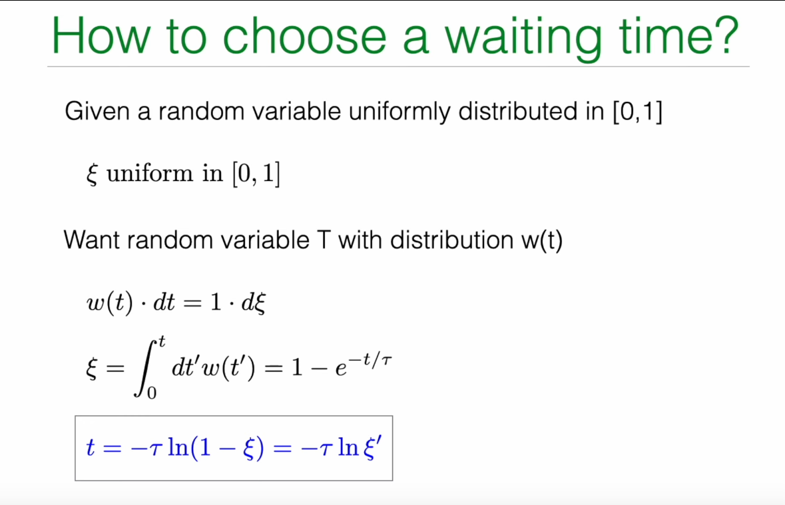
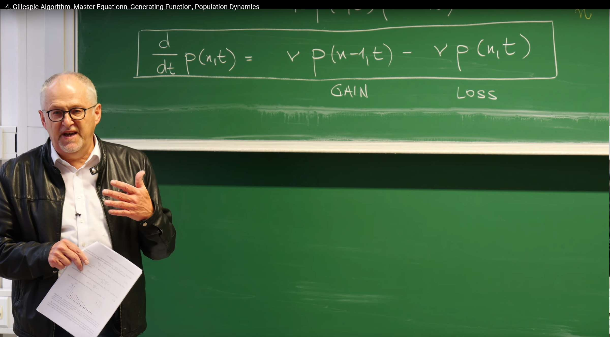

# 回顾：泊松过程及其模拟

在上一讲中，Erwin Frey 教授详细探讨了泊松过程，它描述了在连续时间中，事件以恒定平均速率发生的随机过程。本节课程从回顾泊松过程的核心数学特征开始，并以此为基础，引出更高级的随机过程模拟与分析方法。

## 等待时间分布与无记忆性

泊松过程的一个核心特征是其"**无记忆性**"（Memorylessness）。这意味着，下一个事件在未来某个时间段内发生的概率，与我们已经等待了多长时间无关。这种物理特性在数学上表现为事件之间的等待时间服从指数分布。

教授在黑板上回顾了描述这一特性的几个关键公式：


**存活概率 (Survival Probability) $S(t)$：**从任意时刻开始，等待时间超过 $t$ 仍未发生任何事件的概率。对于泊松过程，这个概率随时间指数衰减：

$$
S(t)=e^{-\nu t}
$$

其中 $\nu$ 是事件发生的恒定速率（rate）。

**等待时间累积分布函数 (Cumulative Distribution Function) $W(t)$：**等待时间小于等于 $t$ 的概率。它等于 1 减去存活概率：

$$
W(t)=1-S(t)=1-e^{-\nu t}
$$

**等待时间概率密度函数 (Probability Density Function) $w(t)$：**在时间 $t$ 附近一个极小时间窗 $dt$ 内发生事件的概率密度。它是累积分布函数的导数：

$$
w(t)=\frac{dW(t)}{dt}=\nu e^{-\nu t}
$$

这组公式是泊松过程的基石。指数形式的等待时间分布 $w(t)$ 直接体现了无记忆性。我们可以通过计算条件概率来验证这一点：假设在时间 $t_0$ 之前没有事件发生，那么在接下来的 $dt$ 时间内发生事件的条件概率是：

$$
P(t_0 < T \leq t_0 + dt \mid T > t_0) = \frac{w(t_0) \, dt}{S(t_0)} = \frac{\nu e^{-\nu t_0} \, dt}{e^{-\nu t_0}} = \nu \, dt
$$

这个结果与 $t_0$ 无关，表明无论我们已经等了多久，在下一个瞬间发生事件的概率始终是 $\nu dt$。

## 模拟的困境：固定时间步长法的局限

有了泊松过程的解析描述，一个自然而然的问题是：我们如何在计算机上模拟这样的过程？一个最直观的方法是**固定时间步长算法**(Fixed time step algorithm)。


该方法的思路如下：

1. 将时间离散化为一系列微小的时间步长 $\Delta t$。

2. 在每一个时间步长内，粒子有一定概率向前"跳跃"一步（即发生一次事件）。

3. 这个概率 $p_+$ 被设定为速率 $\nu$ 乘以时间步长 $\Delta t$，即 $p_+=\nu\Delta t$。

4. 相应地，在这一步长内不发生跳跃的概率为 $p_0=1-p_+=1-\nu\Delta t$。

然而，这种看似简单的方法存在着深刻的理论缺陷和实际操作上的困难：

- **精度问题**：该方法成立的前提是 $\nu\Delta t\ll 1$，即在一个时间步长内发生事件的概率必须非常小。如果 $\Delta t$ 不够小，这个近似就不再成立。更严重的是，它完全忽略了在一个 $\Delta t$ 内发生两次或更多次事件的可能性（其概率正比于 $(\nu\Delta t)^2$ 或更高阶项）。

- **效率问题**：如果事件发生的速率 $\nu$ 非常小，那么在绝大多数时间步长内，系统都处于"什么也没发生"的状态 ($p_0\approx 1$)。计算机会花费大量时间模拟这些"无事件"的步骤，效率极低。

- **正确性问题**：该方法引入了人为的时间网格，迫使事件只能在 $k\cdot\Delta t$（$k$ 为整数）这些离散的时间点上发生，这与真实泊松过程中事件可以发生在任意连续时间的特性相悖。

这些局限性促使我们去寻找一种更精确、更高效的模拟方法，这便是本讲的核心内容之一——**Gillespie 算法**。

# 1. Gillespie 算法：一种精确的随机模拟方法

Gillespie 算法（吉莱斯皮算法），又称随机模拟算法 (Stochastic Simulation Algorithm, SSA)，是一种**事件驱动 (event-driven)** 的方法，它完全摒弃了固定时间步长的概念。其核心思想不是问**在下一个 $\Delta t$ 内是否会发生事件？**，而是直接问**下一个事件将在何时发生？**。通过直接从理论上正确的等待时间分布中抽取随机数，该算法能够精确地模拟随机过程的每一个事件，因此它是一种"**精确**"的模拟方法，其结果在统计意义上与理论解析解完全一致。

## 1.1 核心思想：逆变换采样



Gillespie 算法的基石是如何生成一个服从特定概率分布（在这里是指数分布 $w(t)=\nu e^{-\nu t}$）的随机数。这需要借助一种强大的统计学技巧——**逆变换采样**(Inverse Transform Sampling)。

其原理如下：

1.我们有一个目标概率密度函数 $w(t)$，以及它对应的累积分布函数 $W(t)=\int_0^t w(t')dt'$。

2.我们还拥有一个能够在 $[0, 1]$ 区间内生成均匀分布随机数的工具，我们称这个随机数为 $\xi$。

3.核心的等式是概率守恒：在 t 附近 dt 范围内的概率 w(t)dt 应该等于在 ξ 附近 dξ 范围内的概率 1⋅dξ。即：

$$
w(t)dt=d\xi
$$

4.对这个等式两边从 0 到 t 进行积分，左边得到累积分布函数 W(t)，右边得到 ξ：

$$
\xi=\int_0^t w(t')dt'=W(t)
$$

5.对于泊松过程，我们有 $W(t)=1-e^{-\nu t}$，所以：

$$
\xi=1-e^{-\nu t}
$$

6.现在，我们的目标是根据已知的 $\xi$ 来求解 $t$。通过简单的代数变换，我们可以得到 $t$ 的表达式：

$$
e^{-\nu t}=1-\xi
$$

$$
-\nu t=\ln(1-\xi)
$$

$$
t=-\frac{1}{\nu}\ln(1-\xi)
$$

7.**这里有一个巧妙的简化：**因为 $\xi$ 是在 $[0, 1]$ 区间内均匀分布的随机数，那么 $1-\xi$ 同样也是在 $[0, 1]$ 区间内均匀分布的随机数。因此，我们可以用另一个均匀随机数 $\xi'$ 来代替 $1-\xi$，从而得到最终的采样公式：

$$
t=-\frac{1}{\nu}\ln(\xi')
$$

在讲座笔记中，教授使用了特征时间 $\tau=1/\nu$ 来表示，公式写作 $t=-\tau\ln(\xi)$。

这个推导过程不仅给出了泊松过程等待时间的生成方法，更重要的是它揭示了一个普适的原理：**要从任意概率分布中抽样，只需先生成一个 $[0, 1]$ 上的均匀随机数 $\xi$，然后计算其累积分布函数的反函数 $W^{-1}(\xi)$ 即可**。

## 1.2 泊松过程的 Gillespie 算法步骤

基于上述原理，模拟泊松过程的 Gillespie 算法可以被清晰地总结为以下三步循环：

1.**初始化**：设定初始时间 $T=0$，初始位置（事件发生次数）$n=0$。

2.抽取等待时间：

   a. 生成一个在 $[0, 1]$ 区间内均匀分布的随机数 $\xi$。

   b. 根据公式 $t=-\frac{1}{\nu}\ln(\xi)$ 计算下一次事件发生的等待时间 $t$。

4.更新系统状态：

   a. 将当前时间向前推进 $t$：$T \leftarrow T+t$。

   b. 事件发生次数加一：$n \leftarrow n+1$。

5.**循环**：重复步骤 2 和 3，直到模拟时间 $T$ 达到预设的终止时间。

这种事件驱动的模拟方式，其时间步长 $t$ 本身就是随机的，完美地复现了随机过程的内在不确定性。它既精确又高效，因为计算机只在事件真正发生时才进行计算。


## 1.3 Python 代码实现

下面是一个使用 Python 实现 Gillespie 算法来模拟泊松过程的示例代码。代码会生成并复现PPT所示的轨迹。

```python
import numpy as np
import matplotlib.pyplot as plt

def gillespie_poisson(nu, t_max):
    """
    Simulate a Poisson process using the Gillespie algorithm.

    Parameters:
    nu (float): Event rate.
    t_max (float): Total simulation time.

    Returns:
    tuple: Two lists containing event times and corresponding event counts.
    """
    # Initialization
    t = 0.0  # Current time
    n = 0    # Current event count

    # Lists to store trajectory
    times = [t]
    counts = [n]
    
    # Simulation loop until maximum time is reached
    while t < t_max:
        # 1. Draw a uniform random number from (0, 1]
        #    Note: xi cannot be 0 because log(0) is negative infinity.
        #    np.random.random() generates random numbers in (0, 1), which meets the requirement.
        xi = np.random.random()
        
        # 2. Calculate waiting time according to the formula
        dt = -1.0/nu * np.log(xi)
        
        # 3. Update time and count
        t += dt
        n += 1
        
        # 4. Record trajectory point
        times.append(t)
        counts.append(n)
        
    return times, counts

# --- Simulation and plotting ---
# Set parameters
nu = 1.0      # Event rate
t_max = 100   # Total simulation time
num_traj = 10 # Number of simulated trajectories

# Create figure with two subplots
plt.figure(figsize=(15, 6))

# Left subplot: Single trajectory
plt.subplot(1, 2, 1)
times, counts = gillespie_poisson(nu, t_max)
plt.step(times, counts, where='post', linewidth=1.5, color='blue')
# Add theoretical expectation line (straight line y = 谓t)
t_theory = np.linspace(0, t_max, 100)
n_theory = nu * t_theory
plt.plot(t_theory, n_theory, 'k--', linewidth=2)
plt.xlabel('Time ($t$)')
plt.ylabel('Event Count ($x$)')
plt.title('Single Trajectory')
plt.grid(True, alpha=0.3)

# Right subplot: Multiple trajectories
plt.subplot(1, 2, 2)
for i in range(num_traj):
    times, counts = gillespie_poisson(nu, t_max)
    plt.step(times, counts, where='post', linewidth=1.5, alpha=0.7)

# Add theoretical expectation line (straight line y = 谓t)
t_theory = np.linspace(0, t_max, 100)
n_theory = nu * t_theory
plt.plot(t_theory, n_theory, 'k--', linewidth=2, label='Expected $\\nu t$')

# Set chart properties
plt.xlabel('Time ($t$)')
plt.ylabel('Event Count ($x$)')
plt.title('Multiple Trajectories')
plt.grid(True, alpha=0.3)
plt.legend()

plt.tight_layout()
plt.show()
```


# 2. 主方程：概率分布的确定性演化

虽然 Gillespie 算法能够生成单条随机轨迹，但要理解整个随机过程的统计特性，我们需要一个更宏观的描述工具。这就是主方程 (Master Equation)。主方程描述的是系统处于各个可能状态的概率如何随时间演化，它是一个确定性的微分方程。

主方程的历史可以追溯到20世纪初，由物理学家马克斯·玻恩(Max Born)和维尔纳·海森堡(Werner Heisenberg)等人在量子力学和统计物理的研究中首次提出。其核心思想是将微观的随机过程转化为宏观的概率演化描述，从而能够系统地分析随机系统的整体行为特征。

**主方程方法的基本原理是概率守恒：系统在某一时刻处于特定状态的概率变化率等于流入该状态的概率流减去流出该状态的概率流。这种"增益-损失"的平衡思想不仅适用于物理系统，也广泛应用于化学反应、生物种群动力学、金融建模等众多领域。**

在具体应用方面，主方程特别适用于处理具有离散状态空间的马尔可夫过程。例如：

- 在化学反应中，描述反应物分子数随时间变化的概率分布

- 在生物种群动力学中，刻画种群大小的概率演化过程

- 在传染病模型中，分析易感者、感染者和康复者数量的概率分布

- 在金融领域，用于建模资产价格变动的概率特征

与Gillespie算法相比，主方程提供了一种更为系统和全面的分析框架。**Gillespie算法关注单条轨迹的随机演化，而主方程关注整个概率分布的确定性演化。**两者相辅相成，共同构成了随机过程分析的重要工具集。

对于初学者，需要区分主方程与之后介绍的平均场自洽方程。两者在数学结构和物理意义上都有本质区别，不应混淆。两者在数学结构和物理意义上都有本质区别，不应混淆。

自洽方程与主方程的区别在于：主方程描述的是概率分布的时间演化，而自洽方程关注的是系统稳态解的内部一致性。

- **主方程**：描述概率分布的时间演化，形式为 $\frac{d}{dt}p(n,t) = \text{增益项} - \text{损失项}$，关注的是整个系综(ensemble)的统计行为。

- **自洽方程**：通常指形如 $x = f(x)$ 的方程，其中未知量$x$同时出现在方程的两边，要求解必须与自身保持一致。在物理中常见于平均场近似，如 $m = \tanh(\beta(Jm + h))$ 这样的自洽方程，其中磁化强度$m$通过自身的值来确定。


## 2.1 从微观过程到宏观演化

让我们回到泊松过程的微观描述。在推导 Gillespie 算法时，我们考虑在时间 $t+dt$ 时系统处于状态 $n$（即发生了 $n$ 次事件）的概率 $p(n, t+dt)$。要达到这个状态，只有两种可能的前置路径：

1.在时间 $t$ 时，系统已经处于状态 $n-1$，然后在接下来的 $dt$ 时间内发生了一次跳跃。这次跳跃的概率是 $\nu dt$。因此，这条路径的贡献是 $p(n-1, t) \cdot \nu dt$。

2.在时间 $t$ 时，系统已经处于状态 $n$，然后在接下来的 $dt$ 时间内没有发生跳跃。不发生跳跃的概率是 $1 - \nu dt$。因此，这条路径的贡献是 $p(n, t) \cdot (1 - \nu dt)$。

将这两种互斥情况的概率相加，我们就得到了 $p(n, t+dt)$ 的表达式：

$$p(n, t+dt) = p(n-1, t) \cdot \nu dt + p(n, t) \cdot (1 - \nu dt)$$

接下来，我们对这个方程进行整理：

$$p(n, t+dt) - p(n, t) = \nu p(n-1, t) dt - \nu p(n, t) dt$$

$$\frac{p(n, t+dt) - p(n, t)}{dt} = \nu p(n-1, t) - \nu p(n, t)$$

当 $dt \to 0$ 时，左边就是 $p(n, t)$ 对时间的导数。于是，我们得到了泊松过程的主方程：

$$\frac{d}{dt} p(n, t) = \nu p(n-1, t) - \nu p(n, t)$$

这个方程对于所有 $n \ge 1$ 成立。对于 $n=0$ 的特殊情况，由于不存在 $n=-1$ 的状态，系统只能从状态 0 离开，而不能进入。因此，其方程为：

$$\frac{d}{dt} p(0, t) = -\nu p(0, t)$$

## 2.2 增益-损失 (Gain-Loss) 诠释

主方程的结构具有非常清晰的物理意义，它可以被看作是每个状态 $n$ 上的概率流的平衡方程：

$$\frac{d}{dt} p(n, t) = \underbrace{\nu p(n-1, t)}_{\text{GAIN}} - \underbrace{\nu p(n, t)}_{\text{LOSS}}$$

- **增益项 (GAIN)：**$\nu p(n-1, t)$ 代表从状态 $n-1$ 流入状态 $n$ 的概率通量。其大小等于源状态的概率 $p(n-1, t)$ 乘以转移速率 $\nu$。

- **损失项 (LOSS)：**$\nu p(n, t)$ 代表从状态 $n$ 流出到状态 $n+1$ 的概率通量。其大小等于当前状态的概率 $p(n, t)$ 乘以离开该状态的总速率 $\nu$。




这种"增益-损失"的结构是所有主方程的共同特征。它本质上是在离散状态空间上的一个**连续性方程**，描述了概率"密度"$p(n, t)$ 的变化率等于流入和流出该状态的概率"流"的净差额。这也保证了总概率守恒，即 $\frac{d}{dt} \sum_n p(n, t) = 0$。

## 2.3 从随机轨迹到确定性演化

这里我们看到了一个深刻的观念转变。Gillespie 算法模拟的是一条随机的、不可预测的路径 $n(t)$。而主方程则是一个**确定性的微分方程组**，它的解 $p(n, t)$ 是一个平滑、可预测的函数。

这两者之间的联系在于：主方程描述的是由无限多个 Gillespie 轨迹构成的**系综 (ensemble)** 的统计行为。如果我们运行无数次 Gillespie 模拟，然后在某个固定的时间 $t$ 统计所有模拟结果中 $n$ 的值的分布直方图，那么这个直方图的形状就会趋近于主方程的解 $p(n, t)$。因此，主方程将微观的随机性与宏观概率的确定性演化联系了起来。

在讲座的稍后部分，教授还展示了主方程的矩阵形式：

$$\frac{d}{dt} \vec{p}(t) = W \vec{p}(t)$$

其中 $\vec{p}(t)$ 是一个列向量，其元素为 $[p(0,t), p(1,t), \dots]^T$，$W$ 是一个**转移速率矩阵** (transition rate matrix)。这种形式揭示了主方程本质上是一个线性常微分方程组，为使用线性代数的工具（如特征值分解）来求解系统动力学开辟了道路。

# 3. 用生成函数求解主方程

主方程虽然形式优美，但它是一个无限维的耦合常微分方程组，直接求解通常非常困难。为了解决这个问题，数学物理中发展出了一种强大的工具——**生成函数** (Generating Function)。

## 3.1 生成函数的定义与转换

生成函数的核心思想是将一个无穷序列的概率 $p(0,t), p(1,t), \dots$ 编码到一个单一的函数 $G(s, t)$ 中。其定义为：

$$G(s, t) = \sum_{n=0}^{\infty} p(n, t) s^n$$

这里的变量 $s$ 是一个辅助变量，没有直接的物理意义，但它像一个"账本"，$s^n$ 的系数就是我们关心的概率 $p(n, t)$。

生成函数的魔力在于它能将主方程中的差分运算（如 $p(n-1, t)$）转化为代数运算。我们将主方程 $\frac{d}{dt} p(n, t) = \nu p(n-1, t) - \nu p(n, t)$ 的两边同时乘以 $s^n$，然后对所有 $n$ 求和：

$$\sum_{n=0}^{\infty} \frac{d}{dt} p(n, t) s^n = \sum_{n=0}^{\infty} \nu p(n-1, t) s^n - \sum_{n=0}^{\infty} \nu p(n, t) s^n$$

我们逐项来处理这个方程：

- **左边**：由于求和与求导可以交换次序，我们得到 

$$
\frac{d}{dt} \sum_{n=0}^{\infty} p(n, t) s^n = \frac{dG(s, t)}{dt}
$$

- **右边第二项**：

$$
\sum_{n=0}^{\infty} \nu p(n, t) s^n = \nu \sum_{n=0}^{\infty} p(n, t) s^n = \nu G(s, t)
$$

- **右边第一项**：这是最关键的一步。我们做一个变量代换，令 $m=n-1$，则 $n=m+1$。

$$
\sum_{n=1}^{\infty} \nu p(n-1, t) s^n = \nu \sum_{m=0}^{\infty} p(m, t) s^{m+1} = \nu s \sum_{m=0}^{\infty} p(m, t) s^m = \nu s G(s, t)
$$

（注意求和从 $n=1$ 开始，因为 $p(-1,t)=0$）

将这三项合并，我们成功地将无限维的常微分方程组转化为了一个**单变量偏微分方程**：

$$
\frac{dG(s, t)}{dt} = \nu s G(s, t) - \nu G(s, t) = \nu(s-1) G(s, t)
$$

## 3.2 求解与结果还原

这个关于 $G(s,t)$ 的方程是一个简单的一阶线性常微分方程（对于固定的 $s$），我们可以直接积分求解。首先，我们需要一个初始条件。通常，我们假设系统在 $t=0$ 时从 $n=0$ 开始，即 $p(n, 0) = \delta_{n,0}$（当 $n=0$ 时为 1，否则为 0）。这个初始条件在生成函数空间中对应为：

$$
G(s, 0) = \sum_{n=0}^{\infty} p(n, 0) s^n = p(0, 0) s^0 = 1
$$

现在求解微分方程 $\frac{dG}{G} = \nu(s-1) dt$，从 $t=0$ 到 $t$ 积分，得到：

$$\ln(G(s, t)) - \ln(G(s, 0)) = \nu(s-1)t$$

$$\ln(G(s, t)) = \nu(s-1)t$$

$$G(s, t) = e^{\nu t(s-1)}$$

我们已经求得了生成函数的解析表达式。最后一步是如何从 $G(s,t)$ 中"解码"出我们想要的 $p(n,t)$。根据泰勒展开的定义，$p(n,t)$ 正是 $G(s,t)$ 在 $s=0$ 点的泰勒展开式中 $s^n$ 项的系数除以 $n!$。一个更直观的方法是直接对 $G(s,t)$ 进行展开：

$$G(s, t) = e^{\nu t s} e^{-\nu t} = e^{-\nu t} \sum_{n=0}^{\infty} \frac{(\nu t s)^n}{n!} = \sum_{n=0}^{\infty} \left[ e^{-\nu t} \frac{(\nu t)^n}{n!} \right] s^n$$

通过将这个展开式与生成函数的定义 $G(s, t) = \sum_{n=0}^{\infty} p(n, t) s^n$ 进行逐项比较，我们立刻可以得到主方程的解：

$$p(n, t) = e^{-\nu t} \frac{(\nu t)^n}{n!}$$

这正是我们熟悉的**泊松分布**，其均值为 $\lambda = \nu t$。

## 3.3 生成函数的威力：计算矩

生成函数不仅能用来求解概率分布，它还是一个强大的"矩生成机器"。我们可以通过对 $G(s,t)$ 求导来方便地计算分布的各阶矩。

- **平均值 $\langle n(t) \rangle$：**

$$
\langle n(t) \rangle = \sum_{n=0}^{\infty} n \cdot p(n, t)
$$

注意到 $\frac{\partial G}{\partial s} = \sum n \cdot p(n,t) s^{n-1}$。因此，

$$
\langle n(t) \rangle = \left. \frac{\partial G(s, t)}{\partial s} \right|_{s=1} = \left. \nu t e^{\nu t(s-1)} \right|_{s=1} = \nu t
$$

- **方差 $\text{Var}[n(t)]$：**

方差的计算需要二阶矩。我们可以先计算 $\langle n(n-1) \rangle = \left. \frac{\partial^2 G(s, t)}{\partial s^2} \right|_{s=1} = (\nu t)^2$

然后利用公式 $\text{Var}(n) = \langle n^2 \rangle - \langle n \rangle^2 = \langle n(n-1) \rangle + \langle n \rangle - \langle n \rangle^2$：

$$
\text{Var}[n(t)] = (\nu t)^2 + \nu t - (\nu t)^2 = \nu t
$$

这两个结果 $\langle n(t) \rangle = \nu t$ 和 $\text{Var}[n(t)] = \nu t$ 是泊松分布的标志性特征，现在我们通过生成函数这一系统性方法再次得到了它们。

# 4. 应用：种群动力学简介

到目前为止，我们讨论的所有内容都围绕着速率恒定的泊松过程。然而，主方程框架的强大之处在于其普适性。通过改变转移速率的函数形式，我们可以用它来描述各种各样更复杂的随机过程。讲座的最后一部分，教授通过一个**种群动力学 (Population Dynamics)** 的例子来展示这一点。

## 4.1 简单死亡过程

考虑一个最简单的模型：**简单死亡过程** (Simple Death Process)。这个过程可以用一个类似化学反应的式子来表示：

$$A \xrightarrow{\lambda} \varnothing$$

这表示物种 $A$ 的个体以一定的速率死亡或从系统中消失。这里的关键是 $\lambda$ 的物理意义：它是**人均死亡速率** (per capita death rate)。

这意味着，如果系统中当前有 $n$ 个个体，那么整个种群的**总死亡速率**是 $n \cdot \lambda$。这是一个至关重要的区别：转移速率不再是一个常数，而是依赖于系统当前的状态 $n$。这种**状态依赖的速率** (state-dependent rates) 是随机建模中非常普遍且重要的概念。

## 4.2 死亡过程的主方程

我们可以再次运用"增益-损失"的逻辑来构建该过程的主方程。我们关心的是在时间 $t$ 种群大小为 $n$ 的概率 $p(n,t)$。

- **增益项 (GAIN)：**要使系统在 $t$ 时刻达到状态 $n$，它必须是从状态 $n+1$ 经过一次死亡事件而来。当种群大小为 $n+1$ 时，总死亡速率是 $(n+1)\lambda$。因此，从状态 $n+1$ 流入状态 $n$ 的概率通量是 $\lambda (n+1) p(n+1, t)$。


- **损失项 (LOSS)：**如果系统当前处于状态 $n$，它会因为发生死亡事件而离开此状态。此时的总死亡速率是 $n\lambda$。因此，从状态 $n$ 流出的概率通量是 $\lambda n p(n, t)$。

将增益和损失项组合起来，我们得到简单死亡过程的主方程：

$$\frac{d}{dt} p(n, t) = \lambda (n+1) p(n+1, t) - \lambda n p(n, t)$$

这个方程的结构与泊松过程的主方程类似，但转移速率从常数 $\nu$ 变成了依赖于状态的 $n\lambda$。这一个简单的改变，使得模型的动力学行为发生了质的变化。

## 4.3 随机模型 vs. 确定性模型

值得注意的是，与这个随机模型相对应的确定性模型是微分方程 $\frac{dN}{dt} = -\lambda N$，其解为指数衰减 $N(t) = N_0 e^{-\lambda t}$。

主方程描述的随机模型提供了比确定性模型丰富得多的信息：

- 它不仅能给出平均种群大小的演化（可以证明 $\langle n(t) \rangle = n_0 e^{-\lambda t}$，与确定性模型一致），还能描述种群大小在平均值附近的**涨落** (fluctuations)。

- 更重要的是，它能计算**灭绝概率** (extinction probability)，即 $p(0,t)$。这是一个纯粹的随机现象，在确定性模型中，种群大小只会渐近于零而永远不会真正达到零。对于小种群，这种由随机性导致的灭绝是至关重要的动力学特征。

## 4.4 Python 代码实现：Gillespie 模拟死亡过程

我们可以修改之前的 Gillespie 算法来模拟这个状态依赖的死亡过程。唯一的关键改动是在计算等待时间时，使用的速率不再是常数，而是当前种群大小 $n$ 的函数。
```python
import numpy as np
import matplotlib.pyplot as plt

def gillespie_death_process(lam, n0, t_max):
    """
    Simulate a simple death process using the Gillespie algorithm.

    Parameters:
    lam (float): Per capita death rate.
    n0 (int): Initial population size.
    t_max (float): Total simulation time.

    Returns:
    tuple: Two lists containing event times and corresponding population sizes.
    """
    # Initialization
    t = 0.0
    n = n0
    
    times = [t]
    counts = [n]
    
    while t < t_max and n > 0:
        # Key difference: Rate depends on state
        rate = lam * n
        
        # Draw waiting time
        xi = np.random.random()
        dt = -1.0 / rate * np.log(xi)
        
        # Update time
        t += dt
        
        # Check if exceeding maximum time
        if t >= t_max:
            # If exceeding maximum time, record final state and exit
            times.append(t_max)
            counts.append(n)
            break
            
        # Record state before event occurs
        times.append(t)
        counts.append(n)
        
        # Update population size (one individual dies)
        n -= 1
        
        # Record state after event occurs
        times.append(t)
        counts.append(n)
            
    # If extinction occurs before t_max, extend trajectory to t_max
    if t < t_max and n == 0:
        times.append(t_max)
        counts.append(0)

    return times, counts

# --- Simulation and plotting ---
# Set parameters
lam = 0.1     # Per capita death rate
n0 = 50       # Initial population size
t_max = 50    # Total simulation time
num_traj = 5  # Simulate 5 trajectories

# Create figure
plt.figure(figsize=(12, 7))

# Plot multiple trajectories to show randomness
for i in range(num_traj):
    times, counts = gillespie_death_process(lam, n0, t_max)
    plt.step(times, counts, where='post', label=f'Trajectory {i+1}')

# Plot deterministic model solution for comparison
t_deterministic = np.linspace(0, t_max, 200)
n_deterministic = n0 * np.exp(-lam * t_deterministic)
plt.plot(t_deterministic, n_deterministic, 'k--', linewidth=2, label='Deterministic Model ($N_0 e^{-\lambda t}$)')

plt.xlabel('Time (t)')
plt.ylabel('Population Size (n)')
plt.title('Simple Death Process: Stochastic vs. Deterministic')
plt.grid(True)
plt.legend()
plt.show()
```


运行这段代码，会看到多条彩色的阶梯状曲线，每一条都代表一次模拟的随机历史。你会发现，尽管它们的总体趋势是下降的，但具体的下降时间和最终的灭绝时间（曲线接触横轴的时刻）都是随机的。黑色的虚线代表确定性模型的解，它描绘了所有随机轨迹的平均行为。这个对比鲜明地展示了随机模型所能捕捉到的丰富动态。

# 总结

此节课带领我们从三个互补的视角深入理解了随机过程：Gillespie 算法、主方程和生成函数。这三者共同构成了一个强大而完备的理论与计算框架。

1. **Gillespie 算法**：提供了一种**数值模拟**的视角。它是一种事件驱动的精确算法，能够生成随机过程的单条具体轨迹，让我们直观地看到随机性是如何展现的。

2. **主方程**：提供了一种**概率演化**的视角。它是一个确定性的微分方程，描述了系统处于各个可能状态的概率如何随时间演化，捕捉了整个随机过程系综的统计规律。

3. **生成函数**：提供了一种**解析求解**的视角。它是一种强大的数学工具，能将复杂的主方程（无限维微分方程组）转化为简单的单一方程，从而求得概率分布的解析解，并方便地计算其各阶矩。

这三种方法各有侧重，共同为我们分析从物理学中的粒子运动到生物学中的种群动态等各种随机现象提供了坚实的基础。

通过引入状态依赖的速率，我们已经初步窥见了如何将这一框架应用于更复杂的系统，如化学反应网络和更真实的生态模型