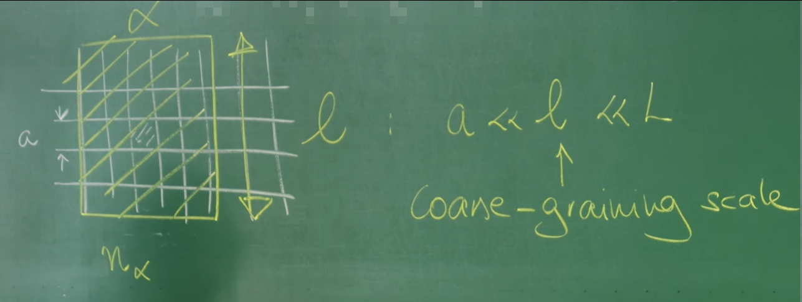

# 引言：统一之路的终点——构建相互作用系统的随机场论

作为系列课程的终章，这节课将汇集先前所有探索的成果，标志着从离散随机过程抵达强大连续场论的统一终点。这节课将之前发展的概念与工具融会贯通，旨在构建一个能够描述**复杂系统中集体行为的统一理论框架。**

整个理论的基石是描述粒子数变化的离散**主方程**（第34、35讲）。为了处理主方程，两条通往场论的道路被开辟出来：一是基于算符代数的**相干态路径积分**（第36讲），二是通过**克莱默-莫亚尔展开**（第37讲）搭建的、从离散跳跃通往连续朗之万方程的桥梁。上一讲（第39讲）正是沿着后一条路径，为简单的空间扩散过程建立了包含内禀涨落的**克莱默-莫亚尔路径积分（KMPI）**，为这节课的工作奠定了坚实的基础。

这节收官之课旨在完成两个核心目标：

1.  将化学反应动力学整合进上一讲建立的扩散场论框架中，从而统一描述粒子在空间中的**运动**和数量上的**增减**。

2.  实现整个课程最重要的目标之一：从第一性原理出发，推导出一个描述**相互作用粒子系统**的随机场论。届时将深刻揭示，微观粒子间的相互作用力是如何在宏观尺度上催生出**模式形成 (pattern formation)** 的**涌现**现象。

更进一步，这节课将展示克莱默-莫亚尔路径积分不仅是一个计算工具，更是一种系统性的**理论构建机器**。它能够接收微观随机规则（如粒子跳跃、化学反应、相互作用）作为输入，并系统性地输出一个描述系统宏观动力学的有效作用量（action）$S[n, i\tilde{n}]$。理解这一点，意味着掌握了一种从微观构建宏观的研究方法论。


# 1. 回顾：无相互作用布朗粒子的作用量

为了构建一个能够描述化学反应与粒子间相互作用的复杂理论，必须从一个坚实且清晰的起点开始。这个起点，正是上一讲（第39讲）通过克莱默-莫亚尔路径积分（KMPI）方法，为大量无相互作用的布朗粒子集体行为推导出的场论作用量。这个作用量是KMPI方法应用于空间扩散过程的直接成果，它将构成这节课所有理论扩展的基础。

其形式如下：

$$
S[n, i\tilde{n}] = \int_{t_0}^{t_f} dt \int d^d x \left\{ i\tilde{n} \partial_t n - Dn \left[ \nabla^2 (i\tilde{n}) + (\nabla i\tilde{n})^2 \right] \right\}
$$

这个作用量编码了纯扩散过程的全部信息，包括其确定性行为和随机涨落。为了深刻理解它，需要对每一项进行细致的物理剖析：

**$i\tilde{n} \partial_t n$**：这是标准的**动力学项**，在场论中扮演着类似于经典力学里 $p\dot{q}$ 的角色。它在数学上将**粒子密度场 $n(\vec{r},t)$** 和与之共轭的**响应场 $i\tilde{n}(\vec{r},t)$** 确立为动力学变量，从而定义了理论的时间演化结构。

**$-Dn\nabla^2(i\tilde{n})$**：这一项代表了**确定性的扩散过程**。通过分部积分，它可以被改写为更直观的形式 $i\tilde{n} (D \nabla^2 n)$。在路径积分的框架下，对响应场 $i\tilde{n}$ 求变分会得到系统的“经典”运动方程（鞍点方程）。这一项恰好会生成菲克第二定律（Fick's second law）中的扩散项 $D\nabla^2 n$，描述了粒子密度如何因浓度梯度而趋于均匀的宏观、平均行为。


**$-Dn(\nabla i\tilde{n})^2$** ：这是整个作用量中最为关键的项，它是系统**随机性**的唯一来源，也是KMPI方法与Doi-Peliti方法推导结果的核心区别所在。这一项在响应场 $i\tilde{n}$ 中是二次的，这正是高斯噪声在路径积分表示中的典型特征。


**物理意义** : 它的物理意义是**扩散噪声**或**散粒噪声 (shot noise)** 。

**乘性噪声** : 前面的系数 $Dn$ 表明噪声强度与局部粒子密度 $n$ 成正比。这非常符合物理直觉：粒子越多的地方，由粒子离散跳跃引起的随机涨落自然也越大。这种与状态变量（密度 $n$）相关的噪声，被称为**乘性噪声 (multiplicative noise)** ，在第22讲介绍过。

这个作用量在数学上完全等价于一个随机偏微分方程（SPDE），即一个场论版本的朗之万方程：

$$
\partial_t n(\vec{r},t) = D \nabla^2 n(\vec{r}, t) + \nabla \cdot \left[ \sqrt{2D n(\vec{r}, t)} \, \vec{\eta}(\vec{r}, t) \right]
$$

其中 $\vec{\eta}(\vec{r},t)$ 是一个时空高斯白噪声场。路径积分的威力在于，它提供了一个对所有可能的噪声历史 $\vec{\eta}$ 进行加权平均的系统性方法。上述作用量中的 $-Dn(\nabla i\tilde{n})^2$ 项，正是对这个具有 $\sqrt{n}$ 依赖性的乘性噪声项的精确编码。

# 2. 扩展场论：引入化学反应

有了描述粒子纯粹空间运动的场论框架后，一个自然且关键的步骤便是引入粒子数量本身的变化，即**化学反应**。这节课将展示，在上一节建立的克莱默-莫亚尔路径积分（KMPI）框架具有强大的通用性，能够以一种系统性的方式，将局域的化学反应与空间扩散无缝地统一起来。

## 2.1 从微观组合到宏观反应速率

考虑一个发生在空间中某处的普通化学反应：$k$ 个 A 粒子以微观速率 $\lambda'$ 转化为 $\ell$ 个 A 粒子。

$$
kA \xrightarrow{\lambda'} \ell A
$$


为了将其纳入连续的场论框架，需要进行一个关键的物理步骤：**粗粒化 (coarse-graining)** 。首先，如下图所示，将空间划分为许多边长为 $a$ 的微小晶格单元，体积为 $a^d$。然后在比 $a$ 大得多但比整个系统 $L$ 小得多的介观尺度 $l$ 上进行平均。



假设在第 $i$ 个晶格中，有 $n_i$ 个粒子。那么，发生上述反应的微观速率正比于从 $n_i$ 个粒子中选出 $k$ 个不同粒子的组合数，即所谓的下降阶乘幂：

微观速率 $\propto \lambda' n_i(n_i - 1) \cdots (n_i - k + 1)$

现在，定义连续的粒子密度场 $n(\vec{r},t) = n_i / a^d$。在取连续极限（$a \to 0$）的过程中，一个核心的物理假设是，每个粗粒化的晶格单元内仍然包含大量粒子，即 $n_i \gg k$。在这种情况下，离散的组合数因子就可以很好地近似为一个简单的幂律形式：

$$
\lambda' n_i(n_i - 1) \cdots (n_i - k + 1) \approx \lambda' n_i^k = \lambda' (a^d n)^k = (\lambda' a^{d(k-1)})(a^d n^k)
$$


为了得到一个在连续极限下有良好定义的宏观反应速率 $\lambda$，需要将所有与晶格大小相关的因子吸收到新的速率常数中，即 $\lambda = \lambda' a^{d(k-1)}$。这样，宏观的反应速率密度就正比于 $n(\vec{r},t)^k$。这正是化学动力学中著名的**质量作用定律 (law of mass action)** 。这个从离散组合到连续幂律的转变，是连接微观随机性与宏观确定性动力学的核心步骤。

## 2.2 反应-扩散作用量与涨落的起源

遵循在第37讲中为跳跃过程建立的KMPI“配方”，描述上述反应过程在作用量中的贡献项可以被系统性地构建出来。将这个新项加入到上一节的扩散作用量中，便得到了一个更完备的**反应-扩散系统**的作用量：

$$
S[n, i\tilde{n}] =\int d^d x \, dt \left\{ i\tilde{n} (\partial_t - D \nabla^2) n - D n (\nabla i \tilde{n})^2 - \lambda n^k \left( e^{i\tilde{n}(\ell-k)} - 1 \right) \right\}
$$


新增的最后一项 $S_{\text{react}} = -\int \lambda n^k \left( e^{i\tilde{n}(\ell-k)} - 1 \right)$ 包含了反应过程的所有信息。

这个指数形式的结构 $e^{i\tilde{n}\Delta N} - 1$ 是路径积分中描述**粒子数跳跃过程**的通用“指纹”，其中 $\Delta N = \ell - k$ 是每次反应事件中粒子数的净变化量。为了揭示其深刻的物理内涵，可以对其进行泰勒展开，这在本质上是一次系统的Kramers-Moyal展开：

$$
\lambda n^k \left( e^{i\tilde{n}(\ell-k)} - 1 \right) \approx \lambda n^k \left[ i\tilde{n}(\ell - k) + \frac{1}{2} (i\tilde{n}(\ell - k))^2 + \cdots \right]
$$

这个展开揭示了反应过程对系统动力学的双重贡献：

* **一阶项 (漂移项)**: 对应于作用量中的 $- \lambda n^k (\ell - k) i\tilde{n}$。这一项在响应场 $i\tilde{n}$ 中是线性的，它在变分后会生成确定性的反应动力学方程，即 $\partial_t n = \cdots + \lambda (\ell - k) n^k$，这正是质量作用定律的微分形式。它描述了反应过程的**平均效果**或**确定性漂移**。

* **二阶项 (噪声项)**: 对应于作用量中的 $-\frac{1}{2} \lambda n^k (\ell - k)^2 (i\tilde{n})^2$。这一项在响应场 $i\tilde{n}$ 中是二次的，它则编码了反应过程的**随机性**。这种源于单次反应事件离散性的涨落，被称为**人口噪声 (demographic noise)** 或**反应噪声**。噪声的强度正比于反应速率 $\lambda n^k$，这同样符合物理直觉：反应越快、越频繁，由单次事件的随机性所带来的涨落就越显著。

至此，KMPI路径积分方法再次展示了其优雅之处：一个简洁的指数项，便将**确定性反应速率**（一阶矩）和**随机的人口噪声**（二阶矩）统一在了一起，为描述真实的、涨落的反应-扩散系统提供了第一性的理论基础。

# 3. 构建相互作用粒子的场论

这节课的核心，也是整个课程的高潮，在于将前两节建立的反应-扩散框架，提升到一个能够描述**相互作用粒子系统**的全新高度。至此，粒子不再是独立的“幽灵”，它们将通过相互作用力“感知”彼此的存在。这个最终的、也是最关键的步骤，将使理论能够从第一性原理出发，预测由粒子间吸引或排斥所导致的聚集、分离等复杂的**集体现象 (collective phenomena)** 。

## 3.1 微观模型：让粒子“感受”彼此

为了让场论能够描述相互作用，必须从一个包含了相互作用物理的微观模型出发。这个模型建立在一个离散的空间格点上，其核心物理输入在于，粒子从一个格点跳跃到相邻格点的速率，不再是一个常数，而是依赖于其所处的能量环境。

一个物理上合理且能保证系统正确趋向热平衡的选择，是所谓的“**热浴规则 (heat-bath rule)** ”：

$$
D_{ij} = \frac{2D}{1 + \exp[\beta(u_i - u_j)]}
$$


* $D$ 是一个基础的扩散系数。
* $\beta = 1/(k_B T)$ 是逆温度，代表了热涨落的强度。
* $u_i$ 和 $u_j$ 分别是粒子在格点 $i$ 和 $j$ 的**局域势能**。

**物理意义**: 这个规则编码了热力学第二定律的倾向。如果目标位置 $j$ 的能量 $u_j$ 低于当前位置 $i$ 的能量 $u_i$，指数项会小于1，跳跃速率 $D_{ij}$ 增大；反之，则跳跃速率减小。这直观地描述了粒子倾向于向能量更低处移动的趋势，从而确保在没有其他非平衡驱动时，系统会自发地向能量最小化的平衡态（玻尔兹曼分布）演化。这与在第38讲中讨论的、需要满足**细致平衡 (detailed balance)** 的平衡态模型一脉相承。

而真正引入“相互作用”的，是局域势能 $u_i$ 的定义。它本身是由粒子间的**成对相互作用 (pairwise interactions)** 决定的：

$$
u_i(t) = \sum_{j \in L} V(\vec{r}_i - \vec{r}_j) n_j(t)
$$


* $V(\vec{r}_i - \vec{r}_j)$ 是粒子间的相互作用势（例如，Lennard-Jones势，或简单的吸引/排斥势）。

* $n_j(t)$ 是格点 $j$ 处的粒子数。

**物理意义**: 这个设定引入了深刻的**非线性**（$D_{ij}$ 依赖于 $n_j$）和**非局域性**（$u_i$ 依赖于所有其他格点 $j$）。一个位置的跳跃速率，取决于整个系统中所有其他粒子的分布情况。这使得问题从单粒子扩散的简单图像，转变为一个真正的、棘手的**多体问题 (many-body problem)** 。

## 3.2 从微观跳跃规则到宏观作用量

目标是从这个离散的、基于格点的微观跳跃规则出发，通过Kramers-Moyal展开和连续极限，推导出宏观的场论作用量。这个推导过程是一次精妙的“双重展开”：

1.  **主方程的跳跃项**: 遵循KMPI的配方，来自粒子跳跃的项在作用量中具有如下形式：
    $$
    S_{\text{hop}} \propto \sum_i \int dt \sum_{j \sim i} D_{ij} n_i \left( e^{i(\tilde{n}_j - \tilde{n}_i)} - 1 \right)
    $$
    其中 $j \sim i$ 表示对 $i$ 的所有邻居 $j$ 求和。

2.  **展开 1 (KM展开)**: 假设响应场在相邻格点间变化平缓，对指数项进行泰勒展开，保留至二阶：
    $$
    e^{i(\tilde{n}_j - \tilde{n}_i)} - 1\approx i(\tilde{n}_j - \tilde{n}_i) - \frac{1}{2}(\tilde{n}_j - \tilde{n}_i)^2
    $$
    这是标准的Kramers-Moyal展开，截断到二阶意味着假设过程是类扩散的，由一阶矩（漂移）和二阶矩（扩散）主导。
    
3.  **展开 2 (弱相互作用展开)**: 假设相互作用较弱或温度较高，使得相邻格点间的能量差很小，即 $\beta(u_i - u_j) \ll 1$。对跳跃速率 $D_{ij}$ 进行泰勒展开：
    $$
    D_{ij} = \frac{2D}{1 + e^{\beta(u_i - u_j)}} \approx \frac{2D}{1 + (1 + \beta(u_i - u_j))} \approx D \left( 1 - \frac{\beta}{2}(u_i - u_j) \right)
    $$
4.  **合并与化简**: 将上述两个展开式代入，并仔细整理各项。只关注到响应场的一阶和二阶项，忽略更高阶的交叉项：

    $$
    \sum_{j \sim i} \underbrace{D \left( 1 - \frac{\beta}{2}(u_i - u_j) \right)}_{D_{ij}} \underbrace{\left( i(\tilde{n}_j - \tilde{n}_i) - \frac{1}{2}(\tilde{n}_j - \tilde{n}_i)^2 \right)}_{e^{\dots}-1}
    $$
    
    展开后，主要有两类项：
    * **纯扩散项**: $D \sum_{j \sim i} \left( i(\tilde{n}_j - \tilde{n}_i) - \frac{1}{2}(\tilde{n}_j - \tilde{n}_i)^2 \right)$。这部分与无相互作用的情况完全相同，在连续极限下会产生 $i\tilde{n} D \nabla^2 n$ 和 $-D n (\nabla i\tilde{n})^2$ 项，即确定性扩散和扩散噪声。
    * **相互作用漂移项**: $-\frac{D\beta}{2} \sum_{j \sim i} (u_i - u_j) i(\tilde{n}_j - \tilde{n}_i)$。这是由相互作用引起的新项，它只贡献于漂移（响应场的一阶项），而不改变噪声结构。

5.  **取连续极限**: 将离散差分替换为连续梯度。特别关注相互作用漂移项，它最终在作用量中贡献了描述确定性漂移的新部分。

## 3.3 理论的基石：近似的内涵

在宣布最终结果之前，有必要停下来反思推导过程中所做近似的深刻物理含义。最终的作用量并非一个绝对精确的理论，而是一个在特定物理条件下的**有效场论 (effective field theory)** 。

* **截断Kramers-Moyal展开**: 忽略 $(\Delta \tilde{n})^3$ 及更高阶项，意味着假设粒子的运动是连续的、类扩散的。这排除了粒子进行长程跳跃（如Lévy飞行）等非高斯行为的可能性。

* **截断弱相互作用展开**: 假设 $\beta(u_i - u_j) \ll 1$，意味着该理论适用于**弱相互作用**或**高温**系统。它无法精确描述在低温下可能发生的强关联效应，如相变或玻璃化。

因此，推导过程本身就定义了理论的适用范围。教授在讲座结尾的提醒“**Caution: Coarse-graining procedure & expansion**” 绝非一句客套话，而是理论物理研究中的一个核心教训：任何一个理论都有其成立的边界，理解这些边界与理解理论本身同等重要。


# 4. 作用量及其物理推论

经过上一节严谨的推导，那台“理论构建机器”——克莱默-莫亚尔路径积分——终于输出了这节课，乃至整个系列课程的最终成果：一个描述弱相互作用布朗粒子系统的**有效场论作用量**。这节课的核心任务，就是深入解读这个作用量，理解其每一项的深刻物理内涵，并揭示它所描绘的、由微观相互作用驱动的宏观集体动力学蓝图。

将第一节的纯扩散作用量与上一节推导出的相互作用项 合并，便得到了最终的完整作用量：

$$
S[n, i\tilde{n}] =\int d^d x\, dt \left[ i\tilde{n} (\partial_t n - D \nabla^2 n) - D n (\nabla i\tilde{n})^2 - i\tilde{n} \frac{D}{k_B T} \nabla \cdot (n \nabla u) \right]
$$


其中，势能 $u$ 仍然是通过卷积定义的非局域项，它体现了多体相互作用的本质：

$$
u(\vec{r}, t) = \int d^d r' V(\vec{r} - \vec{r}') n(\vec{r}', t)
$$

## 4.1 新增相互作用项的物理诠释：内生力与集体漂移

与无相互作用的情况相比，作用量中出现了一个全新的项：

$$
S_{\text{int}} = - \int d^d x dt \left( i\tilde{n} \frac{D}{k_B T} \nabla \cdot (n \nabla u) \right)
$$


这一项只包含响应场 $i\tilde{n}$ 的一阶，因此它描述的是一个纯粹的**确定性过程** ，即由粒子间相互作用力驱动的**集体漂移 (collective drift)** 。它的物理意义可以按以下层次来深刻理解：


**平均力 (Mean Force)** : $-\nabla u = -\nabla \int V n'$ 是作用在位于 $\vec{r}$ 的单个粒子上的**平均力**。这个力是由周围所有其他粒子通过相互作用势 $V$ 共同产生的“力场”。


**力密度 (Force Density)**: $n(-\nabla u)$ 则是单位体积内的**总力密度**。它代表了在 $\vec{r}$ 处，所有粒子作为一个整体所受到的来自其他区域粒子的合力。


**迁移率 (Mobility) 与爱因斯坦关系**: 前面的系数 $\mu = \frac{D}{k_B T}$ 正是著名的**爱因斯坦关系** 。它揭示了一个深刻的物理联系：一个粒子的**迁移率 $\mu$** （在单位力作用下的漂移速度）与其**扩散系数 $D$** （衡量其随机热运动的剧烈程度）成正比。这本质上是涨落-耗散定理在单粒子层面的体现。


**漂移流 (Drift Flux)** : 因此，$\vec{J}_{\text{drift}} = n \mu (-\nabla u)$ 就代表了由相互作用力驱动的**粒子密度流** 。


**连续性方程**: 整个项 $\nabla \cdot (n \mu (-\nabla u))$ 描述了粒子数守恒的连续性方程 $\partial_t n = -\nabla \cdot \vec{J}_{\text{drift}}$。如果相互作用是吸引的（$V < 0$），粒子会倾向于向密度更高的地方移动（力指向密度中心），导致聚集；如果是排斥的（$V > 0$），粒子则会相互推离。

## 4.2 完整的运动方程：描述模式形成的蓝图

与该作用量等价的朗之万方程（SPDE）是：

$$
\partial_t n = D \nabla^2 n + \frac{D}{k_B T} \nabla \cdot (n \nabla u) + \nabla \cdot \left( \sqrt{2Dn} \, \vec{\eta} \right)
$$

这个方程在非平衡统计物理中极为重要，被称为**Dean-Kawasaki方程**。
Dean-Kawasaki方程由英国物理学家David Dean和日本物理学家Kunimasa Kawasaki于1996年几乎同时独立提出，其历史渊源是试图在流体力学描述层面严格刻画稠密相互作用的布朗粒子系统的微观涨落。**该方程的物理本质是一个关于微观粒子数密度场的、具有乘性噪声的随机偏微分方程，它从微观的朗之万方程出发，通过投影映射技术精确推导而来，其决定性项描述了粒子间的相互作用势与扩散，而随机项则本质地反映了由于粒子数守恒所导致的微观密度涨落，其噪声强度与密度平方根成正比。**

该方程的具体应用是沟通微观粒子动力学与宏观连续介质描述的桥梁，为研究胶体悬浮液的非平衡统计物理、玻璃化转变中的动力学异质性、以及发展精确的动态密度泛函理论提供了核心的理论框架，尤其擅长描述在相分离临界点附近由涨落主导的稀有事件。

这个方程描绘了一幅物理图景：一个密度场如何同时在三种永不停歇的物理机制的竞争与协作下演化：

1.  **扩散 ($D \nabla^2 n$)**: 这是熵的体现，一种无情的、使系统均匀化的力量。它总是试图抹平任何密度差异，将团簇和结构“溶解”掉。

2.  **相互作用漂移 ($\frac{D}{k_B T} \nabla \cdot (n \nabla u)$)**: 这是能量的体现，一种构建结构的力量。对于吸引相互作用，它会放大微小的密度不均匀性，将粒子拉向高密度区域，是形成团簇和相分离的驱动力。

3.  **噪声 ($\nabla \cdot ( \sqrt{2Dn} \, \vec{\eta} )$)**: 这是随机性的体现，是系统演化的“催化剂”和“探险家”。它源于粒子运动的离散性，不断地随机扰动系统，为相互作用漂移提供了可以放大的初始“种子”，是新结构萌发的源泉。

下表清晰地总结了作用量中各项与朗之vis方程中各项及其物理意义的对应关系。

**表1：相互作用粒子系统作用量的剖析**

| 作用量中的项 | 朗之万方程中的项 | 物理意义 |
| :--- | :--- | :--- |
| $i\tilde{n} \partial_t n$ | $\partial_t n$ | **时间演化**：定义了动力学本身。 |
| $-i\tilde{n} D \nabla^2 n$ | $D \nabla^2 n$ | **确定性扩散**：熵驱动的均匀化过程 (菲克定律)。 |
| $-i\tilde{n} \frac{D}{k_B T} \nabla \cdot (n \nabla u)$ | $\frac{D}{k_B T} \nabla \cdot (n \nabla u)$ | **相互作用漂移**：能量驱动的结构形成过程。 |
| $-D n (\nabla i\tilde{n})^2$ | $\nabla \cdot ( \sqrt{2Dn} \, \vec{\eta} )$ | **乘性扩散噪声**：源于粒子离散性的随机涨落 (散粒噪声)。 |

# 5. 代码实践：从简单规则到群体的涌现

上一小节最终推导出了描述相互作用粒子的随机场论（Dean-Kawasaki方程），成功地将扩散、噪声和**基于物理力**的相互作用统一在了一个框架内。为了更直观展示这一理论框架，代码实践将实现一个更前沿、更复杂的系统，其“相互作用”不再是简单的物理推拉，而是**基于信息传递**的对齐行为——这正是对真实椋鸟飞行等生物群体行为的抽象。

这次模拟将复现领域内极具影响力的**惯性自旋模型 (Inertial Spin Model)** 。其目是为了从三个层面深刻地呼应这节的核心思想：

模拟中“信息波”和全局有序鸟群的涌现，正是这系列发展的场论工具所致力于解释和预测的、最前沿的非平衡集体现象。惯性自旋模型引入了新的内部自由度（角速度），构成了一套更复杂的耦合朗之万方程。这系列课程建立的、从微观随机规则出发构建路径积分的“理论机器”，其原理同样适用于这类更高级、更贴近生物现实的系统。

因此，这次模拟将以最直观的方式，完成本课程从始至终的主题——见证最简单的微观规则（个体间的局部对齐）是如何通过多体系统的非线性动力学，自下而上地涌现出宏伟、有序且充满“生命感”的宏观集体运动。

## 5.1 理论的源头：来自真实鸟群的物理难题

在21世纪初，一个由物理学家 **Andrea Cavagna**、**Irene Giardina** 以及后来的**诺贝尔物理学奖得主乔治·帕里西 (Giorgio Parisi)** 等人组成的研究团队完成了一项壮举：他们利用多台高速摄像机，以前所未有的精度三维重建了罗马街头数千只椋鸟组成的庞大鸟群的飞行轨迹。这些海量的、真实的数据揭示了两个经典模型（如Vicsek模型）无法解释的惊人现象：

1.  **无标度的关联 (Scale-free Correlations)** : 他们发现，一只鸟的速度涨落会与鸟群中所有其他鸟产生关联，且这种关联的强度不随距离衰减。这意味着鸟群作为一个整体，表现得像一个处于“临界点”的物理系统，能够对外部扰动（如天敌）做出极其高效的集体响应。

2.  **声波般的“信息波”** : 当鸟群转向时，转向的“指令”并非像热量一样在群体中缓慢扩散，而是以一种恒定的、远超扩散的速度，像**声波**一样在群体中传播。

这两个观测事实都指向一个结论：鸟群的动力学中必然存在一个Vicsek模型忽略了的关键物理成分。这个成分，就是**惯性**。

## 5.2 微观动力学模型：惯性自旋模型

为了解释上述难题，该研究团队提出了**惯性自旋模型 (Inertial Spin Model, ISM)**。其核心思想是，个体的方向 $θ$ 不能瞬时改变，它的变化率由一个新的变量——**角速度** $ω$——所决定。这套“二阶”动力学完美地引入了惯性：


1.  **角加速度方程**: 个体角速度的变化，由三个“力矩”共同决定： 

    $$
    I \frac{d\omega_i}{dt} = -\gamma_r \omega_i + F_i^{\text{align}} + \eta_i^{\text{torque}}(t)
    $$
    

**惯性 ($I$)**: $I$ 是转动惯量，代表个体抵抗角速度变化的“惰性”。惯性越大，转向越“迟钝”。

**转动摩擦 ($-\gamma_r \omega_i$)**: 仿佛空气阻力一般，使个体的转动趋于平息，倾向于直线飞行。

**对齐力矩 ($F_i^{\text{align}}$)**: 这是来自邻居的“同伴压力”或“社会力矩”，它正比于个体当前方向与邻居平均方向的**差值**，驱动个体向群体对齐。

**噪声力矩 ($\eta_i^{\text{torque}}$)**: 代表个体决策的随机性或环境的随机扰动。

2.  **角度更新方程**: 方向的变化率就是角速度，这是运动学的基本定义：
    $$
    \frac{d\theta_i}{dt} = \omega_i
    $$

3.  **位置更新方程**: 与之前相同，由恒定的速度和随时间变化的方向决定：
    $$
    \frac{d\vec{r}_i}{dt} = v_0 \begin{pmatrix} \cos\theta_i \\ \sin\theta_i \end{pmatrix}
    $$


这个模型看似比我们之前处理的朗之万方程更复杂，但它的本质并未脱离本课程的理论框架。可以将每个粒子的状态看作一个由位置 $(x, y)$、角度 $θ$ 和角速度 $ω$ 构成的**高维状态向量**。上述方程组正是一套描述这个高维向量演化的**耦合朗之万方程**。原则上，可以运用本课程发展的路径积分技术（如KMPI），为这个更复杂的、包含“动量”（角速度）变量的系统，构建一个更为丰富的有效作用量，并推导其宏观的场论描述（即包含惯性的Toner-Tu理论）。


## 5.3 Python 实现：惯性鸟群模拟器

代码在Vicsek模型的基础上进行了升级，引入了角速度作为核心变量，并相应地修改了更新规则。对齐规则从直接设定角度，变为了施加一个改变角速度的“力矩”。

```python
import numpy as np
import matplotlib.pyplot as plt
from matplotlib.animation import FuncAnimation
from scipy.spatial import KDTree

def simulate_inertial_flocking(
    num_particles=400, box_size=100.0, v0=0.5,
    R=10.0, dt=0.2, total_time=400.0
):
    """
    Simulates the Inertial Spin Model for collective motion,
    showcasing realistic turning waves.
    """
    # Model parameters
    inertia = 0.5  # Moment of inertia
    friction = 0.2 # Rotational friction
    align_strength = 0.5 # How strongly individuals align

    # Initialization
    positions = np.random.rand(num_particles, 2) * box_size
    orientations = np.random.rand(num_particles) * 2 * np.pi
    angular_velocities = np.zeros(num_particles)

    # --- Animation Setup ---
    fig, ax = plt.subplots(figsize=(10, 10))
    fig.patch.set_facecolor('black')
    ax.set_facecolor('black')
    ax.set_xlim(0, box_size)
    ax.set_ylim(0, box_size)
    ax.set_xticks([])
    ax.set_yticks([])

    quiver = ax.quiver(
        positions[:, 0], positions[:, 1],
        np.cos(orientations), np.sin(orientations),
        color='cyan', scale=40, headwidth=4, pivot='middle'
    )
    title = ax.set_title("Disordered State | t = 0.0", color='white', fontsize=16)

    noise_strength = 0.1 # Constant low noise

    def update(frame):
        nonlocal positions, orientations, angular_velocities

        # --- Find neighbors using KDTree ---
        tree = KDTree(positions, boxsize=[box_size, box_size])
        neighbor_indices = tree.query_ball_point(positions, r=R)

        # --- Calculate Alignment Torques ---
        align_torques = np.zeros(num_particles)
        for i in range(num_particles):
            neighbors = neighbor_indices[i]
            if len(neighbors) > 1:
                # Calculate the vector difference to the mean orientation
                # This is a more stable way to calculate the torque
                mean_vec = np.array([
                    np.mean(np.cos(orientations[neighbors])),
                    np.mean(np.sin(orientations[neighbors]))
                ])
                # The torque is proportional to the "cross product" in 2D
                # (sin(theta_mean - theta_i))
                current_vec = np.array([np.cos(orientations[i]), np.sin(orientations[i])])
                # Normalize mean_vec to avoid magnitude effects
                mean_vec /= np.linalg.norm(mean_vec)
                # Torque is sin of angle difference: u x v = u_x v_y - u_y v_x
                torque = current_vec[0]*mean_vec[1] - current_vec[1]*mean_vec[0]
                align_torques[i] = align_strength * torque

        # --- Update Angular Velocities (Second-order dynamics) ---
        random_torques = noise_strength * (np.random.rand(num_particles) - 0.5)
        angular_accelerations = (
            -friction * angular_velocities + align_torques + random_torques
        ) / inertia
        angular_velocities += angular_accelerations * dt

        # --- Update Orientations and Positions ---
        orientations += angular_velocities * dt
        positions[:, 0] += v0 * np.cos(orientations) * dt
        positions[:, 1] += v0 * np.sin(orientations) * dt
        
        # Periodic boundary conditions
        positions %= box_size

        # --- Update Visualization ---
        quiver.set_offsets(positions)
        quiver.set_UVC(np.cos(orientations), np.sin(orientations))
        
        title.set_text(f"Inertial Flocking | t = {frame*dt:.1f}")
        return quiver, title

    ani = FuncAnimation(
        fig, update, frames=int(total_time / dt),
        blit=True, interval=20
    )
    ani.save('inertial_flocking.gif', writer='pillow', fps=30)
    plt.show()

# Run the simulation
simulate_inertial_flocking(num_particles=300, R=8.0)
```


<video src="../../../assets/images/remote/Starling.mp4"></video>
<p><strong>运行代码输出</strong></p>

**平滑的集体动态**：与Vicsek模型最直观的区别是，整个群体的运动极其平滑、连贯。当群体转向时，它不再是生硬的“折断”，而是像一整块柔软的绸缎在空中飘舞，展现出优美的弧线。这正是**惯性**的直接体现。

**信息波的传播**：仔细观察群体的转向过程会发现，转向的“决策”往往从群体的某个局部开始，然后像一道波纹一样，迅速但以**有限速度**传播到整个群体。一个粒子转向，通过对齐力矩“拉动”它的邻居，邻居再拉动邻居的邻居……惯性使得这个拉动过程需要时间，从而形成了肉眼可见的**信息波**。这与真实椋鸟群中观察到的现象一致。

**高度的内部秩序**：在有序状态下，尽管整个群体在进行复杂的转弯和机动，但其内部的个体排列和方向协同性非常高。惯性和转动摩擦共同作用，有效地抑制了个体偏离群体方向的剧烈涨落，使得群体表现得如一个高度协调的“超个体”。

这个模拟从简单的粒子物理，一路到了复杂生命系统动力学的门前。在整个课程中所学的理论工具——从主方程、路径积分到随机微分方程——不仅仅是求解物理习题的工具，更是我们理解和模拟从粒子到生命、从无序到有序这一宏伟宇宙图景的强大思想武器。

# 结论：一个统一的视角

这节课作为整个系列课程的终章，完成了从微观随机规则到宏观连续场论的构建。通过**克莱默-莫亚尔路径积分 (KMPI)** 这一强大而系统性的工具，最终将**扩散、化学反应**和**粒子间相互作用**这三种核心的物理过程，无缝地整合进一个统一、自洽的理论框架中。

回顾这趟旅程，一条清晰的理论构建路径已然铺就：

**从微观规则出发**: 整个理论的基石，是描述单个、离散随机事件的主方程。课程展示了如何将离散的化学反应和跳跃规则，通过KMPI转化为路径积分作用量中一个简洁的指数项，该项已然包含了确定性动力学（一阶矩）和随机的人口噪声（二阶矩）的全部信息。

**推导宏观理论**: 课程的核心内容，是从一个基于物理直觉的、依赖于能量的微观跳跃模型出发，通过系统性的展开和粗粒化，**从第一性原理推导出了描述相互作用粒子系统的随机偏微分方程（Dean-Kawasaki方程）**。最终得到的方程不是一个唯象的假设，而是微观物理规律在宏观尺度上的直接、深刻的体现。

这节课介绍的是一种普适的**理论构建方法论**。克莱默-莫亚尔路径积分分作为一个“**理论构建机器**”，其应用范围也远超传统的物理学边界。在生物学中，它可以用来建立种群动态、细胞趋化和生物模式形成的理论；在生态学中，可以模拟捕食者-被捕食者系统的空间分布演化；甚至在最终的代码实践中可以看到，其思想也延伸至了描述鸟群、鱼群乃至人群等生命系统中，由**信息传递**而非物理力主导的集体行为。

通过本系列课程的学习，我们基本了解现代非平衡统计力学中最强大的理论工具之一，拥有了从微观随机事件出发，理解和预测宏观集体行为的理论能力。这既是一座连接微观规则与宏观现象世界的坚实桥梁，也是一柄开启更前沿研究领域（如活性物质、生命物理、复杂系统）的钥匙。

眼前的终点，亦是全新探索的起点！


