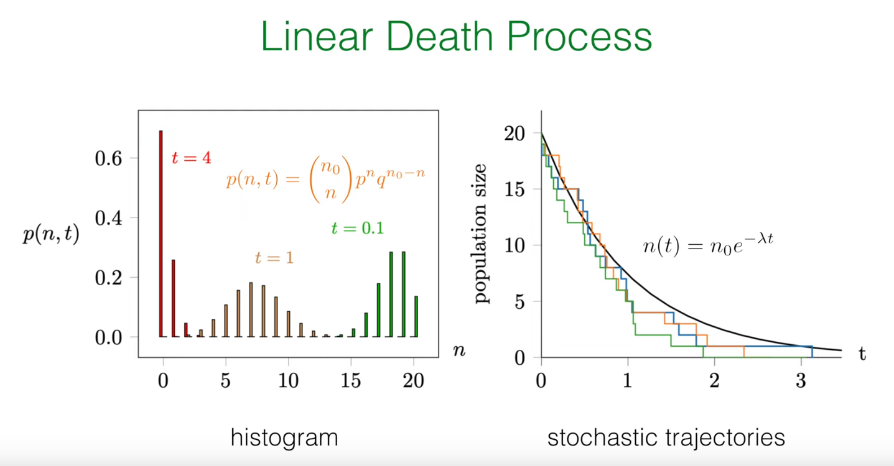
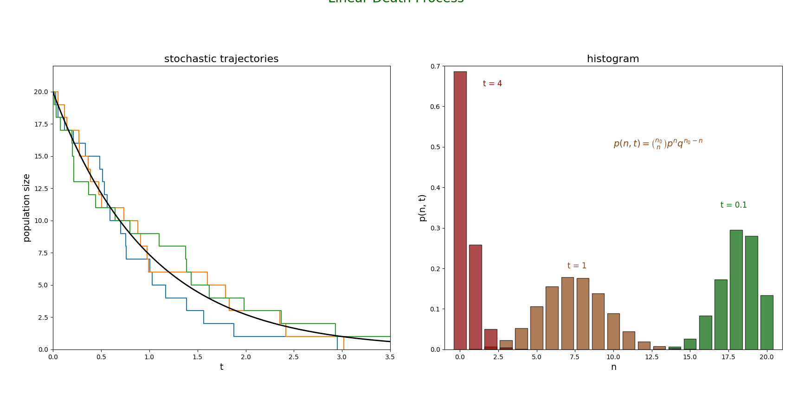
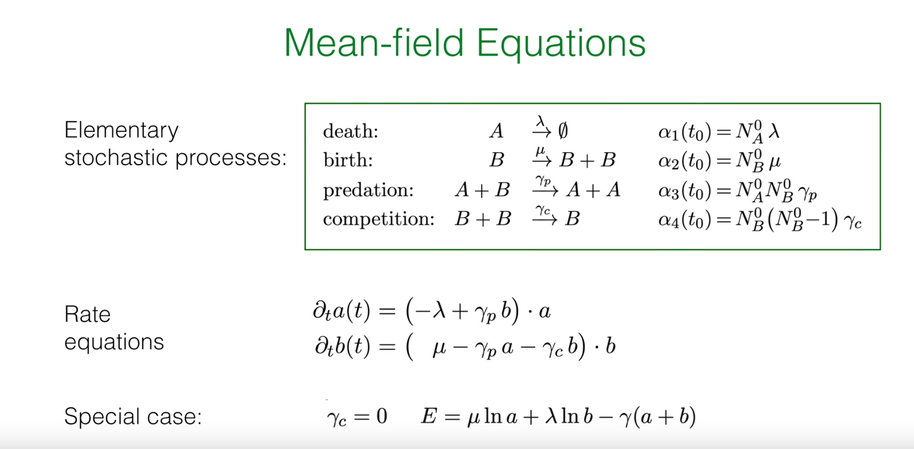
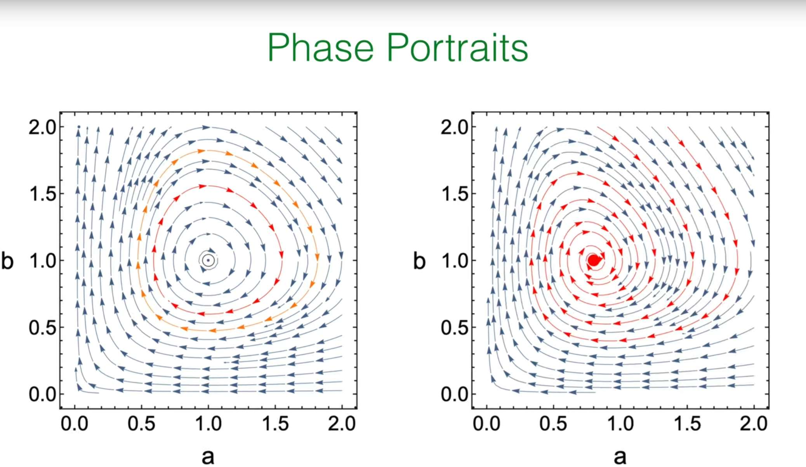
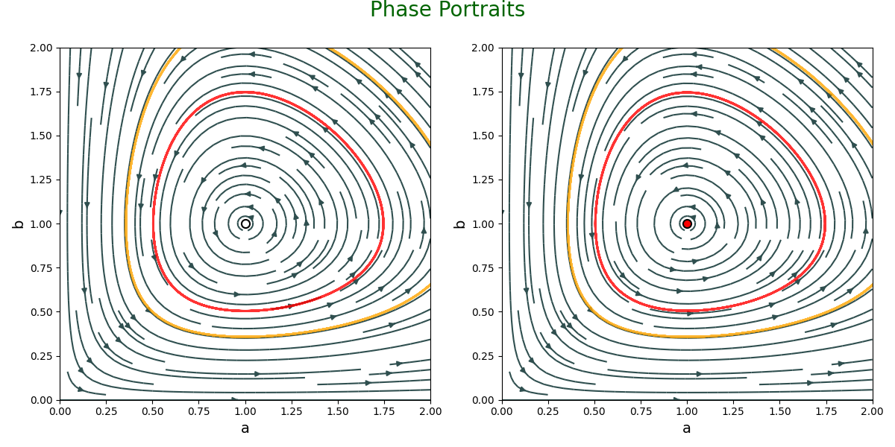
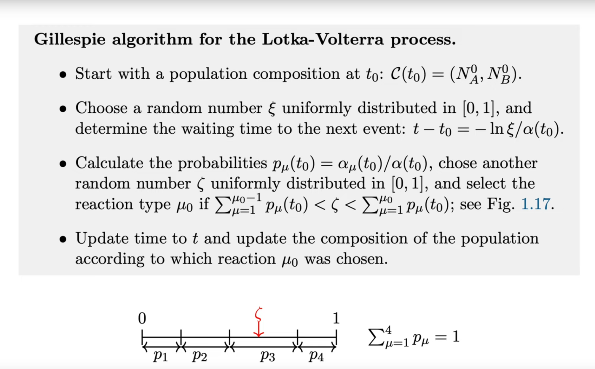
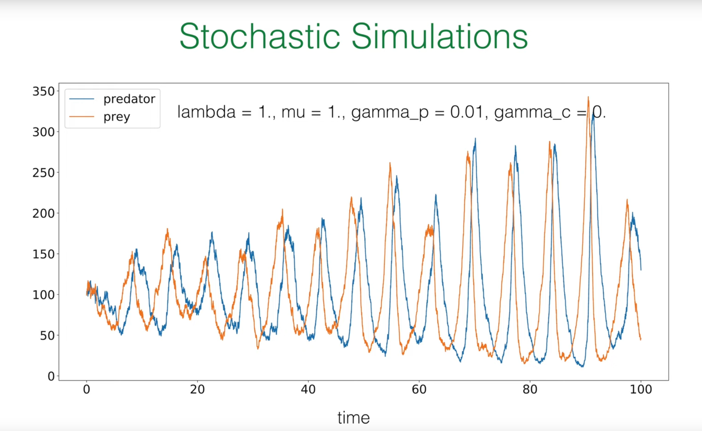
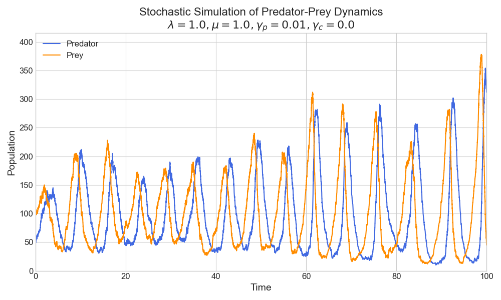
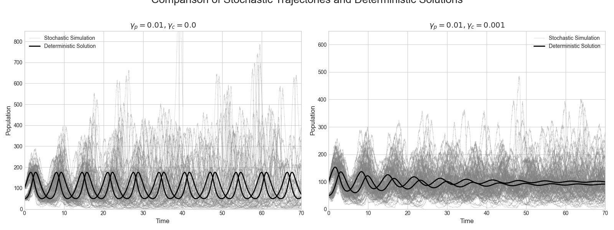
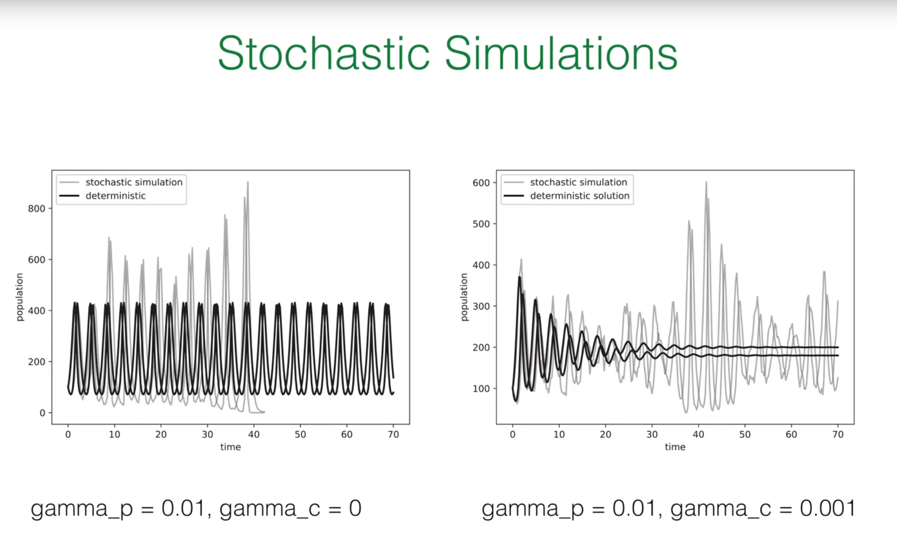

# 引言：将随机工具包应用于生命动态学

在前几节课中，教授已经帮我们建立了一个强大的理论框架来描述随机过程。本节课将这些抽象的工具应用于一个具体且重要的领域：种群动力学。这节课的目标是利用我们学到的知识来模拟由离散个体组成的种群的生、死和相互作用。

# 1. 核心概念回顾

在深入研究新的模型之前，教授带我们简要回顾了一下工具箱中的几个关键概念：

**主方程 (Master Equation)：**这是描述随机系统概率分布随时间演化的核心方程。它的本质思想非常直观，即系统处于某个特定状态 $n$ 的概率 $p(n,t)$ 的变化率，等于从其他状态转移到状态 $n$ 的速率（"增益"项）减去从状态 $n$ 转移到其他状态的速率（"损失"项）。其通用形式为：

$$\frac{d}{dt}p(n,t) = \text{"gain"} - \text{"loss"}$$

这个方程为我们提供了一个完整的、概率性的系统描述。

**Gillespie 算法：**主方程虽然精确，但通常是一组难以解析求解的耦合微分方程。Gillespie 算法是一种精妙的数值方法，它并非对主方程的近似，而是其**精确的随机实现**。该算法能够生成一系列随机轨迹（stochastic trajectories），这些轨迹的统计特性与主方程所描述的完全一致。

**理论与模拟的联系：**理论（主方程）和模拟（Gillespie 算法）之间存在着深刻的联系。如果我们运行大量的 Gillespie 模拟，并在某个特定时间点 $t$ 收集所有轨迹的系统状态（例如，种群数量 $n$），然后绘制这些状态的直方图，那么当模拟次数足够多时，这个直方图将收敛于主方程所预测的真实概率分布 $p(n,t)$ 。

## 为何需要随机模型？

你可能会问，我们已经有了描述种群增长的确定性模型（如逻辑斯谛方程），为什么还需要引入如此复杂的随机框架？

答案在于物理现实的根本性质。种群是由**离散的**个体组成的，而个体的行为——出生、死亡、捕食、交配——本质上是**概率性**的事件。确定性模型将种群数量视为连续变量，忽略了个体性和随机性，这在种群数量巨大时是一个合理的近似。然而，当种群规模较小时，随机波动（即"人口噪音"，demographic noise）可能主导系统的行为。一个随机的死亡事件序列可能导致一个小种群意外灭绝，而这是确定性模型无法预测的。

因此，随机模型不仅仅是确定性模型的一个更复杂的替代品，它们是对生命系统更**基本、更真实**的描述。它们使我们能够理解和量化由随机性本身驱动的现象，如灭绝风险、疾病爆发的概率以及生物多样性的维持。在本节中，教授将首先从最简单的"线性死亡过程"入手，然后逐步构建一个复杂的、包含捕食者和猎物的生态系统，并在这个过程中揭示随机性如何从根本上改变我们对系统行为的理解。

# 2. 线性死亡过程：随机种群模型的基础

为了建立对随机种群动态的直观理解，我们从最简单的非平凡模型开始：一个种群中的个体只能死亡，不能出生。我们将从三个不同的角度来剖析这个过程：确定性的平均场视角、随机的主方程视角，以及精确的解析解。

## 2.1 确定性视角（平均场理论）

首先，我们考虑一个最简单的描述。假设我们有一个物种 $A$，其个体以恒定的速率 $\lambda$ 死亡。我们可以用一个类似化学反应的式子来表示这个过程：

$$A \xrightarrow{\lambda} \varnothing$$

这里的 $\lambda$ 代表每个个体在单位时间内死亡的概率，即人均死亡率。

在**平均场**（mean-field）近似下，我们假设种群数量非常大，并且混合得非常均匀，因此我们可以忽略个体的离散性和随机波动，将种群数量 $n(t)$ 视为一个连续的、确定性的变量。

在这种情况下，整个种群数量的减少速率，就等于人均死亡率 $\lambda$ 乘以当前的种群数量 $n(t)$。这给了我们一个简单的一阶常微分方程（ODE）：

$$\frac{d}{dt}n(t) = -\lambda n(t)$$

这是一个我们非常熟悉的一阶线性微分方程。给定初始条件 $n(t=0)=n_0$，它的解是经典的指数衰减：

$$n(t) = n_0 e^{-\lambda t}$$

这个确定性解告诉我们种群的平均行为趋势。它将作为我们评估更完整的随机模型的一个基准。

## 2.2 更深层次的探索：通过主方程进行随机描述

现在，我们放弃平均场近似，将种群数量 $N(t)$ 视为一个离散的随机变量。我们的目标不再是求解一个确定的轨迹 $n(t)$，而是找到在任意时刻 $t$，种群数量恰好为 $n$ 的概率分布，即 $p(n,t) = \text{Prob}(N(t)=n)$。为此，我们需要构建该过程的主方程。

我们再次运用"增益-损失"原理来构建方程：

$$\frac{d}{dt}p(n,t) = \text{gain} - \text{loss}$$

* **损失项 (Loss Term)：**系统如何离开状态 $n$？唯一的途径是发生一次死亡事件。当种群数量为 $n$ 时，每个个体都可能以速率 $\lambda$ 死亡。由于所有个体的死亡事件是相互独立的（这是"线性"过程的核心假设），整个种群发生死亡事件的总速率是 $n \times \lambda$。因此，系统以速率 $\lambda n$ 离开状态 $n$。这一项对 $p(n,t)$ 的贡献是负的，即 $-\lambda n p(n,t)$。

* **增益项 (Gain Term)：**系统如何进入状态 $n$？唯一的途径是，系统原本处于状态 $n+1$，然后发生了一次死亡事件。当种群数量为 $n+1$ 时，整个种群发生死亡的总速率是 $(n+1) \times \lambda$。因此，从状态 $n+1$ 转移到状态 $n$ 的速率是 $\lambda(n+1)p(n+1,t)$。这一项对 $p(n,t)$ 的贡献是正的。

将增益项和损失项组合起来，我们就得到了线性死亡过程的完整主方程：

$$\frac{d}{dt}p(n,t) = \lambda(n+1)p(n+1,t) - \lambda n p(n,t)$$

这是一个无限维的耦合常微分方程组（对于 $n=0,1,2,...,n_0$），直接求解它相当困难。幸运的是，Frey 教授展示了一种更优雅、更具物理直觉的方法来获得其精确解。

## 2.3 精确解：揭示存活的二项分布本质

与其直接求解主方程，不如让我们从一个更简单的问题入手，然后逐步推广。

### 2.3.1 单个个体的存活

首先，考虑初始时只有一个个体（$n_0=1$）的情况。这个个体在时间 $t$ 仍然存活的概率是多少？这是一个经典的指数等待问题。在任何一个微小的时间间隔 $dt$ 内，它死亡的概率是 $\lambda dt$。因此，它在时间 $t$ 仍然存活的概率 $p(t)$ 遵循：

$$\frac{d}{dt}p(t) = -\lambda p(t)$$

解得 $p(t) = e^{-\lambda t}$。相应地，它在时间 $t$ 已经死亡的概率为 $q(t) = 1 - p(t) = 1 - e^{-\lambda t}$ 。

### 2.3.2 推广至 $n_0$ 个个体

现在，我们回到初始种群为 $n_0$ 的情况。线性死亡过程的一个核心假设是，**每个个体的死亡事件是相互独立的**。一个人的死亡不会影响另一个人的死亡概率。这意味着，在时间 $t$，整个种群的存活情况可以看作是进行了 $n_0$ 次独立的"伯努利试验"。

每一次试验对应一个初始个体，试验的结果只有两种：

1."成功"：该个体在时间 $t$ 仍然存活，其概率为 $p(t) = e^{-\lambda t}$。

2."失败"：该个体在时间 $t$ 已经死亡，其概率为 $q(t) = 1 - e^{-\lambda t}$。

我们关心的是，在 $n_0$ 次试验中，恰好有 $n$ 次"成功"（即有 $n$ 个个体存活）的概率是多少。这正是**二项分布**的定义！因此，我们可以直接写出其概率分布：

$$p(n,t) = \binom{n_0}{n} [p(t)]^n [q(t)]^{n_0-n} = \binom{n_0}{n} (e^{-\lambda t})^n (1 - e^{-\lambda t})^{n_0-n}$$

这个结果非常深刻。它揭示了模型数学形式与其物理假设之间的直接联系：

线性速率（总速率 $\propto n$） $\implies$ 个体独立性（无相互作用） $\implies$ 伯努利试验（每个个体独立存活或死亡） $\implies$ 二项分布解。

这个逻辑链条是理解随机过程物理意义的关键。

## 2.4 分布的矩：平均值与方差

一旦我们知道了概率分布是二项分布，我们就可以利用其已知的性质来计算平均值和方差。对于一个参数为 $(N,p)$ 的二项分布，其均值为 $Np$，方差为 $Np(1-p)$。

在我们的模型中，$N$ 对应于初始种群 $n_0$，$p$ 对应于单个个体的存活概率 $p(t) = e^{-\lambda t}$。因此，我们可以立即得到：

**平均种群数量 (Mean)：**

$$\langle n(t) \rangle = n_0 p(t) = n_0 e^{-\lambda t}$$

**种群数量的方差 (Variance)：**

$$\sigma^2(t) = n_0 p(t) (1 - p(t)) = n_0 e^{-\lambda t} (1 - e^{-\lambda t})$$

这里我们发现了一个至关重要的结论：随机过程的**平均值** $\langle n(t) \rangle$ 与我们之前推导的**确定性平均场解** $n(t)$ 完全相同！这对于所有线性过程都是一个普遍成立的优美结果。它告诉我们，确定性方程确实正确地捕捉了系统的平均行为。

然而，方差 $\sigma^2(t)$ 是一个全新的、纯粹由随机性带来的量。它量化了"人口噪音"的大小——即由于个体死亡事件发生的随机性，实际种群轨迹围绕着平均值的波动程度。这是平均场方法完全无法捕捉到的信息。

## 2.5 计算验证：模拟线性死亡过程

我们将使用 Gillespie 算法来模拟线性死亡过程，并生成讲座 PPT 中的第一张图。


Gillespie 算法的逻辑如下：

1.**初始化**：在时间 $t=0$ 时，设置种群数量 $N(0)=n_0$。

2.**计算总速率**：在任意时刻，当种群数量为 $N$ 时，发生下一次事件（任何一次死亡）的总速率为 $\alpha = \lambda N$。

3.**确定等待时间**：下一次事件发生的等待时间 $\tau$ 服从速率为 $\alpha$ 的指数分布。我们可以通过逆变换采样法生成这个时间：$\tau = -\frac{1}{\alpha} \ln(\xi)$，其中 $\xi$ 是一个在 $(0, 1]$ 区间内均匀分布的随机数。

4.**执行事件**：由于系统中只有一种事件（死亡），我们直接更新种群数量：$N \to N-1$。

5.**更新时间**：将当前时间向前推进：$t \to t+\tau$。

6.**重复**：回到第 2 步，继续模拟，直到种群数量 $N=0$ 或达到预设的模拟总时长。

下面是实现这一过程并复现讲座中两张图的 Python 代码。


```python
import numpy as np
import matplotlib.pyplot as plt
from scipy.special import comb

# --- Simulation parameters ---
n0 = 20      # Initial population size
lambda_rate = 1.0  # Per capita death rate
t_max = 4.0    # Maximum simulation time
num_simulations = 10000 # Total number of simulated trajectories

# --- Gillespie algorithm implementation for linear death process ---
def linear_death_gillespie(n_start, rate, t_end):
    """
    Simulate linear death process using Gillespie algorithm
    """
    t = 0.0
    n = n_start
    
    times = [t]
    populations = [n]
    
    while n > 0 and t < t_end:
        # Total reaction rate
        alpha = rate * n
        
        # Generate waiting time tau
        xi1 = np.random.uniform(0, 1)
        tau = -np.log(xi1) / alpha
        
        # Update time and population
        t += tau
        n -= 1 # Only death events
        
        times.append(t)
        populations.append(n)
        
    return np.array(times), np.array(populations)

# --- Run multiple simulations ---
all_trajectories = []
for _ in range(num_simulations):
    times, populations = linear_death_gillespie(n0, lambda_rate, t_max)
    all_trajectories.append((times, populations))

# --- Plotting ---
plt.style.use('default')
fig, axes = plt.subplots(1, 2, figsize=(12, 5))

# --- Figure 1: Stochastic trajectories and deterministic solution ---
ax = axes[0]
# Plot some example trajectories
for i in range(3):
    times, populations = all_trajectories[i]
    ax.step(times, populations, where='post')

# Plot deterministic solution
t_deterministic = np.linspace(0, t_max, 200)
n_deterministic = n0 * np.exp(-lambda_rate * t_deterministic)
ax.plot(t_deterministic, n_deterministic, color='black', lw=2, label=r'$n(t) = n_0 e^{-\lambda t}$')

ax.set_xlabel('t', fontsize=14)
ax.set_ylabel('population size', fontsize=14)
ax.set_title('stochastic trajectories', fontsize=16)
ax.set_ylim(0, n0 + 2)
ax.set_xlim(0, t_max - 0.5)

# --- Figure 2: Histogram and theoretical solution at different times ---
ax = axes[1]
time_points = [0.1, 1.0, 4.0]
colors = ['darkgreen', 'saddlebrown', 'darkred']
bar_width = 0.8

# Helper function: get population size at a specific time from a trajectory
def get_population_at_time(trajectory, t_point):
    times, populations = trajectory
    # Find the index of the last time point <= t_point
    idx = np.searchsorted(times, t_point, side='right') - 1
    return populations[idx]

for t, color in zip(time_points, colors):
    # Collect population sizes at this time point from all simulations
    populations_at_t = [get_population_at_time(traj, t) for traj in all_trajectories]
    
    # Calculate histogram
    n_values, counts = np.unique(populations_at_t, return_counts=True)
    probabilities = counts / num_simulations
    
    # Plot histogram
    ax.bar(n_values, probabilities, width=bar_width, color=color, alpha=0.7, ec='black', label=f't = {t}')
    
    # Plot theoretical binomial distribution
    p_survival = np.exp(-lambda_rate * t)
    n_range = np.arange(0, n0 + 1)
    p_n_t = comb(n0, n_range) * (p_survival**n_range) * ((1 - p_survival)**(n0 - n_range))
    # For visualization, only plot points with significant probabilities
    # ax.plot(n_range, p_n_t, 'o', color=color, markersize=4)

ax.set_xlabel('n', fontsize=14)
ax.set_ylabel('p(n, t)', fontsize=14)
ax.set_title('histogram', fontsize=16)
ax.set_xlim(-1, n0 + 1)
ax.set_ylim(0, 0.7)

# Add theoretical formula text
ax.text(10, 0.5, r'$p(n,t) = \binom{n_0}{n} p^n q^{n_0-n}$', fontsize=14, color='saddlebrown')
ax.text(1.5, 0.65, 't = 4', fontsize=12, color='darkred')
ax.text(7, 0.2, 't = 1', fontsize=12, color='saddlebrown')
ax.text(17, 0.35, 't = 0.1', fontsize=12, color='darkgreen')

fig.suptitle('Linear Death Process', fontsize=20, color='darkgreen', y=1.02)
plt.tight_layout()
plt.show()
```

**右图 (histogram)：**这张图展示了在三个不同时间点（$t=0.1, 1, 4$）种群数量的概率分布。条形图是我们通过运行上万次 Gillespie 模拟得到的经验分布。可以看到，随着时间的推移，分布的峰值向左移动（平均种群数量减少），并且分布变得更宽（相对不确定性增加），最终在时间很长时，大部分模拟都以种群灭绝（$n=0$）告终。这与我们推导的二项分布的动态行为完全一致。

**左图 (stochastic trajectories)：**这张图展示了三次独立的模拟轨迹（彩色阶梯线）。每一条轨迹都代表了一种可能的历史。黑色的平滑曲线是我们推导出的确定性解 $n(t)=n_0e^{-\lambda t}$，也就是随机过程的平均值。这张图直观地展示了随机过程的核心特征：**单次实现（轨迹）是随机的、离散的，但大量实现的平均行为则收敛于确定性的均场解**。

# 3. 洛特卡-沃尔泰拉过程(Lotka-Volterra Process)：模拟捕食者-猎物互动

在掌握了最简单的单一种群模型后，我们现在将挑战一个更复杂、也更有趣的系统：一个包含两种相互作用物种的生态系统——**捕食者（predator）和猎物（prey）**。这就是著名的洛特卡-沃尔泰拉（**Lotka-Volterra**）模型。我们将看到，物种间的非线性相互作用会产生远比线性过程丰富和令人惊讶的动态行为。

洛特卡-沃尔泰拉方程是一组描述捕食者-猎物生态系统动态的耦合非线性微分方程。这个模型源于20世纪初生态学研究的需求，由阿尔弗雷德·洛特卡和维托·沃尔泰拉分别独立提出，用于解释自然界中捕食者和猎物种群数量的周期性波动现象。

该方程组的建立基于以下生物学假设：

1.捕食者种群因自然死亡而减少，速率为 $-\lambda a$

2.捕食者通过捕食猎物而繁殖，增殖速率为 $+\gamma_p ab$

3.猎物种群因自身繁殖而增长，速率为 $+\mu b$

4.猎物因被捕食而减少，速率为 $-\gamma_p ab$

5.猎物之间因资源竞争而死亡，速率为 $-\gamma_c b^2$


这些假设最终形成了如下的耦合方程组：
$$
\frac{d}{dt}a(t) = (-\lambda + \gamma_p b) \cdot a
$$

$$
\frac{d}{dt}b(t) = (\mu - \gamma_p a - \gamma_c b) \cdot b
$$

其中 $a(t)$ 和 $b(t)$ 分别代表捕食者和猎物的种群密度。

在实际应用中，洛特卡-沃尔泰拉方程广泛用于：

1.**生态系统建模**：分析捕食者-猎物关系，如狼与鹿、猫与鼠等生态系统的行为

2.**渔业资源管理**：指导可持续捕捞策略的制定

3.**害虫生物防治**：设计利用天敌控制农业害虫的方案

4.**流行病学研究**：模拟疾病传播中病毒与宿主的相互作用

5.**经济学建模**：描述商业竞争中不同企业间的动态关系

该模型虽然简化了现实生态系统的复杂性，但其揭示的非线性相互作用原理对理解复杂系统行为具有重要意义。特别是当引入随机性后，该模型能更好地反映真实生态系统中种群数量的波动特性，为生态风险评估和生物多样性保护提供理论基础。

## 3.1 构建生态系统：基本随机过程

我们定义系统中的两个物种：

* **A**: 捕食者 (Predator)
* **B**: 猎物 (Prey)

这个生态系统的动态由四个基本（或称元）随机过程共同决定：

1. **捕食者死亡 (Predator Death)：**捕食者会因自然原因死亡。这是一个线性的死亡过程，与我们之前分析的类似。
   $$\varnothing \xleftarrow{\lambda} A$$

2. **猎物出生 (Prey Birth)：**猎物会自我繁殖。假设资源充足，这也是一个线性的出生过程。
   $$B \xrightarrow{\mu} B + B$$

3. **捕食 (Predation)：**这是模型的核心互动。当一个捕食者 A 遇到一个猎物 B 时，它会吃掉猎物，并在此过程中繁殖出一个新的捕食者。

   
   $$
   A + B \xrightarrow{\gamma_p} A + A
   $$
   

4. **猎物竞争 (Prey Competition)：**当猎物数量过多时，它们会因为争夺有限的资源（如食物、空间）而发生竞争，导致其中一个个体死亡。
   $$
   B + B \xrightarrow{\gamma_c} B
   $$
   

## 3.2 量化变化：反应倾向性

为了用 Gillespie 算法模拟这个系统或推导其平均场方程，我们需要将上述的符号化反应转化为数学上的速率表达式，即**倾向性函数 (propensity function)** $\alpha_\mu$。倾向性 $\alpha_\mu$ 表示反应 $\mu$ 在单位时间内发生的概率。


假设系统当前的状态是 $(N_A, N_B)$，其中 $N_A$ 是捕食者数量，$N_B$ 是猎物数量。


$\alpha_1 = \lambda N_A$：捕食者死亡的总速率。与线性死亡过程一样，它正比于捕食者的数量 $N_A$。


$\alpha_2 = \mu N_B$：猎物出生的总速率，正比于猎物数量 $N_B$。


$\alpha_3 = \gamma_p N_A N_B$：捕食事件的总速率。这个二次项是模型的关键。它源于"质量作用定律"的假设：在一个充分混合的系统中，两种不同类型的个体相遇的频率正比于它们各自数量的乘积。


$\alpha_4 = \gamma_c N_B(N_B - 1)$：猎物竞争的总速率。竞争需要两个猎物个体参与。在 $N_B$ 个猎物中，可以组成的不同个体对的数量是 $\binom{N_B}{2} = \frac{1}{2}N_B(N_B - 1)$。因此，总速率正比于此。Frey 教授的讲义中将速率常数定义为 $\gamma_c$，吸收了因子 $1/2$，因此倾向性写为 $\gamma_c N_B(N_B - 1)$。当 $N_B$ 很大时，这近似于 $\gamma_c N_B^2$。


为了清晰地组织这些信息，我们可以创建一个表格，它将成为我们理解和编程的蓝图：


| 过程名称 | 化学反应式 | 速率常数 | 倾向性函数 $\alpha_\mu(N_A, N_B)$ | 状态变化 $(\Delta N_A, \Delta N_B)$ |
| --- | --- | --- | --- | --- |
| 捕食者死亡 | $A \xrightarrow{\lambda} \emptyset$ | $\lambda$ | $\lambda N_A$ | $(-1, 0)$ |
| 猎物出生 | $B \xrightarrow{\mu} B + B$ | $\mu$ | $\mu N_B$ | $(0, +1)$ |
| 捕食 | $A + B \xrightarrow{\gamma_p} A + A$ | $\gamma_p$ | $\gamma_p N_A N_B$ | $(+1, -1)$ |
| 猎物竞争 | $B + B \xrightarrow{\gamma_c} B$ | $\gamma_c$ | $\gamma_c N_B (N_B - 1)$ | $(0, -1)$ |

这个表格完整地定义了我们的随机模型。每一行都告诉我们一个事件的"发生速率"（倾向性）以及"发生后会怎样"（状态变化）。


## 3.3 平均场近似：耦合速率方程




与线性死亡过程类似，我们可以通过忽略随机波动来推导描述系统平均行为的确定性方程。我们用连续变量 $a(t)$ 和 $b(t)$ 分别代表捕食者和猎物的种群密度。

**捕食者密度 $a(t)$ 的变化**：

  * 因自然死亡而减少，速率为 $-\lambda a$。

  * 因捕食猎物而增加，速率为 $+\gamma_p ab$。

  * 合并得到：$\frac{d}{dt}a(t) = (-\lambda + \gamma_p b) \cdot a$

**猎物密度 $b(t)$ 的变化**：

  * 因自身繁殖而增加，速率为 $+\mu b$。

  * 因被捕食而减少，速率为 $-\gamma_p ab$。

  * 因内部竞争而减少，速率为 $-\gamma_c b^2$（这里我们用 $b^2$ 作为 $b(b-1)$ 的连续近似）。

  * 合并得到：$\frac{d}{dt}b(t) = (\mu - \gamma_p a - \gamma_c b) \cdot b$

这两个耦合的非线性常微分方程就是确定性的洛特卡-沃尔泰拉方程。

## 3.4 相空间中的动态：不动点与相图

确定性方程的长期行为可以通过分析其在 $(a,b)$ 相空间中的流场来理解。我们关心的是不动点（fixed points），即种群密度不再变化的点（$\partial_t a=0$ 和 $\partial_t b=0$）。



**特殊情况 ($\gamma_c=0$)：**这是最经典的洛特卡-沃尔泰拉模型，没有猎物竞争。


不动点有两个：一个是灭绝点 $(0,0)$，另一个是共存不动点 $(a^*,b^*)=(\mu/\gamma_p,\lambda/\gamma_p)$。


分析表明，这个共存不动点是一个**中性稳定中心** (neutrally stable center)。系统的轨迹是围绕这个中心的一系列封闭的轨道（周期性振荡）。系统所在的具体轨道由初始条件决定。


这个系统是保守的，存在一个守恒量 $E = \mu \ln a + \lambda \ln b - \gamma_p(a+b)$。每条轨道对应一个恒定的 $E$ 值。


**一般情况 ($\gamma_c>0$)：**引入猎物竞争后，情况发生了质变。


共存不动点的位置变为 $(a^*,b^*)$，其中 $b^* = (\mu-\gamma_p a^*)/\gamma_c$。


竞争项 $\gamma_c b^2$ 起到了"阻尼"的作用。不动点不再是中性中心，而是一个**稳定螺线点** (stable spiral)。无论从哪个初始条件出发（只要种群不灭绝），系统的轨迹都会以振荡的方式螺旋式地收敛到这个唯一的共存不动点。


我们可以通过绘制相图（Phase Portraits）来将这些动态行为可视化。
```python
# --- Import necessary libraries ---
import numpy as np
import matplotlib.pyplot as plt
from scipy.integrate import odeint

# --- Define Lotka-Volterra ODE system ---
def lotka_volterra_ode(y, t, lambda_rate, mu_rate, gamma_p, gamma_c):
    a, b = y
    da_dt = mu_rate * a - gamma_p * a * b
    db_dt = -lambda_rate * b + gamma_p * a * b - gamma_c * b
    return [da_dt, db_dt]

# --- Set parameters ---
lambda_rate = 1.0
mu_rate = 1.0
gamma_p = 1.0
gamma_c = 0.0

# --- Plot phase diagrams ---
fig, axes = plt.subplots(1, 2, figsize=(12, 6))

# --- Case 1: gamma_c = 0 (neutral center) ---
gamma_c = 0.0
ax = axes[0]
a_max, b_max = 2.0, 2.0
a_grid, b_grid = np.meshgrid(np.linspace(0, a_max, 20), np.linspace(0, b_max, 20))

u, v = np.zeros_like(a_grid), np.zeros_like(b_grid)
NI, NJ = a_grid.shape
for i in range(NI):
    for j in range(NJ):
        y = [a_grid[i, j], b_grid[i, j]]
        dydt = lotka_volterra_ode(y, 0, lambda_rate, mu_rate, gamma_p, gamma_c)
        u[i, j], v[i, j] = dydt[0], dydt[1]

# Plot flow field
ax.streamplot(a_grid, b_grid, u, v, density=1.2, color='darkslategrey')

# Plot fixed point
a_star = mu_rate / gamma_p
b_star = lambda_rate / gamma_p
ax.plot(a_star, b_star, 'o', markersize=8, markerfacecolor='white', markeredgecolor='black', markeredgewidth=1.5)

# Plot sample trajectories
initial_conditions = [[a_star*1.5, b_star*1.5], [a_star*0.5, b_star*0.5]]
t_span = np.linspace(0, 50, 500)
colors = ['red', 'orange']
for i, y0 in enumerate(initial_conditions):
    sol = odeint(lotka_volterra_ode, y0, t_span, args=(lambda_rate, mu_rate, gamma_p, gamma_c))
    ax.plot(sol[:, 0], sol[:, 1], color=colors[i], lw=2, alpha=0.8)

ax.set_xlabel('a', fontsize=14)
ax.set_ylabel('b', fontsize=14)
ax.set_xlim(0, a_max)
ax.set_ylim(0, b_max)

# --- Case 2: gamma_c > 0 (stable spiral point) ---
gamma_c = 0.001
ax = axes[1]
a_max, b_max = 2.0, 2.0
a_grid, b_grid = np.meshgrid(np.linspace(0, a_max, 20), np.linspace(0, b_max, 20))

u, v = np.zeros_like(a_grid), np.zeros_like(b_grid)
NI, NJ = a_grid.shape
for i in range(NI):
    for j in range(NJ):
        y = [a_grid[i, j], b_grid[i, j]]
        dydt = lotka_volterra_ode(y, 0, lambda_rate, mu_rate, gamma_p, gamma_c)
        u[i, j], v[i, j] = dydt[0], dydt[1]

ax.streamplot(a_grid, b_grid, u, v, density=1.2, color='darkslategrey')

# Plot fixed point
b_star_damped = lambda_rate / gamma_p
a_star_damped = (mu_rate - gamma_c * b_star_damped) / gamma_p
ax.plot(a_star_damped, b_star_damped, 'o', markersize=8, markerfacecolor='red', markeredgecolor='black', markeredgewidth=1.5)

# Plot sample trajectories
initial_conditions = [[a_star_damped*1.5, b_star_damped*1.5], [a_star_damped*0.5, b_star_damped*0.5]]
t_span = np.linspace(0, 50, 500)
colors = ['red', 'orange']
for i, y0 in enumerate(initial_conditions):
    sol = odeint(lotka_volterra_ode, y0, t_span, args=(lambda_rate, mu_rate, gamma_p, gamma_c))
    ax.plot(sol[:, 0], sol[:, 1], color=colors[i], lw=2, alpha=0.8)

ax.set_xlabel('a', fontsize=14)
ax.set_ylabel('b', fontsize=14)
ax.set_xlim(0, a_max)
ax.set_ylim(0, b_max)

fig.suptitle('Phase Portraits', fontsize=20, color='darkgreen', y=1.0)
plt.tight_layout()
plt.show()
```


**左图 ($\gamma_c=0$)**: 该图清晰地展示了一个中性稳定中心。流线（streamplot）形成了围绕中心不动点（白色圆圈）的闭合环路。我们绘制的两条轨迹（橙色和橘红色）也沿着这些闭合轨道运行，永不靠近也不远离中心。这代表了捕食者和猎物数量的持续周期性振荡。

**右图 ($\gamma_c>0$)**: 该图展示了一个稳定螺线点。流线现在都指向内部的中心不动点（红色圆圈）。我们绘制的一条轨迹（红色）也显示了种群数量一边振荡一边衰减，最终趋向于稳定的共存状态。

# 4. 完整的随机模拟：Gillespie 算法

确定性模型为我们提供了系统平均行为的蓝图，但真实的故事隐藏在随机性之中。现在，我们将使用 Gillespie 算法来模拟完整的随机洛特卡-沃尔泰拉过程。






适用于多个反应通道的 Gillespie 算法步骤如下：

1.**初始化**：在 $t=0$ 时，设置状态 $(N_A,N_B)$。

2.**计算所有倾向性**：根据当前状态 $(N_A,N_B)$，计算出所有四个反应的倾向性 $\alpha_1,\alpha_2,\alpha_3,\alpha_4$。

3.**计算总速率**：将所有倾向性相加，得到总速率 $\alpha_{\text{tot}} = \sum_{\mu=1}^{4} \alpha_\mu$。

4.**确定等待时间**：生成下一次事件的等待时间 $\tau = -\frac{1}{\alpha_{\text{tot}}} \ln(\xi_1)$，其中 $\xi_1$ 是 $(0, 1]$ 上的均匀随机数。

5.**选择发生的事件**：这是关键一步。我们需要根据每个反应的相对概率 $\alpha_\mu/\alpha_{\text{tot}}$ 来决定具体发生哪个事件。这可以通过"轮盘赌"选择法实现：生成第二个均匀随机数 $\xi_2 \in [0,1]$，然后选择满足 $\sum_{\nu=1}^{\mu-1} \alpha_\nu < \xi_2 \alpha_{\text{tot}} \leq \sum_{\nu=1}^{\mu} \alpha_\nu$ 的反应 $\mu$。

6.**执行事件**：根据选中的反应类型，按照状态变化表更新系统状态。

7.**更新时间**：将当前时间向前推进：$t \to t+\tau$。

8.**重复**：回到第 2 步，继续模拟，直到达到预设的模拟总时长。

下面是实现这一算法的 Python 代码：

```python
import numpy as np
import matplotlib.pyplot as plt
from scipy.integrate import odeint

# --- Parameter Setup ---
lambda_rate = 1.0  # Predator death rate
mu_rate = 1.0      # Prey birth rate
gamma_p = 0.01     # Predation rate

# --- Deterministic ODE Definition ---
def lotka_volterra_ode(y, t, lambda_r, mu_r, gamma_p_r, gamma_c_r):
    """
    Defines the system of ordinary differential equations for the Lotka-Volterra model.
    """
    a, b = y
    dadt = (-lambda_r + gamma_p_r * b) * a
    dbdt = (mu_r - gamma_p_r * a - gamma_c_r * b) * b
    return [dadt, dbdt]

# --- Gillespie Algorithm for Lotka-Volterra Process ---
def lotka_volterra_gillespie(n_a, n_b, rates, t_end):
    """
    Simulates the Lotka-Volterra process using the Gillespie algorithm.
    
    Args:
        n_a (int): Initial number of predators.
        n_b (int): Initial number of prey.
        rates (tuple): A tuple of rate constants (lambda_r, mu_r, gamma_p_r, gamma_c_r).
        t_end (float): The end time for the simulation.
        
    Returns:
        A tuple containing arrays for times, predator populations, and prey populations.
    """
    lambda_r, mu_r, gamma_p_r, gamma_c_r = rates
    
    t = 0.0
    # Ensure populations are floats to avoid potential integer division issues
    n_a = float(n_a)
    n_b = float(n_b)
    
    times = [t]
    populations_a = [n_a]
    populations_b = [n_b]
    
    # Stoichiometry matrix: rows are reactions, columns are species (A, B)
    nu = np.array([
        [-1,  0],  # Reaction 1: A -> 0 (Predator death)
        [ 0, +1],  # Reaction 2: B -> 2B (Prey birth)
        [+1, -1],  # Reaction 3: A+B -> 2A (Predation)
        [ 0, -1]   # Reaction 4: 2B -> B (Prey competition)
    ])
    
    while t < t_end:
        if n_a == 0 or n_b == 0:
            break  # Stop if one species goes extinct
            
        # Calculate propensities for each reaction
        propensities = np.array([
            lambda_r * n_a,
            mu_r * n_b,
            gamma_p_r * n_a * n_b,
            gamma_c_r * n_b * (n_b - 1)
        ])
        
        a_total = np.sum(propensities)
        
        if a_total == 0:
            break # No more reactions can occur
            
        # Generate waiting time (tau) until the next reaction
        xi1 = np.random.uniform(0, 1)
        tau = -np.log(xi1) / a_total
        
        # Choose which reaction occurs
        xi2 = np.random.uniform(0, 1)
        p_normalized = propensities / a_total
        reaction_idx = np.random.choice(len(propensities), p=p_normalized)
        
        # Update time and populations
        t += tau
        n_a += nu[reaction_idx, 0]
        n_b += nu[reaction_idx, 1]
        
        times.append(t)
        populations_a.append(n_a)
        populations_b.append(n_b)
        
    return np.array(times), np.array(populations_a), np.array(populations_b)

# --- Initial Conditions ---
# The deterministic fixed point is (100, 100) for gamma_c=0.
# We start away from the fixed point to observe oscillations.
n_a0 = 50
n_b0 = 100

# --- Plot 1: Stochastic Oscillations Time Series (Reproducing PPT_1.jpg) ---
plt.style.use('seaborn-v0_8-whitegrid')
fig1, ax1 = plt.subplots(figsize=(10, 6))

gamma_c_1 = 0.0
rates_1 = (lambda_rate, mu_rate, gamma_p, gamma_c_1)
# For a better single trajectory view, let's start this one away from the fixed point too
t_sim_1, n_a_sim_1, n_b_sim_1 = lotka_volterra_gillespie(50, 100, rates_1, 100)

ax1.plot(t_sim_1, n_a_sim_1, label='Predator', lw=1.5, color='royalblue')
ax1.plot(t_sim_1, n_b_sim_1, label='Prey', lw=1.5, color='darkorange')
ax1.set_xlabel('Time', fontsize=14)
ax1.set_ylabel('Population', fontsize=14)
ax1.set_title(f'Stochastic Simulation of Predator-Prey Dynamics\n'
              f'$\lambda={lambda_rate}, \mu={mu_rate}, \gamma_p={gamma_p}, \gamma_c={gamma_c_1}$', 
              fontsize=16)
ax1.legend(fontsize=12)
ax1.tick_params(axis='both', which='major', labelsize=12)
ax1.set_xlim(0, 100)
ax1.set_ylim(0, max(np.max(n_a_sim_1), np.max(n_b_sim_1)) * 1.1 if len(n_a_sim_1) > 0 else 100)
plt.tight_layout()
plt.show()

# --- Plot 2: Stochastic vs. Deterministic (Reproducing PPT2.jpg) ---
fig2, axes = plt.subplots(1, 2, figsize=(16, 6))

# --- Left Subplot: gamma_c = 0 ---
ax2_left = axes[0]
gamma_c_left = 0.0
rates_left = (lambda_rate, mu_rate, gamma_p, gamma_c_left)
num_simulations = 50  # Number of stochastic trajectories to plot

# Run and plot multiple stochastic simulations
for i in range(num_simulations):
    t_sim, n_a_sim, n_b_sim = lotka_volterra_gillespie(n_a0, n_b0, rates_left, 70)
    # Use a low alpha to create a "cloud" effect
    ax2_left.plot(t_sim, n_a_sim, color='gray', lw=0.5, alpha=0.4, 
                  label='Stochastic Simulation' if i == 0 else "")
    ax2_left.plot(t_sim, n_b_sim, color='gray', lw=0.5, alpha=0.4)


# Deterministic solution
t_ode = np.linspace(0, 70, 1000)
y0 = [n_a0, n_b0]
sol_left = odeint(lotka_volterra_ode, y0, t_ode, args=rates_left)
# Plot deterministic solution with a thick black line for contrast
ax2_left.plot(t_ode, sol_left[:, 0], color='black', lw=2.0, label='Deterministic Solution')
ax2_left.plot(t_ode, sol_left[:, 1], color='black', lw=2.0)


ax2_left.set_xlabel('Time', fontsize=12)
ax2_left.set_ylabel('Population', fontsize=12)
ax2_left.set_title(f'$\gamma_p = {gamma_p}, \gamma_c = {gamma_c_left}$', fontsize=14)
ax2_left.legend()
ax2_left.set_xlim(0, 70)
ax2_left.set_ylim(0, 850)


# --- Right Subplot: gamma_c > 0 ---
ax2_right = axes[1]
gamma_c_right = 0.001
rates_right = (lambda_rate, mu_rate, gamma_p, gamma_c_right)

# Run and plot multiple stochastic simulations
for i in range(num_simulations):
    t_sim, n_a_sim, n_b_sim = lotka_volterra_gillespie(n_a0, n_b0, rates_right, 70)
    ax2_right.plot(t_sim, n_a_sim, color='gray', lw=0.5, alpha=0.4,
                   label='Stochastic Simulation' if i == 0 else "")
    ax2_right.plot(t_sim, n_b_sim, color='gray', lw=0.5, alpha=0.4)


# Deterministic solution
sol_right = odeint(lotka_volterra_ode, y0, t_ode, args=rates_right)
ax2_right.plot(t_ode, sol_right[:, 0], color='black', lw=2.0, label='Deterministic Solution')
ax2_right.plot(t_ode, sol_right[:, 1], color='black', lw=2.0)

ax2_right.set_xlabel('Time', fontsize=12)
ax2_right.set_ylabel('Population', fontsize=12)
ax2_right.set_title(f'$\gamma_p = {gamma_p}, \gamma_c = {gamma_c_right}$', fontsize=14)
ax2_right.legend()
ax2_right.set_xlim(0, 70)
ax2_right.set_ylim(0, 650)


fig2.suptitle('Comparison of Stochastic Trajectories and Deterministic Solutions', fontsize=20, y=1.02)
plt.tight_layout()
plt.show()
```

**第一张图 (随机振荡时间序列)：**这张图展示了在没有猎物竞争（$\gamma_c=0$）的情况下，一次典型的随机模拟结果。我们可以看到清晰的捕食者-猎物振荡：猎物（橙色线）数量先增加，随后捕食者（蓝色线）数量因食物充足而增加；捕食者增多导致猎物数量下降，接着捕食者因食物短缺而数量下降，完成一个循环。然而，与确定性模型的完美周期不同，这里的振荡**幅度和周期都是随机变化的**。





**第二张图 (随机 vs 确定性对比)：**这张图是本讲座最核心、最发人深省的结果。



**左子图 ($\gamma_c=0$)**: 确定性解（粗黑线）是一条完美的、稳定的周期轨道。然而，随机模拟（细灰线）的行为截然不同。随机轨迹的振荡幅度**倾向于不断增大**，出现越来越高的波峰和越来越低的波谷。这是为什么呢？确定性系统是保守的，被"囚禁"在由初始条件决定的一条轨道上。而随机事件（出生、死亡）就像是对系统的随机"踢动"，使得系统可以在不同的轨道之间进行随机游走。由于没有一个力把它拉回到某个特定的轨道，这种游走会使振荡幅度扩散，极大地增加了某个物种数量触及零（即灭绝）的风险。在这里，**内在噪音起到了破坏稳定性的作用**。

**右子图 ($\gamma_c > 0$)**: 引入猎物竞争后，确定性解（粗黑线）表现为阻尼振荡，最终稳定在一个不动点上。生态系统达到了一个静态的平衡。然而，随机模拟（细灰线）再次讲述了一个不同的故事。轨迹确实被吸引到了不动点附近，但它**并没有停下来**。相反，它在不动点周围持续地进行着随机波动。这里，确定性动力像一个"恢复力"，总是试图将系统拉回到平衡点；而随机事件则像一个持续的"驱动力"，不断地将系统踢离平衡点。这两者之间达成的动态平衡，使得系统能够**维持持续的、有噪声的振荡**。在这种情况下，**内在噪音起到了维持动态、防止系统"死亡"的作用**。

# 总结

通过本次课的学习，我们完成了一次从简单到复杂的旅程，从一个物种的指数衰减，到一个完整生态系统的复杂互动。更重要的是，我们深入探讨了描述这些系统的两种不同哲学：确定性平均场理论和完整的随机理论。

我们总结出以下关键教训：

1.**确定性模型捕捉平均行为**：对于线性过程，或者对于种群规模极大的非线性过程，确定性（平均场）方程能够很好地描述系统的平均动态。例如，线性死亡过程的平均值与确定性解完全一致。

    

2.**随机性揭示了波动的本质**：随机模型不仅给出了平均行为，还精确地量化了围绕平均值的波动（方差或整个概率分布）。这些"人口噪音"在确定性世界中是不可见的，但在真实的生物系统中，它们是不可避免的、核心的组成部分。

    

3.**噪音的角色是微妙且依赖于系统的**：通过对比有无竞争的洛特卡-沃尔泰拉模型，我们看到了一个最深刻的结论：噪音并非总是"讨厌的"随机扰动。它的作用与系统本身的确定性动力学结构密切相关。

    * 在保守的、具有中性稳定轨道的系统中（如 $\gamma_c=0$），噪音是**破坏性的**，它会放大振荡，驱动系统走向灭绝。
    * 在耗散的、具有稳定吸引子的系统中（如 $\gamma_c>0$），噪音是**创造性的**，它能与确定性的吸引力相抗衡，维持系统持续的动态波动，防止其陷入死寂的平衡。

最终，这节课告诉我们，要真正理解生态系统、细胞网络或流行病传播等现象，我们必须拥抱随机性。随机波动不是需要被平均掉的细节，而是驱动系统产生丰富、复杂甚至反直觉行为的关键因素。我们建立的"主方程-Gillespie算法"框架，为探索这个随机世界提供了强大而精确的工具。

