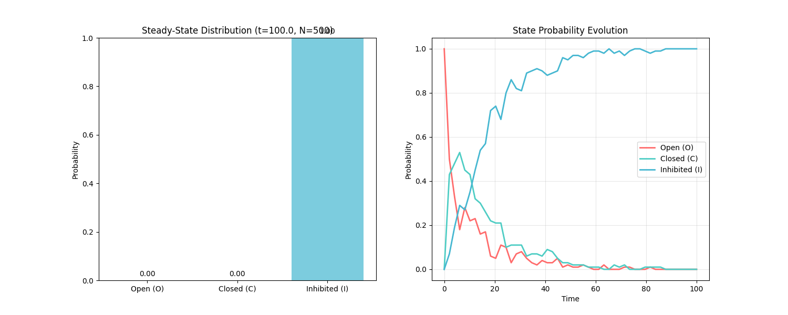

# 引言

在前几讲中，我们已经接触了多种随机过程的具体实例。从第一讲中粒子在一维晶格上的"简单随机游走"，到第四讲中描述生物种群数量生灭的"种群动态学"，我们看到了随机性在物理和生物系统中的核心作用。这些例子虽然具体，但引出了一个更深层次的问题：是否存在一个普适的数学框架，一种通用的语言，来描述所有那些"不计过往，只看今朝"的随机演化过程？

这节课的目标正是要建立并理解这一通用语言。Erwin Frey将带领我们推导并阐释支配所有马尔可夫过程（Markov Processes）的两个基本方程。首先是**查普曼-科尔莫戈罗夫方程 (Chapman-Kolmogorov Equation)**，它如同宏观世界的桥梁，连接了不同时间点上的概率分布。随后，我们将从宏观深入微观，推导出**主方程 (Master Equation)**，它以瞬时"速率"的形式，为我们提供了描述系统状态概率如何随时间连续演化的强大工具。这两个方程共同构成了随机过程理论的基石。

# 1. 随机过程的概率描述

## 1.1 定义随机过程 (Defining a Stochastic Process)

为了构建一个通用的理论，我们首先需要一个精确的数学定义。一个随机过程（Stochastic Process）可以被看作是一个由时间$t$索引的随机变量的集合。在最一般的情况下，它可以是一个多维向量：

$$
X(t) = (X_1(t), X_2(t), \ldots)
$$

其中，每个分量$X_i(t)$本身就是一个随机变量，它的取值可以是连续的实数（$X_i \in \mathbb{R}$），例如布朗运动中粒子的位置；也可以是离散的整数（$X_i \in \mathbb{Z}$），例如种群中的个体数量。

为了简化讨论并抓住核心概念，我们遵循教授在讲座中的做法，暂时只考虑一个单分量的随机变量$X(t)$。

## 1.2 联合概率密度：完整的描述 (Joint Probability Density: The Complete Description)

如何才能完整地描述一个随机过程呢？答案是，我们需要知道在任意一系列时间点$t_1, t_2, \ldots, t_n$上，随机变量$X(t)$分别取值为$x_1, x_2, \ldots, x_n$的联合概率。这由联合概率密度函数$P(x_n, t_n; x_{n-1}, t_{n-1}; \ldots; x_1, t_1)$来刻画。其严格定义如下：

$$
P(x_n, t_n; \ldots; x_1, t_1) dx_n \ldots dx_1 = \mathrm{Prob}\{x_n \leq X(t_n) \leq x_n + dx_n; \ldots; x_1 \leq X(t_1) \leq x_1 + dx_1\}
$$

这个表达式的含义是，在时间$t_1$观测到系统状态在$x_1$附近，*并且*在时间$t_2$观测到状态在$x_2$附近，...，一直到在时间$t_n$观测到状态在$x_n$附近的联合概率。

这个联合概率密度函数是描述一个随机过程最根本、最完整的方式，它包含了系统在不同时间点之间所有可能的关联信息。然而，这种"完整性"也带来了巨大的复杂性。想象一下，要为一个真实系统确定这个函数，我们需要测量或计算出*所有可能历史路径*的概率。随着时间点$n$的增加或状态空间维度的扩大，这个函数的复杂性会爆炸式增长，使其在实践中几乎无法使用。这正是理论建模中一个核心挑战的体现：我们必须引入合理的物理简化假设，才能从这种无法驾驭的复杂性中提取出有用的、可解的数学模型。马尔可夫性质，正是我们将要介绍的最重要、最强大的简化假设。

## 1.3 随机轨迹与条件概率 (Stochastic Trajectory and Conditional Probability)

为了更直观地理解随机过程，我们可以引入"随机轨迹"（Stochastic Trajectory）的概念。随机过程的每一次具体实现，即$X(t)$随时间$t$演化所形成的一条具体路径，就是一条随机轨迹。它描绘了系统状态随时间的一次具体演化历史，如下图所示：


要分析不同时间点之间的依赖关系——即过去如何影响未来——我们需要使用条件概率（Conditional Probability）这一数学工具。根据其定义，在已知过去一系列事件（在$t_1, \ldots, t_n$时刻状态为$x_1, \ldots, x_n$）的条件下，未来一系列事件（在$t_{n+1}, \ldots, t_{n+m}$时刻状态为$x_{n+1}, \ldots, x_{n+m}$）发生的概率为：

$$
P(x_{n+m}, t_{n+m}; \ldots; x_{n+1}, t_{n+1} \mid x_n, t_n; \ldots; x_1, t_1) = \frac{P(x_{n+m}, t_{n+m}; \ldots; x_{n+1}, t_{n+1}; x_n, t_n; \ldots; x_1, t_1)}{P(x_n, t_n; \ldots; x_1, t_1)}
$$

这个表达式是我们接下来讨论马尔可夫性质的出发点。

# 2. 核心假设：马尔可夫性质

## 2.1 "无记忆"过程的定义 (Defining a "Memoryless" Process)

马尔可夫性质（Markov Property）是对随机过程"记忆"的限制，它构成了本讲座后续所有理论的基石。其核心思想是"无记忆性"（memoryless）。一个过程如果具有马尔可夫性质，那么其未来的状态只依赖于当前的状态，而与到达当前状态的整个历史路径无关。

用条件概率的语言来表述，这个性质可以写成：

$$
P(x_n, t_n \mid x_{n-1}, t_{n-1}; \ldots; x_1, t_1) = P(x_n, t_n \mid x_{n-1}, t_{n-1})
$$

这个等式意味着，为了预测在$t_n$时刻系统处于状态$x_n$的概率，我们只需要知道它在紧邻的前一个时刻$t_{n-1}$所处的状态$x_{n-1}$就足够了。所有更早的历史信息（$x_{n-2}, \ldots, x_1$）对于预测未来都是冗余的。当前状态$x_{n-1}$已经包含了预测未来所需的全部信息。

这个看似简单的数学假设背后，蕴含着深刻的物理洞见。一个物理系统之所以能被近似为马尔可夫过程，通常是因为存在着**时间尺度的分离**。例如，考虑一个在液体中运动的大颗粒（布朗运动）。它的位置$X(t)$是我们关心的随机变量。严格来说，它的运动是有记忆的，因为它的速度在短时间内会保持。一个完整的描述需要考虑状态$(X(t), V(t))$。然而，颗粒与大量微小的液体分子碰撞，导致其速度的关联时间（记忆时间）非常短。如果我们观察颗粒位置的时间尺度远大于这个速度关联时间，那么在我们的观察尺度上，颗粒的下一步位移就几乎只与其当前位置有关，而与其之前的速度历史无关。因此，马尔可夫性质并非一个绝对的物理定律，而是一个极其有效的近似，它适用于那些所有未被观测的、携带记忆的"快变量"能够在其弛豫时间尺度上迅速达到平衡，从而不影响我们所关心的"慢变量"的演化。

## 2.2 简化联合概率 (Simplifying the Joint Probability)

马尔可夫性质的威力在于它能极大地简化我们之前提到的、极其复杂的联合概率密度。利用条件概率的链式法则，我们可以将联合概率分解：

$$
P(x_n, t_n; \ldots; x_1, t_1) = P(x_n, t_n \mid x_{n-1}, t_{n-1}; \ldots; x_1, t_1) \cdot P(x_{n-1}, t_{n-1}; \ldots; x_1, t_1)
$$

应用马尔可夫性质，上式中的条件概率被大大简化。重复这个过程，我们可以将整个联合概率分解为一系列两点转移概率（transition probability）的乘积：

$$
P(x_n, t_n; \ldots; x_1, t_1) = P(x_n, t_n \mid x_{n-1}, t_{n-1}) P(x_{n-1}, t_{n-1} \mid x_{n-2}, t_{n-2}) \cdots P(x_2, t_2 \mid x_1, t_1) P(x_1, t_1)
$$

这个结果意义非凡。它告诉我们，一个复杂的马尔可夫过程的完整统计特性，完全由两个要素决定：

1. **初始条件**：系统在起始时刻$t_1$的概率分布$P(x_1, t_1)$。

2. **转移规则**：描述系统从一个状态转移到下一个状态的条件概率$P(x_j, t_j \mid x_{j-1}, t_{j-1})$。

我们不再需要处理那个包含所有历史信息的、难以驾驭的联合概率函数。整个系统的演化，现在可以被看作是通过转移概率，将初始概率分布一步步地向前"传播"。

# 3. 查普曼-科尔莫戈罗夫方程：连接不同时间点的桥梁

有了马尔可夫性质这一利器，我们现在可以推导第一个基本方程：查普曼-科尔莫戈罗夫（CK）方程。

## 3.1 推导：边缘化的力量 (Derivation: The Power of Marginalization)

CK方程的推导基于概率论中的一个基本法则——全概率公式，也称为边缘化（Marginalization）。考虑三个时间点$t_1 < t_2 < t_3$。我们想知道系统从状态$(x_1, t_1)$转移到状态$(x_3, t_3)$的概率$P(x_3, t_3 \mid x_1, t_1)$。

要从$t_1$到达$t_3$，系统必须在中间时刻$t_2$经过某个中间状态$x_2$。由于$x_2$可以是任何可能的状态，我们需要对所有可能的中间状态进行求和（或积分），这正是边缘化的思想：

$$
P(x_3, t_3 \mid x_1, t_1) = \int dx_2 P(x_3, t_3; x_2, t_2 \mid x_1, t_1)
$$

现在，我们可以利用条件概率的定义和马尔可夫性质来简化被积函数：

$$
P(x_3, t_3; x_2, t_2 \mid x_1, t_1) = \frac{P(x_3, t_3; x_2, t_2; x_1, t_1)}{P(x_1, t_1)}
$$

对分子应用链式法则和马尔可夫性质：

$$
P(x_3, t_3; x_2, t_2; x_1, t_1) = P(x_3, t_3 \mid x_2, t_2) P(x_2, t_2 \mid x_1, t_1) P(x_1, t_1)
$$

将此结果代回，我们得到：

$$
P(x_3, t_3; x_2, t_2 \mid x_1, t_1) = P(x_3, t_3 \mid x_2, t_2) P(x_2, t_2 \mid x_1, t_1)
$$

最后，将这个简化的表达式代入边缘化的积分中，我们就得到了查普曼-科尔莫戈罗夫方程。


## 3.2 方程的形式与物理意义 (Form and Physical Meaning of the Equation)

CK方程根据状态变量是连续还是离散，有两种形式：

* **连续状态变量**：

$$
P(x_3, t_3 \mid x_1, t_1) = \int dx_2 P(x_3, t_3 \mid x_2, t_2) P(x_2, t_2 \mid x_1, t_1)
$$

* **离散状态变量**（用$n$表示状态，并设$t_1 = t_0, t_2 = t', t_3 = t$）：

$$
P(n, t \mid n_0, t_0) = \sum_{n'} P(n, t \mid n', t') P(n', t' \mid n_0, t_0)
$$

**物理意义**：CK方程的物理意义非常直观。它表明，从状态$n_0$到$n$的整个演化过程，可以分解为两个独立的马尔可夫步骤：先从$n_0$演化到某个中间状态$n'$，再从$n'$演化到最终状态$n$。方程的核心思想是"**对所有可能路径求和**"。它将一个大时间间隔内的转移概率，表示为所有可能中间路径的概率之和，体现了马尔可夫过程的演化合成法则。

对于离散状态系统，CK方程的形式暗示了一种与线性代数的深刻联系。如果我们定义一个转移概率矩阵$\mathbf{T}(t_a \to t_b)$，其矩阵元$(\mathbf{T})_{ij} = P(j, t_b \mid i, t_a)$，那么离散形式的CK方程就可以被简洁地写成矩阵乘法的形式：

$$
\mathbf{T}(t_1 \to t_3) = \mathbf{T}(t_2 \to t_3) \mathbf{T}(t_1 \to t_2)
$$

这个视角极为重要，它将随机过程的概率演化问题，转化为了我们所熟悉的、强大的线性代数问题。例如，系统的长期行为（稳态分布）就与转移矩阵的特征向量和特征值紧密相关。

# 4. 从宏观到微观：主方程

查普曼-科尔莫戈罗夫方程描述了在**有限**时间间隔内概率的演化。然而，在许多物理和化学问题中，我们更关心概率**瞬时**的变化率。为了得到一个描述这种瞬时变化的微分方程，我们需要从CK方程出发，考虑一个无穷小的时间步长，这便引出了主方程（Master Equation）。

## 4.1 从有限步长到瞬时速率 (From Finite Steps to Instantaneous Rates)

我们从离散形式的CK方程出发，并将时间间隔$t-t'$设为一个无穷小量$\Delta t$，即$t' = t, t = t + \Delta t$。方程变为：

$$
P(n, t + \Delta t \mid n_0, t_0) = \sum_m P(n, t + \Delta t \mid m, t) P(m, t \mid n_0, t_0)
$$

我们感兴趣的是概率随时间的变化率，即时间导数：

$$
\frac{d}{dt} P(n, t \mid n_0, t_0) = \lim_{\Delta t \to 0} \frac{1}{\Delta t} [P(n, t + \Delta t \mid n_0, t_0) - P(n, t \mid n_0, t_0)]
$$

将CK方程代入上式，并利用$P(n, t \mid n_0, t_0) = \sum_m \delta_{n,m} P(m, t \mid n_0, t_0)$（其中$\delta_{n,m}$是克罗内克符号），我们得到：

$$
\frac{d}{dt} P(n, t \mid n_0, t_0) = \lim_{\Delta t \to 0} \frac{1}{\Delta t} \sum_m [P(n, t + \Delta t \mid m, t) - \delta_{n,m}] P(m, t \mid n_0, t_0)
$$

这个表达式的核心在于方括号内的项，它描述了在极短时间$\Delta t$内，从状态$m$转移到状态$n$的概率变化。

## 4.2 转移速率矩阵 Q (The Transition Rate Matrix, Q)

为了简化上述表达式，我们定义一个关键的物理量——**转移速率矩阵**（Transition Rate Matrix）$\mathbf{Q}$。其矩阵元$Q(n,m)$（有时也写作$Q_{nm}$）定义为：

$$
Q(n, m) := \lim_{\Delta t \to 0} \frac{1}{\Delta t} [P(n, t + \Delta t \mid m, t) - \delta_{n,m}]
$$

这个矩阵的元素具有清晰的物理意义：

**非对角元素 (Gain)**: 当$n \neq m$时，$\delta_{n,m} = 0$。此时的矩阵元通常记为$w_{m \to n}$：

 $$
 w_{m \to n} := Q(n, m) = \lim_{\Delta t \to 0} \frac{1}{\Delta t} P(n, t + \Delta t \mid m, t)
 $$

$w_{m \to n}$表示系统从状态$m$**转移到**状态$n$的**瞬时速率**。它的单位是$[\text{时间}]^{-1}$。在无穷小时间$d\tau$内，从$m$转移到$n$的无量纲概率就是$w_{m \to n} d\tau$。这代表了流入状态$n$的概率"增益"（Gain）项。

**对角元素 (Loss)**: 当$n = m$时，$\delta_{n,m} = 1$。此时的矩阵元为：

$$
Q(m, m) = \lim_{\Delta t \to 0} \frac{1}{\Delta t} [P(m, t + \Delta t \mid m, t) - 1]
$$

由于在短时间内不发生转移的概率$P(m, t + \Delta t \mid m, t)$接近于1，所以$Q(m,m)$是一个负数。我们通常定义一个正的**离开速率**（exit rate）$w_m$：

$$
w_m := -Q(m, m) = \lim_{\Delta t \to 0} \frac{1}{\Delta t} [1 - P(m, t + \Delta t \mid m, t)]
$$

$w_m$表示系统**离开**状态$m$（转移到任何其他状态）的总速率。这代表了流出状态$m$的概率"损失"（Loss）项。

## 4.3 主方程的最终形式 (The Final Form of the Master Equation)

将转移速率矩阵$\mathbf{Q}$的定义代入之前的时间导数表达式中，我们便得到了主方程的矩阵形式：

$$
\frac{d}{dt} P(n, t \mid n_0, t_0) = \sum_m Q(n, m) P(m, t \mid n_0, t_0)
$$

为了更直观地理解其物理意义，我们可以将其写成"增益-损失"的形式。为此，我们需要用到一个重要的性质。

## 4.4 概率守恒的体现 (The Manifestation of Probability Conservation)

由于从任何一个状态$m$出发，系统在下一时刻必然会处于某个状态（包括$m$自身），因此总概率必须守恒：$\sum_n P(n, t + \Delta t \mid m, t) = 1$。利用这个性质，我们可以证明$\mathbf{Q}$矩阵的每一列之和为零：

$$
\sum_n Q(n, m) = \lim_{\Delta t \to 0} \frac{1}{\Delta t} \left[ \sum_n P(n, t + \Delta t \mid m, t) - \sum_n \delta_{n,m} \right] = \lim_{\Delta t \to 0} \frac{1}{\Delta t} [1-1] = 0
$$

这个数学性质是物理上**概率守恒定律**的直接体现。它意味着对角元的损失速率，精确地等于该状态流向所有其他状态的增益速率之和：

$$
-Q(m, m) = \sum_{n \neq m} Q(n, m) \quad \implies \quad w_m = \sum_{n \neq m} w_{m \to n}
$$

这一关系是构建"增益-损失"方程的关键。主方程可以被看作是状态空间中的一个**连续性方程**。总概率是一个守恒量，它不会凭空产生或消失，只会在不同状态之间重新分布。而$w_{m \to n} P(m,t)$这样的项，就扮演了从状态$m$流向状态$n$的"概率流"的角色。$\mathbf{Q}$矩阵列和为零的约束，保证了总的概率流为零，即总概率不随时间变化。

现在，我们可以将主方程写成最终的、最直观的形式。为简化符号，我们用$P_n(t)$代表$P(n, t \mid n_0, t_0)$：

$$
\frac{d}{dt} P_n(t) = \sum_m Q_{nm} P_m(t) = \sum_{m \neq n} Q_{nm} P_m(t) + Q_{nn} P_n(t)
$$

利用$w_{m \to n} = Q_{nm}$和$w_n = -Q_{nn} = \sum_{m \neq n} w_{n \to m}$，上式变为：

$$
\frac{d}{dt} P_n(t) = \underbrace{\sum_{m \neq n} w_{m \to n} P_m(t)}_{\text{Gain: from all } m \text{ into } n} - \underbrace{\sum_{m \neq n} w_{n \to m} P_n(t)}_{\text{Loss: from } n \text{ to all } m}
$$

这个形式完美地诠释了主方程的物理内涵：处于状态$n$的概率随时间的变化率，等于所有其他状态$m$流入$n$的概率通量之和（增益项），减去从状态$n$流出到所有其他状态$m$的概率通量之和（损失项）。

## 4.5 前向与后向主方程 (Forward vs. Backward Master Equations)

讲座最后简单提及，我们推导的这个主方程，其时间导数是针对演化的"终点"时间$t$的（$\partial_t$），被称为**前向主方程 (Forward Master Equation)**。它回答的问题是："给定初始状态，未来的概率分布如何演化？"

与之对应，还存在一个**后向主方程 (Backward Master Equation)**，其时间导数是针对"起点"时间$t_0$的（$\partial_{t_0}$）。它回答一个不同的问题："要想到达某个固定的终点状态，初始状态的概率分布应该如何选择？" 前向方程在物理和化学中应用更为广泛，因为它自然地描述了系统随时间的正向演化。

# 5. Python模拟：可视化一个离散马尔可夫过程

为了将主方程中定义的"速率"与实际的随机轨迹联系起来，我们可以使用数值模拟方法。对于由主方程描述的离散状态、连续时间的马尔可夫过程，最经典的模拟算法是**Gillespie算法**（在第3讲中已有介绍）。

## 5.1 系统设定

我们设定一个简单的三状态模型，例如一个蛋白质分子可能处于三种构象：开放态（Open, O）、关闭态（Closed, C）和失活态（Inhibited, I）。我们用数字0, 1, 2分别代表这三种状态。状态之间的转移速率如下：


$O \leftrightarrow C$：开放态和关闭态之间可以相互转换，速率分别为$w_{0 \to 1} = k_{OC}$和$w_{1 \to 0} = k_{CO}$。

$C \to I$：关闭态可以不可逆地变为失活态，速率为$w_{1 \to 2} = k_{CI}$。

对应的转移速率矩阵$\mathbf{Q}$为：

$$
\mathbf{Q} = \begin{pmatrix}
-k_{OC} & k_{CO} & 0 \\
k_{OC} & -k_{CO} - k_{CI} & 0 \\
0 & k_{CI} & 0
\end{pmatrix}
$$

注意，每一列的和都为零，满足概率守恒。

## 5.2 算法与代码实现

Gillespie算法的核心思想是，在任意时刻，系统下一步会发生什么以及需要等待多久，都是随机的。算法通过两步随机抽样来确定：

1. **确定等待时间**：总的离开速率$W$是当前状态所有可能出路的速率之和。等待时间$\Delta t$服从指数分布，可以通过$\Delta t = -\frac{1}{W} \ln(r_1)$生成，其中$r_1$是$(0,1]$上的随机数。

2. **确定下一个事件**：用第二个随机数$r_2$来决定具体发生哪一个转移。将区间按各个转移速率的比例划分，看$r_2 \cdot W$落在哪一个子区间，就发生对应的转移。

以下是实现该过程的Python代码：


```python
import numpy as np
import matplotlib.pyplot as plt
from matplotlib.patches import FancyBboxPatch, ArrowStyle
import matplotlib.patches as mpatches
from collections import Counter

def simulate_markov_process(initial_state, rates, t_max):
    """
    Simulate a discrete state, continuous time Markov process using the Gillespie algorithm.

    Parameters:
        initial_state (int): Initial state of the system (0, 1 or 2).
        rates (dict): Dictionary of transition rates, e.g. {'k_oc': 1.0,...}.
        t_max (float): Maximum simulation time.

    Returns:
        tuple: A tuple containing lists of times and states.
    """
    # Unpack rate parameters
    k_oc = rates.get('k_oc', 0)
    k_co = rates.get('k_co', 0)
    k_ci = rates.get('k_ci', 0)

    # Store trajectory data
    times = [0.0]
    states = [initial_state]

    current_time = 0.0
    current_state = initial_state

    while current_time < t_max:
        # Define possible transitions and their rates in the current state
        possible_transitions = []
        if current_state == 0:  # State O
            possible_transitions = [(1, k_oc)]
        elif current_state == 1:  # State C
            possible_transitions = [(0, k_co), (2, k_ci)]
        elif current_state == 2:  # State I (absorbing state)
            # No outward transitions from state I
            break

        # Calculate total exit rate W
        total_rate = sum(rate for _, rate in possible_transitions)

        if total_rate == 0:
            # Absorbing state, simulation ends
            break

        # Step 1: Determine time interval to next event
        r1 = np.random.rand()
        dt = -np.log(r1) / total_rate
        
        current_time += dt
        if current_time > t_max:
            break

        # Step 2: Determine which event occurs
        r2 = np.random.rand()
        cumulative_prob = 0.0
        next_state = -1
        for state, rate in possible_transitions:
            cumulative_prob += rate / total_rate
            if r2 < cumulative_prob:
                next_state = state
                break

        # Update state and store results
        current_state = next_state
        times.append(current_time)
        states.append(current_state)

    return times, states

def plot_state_diagram(rates):
    """
    Plot state transition diagram
    """
    fig, ax = plt.subplots(1, 1, figsize=(10, 6))
    
    # State positions
    positions = {0: (2, 4), 1: (2, 2), 2: (2, 0)}  # O, C, I
    state_names = {0: 'Open (O)', 1: 'Closed (C)', 2: 'Inhibited (I)'}
    colors = {0: '#FF6B6B', 1: '#4ECDC4', 2: '#45B7D1'}
    
    # Draw state nodes (larger circles)
    for state, pos in positions.items():
        circle = plt.Circle(pos, 0.5, color=colors[state], alpha=0.8)  # Increased radius from 0.3 to 0.5
        ax.add_patch(circle)
        ax.text(pos[0], pos[1], state_names[state], ha='center', va='center', 
                fontsize=10, fontweight='bold', color='white')
    
    # Draw transition arrows
    k_oc = rates.get('k_oc', 0)
    k_co = rates.get('k_co', 0)
    k_ci = rates.get('k_ci', 0)
    
    # O <-> C
    if k_oc > 0:
        arrow1 = mpatches.FancyArrowPatch((2, 3.5), (2, 2.5), 
                                          arrowstyle='->', mutation_scale=20, 
                                          color='gray', alpha=0.7, 
                                          connectionstyle="arc3,rad=-0.3")
        ax.add_patch(arrow1)
        ax.text(2.5, 3, f'k_OC = {k_oc}', fontsize=9, rotation=-90, ha='center')
    
    if k_co > 0:
        arrow2 = mpatches.FancyArrowPatch((2, 2.5), (2, 3.5), 
                                          arrowstyle='->', mutation_scale=20, 
                                          color='gray', alpha=0.7,
                                          connectionstyle="arc3,rad=-0.3")
        ax.add_patch(arrow2)
        ax.text(1.5, 3, f'k_CO = {k_co}', fontsize=9, rotation=90, ha='center')
    
    # C -> I
    if k_ci > 0:
        arrow3 = mpatches.FancyArrowPatch((2, 1.5), (2, 0.5), 
                                          arrowstyle='->', mutation_scale=20, 
                                          color='gray', alpha=0.7)
        ax.add_patch(arrow3)
        ax.text(2.5, 1, f'k_CI = {k_ci}', fontsize=9, rotation=-90, ha='center')
    
    ax.set_xlim(0, 4)
    ax.set_ylim(-0.5, 5)
    ax.set_aspect('equal')
    ax.axis('off')
    ax.set_title('State Transition Diagram', fontsize=14, fontweight='bold')
    
    return fig

def plot_multiple_trajectories(initial_state, rates, t_max, num_trajectories=5):
    """
    Plot multiple trajectories to show randomness
    """
    fig, ax = plt.subplots(1, 1, figsize=(12, 6))
    
    colors = ['#FF6B6B', '#4ECDC4', '#45B7D1', '#96CEB4', '#FECA57']
    state_labels = ['Open (O)', 'Closed (C)', 'Inhibited (I)']
    
    for i in range(num_trajectories):
        times, states = simulate_markov_process(initial_state, rates, t_max)
        # Add small offset to each trajectory for better visualization
        offset_states = [s + (i*0.05) for s in states]
        ax.step(times, offset_states, where='post', alpha=0.7, 
                color=colors[i % len(colors)], linewidth=1.5)
    
    ax.set_yticks([0, 1, 2])
    ax.set_yticklabels(state_labels)
    ax.set_xlabel('Time')
    ax.set_ylabel('State')
    ax.set_title(f'Multiple Stochastic Trajectories (N={num_trajectories})')
    ax.grid(True, alpha=0.3)
    
    return fig

def plot_state_probability_distribution(initial_state, rates, t_max, num_samples=1000):
    """
    Plot state probability distribution
    """
    # Run multiple simulations to get statistics
    final_states = []
    all_times = []
    all_states = []
    
    for _ in range(num_samples):
        times, states = simulate_markov_process(initial_state, rates, t_max)
        if times:
            final_states.append(states[-1])
            all_times.extend(times)
            all_states.extend(states)
    
    # Count final state distribution
    state_counts = Counter(final_states)
    total = sum(state_counts.values())
    state_probs = {state: count/total for state, count in state_counts.items()}
    
    fig, (ax1, ax2) = plt.subplots(1, 2, figsize=(15, 6))
    
    # Final state distribution
    state_labels = ['Open (O)', 'Closed (C)', 'Inhibited (I)']
    state_colors = ['#FF6B6B', '#4ECDC4', '#45B7D1']
    probs = [state_probs.get(i, 0) for i in range(3)]
    
    bars = ax1.bar(state_labels, probs, color=state_colors, alpha=0.7)
    ax1.set_ylabel('Probability')
    ax1.set_title(f'Steady-State Distribution (t={t_max}, N={num_samples})')
    ax1.set_ylim(0, 1)
    
    # Add value labels on bars
    for bar, prob in zip(bars, probs):
        height = bar.get_height()
        ax1.text(bar.get_x() + bar.get_width()/2., height + 0.01,
                f'{prob:.2f}', ha='center', va='bottom')
    
    # State occupancy over time (simplified)
    time_points = np.linspace(0, t_max, 50)
    state_occupancy = {0: [], 1: [], 2: []}
    
    for t in time_points:
        count = {0: 0, 1: 0, 2: 0}
        total_count = 0
        for _ in range(100):  # Sample 100 trajectories at each time point
            times, states = simulate_markov_process(initial_state, rates, t_max)
            # Find state at time t
            state_at_t = states[0]  # Default to initial state
            for i in range(len(times)-1):
                if times[i] <= t < times[i+1]:
                    state_at_t = states[i]
                    break
                elif t >= times[-1]:
                    state_at_t = states[-1]
                    break
            count[state_at_t] += 1
            total_count += 1
        
        for state in [0, 1, 2]:
            state_occupancy[state].append(count[state] / total_count if total_count > 0 else 0)
    
    # Plot state occupancy over time
    for state in [0, 1, 2]:
        ax2.plot(time_points, state_occupancy[state], 
                label=state_labels[state], color=state_colors[state], linewidth=2)
    
    ax2.set_xlabel('Time')
    ax2.set_ylabel('Probability')
    ax2.set_title('State Probability Evolution')
    ax2.legend()
    ax2.grid(True, alpha=0.3)
    
    return fig

# --- Simulation parameters ---
params = {
    'k_oc': 0.5,  # Rate O -> C
    'k_co': 0.2,  # Rate C -> O
    'k_ci': 0.1   # Rate C -> I
}
initial_state = 0  # Start from state O
simulation_time = 100.0

# --- Create enhanced visualizations ---
# 1. State transition diagram
fig1 = plot_state_diagram(params)
plt.show()

# 2. Multiple trajectories
fig2 = plot_multiple_trajectories(initial_state, params, simulation_time, num_trajectories=10)
plt.show()

# 3. State probability distribution
fig3 = plot_state_probability_distribution(initial_state, params, simulation_time, num_samples=500)
plt.show()
```

蛋白质分子系统的动力学结构，其中从关闭态到失活态是不可逆的，而开放态和关闭态之间可以相互转换。


**随机性：**不同轨迹在相同时间点的状态各不相同，体现了系统的随机性质

**状态跳跃**：系统在不同状态间瞬时跳变，符合马尔可夫过程的特性

**吸收态**：所有轨迹最终都进入失活态（Inhibited），因为这是吸收态

**停留时间**：系统在每个状态停留的时间是随机的，服从指数分布



显示了系统在长时间运行后（t=100）的最终状态分布，所有样本都进入了失活态（Inhibited），概率接近1.0，开放态和关闭态的概率接近0，说明系统最终都会被"捕获"在失活态。
# 总结


这节课教授带领我们完成了一次从普适性描述到具体动力学方程的逻辑构建。整个过程可以总结为一条清晰的思路：

1. 我们从一个随机过程最完备但最复杂的描述**联合概率密度**出发。

2. 为了使其变得可控，我们引入了核心的物理简化——**马尔可夫性质**，即"无记忆性"。

3. 基于马尔可夫性质，我们推导出了第一个基本方程——**查普曼-科尔莫戈罗夫方程**。它是一个积分/求和方程，描述了系统在**有限时间步长**内从一个状态转移到另一个状态的概率，其核心思想是"对所有中间路径求和"。

4. 最后，通过对CK方程取**无穷小时间极限**，我们得到了更为强大的**主方程**。它是一个微分方程，通过定义**转移速率**，精确描述了系统状态概率的**瞬时变化**，其核心思想是概率在不同状态间的"增益-损失"平衡。

为了更清晰地对比这两个核心方程，下表总结了它们的关键特征：


| 特征     | 查普曼-科尔莫戈罗夫方程                 | 主方程                                     |
| -------- | --------------------------------------- | ------------------------------------------ |
| 时间尺度 | 有限时间步长 ($t \to t + \Delta t$)     | 无穷小时间步长 ($dt$)                      |
| 描述对象 | 转移概率 $P(n, t + \Delta t \mid m, t)$ | 转移速率 $w_{m \to n}$                     |
| 数学形式 | 积分/求和方程                           | 微分方程                                   |
| 核心思想 | 路径叠加 (Sum over intermediate paths)  | 概率流的平衡 (Balance of probability flux) |


主方程不仅是理论的终点，更是应用研究的起点。掌握了主方程，我们就拥有了分析各类随机系统的强大工具。在后续的学习中，我们可以利用它来：

* 求解系统的**稳态分布**（Steady-State Distribution）：当时间趋于无穷时，系统处于各个状态的概率是多少？这通常对应于主方程的零解。

* 计算系统的**弛豫时间**（Relaxation Times）：系统受到扰动后，需要多长时间才能恢复到稳态？这与转移速率矩阵的特征值有关。

* 分析**首次通过时间**（First-Passage Time）：系统从一个初始状态出发，平均需要多长时间才能首次到达某个目标状态？

这些问题在物理、化学、生物和金融等领域都有着至关重要的应用。
