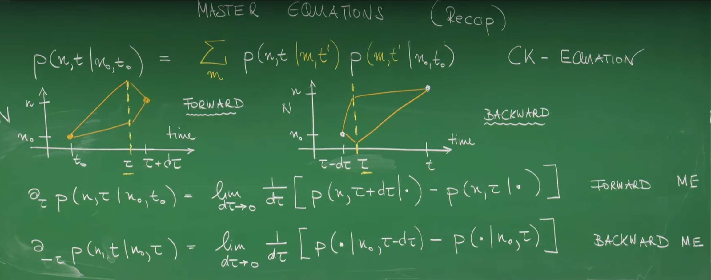
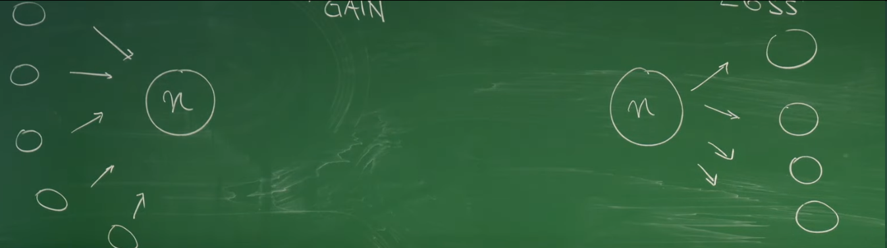
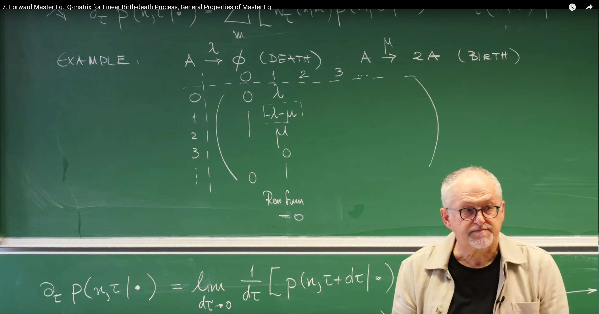
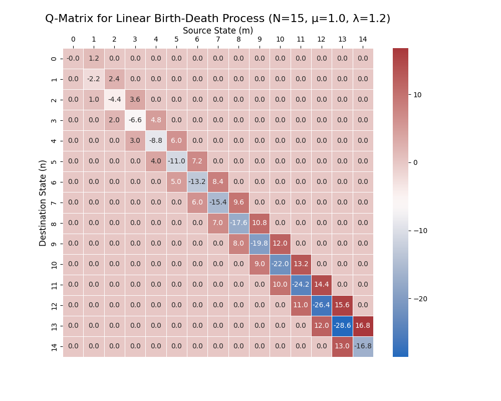
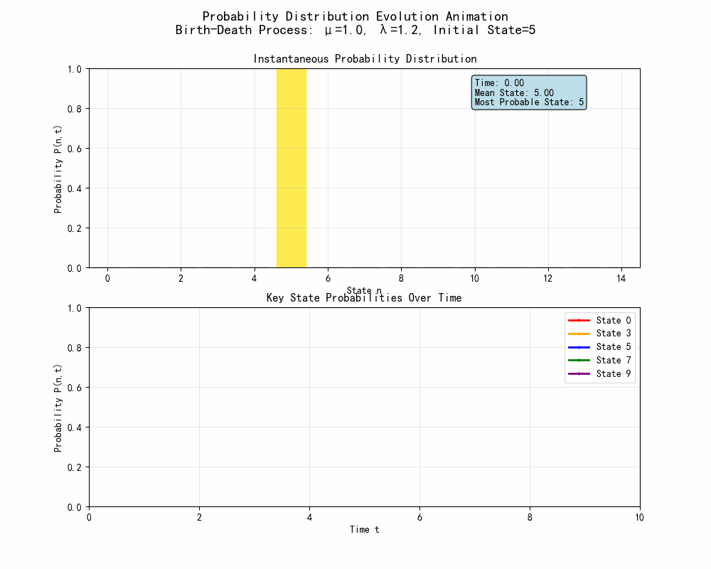
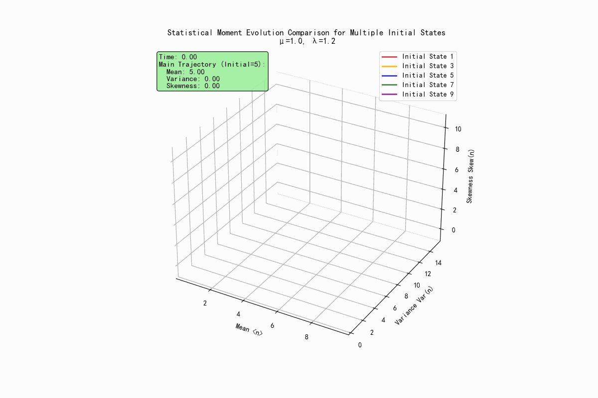
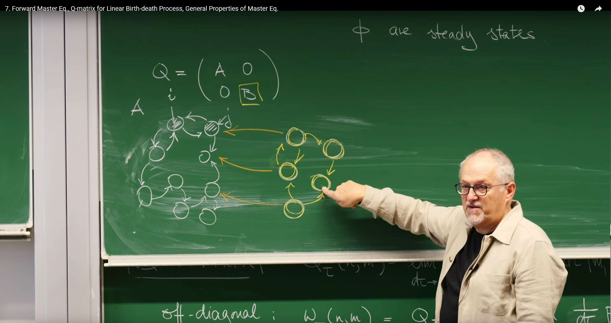
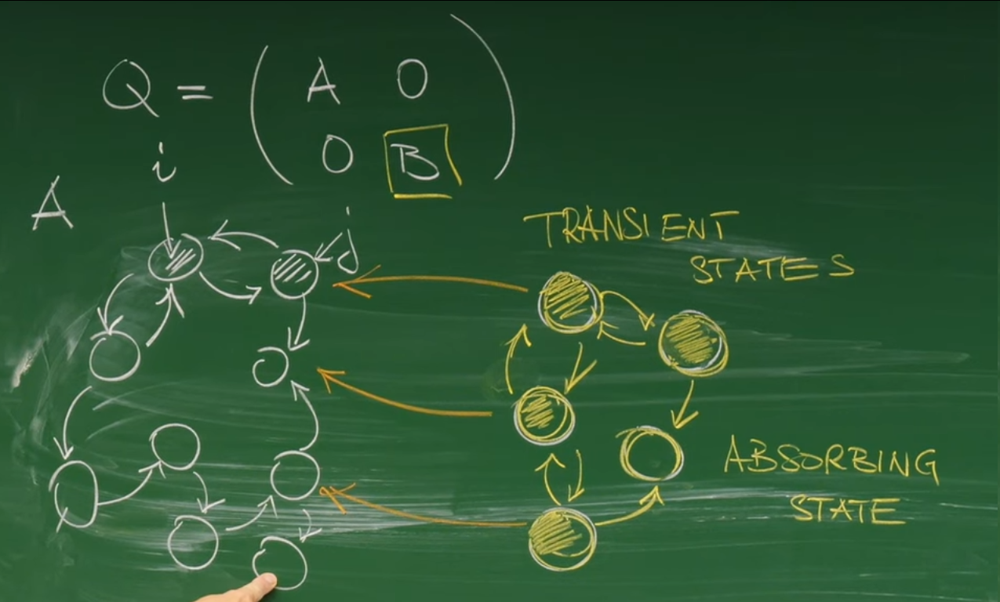

# 引言:从全局跳转到瞬时速率

在上一讲中,我们学习了查普曼-科尔莫戈罗夫(Chapman-Kolmogorov, CK)方程,它是描述马尔可夫过程演化的基石。CK方程提供了一个全局视角,告诉我们系统在有限时间间隔内从一个状态转移到另一个状态的概率是如何通过所有可能的中间状态联系起来的。然而,在物理和化学的许多实际问题中,我们更关心的是系统状态随时间**瞬时**如何变化。我们希望有一个类似于牛顿力学中 $F = ma$ 的方程,它不描述整个轨迹,而是描述在任意时刻系统状态变化的"驱动力"或速率。

这节课 Erwin Frey教授的目标正是带领我们推导出这样一个更为强大的工具:一个描述概率分布**瞬时变化率**的微分方程(主方程)。通过将CK方程中有限的时间步长推向无穷小极限,我们将从一个描述有限时间跳转的积分型方程,过渡到一个描述瞬时概率流动的微分型方程。这种从全局到局部的视角转变,不仅在数学上更易于处理,也更符合我们对动态过程的物理直觉。

# 1. 主方程的推导

## 1.1 回顾:作为起点的查普曼-科尔莫戈罗夫方程



让我们从上一讲的核心内容——CK方程开始。对于一个离散状态空间中的马尔可夫过程,CK方程描述了条件概率如何随时间演化。给定三个时间点 $t_0 < t' < t$,系统从初始状态 $n_0$ 演化到最终状态 $n$ 的概率,可以通过对所有可能在中间时刻 $t'$ 出现的中间状态 $m$ 进行求和得到:

$$
P(n,t|n_0,t_0) = \sum_m P(n,t|m,t')P(m,t'|n_0,t_0)
$$

这个方程体现了马尔可夫过程的"无记忆性":系统在 $t'$ 时刻之后如何演化,只取决于它在 $t'$ 时刻所处的状态 $m$,而与它如何到达该状态的历史无关。

正如教授在课堂上回顾的,基于CK方程,我们可以从两个不同的角度来考察时间的演化:

* **前向方程(Forward Equation)**:固定初始状态 $(n_0,t_0)$ 和中间时刻 $t'$,考察最终状态的概率 $P(n,t|\cdot)$ 如何随着时间 $t$ 向前演化。

* **后向方程(Backward Equation)**:固定最终状态 $(n,t)$ 和中间时刻 $t'$,考察初始状态的概率 $P(\cdot|n_0,t_0)$ 如何随着时间 $t_0$ 向后演化。

在本节课中,我们的焦点将完全集中在**前向主方程**上,因为它描述了我们通常最关心的物理过程:**一个系统从一个确定的初始状态出发,其概率分布如何随着时间的流逝而演变。**

## 1.2 从有限时间步到瞬时视角

为了得到一个描述概率瞬时变化的微分方程,我们的核心策略是考察在一个无穷小的时间间隔 $d\tau$ 内概率的变化。我们从概率 $P(n,\tau|n_0,t_0)$ 对时间 $\tau$ 的导数的定义出发:

$$
\partial_\tau P(n,\tau|n_0,t_0) = \lim_{d\tau \to 0} \frac{1}{d\tau}[P(n,\tau+d\tau|n_0,t_0) - P(n,\tau|n_0,t_0)]
$$

这个表达式的物理意义是概率 $P(n,\tau|\cdot)$ 的瞬时变化率。现在,我们的任务是利用CK方程来处理分子中的第一项 $P(n,\tau+d\tau|n_0,t_0)$。我们将CK方程中的时间点设置为 $t=\tau+d\tau$,$t'=\tau$ 和 $t_0$。这样,CK方程就变成了:

$$
P(n,\tau+d\tau|n_0,t_0) = \sum_m P(n,\tau+d\tau|m,\tau)P(m,\tau|n_0,t_0)
$$

这个式子告诉我们,要在 $\tau+d\tau$ 时刻处于状态 $n$,系统必须在 $\tau$ 时刻处于某个中间状态 $m$,然后在无穷小的时间间隔 $d\tau$ 内从 $m$ 转移到 $n$。

现在,我们将这个结果代入导数的定义式中:

$$
\partial_\tau P(n,\tau|\cdot) = \lim_{d\tau \to 0} \frac{1}{d\tau}\left[\sum_m P(n,\tau+d\tau|m,\tau)P(m,\tau|\cdot) - P(n,\tau|\cdot)\right]
$$

为了将分子中的第二项也纳入求和符号中,我们使用一个巧妙的技巧:引入克罗内克(Kronecker)delta函数 $\delta_{nm}$。我们知道 $\sum_m \delta_{nm}P(m,\tau|\cdot) = P(n,\tau|\cdot)$。利用这个恒等式,我们可以将上式改写为 (1):

$$
\partial_{\tau} P(n, \tau \mid \cdot) = \lim_{d\tau \to 0} \frac{1}{d\tau} \sum_{m} \left[ P(n, \tau + d\tau \mid m, \tau) P(m, \tau \mid \cdot) - \delta_{nm} P(m, \tau \mid \cdot) \right]
$$

整理后得到:

$$
\partial_{\tau} P(n, \tau \mid \cdot) = \sum_{m} \left( \lim_{d\tau \to 0} \frac{P(n, \tau + d\tau \mid m, \tau) - \delta_{nm}}{d\tau} \right) P(m, \tau \mid \cdot)
$$

这个方程就是**前向主方程**的雏形。它将状态 $n$ 的概率随时间的瞬时变化(左侧)与所有其他状态 $m$ 的概率(右侧的 $P(m,\tau|\cdot)$)以及它们向状态 $n$ 的转移能力(括号内的极限项)联系了起来。

这个推导过程标志着我们分析方法的一次根本性转变。CK方程回答的是一个**全局性**的问题:"系统如何通过中间状态B从A到达C?" 而我们刚刚推导出的主方程,通过取 $d\tau \to 0$ 的极限,回答了一个更强大、更局部的物理问题:"**在此刻,概率是如何流入和流出当前状态的?**" 这类似于在经典力学中,从计算一段旅程的平均速度,发展到定义任意时刻的瞬时速度。这种局域化的微分形式,是物理学中绝大多数动力学理论的基石。

# 2. Q 矩阵:时间演化的引擎

在上一节的推导中,介绍了一个核心的数学结构,它描述了在无穷小时间间隔内从一个状态到另一个状态的转移概率。为了简化表达并揭示其深刻的物理内涵,我们将其定义为一个矩阵,即**Q矩阵**,也称为**无穷小生成元(infinitesimal generator)或转移速率矩阵(transition rate matrix)**。

## 2.1 Q 矩阵的正式定义

根据上一节的推导,Q矩阵的元素 $Q_\tau(n,m)$ 被定义为:

$$
Q_{\tau}(n, m) = \lim_{d\tau \to 0} \frac{1}{d\tau} \left[ P(n, \tau + d\tau \mid m, \tau) - \delta_{nm} \right]
$$

这个定义非常精炼,它将系统在无穷小时间内的所有转移信息都封装在了矩阵 $Q$ 中。引入Q矩阵后,上一节推导出的主方程可以被写成一个极为紧凑和优美的矩阵形式:

为避免记号混淆,本文采用如下约定: $Q_{\text{row},\,\text{col}}$ 表示从“列”对应的状态跳到“行”对应的状态(即 col→row 的速率),因此 $Q$ 的“列和”为零。

$$
\partial_{\tau} P(n, \tau \mid \cdot) = \sum_{m} Q_{\tau}(n, m) P(m, \tau \mid \cdot)
$$

如果我们用向量 $\vec{P}(\tau)$ 来表示所有状态的概率分布,其中第 $n$ 个分量是 $P(n, \tau)$,那么整个系统的时间演化可以被一个简洁的线性常微分方程组描述:

$$
\partial_{\tau} \vec{P}(\tau \mid t_0) = Q_{\tau} \vec{P}(\tau \mid t_0)
$$

这个方程就是**前向主方程**的最终形式。它表明,概率向量的时间导数(即概率分布的变化速率)完全由Q矩阵作用在当前的概率向量上决定。给定一个初始概率分布 $\vec{P}(t_0)$,求解这个微分方程组就能得到系统在任何未来时刻的概率分布。Q矩阵就像是驱动系统概率演化的引擎。

## 2.2 解构Q矩阵

为了深刻理解Q矩阵的物理意义,我们需要仔细分析其矩阵元素的构成。

### 非对角元素 ($Q_{nm}$,$n \neq m$):转移速率

当 $n \neq m$ 时,克罗内克delta函数 $\delta_{nm} = 0$。此时,Q矩阵的非对角元素定义为:

$$
Q_{nm} = w(n,m) = \lim_{d\tau \to 0} \frac{P(n,\tau+d\tau|m,\tau)}{d\tau}
$$

这个表达式的物理意义是,当系统处于状态 $m$ 时,在无穷小的时间间隔 $d\tau$ 内转移到状态 $n$ 的概率 $P(n,\tau+d\tau|m,\tau)$,除以该时间间隔 $d\tau$。这正是从状态 $m$ 跳转到状态 $n$ 的瞬时概率速率,我们称之为转移速率(transition rate)。由于概率 $P$ 是非负的,所以所有的非对角元素必然满足 $Q_{nm} \geq 0$。

### 对角元素 ($Q_{mm}$): 负的离开速率

当 $n = m$ 时,克罗内克delta函数 $\delta_{mm} = 1$。此时,Q矩阵的对角元素定义为:

$$
Q_{mm} = \lim_{d\tau \to 0} \frac{P(m,\tau+d\tau|m,\tau) - 1}{d\tau}
$$

这里的 $P(m,\tau+d\tau|m,\tau)$ 是系统在 $d\tau$ 时间内保持在状态 $m$ 的概率。因此,$1-P(m,\tau+d\tau|m,\tau)$ 就是系统离开状态 $m$ 的总概率。所以,$Q_{mm}$ 可以被理解为负的单位时间离开概率,我们定义 $w(m) = -Q_{mm}$ 为从状态 $m$ 的总离开速率(exit rate)。由于保持概率 $P(m,\tau+d\tau|m,\tau) \leq 1$,所以对角元素必然满足 $Q_{mm} \leq 0$。

## 2.3 基本约束:概率守恒

Q矩阵最重要的一个性质是:**每一列的元素之和恒为零**。这个性质并非凭空而来,它直接源于概率守恒这一基本物理原理。

考虑系统在 $\tau$ 时刻处于状态 $m$。在经过一个无穷小的时间间隔 $d\tau$ 后,它必然会转移到状态空间中的某个状态 $n$(包括保持在状态 $m$ 本身)。因此,从状态 $m$ 出发到所有可能状态 $n$ 的转移概率之和必须为1:

$$
\sum_n P(n,\tau+d\tau|m,\tau) = 1
$$

现在,我们从这个等式两边同时减去1,然后除以 $d\tau$ 并取极限。注意到 $1 = \sum_n \delta_{nm}$,我们可以得到:

$$
\lim_{d\tau \to 0} \frac{1}{d\tau} \left( \sum_{n} P(n, \tau + d\tau \mid m, \tau) - \sum_{n} \delta_{nm} \right) = 0
$$

将求和与极限交换顺序(对于有限状态空间),我们得到:

$$
\sum_{n} \left( \lim_{d\tau \to 0} \frac{P(n, \tau + d\tau \mid m, \tau) - \delta_{nm}}{d\tau} \right) = 0
$$

括号内的表达式正是Q矩阵元素的定义,因此我们得到了核心结论:

$$
\sum_{n} Q_{nm} = 0
$$

这个性质具有深刻的物理含义。它表明,对角元素(负的离开速率)必须精确地等于该列所有非对角元素(到其他所有状态的转移速率)之和:

$$
w(m) = -Q_{mm} = \sum_{n \neq m} Q_{nm} = \sum_{n \neq m} w(n, m)
$$

换句话说,**系统离开一个状态的总速率,必须等于它跳转到所有其他可能状态的速率之和**。Q矩阵的代数性质并非抽象的数学规则,而是概率守恒这一物理定律的直接数学体现。从概率必须归一化出发,我们推导出在一个小时间步内,离开和保持的概率之和为1。Q矩阵正是基于这些概率在无穷小极限下的定义。因此,Q矩阵“列和为零”的数学约束,就是概率守恒定律的代数编码。**对角元素的"损失"必须与该列所有非对角元素的"增益"完美平衡。**

为了方便快速掌握,将Q矩阵的核心特性总结在下表中。

#### 表1:Q矩阵的解构

| 矩阵元素 | 数学定义 | 物理意义 | 约束条件 |
|----------|----------|----------|----------|
| 非对角元 $Q_{nm}$ ($n \neq m$) | $w(n,m) = \lim_{d\tau \to 0} \frac{P(n,\tau+d\tau\|m,\tau)}{d\tau}$ | 从状态 $m$ 到状态 $n$ 的转移速率 | $Q_{nm} \geq 0$ |
| 对角元 $Q_{mm}$ | $-w(m) = \lim_{d\tau \to 0} \frac{P(m,\tau+d\tau\|m,\tau) - 1}{d\tau}$ | 负的从状态 $m$ 的总离开速率 | $Q_{mm} \leq 0$ |
| 行和约束 | $\sum_n Q_{nm} = 0$ | 概率守恒定律 | 对所有 $m$ 成立 |


# 3. 主方程的物理直觉:增益与损失的平衡

虽然主方程的矩阵形式 $\partial_\tau P = QP$ 非常简洁,但它的另一个等价形式——"增益-损失"形式,为我们提供了更清晰的物理图像。

## 3.1 重写主方程 

我们可以利用上一节对Q矩阵元素的定义,将主方程 $\partial_\tau P(n,\tau) = \sum_m Q_{nm} P(m,\tau)$ 展开。我们将求和项中的对角项 ($m=n$) 和非对角项 ($m \neq n$) 分开:

$$
\partial_\tau P(n,\tau) = Q_{nn} P(n,\tau) + \sum_{m \neq n} Q_{nm} P(m,\tau)
$$

代入 $Q_{nm} = w(n,m)$ 和 $Q_{nn} = -\sum_{m \neq n} w(m,n)$,我们得到:

$$
\partial_{\tau} P(n, \tau) = \sum_{m \neq n} w(n, m) P(m, \tau) - \left( \sum_{m \neq n} w(m, n) \right) P(n, \tau)
$$

这个方程可以进一步整理成一个对称且直观的形式:

$$
\partial_{\tau} P(n, \tau) = \sum_{m \neq n} \left[ w(n, m) P(m, \tau) - w(m, n) P(n, \tau) \right]
$$

这就是主方程的**增益-损失(Gain-Loss)**形式。

## 3.2 物理诠释

这个形式的方程为我们描绘了一幅物理图景,即状态 $n$ 的概率变化是由流入和流出的"概率流"决定的。



**增益项(Gain Term): $w(n,m)P(m,\tau)$**


* 这个项代表从状态 $m$ **流入**状态 $n$ 的概率流。

* $P(m,\tau)$ 是系统在 $\tau$ 时刻处于状态 $m$ 的概率。

* $w(n,m)$ 是从 $m$ 转移到 $n$ 的速率。

* 两者的乘积 $w(n,m)P(m,\tau)$ 就是单位时间内,由于从状态 $m$ 的跳转而使状态 $n$ 的概率增加的量。

* 总的增益是把所有其他状态 $m$ 的贡献加起来:$\sum_{m \neq n} w(n,m) P(m,\tau)$。

  

**损失项(Loss Term): $-w(m,n)P(n,\tau)$**


* 这个项代表从状态 $n$ **流出**到状态 $m$ 的概率流。
* $P(n,\tau)$ 是系统在 $\tau$ 时刻处于状态 $n$ 的概率。
* $w(m,n)$ 是从 $n$ 转移到 $m$ 的速率。
* 两者的乘积 $w(m,n)P(n,\tau)$ 就是单位时间内,由于向状态 $m$ 的跳转而使状态 $n$ 的概率减少的量。
* 总的损失是把所有可能的去向 $m$ 的贡献加起来:$\sum_{m \neq n} w(m,n) P(n,\tau)$。


因此,增益-损失方程的物理意义是:**状态 $n$ 的概率的净变化率 = (所有流入状态 $n$ 的总概率流速率) - (所有从状态 $n$ 流出的总概率流速率)。**

这种表述方式揭示了主方程的本质。在物理学中,描述守恒量输运的方程被称为**连续性方程**。例如,电荷守恒方程 $\partial\rho/\partial t + \nabla \cdot J = 0$ 表明,一个体积内电荷密度的变化率等于通过其边界的净电流通量。我们这里的增益-损失方程正是概率在离散状态空间中的连续性方程。

$P(n,\tau)$ 相当于在"位置" $n$ 的"概率密度",$\partial_\tau P(n,\tau)$ 是这个密度的变化率,而右边的项 $\sum_{m \neq n}[J_{n \leftarrow m} - J_{m \leftarrow n}]$(其中概率流 $J_{n \leftarrow m} = w(n,m)P(m,\tau)$)则代表了流入"位置" $n$ 的净"概率流"。通过这种类比,我们将主方程从一个普通的常微分方程,提升到了一个描述基本守恒定律的输运方程的高度,将它与物理学中其他广泛的现象联系起来。

# 4. 案例研究:线性出生-死亡过程

现在,我们将应用主方程和Q矩阵的框架来分析一个在种群动力学、化学反应和排队论中都非常重要的模型:**线性出生-死亡过程**。

## 4.1 定义系统

我们考虑一个由许多相同个体(例如分子、细胞或生物)组成的种群,其数量为 $n$。这个系统只允许发生两种类型的随机事件:

* **出生(Birth)**: 某个个体以速率 $\mu$ 复制自身,导致种群数量增加1。这个过程可以表示为 $A \xrightarrow{\mu} 2A$。如果种群中有 $n$ 个个体,那么总的出生速率与 $n$ 成正比。因此,从状态 $n$ 转移到 $n+1$ 的速率为 $w(n+1,n) = \mu n$。

* **死亡(Death)**: 某个个体以速率 $\lambda$ 从系统中消失。这个过程可以表示为 $A \xrightarrow{\lambda} \emptyset$。同样,总的死亡速率与种群数量 $n$ 成正比。因此,从状态 $n$ 转移到 $n-1$ 的速率为 $w(n-1,n) = \lambda n$。

在这个模型中,状态 $n=0$ 是一个非常特殊的状态。当种群数量为零时,没有个体可以进行出生或死亡,因此系统的总出生和死亡速率都为零。这意味着,一旦系统进入 $n=0$ 的状态,它将永远停留在那里。这种状态被称为**吸收态(absorbing state)**。

## 4.2 构建出生-死亡过程的Q矩阵

现在,我们根据上述规则,一步步地构建这个过程的Q矩阵。矩阵的行和列都由种群数量 $n=0,1,2,\ldots$ 来索引。


**非对角元素**:


* 对于从 $n$ 到 $n+1$ 的转移(出生),我们有 $Q_{n+1,n} = w(n+1,n) = \mu n$。这些元素位于主对角线的上方(上对角线)。
* 对于从 $n$ 到 $n-1$ 的转移(死亡),我们有 $Q_{n-1,n} = w(n-1,n) = \lambda n$。这些元素位于主对角线的下方(下对角线)。
* 由于每次只能出生或死亡一个个体,所以不存在跳跃超过一个单位的转移,例如从 $n$ 到 $n+2$。因此,所有其他的非对角元素都为零。


**对角元素**:


* 对角元素 $Q_{n,n}$ 是负的总离开速率。从状态 $n$ 出发,系统只能转移到 $n+1$ 或 $n-1$。因此,总离开速率是这两个过程的速率之和:$w(n) = w(n+1,n) + w(n-1,n) = \mu n + \lambda n = (\mu + \lambda)n$。

* 所以,对角元素为 $Q_{n,n} = -(\mu + \lambda)n$。

* 对于吸收态 $n=0$,离开速率为零,所以 $Q_{0,0} = 0$。

  



综上所述,线性出生-死亡过程的Q矩阵具有一个非常清晰的**三对角结构**:

$$
Q = \begin{pmatrix}
0 & 0 & 0 & 0 & \cdots \\
\lambda & -(\mu+\lambda) & \mu & 0 & \cdots \\
0 & 2\lambda & -2(\mu+\lambda) & 2\mu & \cdots \\
0 & 0 & 3\lambda & -3(\mu+\lambda) & \cdots \\
\vdots & \vdots & \vdots & \vdots & \ddots
\end{pmatrix}
$$


这个例子展示了一个深刻的原理:**Q矩阵的结构是系统微观动力学规则的直接"指纹"。**出生-死亡过程只允许种群数量变化 $\pm 1$,这在状态空间中构成了"最近邻"的跳转。当我们把这些规则翻译成Q矩阵时,我们自然地得到了一个只有主对角线和紧邻的上下两条对角线非零的稀疏矩阵。这是一个普遍的规律:Q矩阵的稀疏模式直接反映了状态空间图的连通性。一个三对角矩阵意味着状态构成了一个一维链。相反,如果一个Q矩阵是稠密的,则意味着任何状态都可能直接转移到任何其他状态。

## 4.3 Python模拟与可视化:从静态结构到动态演化

为了更直观地理解Q矩阵的结构,我们可以使用Python代码来生成并可视化它。这与教授在黑板上绘制的示意图是一致的。


```python
import numpy as np
import matplotlib.pyplot as plt
import seaborn as sns

def create_birth_death_q_matrix(N, mu, lam):
    """
    Construct the Q matrix for a linear birth-death process.

    Parameters:
    N (int): Size of the state space (from 0 to N-1). This is a truncation, as theoretically the state space is infinite.
    mu (float): Birth rate per individual.
    lam (float): Death rate per individual (lambda is a keyword in python, so we use lam).

    Returns:
    numpy.ndarray: Q matrix of size (N, N).
    """
    # Initialize an N x N zero matrix
    Q = np.zeros((N, N))

    # Fill non-diagonal elements
    for n in range(1, N):
        # Death process: n -> n-1
        # Q_{n-1, n} = w(n-1, n) = lambda * n
        Q[n-1, n] = lam * n
        # Birth process: n-1 -> n
        # Q_{n, n-1} = w(n, n-1) = mu * (n-1)
        Q[n, n-1] = mu * (n-1)

    # Fill diagonal elements
    # Q_{n,n} = - (exit rate) = - (birth rate + death rate)
    for n in range(N):
        # Exit rate is the negative sum of all non-diagonal elements in this column
        # This is also equivalent to - (mu * n + lam * n)
        # Note: The row sum of Q matrix is 0, but here we follow the professor's board notation,
        # where transition rates are placed in Q_{destination, source}, so the column sum is 0.
        # If it's the standard mathematical notation Q_{i,j} representing transition from j->i, then the column sum is 0.
        # If it's the common notation in probability theory Q_{i,j} representing transition from i->j, then the row sum is 0.
        # The implementation here follows Q[row, col] = Q_{row, col}, i.e., transition from col to row, so the column sum is 0.
        # Q_{n,n} = - sum_{m!=n} Q_{m,n}
        Q[n, n] = -np.sum(Q[:, n])

    return Q

# --- Parameter settings ---
N_states = 15  # State space size (0, 1,..., 14)
mu = 1.0       # Birth rate
lambda_rate = 1.2 # Death rate

# Create Q matrix
Q_matrix = create_birth_death_q_matrix(N_states, mu, lambda_rate)

# --- Visualization ---
plt.figure(figsize=(10, 8))
sns.heatmap(Q_matrix, annot=True, fmt=".1f", cmap="vlag", linewidths=.5, cbar=True)
plt.title(f'Q-Matrix for Linear Birth-Death Process (N={N_states}, μ={mu}, λ={lambda_rate})', fontsize=16)
plt.xlabel('Source State (m)', fontsize=12)
plt.ylabel('Destination State (n)', fontsize=12)
plt.gca().xaxis.tick_top()
plt.gca().xaxis.set_label_position('top')
plt.show()

print("Q Matrix (truncated):")
print(np.round(Q_matrix, 2))
```



主对角线(蓝色):这些是负的离开速率 $Q_{n,n} = -(\mu + \lambda)n$,其绝对值随 $n$ 线性增加。上对角线(红色):这些是出生率 $Q_{n+1,n} = \mu n$,也随 $n$ 线性增加。下对角线(红色):这些是死亡率 $Q_{n-1,n} = \lambda n$,同样随 $n$ 线性增加。其他区域:全部为零,表示不存在"长距离"的跳转。

## 4.4 概率与相空间演化

有了Q矩阵这个"引擎",我们现在可以数值求解主方程 $\partial_\tau \vec{P} = Q\vec{P}$,观察概率分布如何从一个确定的初始状态演化到稳态分布。理论告诉我们稳态是什么,但没有说明系统如何到达稳态,而演化过程中的瞬态行为同样重要,它反映了系统的松弛动力学,动画能直观展示"概率流"这一抽象概念的具体表现。
现在我们求解主方程,观察概率分布如何随时间动态演化:

```python
"""
Probability Evolution and Phase Space Animation Demonstration

"""

import numpy as np
import matplotlib.pyplot as plt
import matplotlib.animation as animation
from scipy.integrate import odeint

# Set English font and mathematical formula display
plt.rcParams['font.sans-serif'] = ['SimHei', 'Microsoft YaHei']
plt.rcParams['axes.unicode_minus'] = False
plt.rcParams['mathtext.fontset'] = 'stix'  

class BirthDeathAnimator:
    """Birth-Death Process Animation Demonstration Class"""
    
    def __init__(self, N=15, mu=1.0, lam=1.2):
        """
        Initialize parameters
        N: State space size
        mu: Birth rate
        lam: Death rate
        """
        self.N = N
        self.mu = mu
        self.lam = lam
        self.Q = self._create_q_matrix()
        
        # Animation time settings
        self.t_max = 10
        self.n_frames = 150
        self.t_points = np.linspace(0, self.t_max, self.n_frames)
        
    def _create_q_matrix(self):
        """Create Q matrix for birth-death process"""
        Q = np.zeros((self.N, self.N))
        
        # Fill transition rates
        for n in range(1, self.N):
            if n < self.N - 1:
                Q[n+1, n] = self.mu * n  # Birth: n -> n+1
            Q[n-1, n] = self.lam * n     # Death: n -> n-1
            
        # Fill diagonal elements (negative exit rates)
        for n in range(self.N):
            Q[n, n] = -np.sum(Q[:, n])
            
        return Q
    
    def solve_master_equation(self, initial_state):
        """Solve master equation dP/dt = Q·P"""
        def master_eq(P, t):
            return self.Q @ P
        
        # Initial condition: all probability concentrated at initial_state
        P0 = np.zeros(self.N)
        P0[initial_state] = 1.0
        
        # Numerically solve ODE
        P_t = odeint(master_eq, P0, self.t_points)
        return P_t
    
    def create_probability_evolution_animation(self, initial_state=5, save_path=None):
        """
        Create probability evolution animation
        Display: 1) Probability distribution bar chart 2) Time series of key states
        """
        P_t = self.solve_master_equation(initial_state)
        
        # Create figure and subplots
        fig, (ax1, ax2) = plt.subplots(2, 1, figsize=(10, 8))
        fig.suptitle(f'Probability Distribution Evolution Animation\n' + 
                    f'Birth-Death Process: μ={self.mu}, λ={self.lam}, Initial State={initial_state}', 
                    fontsize=14, fontweight='bold')
        
        # === Subplot 1: Probability distribution bar chart ===
        states = np.arange(self.N)
        bars = ax1.bar(states, P_t[0], alpha=0.8, color='skyblue', edgecolor='navy')
        ax1.set_xlim(-0.5, self.N-0.5)
        ax1.set_ylim(0, 1.0)
        ax1.set_xlabel('State n')
        ax1.set_ylabel('Probability P(n,t)')
        ax1.set_title('Instantaneous Probability Distribution')
        ax1.grid(True, alpha=0.3)
        
        # Statistics text (avoid overlap)
        stats_text = ax1.text(0.7, 0.95, '', transform=ax1.transAxes, 
                             verticalalignment='top', fontsize=10,
                             bbox=dict(boxstyle="round,pad=0.3", facecolor="lightblue", alpha=0.8))
        
        # === Subplot 2: Time evolution of key states ===
        key_states = [0, max(1, initial_state-2), initial_state, 
                     min(initial_state+2, self.N-1), min(initial_state+4, self.N-1)]
        colors = ['red', 'orange', 'blue', 'green', 'purple']
        lines = []
        
        for state, color in zip(key_states, colors):
            line, = ax2.plot([], [], color=color, linewidth=2, 
                           label=f'State {state}', marker='o', markersize=2)
            lines.append((line, state))
        
        ax2.set_xlim(0, self.t_max)
        ax2.set_ylim(0, 1.0)
        ax2.set_xlabel('Time t')
        ax2.set_ylabel('Probability P(n,t)')
        ax2.set_title('Key State Probabilities Over Time')
        ax2.legend(loc='upper right', fontsize=10)
        ax2.grid(True, alpha=0.3)
        
        # Time indicator line
        time_line = ax2.axvline(x=0, color='black', linestyle='--', alpha=0.7)
        
        def animate(frame):
            """Animation update function"""
            current_time = self.t_points[frame]
            current_prob = P_t[frame]
            
            # Update bar chart
            for bar, prob in zip(bars, current_prob):
                bar.set_height(prob)
                # Adjust color intensity based on probability
                intensity = prob / np.max(current_prob) if np.max(current_prob) > 0 else 0
                bar.set_color(plt.cm.viridis(intensity))
            
            # Calculate and display statistics
            mean_state = np.sum(states * current_prob)
            max_prob_state = states[np.argmax(current_prob)]
            
            stats_text.set_text(
                f'Time: {current_time:.2f}\n'
                f'Mean State: {mean_state:.2f}\n'
                f'Most Probable State: {max_prob_state}'
            )
            
            # Update time series
            for line, state in lines:
                if frame > 0:
                    x_data = self.t_points[:frame+1]
                    y_data = P_t[:frame+1, state]
                    line.set_data(x_data, y_data)
            
            # Update time indicator line
            time_line.set_xdata([current_time, current_time])
            
            return [*bars, stats_text, *[line for line, _ in lines], time_line]
        
        # Create animation
        anim = animation.FuncAnimation(fig, animate, frames=self.n_frames, 
                                     interval=80, blit=False, repeat=True)
        
        # Save animation
        if save_path:
            print(f"Saving probability evolution animation to {save_path}...")
            anim.save(save_path, writer='pillow', fps=12, dpi=100)
            print("Save complete!")
        
        plt.tight_layout()
        plt.show()
        return anim
    
    def create_phase_space_animation(self, initial_state=5, save_path=None):
        """
        Create phase space evolution animation
        Display comparison of statistical moment evolution trajectories for multiple initial states
        """
        # Calculate evolution for multiple different initial states
        initial_states = [1, max(2, initial_state-2), initial_state, 
                         min(initial_state+2, self.N-2), min(initial_state+4, self.N-2)]
        colors = ['red', 'orange', 'blue', 'green', 'purple']
        all_moments = []
        
        for init_state in initial_states:
            P_t = self.solve_master_equation(init_state)
            
            # Calculate statistical moments
            states = np.arange(self.N)
            moments = np.zeros((len(self.t_points), 3))
            
            for i, prob in enumerate(P_t):
                # First moment: mean
                moments[i, 0] = np.sum(states * prob)
                # Second central moment: variance
                moments[i, 1] = np.sum((states - moments[i, 0])**2 * prob)
                # Third normalized moment: skewness (simplified calculation)
                if moments[i, 1] > 1e-6:  # Avoid division by zero
                    moments[i, 2] = np.sum((states - moments[i, 0])**3 * prob) / (moments[i, 1]**(1.5))
                else:
                    moments[i, 2] = 0
            
            all_moments.append(moments)
        
        # Create 3D figure
        fig = plt.figure(figsize=(12, 8))
        ax = fig.add_subplot(111, projection='3d')
        
        # Initialize multiple trajectory lines and current points
        lines = []
        points = []
        for i, (color, init_state) in enumerate(zip(colors, initial_states)):
            line, = ax.plot([], [], [], color=color, linewidth=2, alpha=0.8, 
                           label=f'Initial State {init_state}')
            point, = ax.plot([], [], [], 'o', color=color, markersize=6)
            lines.append(line)
            points.append(point)
        
        # Set axes
        ax.set_xlabel('Mean <n>')
        ax.set_ylabel('Variance Var(n)')
        ax.set_zlabel('Skewness Skew(n)')
        ax.set_title(f'Statistical Moment Evolution Comparison for Multiple Initial States\nμ={self.mu}, λ={self.lam}')
        ax.legend()
        
        # Dynamically set axis ranges (based on all trajectories)
        all_moments_combined = np.concatenate(all_moments, axis=0)
        margin = 0.1
        ax.set_xlim(np.min(all_moments_combined[:, 0])*(1-margin), 
                   np.max(all_moments_combined[:, 0])*(1+margin))
        ax.set_ylim(np.min(all_moments_combined[:, 1])*(1-margin), 
                   np.max(all_moments_combined[:, 1])*(1+margin))
        z_range = np.max(all_moments_combined[:, 2]) - np.min(all_moments_combined[:, 2])
        ax.set_zlim(np.min(all_moments_combined[:, 2])-z_range*margin, 
                   np.max(all_moments_combined[:, 2])+z_range*margin)
        
        # Information text (avoid obstruction)
        time_text = ax.text2D(0.02, 0.98, '', transform=ax.transAxes, fontsize=11,
                             verticalalignment='top',
                             bbox=dict(boxstyle="round,pad=0.3", facecolor="lightgreen", alpha=0.8))
        
        def animate_phase(frame):
            """Phase space animation update function"""
            current_time = self.t_points[frame]
            
            # Update all trajectory lines and current points
            for i, (line, point, moments) in enumerate(zip(lines, points, all_moments)):
                if frame > 0:
                    line.set_data_3d(moments[:frame+1, 0], moments[:frame+1, 1], moments[:frame+1, 2])
                    point.set_data_3d([moments[frame, 0]], [moments[frame, 1]], [moments[frame, 2]])
            
            # Update time information (display information from main trajectory)
            main_moments = all_moments[2]  # Use middle initial state (index 2) as main display
            time_text.set_text(
                f'Time: {current_time:.2f}\n'
                f'Main Trajectory (Initial={initial_state}):\n'
                f'  Mean: {main_moments[frame, 0]:.2f}\n'
                f'  Variance: {main_moments[frame, 1]:.2f}\n'
                f'  Skewness: {main_moments[frame, 2]:.2f}'
            )
            
            return [*lines, *points, time_text]
        
        # Create animation
        anim = animation.FuncAnimation(fig, animate_phase, frames=self.n_frames, 
                                     interval=80, blit=False, repeat=True)
        
        # Save animation
        if save_path:
            print(f"Saving phase space animation to {save_path}...")
            anim.save(save_path, writer='pillow', fps=12, dpi=100)
            print("Save complete!")
        
        plt.show()
        return anim

# Demonstration usage
if __name__ == "__main__":
    print("=== Section 4.3 Probability Evolution and Phase Space Animation Demonstration ===\n")
    
    # Create animation demonstrator
    animator = BirthDeathAnimator(N=15, mu=1.0, lam=1.2)
    
    print("1. Generating probability evolution animation...")
    anim1 = animator.create_probability_evolution_animation(
        initial_state=5, 
        save_path="probability_evolution.gif"
    )
    
    print("\n2. Generating phase space evolution animation...")
    anim2 = animator.create_phase_space_animation(
        initial_state=5, 
        save_path="phase_space_evolution.gif"
    )
    
    print("\nAnimation generation complete!")
```



上图显示每个时刻所有状态的概率 $P(n,t)$,颜色深度动态反映概率大小(深色=高概率),展示概率如何从初始的"尖峰"逐渐"扩散"。下图追踪5个代表性状态的概率随时间变化:状态0是吸收态,概率单调增加;状态3位于初始状态下方,展示向低状态的概率转移;状态5是初始状态,概率先减少后趋于稳态值;状态7位于初始状态上方,展示概率扩散效应;状态9是更高状态,展示高状态区域的行为。



可以清晰看到概率从高状态向低状态的净流动,系统在(均值、方差、偏度)空间中的演化路径,轨迹最终收敛到稳态对应的固定点,反映了系统的松弛动力学。

# 5. 长期动力学与一般性质

构建了主方程和Q矩阵之后,一个自然而然的问题是:随着时间的推移,系统最终会演化到什么状态?是否存在一个稳定的平衡态?

## 5.1 达到平衡:稳态

当系统达到**稳态(steady state)**或**平稳分布(stationary distribution)**时,其概率分布将不再随时间变化。我们用向量 $\vec{\pi}$ 来表示这个稳态分布。从数学上讲,这意味着概率的时间导数为零:

$$
\partial_\tau \vec{P}(\tau) = 0
$$

将这个条件代入主方程 $\partial_\tau \vec{P} = Q\vec{P}$,我们立刻得到了寻找稳态分布的核心方程:

$$
Q\vec{\pi} = 0
$$

这个方程的含义是:稳态分布 $\vec{\pi}$ 是Q矩阵对应于特征值为0的右特征向量。这是一个非常深刻的结论,它将一个动力学问题(寻找不随时间变化的分布)转化为了一个线性代数问题(寻找矩阵的零空间)。

同时,我们之前已经知道,由于概率守恒,$Q$ 的**每一列之和为零**。这可以用向量形式写成 $(1,1,\ldots,1)Q = 0$,其中 $(1,1,\ldots,1)$ 是一个全1的行向量。这意味着,**全1向量是 $Q$ 对应于特征值为0的左特征向量**。

## 5.2 状态空间的结构



一个系统的长期行为不仅取决于转移速率,还深刻地依赖于其状态空间的"拓扑结构",即状态之间是如何连接的。

* **吸收态(Absorbing States)**: 如前所述,一个状态 $i$ 如果一旦进入就无法离开,则称为吸收态。在 $Q$ 矩阵(采用 col→row 记法)中,这意味着从状态 $i$ 的总离开速率为零,即 $Q_{ii} = 0$。由于**列和为零**,并且吸收态无出边,这也意味着该列除对角元外其余元素全为零,即对所有 $j\ne i$ 有 $Q_{ji}=0$。我们例子中的 $n=0$ 状态就是一个吸收态。

* **暂态(Transient States)**: 一个状态如果系统可以离开它,并且存在一个非零的概率永远不再返回,那么这个状态就是暂态。在有吸收态的系统中,所有非吸收态都是暂态,因为系统最终会被吸收态"捕获"。

* **不可约性(Irreducibility)**: 如果一个系统(或其状态的一个子集)中的任何一个状态都可以从任何其他状态经过有限步转移到达,那么这个系统就是**不可约的(irreducible)**。这意味着整个状态空间是"完全连通"的,不会分裂成几个互不通信的部分 。教授在黑板上画的块对角形式的Q矩阵(如下所示)就代表了一个**可约的(reducible)**系统,因为它分裂成了两个独立的子系统A和B,彼此之间无法通信。

$$
Q = \begin{pmatrix} A & 0 \\ 0 & B \end{pmatrix}
$$

## 5.3 佩龙-弗罗贝尼乌斯定理:唯一物理现实的保证

对于一个不可约的系统,我们关心是否存在一个物理上有意义的(即所有概率分量都为正)稳态,以及这个稳态是否是唯一的。强大的**佩龙-弗罗贝尼乌斯(Perron-Frobenius)定理**为我们提供了肯定的答案。

这个定理是线性代数中的一个深刻结果,对于具有非负非对角元素的矩阵(如Q矩阵的变体)有许多结论。对于我们所关心的不可约Q矩阵,该定理最重要的推论可以通俗地表述为:

1. **唯一性保证**: 特征值0是**单重根(simple)**,即它的代数重数为1。这意味着对应于特征值0的特征空间是一维的。因此,满足 $Q\vec{\pi} = 0$ 的解 $\vec{\pi}$ 在归一化($\sum_n \pi_n = 1$)之后是**唯一的**。

2. **物理性保证**: 这个唯一的稳态特征向量 $\vec{\pi}$ 的所有分量都可以被选择为**严格正值**($\pi_n > 0$ for all $n$)。这保证了解是一个物理上有意义的概率分布,其中每个状态在长期来看都有非零的概率被占据。

这个定理的意义是巨大的。我们可以为任何一组规则写下一个Q矩阵,但求解 $Q\vec{\pi} = 0$ 可能会得到多个解,或者解中包含负数,这将导致物理上的困境。

佩龙-弗罗贝尼乌斯定理告诉我们,只要系统满足一个直观的物理条件——不可约性(即系统内部是"充分混合"的),那么数学就能保证系统最终会演化到一个唯一的、物理上合理的平衡态。一个可约的系统(例如有吸收态的系统)的最终状态可能依赖于它的初始位置。但如果系统是不可约的,它总能从任何地方到达任何地方,不断地混合。

佩龙-弗罗贝尼乌斯定理从数学上证明了,正是这种"混合"特性(不可约性),保证了系统最终会稳定在一个明确的平衡态,并且在这个平衡态中,每一种构型都有可能出现($\pi_n > 0$)。**它将一个图论性质(状态空间的强连通性)与一个谱性质(特征值0的简并性)联系起来,而后者又保证了一个重要的物理性质(唯一稳态的存在)。**


# 总结

本讲教授带领我们完成了一次从宏观到微观,再回归宏观的理论构建:

1. 我们从描述有限时间演化的**查普曼-科尔莫戈罗夫方程**出发。

2. 通过取无穷小时间极限,我们推导出了描述概率瞬时变化的**前向主方程**,这是一个微分方程。

3. 我们将系统的所有转移速率信息封装在了一个核心的数学对象——**Q矩阵**中,它成为了驱动概率演化的"引擎"。

4. 通过分析Q矩阵的元素,我们将主方程诠释为一种物理上非常直观的**增益-损失平衡**,它本质上是概率的连续性方程。

5. 我们将这套理论框架应用于一个具体的**线性出生-死亡过程**,展示了如何根据微观规则构建Q矩阵,并理解其结构与系统动力学的关系。

6. 最后,我们探讨了系统的长期行为,并引入了**佩龙-弗罗贝尼乌斯定理**,揭示了状态空间的拓扑结构(不可约性)是如何保证系统能够达到一个唯一的、物理上合理的稳态平衡的。

通过这一讲的学习,我们确立了主方程作为描述连续时间马尔可夫过程概率演化的基本运动方程的地位。它不仅是一个强大的计算工具,更是一个深刻揭示随机系统动力学本质的理论框架。

