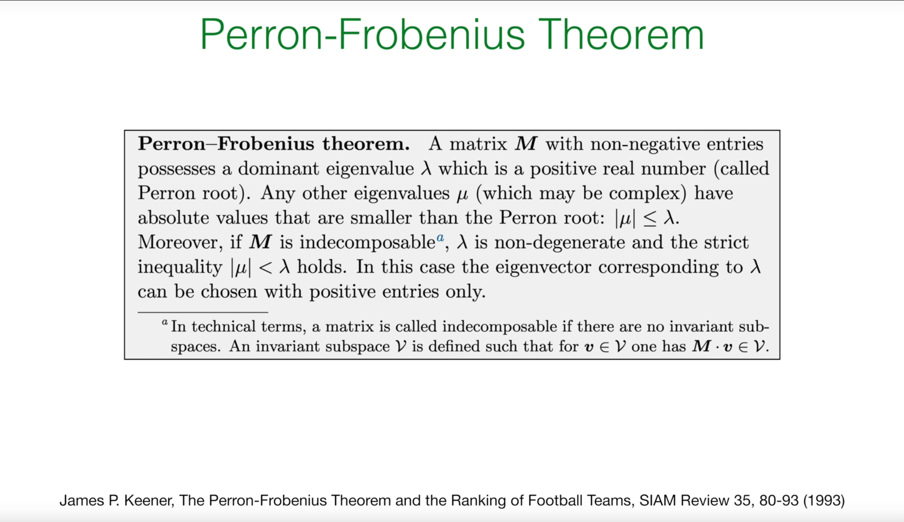

# 引言：探寻唯一且物理的稳态

在上一讲中，Erwin Frey 教授深入探讨了描述马尔可夫过程基本方程的核心工具——**前向主方程 (Forward Master Equation)** 和 **Q矩阵** (Q-matrix)。我们知道，一个系统的概率分布随时间的演化由以下简洁的矩阵方程所支配：

$$\frac{dP}{dt}(t) = QP(t)$$

其中，$P(t)$ 是一个列向量，其第 $n$ 个元素 $P_n(t)$ 代表系统在时刻 $t$ 处于状态 $n$ 的概率。$Q$ 矩阵，也称为转移速率矩阵，其元素定义为：

* **非对角元素** $Q_{nm} = w_{m \to n} \geq 0$ （对于 $n \neq m$），表示从状态 $m$ 转移到状态 $n$ 的速率。

* **对角元素** $Q_{nn} = -\sum_{m \neq n} w_{n \to m}$，表示离开状态 $n$ 的总速率。

我们还推导出了 $Q$ 矩阵的一个至关重要的性质：它的**列和为零**。

$$\sum_n Q_{nm} = 0$$


在物理学、化学、生物学和许多其他领域，我们最关心的往往不是瞬态行为，而是系统在长时间演化后最终会达到什么样的状态。这个最终的、不随时间改变的状态，我们称之为**稳态（steady state）或平衡态（equilibrium）**。正如教授在黑板上指出的那样，这个数学性质直接保证了系统中存在**稳态** (steady states)。一个稳态分布 $\pi$ 是指不随时间变化的概率分布，即 $\frac{d\pi}{dt} = 0$。代入主方程，我们得到稳态必须满足的条件：

$$Q\pi = 0$$

这正是线性代数中的一个本征方程，它告诉我们稳态 $\pi$ 是 $Q$ 矩阵对应于本征值为 0 的本征向量。列和为零的性质确保了 0 必定是 $Q$ 矩阵的一个本征值。

然而，上一讲的知识在这里给我们留下了一些关键的、悬而未决的物理问题：

1. **唯一性 (Uniqueness):** 这个稳态解 $\pi$ 是系统唯一的长期归宿吗？还是说系统可能存在多个不同的稳态，其最终状态取决于初始条件？

2. **物理性 (Physicality):** 作为一个概率分布，稳态向量的每个分量 $\pi_n$ 都必须是非负的，即 $\pi_n \geq 0$。我们能否保证这个数学解在物理上是有意义的？更进一步，我们能否保证 $\pi_n > 0$，即在稳态下，没有任何一个状态是完全不可能出现的？

3. **可达性 (Reachability):** 在什么样的物理条件下，这种唯一性和正定性才能够成立？

为了回答这些关于系统长期行为的核心问题，我们需要一个强大的数学工具，它专门处理具有特定性质的矩阵。这个工具就是**佩龙-弗罗贝尼乌斯定理 (Perron-Frobenius theorem)。**这节课的核心任务，就是利用这个定理，为我们所关心的随机过程建立一个坚实的理论基础，证明其在特定条件下必然会演化到一个唯一的、物理上有意义的稳态。

# 1. 佩龙-弗罗贝尼乌斯定理：一个关于正矩阵的强大保证

佩龙-弗罗贝尼乌斯定理（简称PF定理）是线性代数中一个深刻的结果，它揭示了具有非负元素的矩阵其本征值和本征向量的特殊性质。

佩龙-弗罗贝尼乌斯定理（Perron-Frobenius theorem）起源于20世纪初，由德国数学家奥斯卡·佩龙（Oskar Perron，1907年）和费迪南德·弗罗贝尼乌斯（Ferdinand Frobenius，1912年）分别提出和完善。该定理专门研究**非负矩阵**（所有元素≥0）和**正矩阵**（所有元素>0）的本征值性质，其核心结论是：对于不可约的非负矩阵，存在一个唯一的最大实本征值（佩龙根），且对应的本征向量所有分量都为正。

这个定理在现代科学中有着极其广泛的应用：在**马尔可夫链理论**中保证稳态分布的唯一性和物理性；在**人口动态学**中分析种群增长的长期行为；在**经济学**中研究投入产出模型和经济增长理论；在**网络科学**中计算网页排名（如Google的PageRank算法）和社交网络的影响力；在**生态学**中建模生态系统的稳定性；在**量子物理**中分析开放量子系统的演化。

PF定理为我们提供了一个强大的数学工具，能够从纯数学的角度保证许多物理和生物系统必然会演化到一个唯一的、物理上有意义的稳态，这使得它成为连接抽象数学理论与现实世界复杂系统行为的重要桥梁。




## 1.1 定理的陈述

该定理可以通俗地陈述如下：

对于一个所有元素均为**非负** ($M_{nm} \geq 0$) 且**不可分解 (indecomposable)** 的实方阵 $M$，以下结论成立：

1. 存在一个**唯一的、实的正本征值** $\lambda$，它在所有本征值中拥有最大的绝对值。也就是说，对于 $M$ 的任何其他本征值 $\mu$（可能是复数），都有 $|\mu| < \lambda$。这个特殊的本征值 $\lambda$ 被称为**佩龙根 (Perron root)** 或主导本征值。

2. 对应于佩龙根 $\lambda$ 的本征向量 $p^{(\lambda)}$ 是唯一的（在乘以一个正常数因子的意义下），并且可以选择使其所有分量都**严格为正** ($p_n^{(\lambda)} > 0$ 对所有 $n$ 成立)。

   


我们可以通过一张频谱图来直观地理解这个定理。对于一个满足条件的矩阵 $M$，其所有本征值都位于复平面上一个以原点为中心、半径为 $\lambda$ 的圆盘内。佩龙根 $\lambda$ 本身是位于正实轴上的一个孤立点，而所有其他本征值 $\mu$ 都严格地处于它的内侧。

## 1.2 核心条件的物理内涵

要理解PF定理的威力，我们必须深入剖析其两个核心前提条件。

### 非负性 ($M_{nm} \geq 0$)

这个条件在物理和生物模型中非常自然。矩阵的元素常常代表那些本质上不可能是负数的量，例如物种的数量、化学物质的浓度，或者在马尔可夫链中，转移的概率。这个条件是整个定理的基石。

### 不可分解性 (Indecomposability) 或 不可约性 (Irreducibility)

这是应用PF定理时最关键的物理条件。一个矩阵是不可分解的，意味着它所描述的系统是一个**整体**，而不是由几个相互隔离、互不连通的子系统组成的。这个概念可以通过以下几种方式来理解，以建立最强的物理直觉：


* **图论视角：** 我们可以将系统的每个状态 $n$ 想象成一个图的节点。如果矩阵元素 $M_{nm} > 0$，我们就在节点 $m$ 和节点 $n$ 之间画一个有向边，表示系统可以从状态 $m$ 转移到状态 $n$。那么，矩阵的**不可分解性**就等价于这个有向图是**强连通的** (strongly connected)。强连通意味着，从任何一个节点出发，都存在一条由有向边组成的路径，可以到达图中的任何其他节点。

* **物理视角：** 一个不可分解（或不可约）的系统，在物理上意味着系统能够随着时间的推移探索其所有可能的状态空间。系统中不存在所谓的"陷阱"或者"孤岛"——即某些状态的集合，系统一旦进入就再也无法离开，或者某些状态永远无法从系统的其他部分到达。正如教授在课堂上提到的，这等价于"所有状态都是可达的" (all states are reachable)。

* **形式化定义：** 在数学上，不可分解性被定义为矩阵不存在非平凡的**不变子空间** (invariant subspaces)。一个子空间 $V$ 是不变的，指的是对于任何属于该子空间的向量 $v \in V$，经过矩阵 $M$ 的变换后，结果 $Mv$ 仍然位于这个子空间内。

不可分解性是保证系统整体行为一致性的数学语言。如果一个系统是可分解的，就好像它被一道无形的墙分成了几个部分。从物理上看，这意味着系统的长期行为将完全取决于它的初始状态。如果它从"区域A"开始，它将永远被困在"区域A"的稳态中；如果从"区域B"开始，它将达到"区域B"的稳态。这就导致了多个可能的稳态，破坏了唯一性。

因此，**不可分解性**这个条件，通过排除这种"囚禁"可能性，迫使系统无论从哪里开始，最终都必须探索所有状态，并趋向于一个**全局统一的稳态**。这深刻地将一个抽象的数学条件与一个关键的物理性质——稳态的唯一性——联系在了一起。
# 2. 将定理应用于Q矩阵：唯一稳态的证明

我们面临一个直接的挑战：我们想要分析的 $Q$ 矩阵并不满足PF定理的"非负性"条件，因为它的对角元素 $Q_{nn}$ 是负数。那么，我们如何才能利用这个强大的定理呢？

这里的关键思想非常巧妙：我们不直接分析 $Q$ 矩阵，而是构造一个与之相关且满足PF定理条件的辅助矩阵 $M$。

## 2.1 构造一个非负矩阵 $M$

我们遵循教授在黑板上的推导，定义一个新的矩阵 $M$ 如下：

$$
M_{nm} := Q_{nm} + \alpha \delta_{nm}
$$

注：:= 符号的意思是：“定义为或设等于”

其中，$\delta_{nm}$ 是克罗内克函数（当 $n = m$ 时为 1，否则为 0），而 $\alpha$ 是一个精心选择的正常数，其值为系统中所有状态的最大出射速率：

$$\alpha = \max_n |Q_{nn}| = \max_n \sum_{m \neq n} w_{n \to m}$$

这个构造的本质是在 $Q$ 矩阵的对角线上加上一个足够大的正数 $\alpha$，从而"抬升"所有对角元素，使其变为非负。

## 2.2 逐步推导

现在，我们一步步地完成这个证明，它将回答我们最初关于稳态唯一性和物理性的问题。

1.**证明 $M$ 是非负矩阵：**

对于非对角元素 ($n \neq m$)，$M_{nm} = Q_{nm} = w_{m \to n} \geq 0$。

对于对角元素 ($n = m$)，$M_{nn} = Q_{nn} + \alpha = -\sum_{m \neq n} w_{n \to m} + \alpha$。根据 $\alpha$ 的定义，它是所有出射速率总和中的最大值，因此对于任何状态 $n$，都有 $\alpha \geq \sum_{m \neq n} w_{n \to m}$。这就保证了 $M_{nn} \geq 0$。

因此，我们构造的矩阵 $M$ 的所有元素都是非负的。

2.**关联 $Q$ 和 $M$ 的本征问题：**

$M$ 的本征方程是 $Mp = \lambda p$。将 $M$ 的定义代入，我们得到 $(Q + \alpha I)p = \lambda p$，其中 $I$ 是单位矩阵。整理后得到：

$$
Qp = (\lambda - \alpha)p
$$

这个关系式非常重要。它表明 $Q$ 和 $M$ 拥有**完全相同的本征向量**，而它们的本征值仅仅相差一个常数 $\alpha$。$Q$ 的本征值是 $M$ 的本征值减去 $\alpha$。


3.**对 $M$ 应用佩龙-弗罗贝尼乌斯定理：**

我们假设所研究的马尔可夫过程是不可约的，这意味着其状态空间是强连通的。这个性质直接保证了我们构造的矩阵 $M$ 是不可分解的。因此，$M$ 满足PF定理的所有条件。

根据PF定理，$M$ 存在一个唯一的、实的正的主导本征值，我们称之为 $\lambda_{PF}$，以及一个所有分量都严格为正的对应本征向量 $p^{(\lambda_{PF})}$。

4.**确定主导本征值 $\lambda_{PF}$ 的值：**


这是证明的核心步骤，完全复现了教授的黑板推导。我们将 $M$ 的本征方程对所有分量 $n$ 求和：

$$
\sum_n (Mp^{(\lambda_{PF})})_n = \sum_n \sum_m M_{nm} p_m^{(\lambda_{PF})} = \sum_n \lambda_{PF} p_n^{(\lambda_{PF})}
$$

在左侧，我们交换求和次序，并代入 $M$ 的定义：

$$
\sum_m \left(\sum_n M_{nm}\right) p_m^{(\lambda_{PF})} = \sum_m \left(\sum_n (Q_{nm} + \alpha \delta_{nm})\right) p_m^{(\lambda_{PF})} = \lambda_{PF} \sum_n p_n^{(\lambda_{PF})}
$$

括号内的求和可以被计算出来。我们知道 $Q$ 矩阵的列和为零，即 $\sum_n Q_{nm} = 0$。而 $\sum_n \alpha \delta_{nm}$ 只有在 $n = m$ 时不为零，其值为 $\alpha$。因此，括号内的值为 $\alpha$。方程变为：

$$
\sum_m \alpha p_m^{(\lambda_{PF})} = \lambda_{PF} \sum_n p_n^{(\lambda_{PF})}
$$

由于 $\sum_m p_m^{(\lambda_{PF})}$ 和 $\sum_n p_n^{(\lambda_{PF})}$ 是同一个和，并且根据PF定理，$p^{(\lambda_{PF})}$ 的所有分量都为正，所以这个和也为正，可以从等式两边约去。我们最终得到一个惊人地简洁的结果：

$$
\lambda_{PF} = \alpha
$$

5.**回到 $Q$ 矩阵，得出最终结论：**

我们已经找到了 $M$ 的主导本征值是 $\alpha$。现在，利用步骤2中的关系式 $Qp = (\lambda - \alpha)p$，我们可以找到 $Q$ 矩阵对应于这个主导本征向量的本征值 $\lambda_Q$：

$$
\lambda_Q = \lambda_{PF} - \alpha = \alpha - \alpha = 0
$$

## 2.3 证明的总结与物理意义

这个证明回答了我们最初的问题。它告诉我们：

**对于任何一个状态空间不可约（即所有状态相互可达）的连续时间马尔可夫过程，其转移速率矩阵 $Q$ 存在一个唯一的本征值为 0 的本征向量。根据佩龙-弗罗贝尼乌斯定理，这个本征向量可以被选择为所有分量都严格为正。**

这个向量就是我们苦苦追寻的**唯一的、物理上有意义的稳态分布 $\pi$。它的唯一性保证了系统的长期行为是确定的，与初始状态无关。它的正定性 ($\pi_n > 0$) 保证了在稳态下，系统中的每一个状态都有可能被访问到，这符合我们对一个"活跃"的、不可约系统的物理直觉。

此外，由于 $\lambda_{PF} = \alpha$ 是 $M$ 的**主导**本征值，这意味着 $M$ 的所有其他本征值 $\mu$ 都满足 $|\mu| < \alpha$。因此，$Q$ 的所有其他本征值 $\lambda_Q' = \mu - \alpha$ 都将满足 $\text{Re}(\lambda_Q') < 0$。这些对应于负实部的本征值代表了系统中所有会随时间指数衰减的"暂态模式"。随着时间趋于无穷，这些模式都会消失，只留下对应于本征值为 0 的稳态模式。

# 3. 刻画平衡：稳态过程与可逆过程

既然我们已经证明了在一个不可约系统中，总会存在一个唯一的稳态 $\pi$，我们现在可以更深入地探讨系统达到这个稳态后的性质。

## 3.1 稳态过程 (Stationary Process)

当一个随机过程 $X(t)$ 已经达到了它的稳态分布，我们就称之为一个**稳态过程**。其统计特性在时间平移下保持不变。这意味着：

* 在任何时刻 $t$，系统处于状态 $n$ 的概率都是恒定的，即 $\text{Prob}\{X(t) = n\} = \pi_n$。

* 系统的联合概率只依赖于时间间隔，而与绝对时间无关。例如，$\text{Prob}\{X(t_1) = n_1, X(t_2) = n_2\}$ 的值只取决于时间差 $t_2 - t_1$。

## 3.2 可逆过程 (Reversible Process)


可逆性是一个更强、也更微妙的条件。一个稳态过程被称为**可逆的**，如果它的统计特性在时间反演下也保持不变。这有一个非常直观的物理解释：想象一下我们用摄像机记录下这个过程的演化轨迹，然后将录像带**倒着播放**。如果从统计上看，倒放的影片和一个正常播放的影片是无法区分的，那么这个过程就是可逆的。

形式上，这意味着一个状态序列的联合概率等于其时间反演序列的联合概率：

$$\text{Prob}\{X(t_1) = n_1, \ldots, X(t_k) = n_k\} = \text{Prob}\{X(t_1) = n_k, \ldots, X(t_k) = n_1\}$$

如果一个过程是可逆的，那么它必然是稳态的。因为如果统计特性在时间上存在一个"箭头"（例如，概率分布正在演化），那么正放和倒放的影片在统计上就会有明显的区别。因此，时间反演对称性蕴含了时间平移对称性。

# 4. 细致平衡：热力学平衡的微观标志

可逆性这个看似抽象的概念，可以通过一个具体而强大的数学条件来表达，这就是**细致平衡** (Detailed Balance)。

在随机过程理论中，任何一个达到稳态（steady state）的系统都必须满足一个基本条件，即总体平衡（Overall Balance）。这个条件指的是，对于系统中任意一个状态，所有流入该状态的总概率通量必须精确等于所有从该状态流出的总概率通量，否则该状态的概率就会随时间变化，系统也就不是稳态了 。然而，总体平衡允许系统内部存在持续的净概率环流（net currents），就像一个环形水管系统，虽然每个点的水位（概率）保持不变，但水流（概率流）可以持续地单向流动 。

“**细致平衡**”则是一个更为严格、也更为深刻的物理条件。它不仅要求每个状态的总流入和总流出相等，还要求在每一对直接相连的状态之间，双向的概率流都精确相等 。其核心思想可以概括为：

在一个满足细致平衡的稳态系统中，对于任意两个状态 $j$ 和 $k$，从状态 $j$ 转移到状态 $k$ 的速率，精确地等于从状态 $k$ 反向转移回状态 $j$ 的速率。


这张图的核心在于对比两种不同的平衡条件，它们描述了在稳态下概率如何在不同状态之间流动和分布。

左图是总体平衡这张图展示了一个复杂的、带有许多闭环（loops）的“网状”状态网络。蓝色的曲线“Cut”将整个状态空间任意地分成了两个子集，$S_+$和$S_-$。这代表了任何稳态都必须满足的最基本条件——总体平衡。它的意思是，在稳态下，对于任何一种划分系统的方式，从$S_-$子集总共流入$S_+$子集的概率通量（所有跨越边界的箭头流量之和），必须精确地等于从$S_+$总共流回$S_-$的概率通量。

如果这两个总通量不相等，那么概率就会在其中一个子集中不断累积，导致概率分布随时间变化，这就与“稳态”的定义相矛盾。重总体平衡是一个普适的条件，但它允许存在净环流（net currents）。例如，可能存在一个 $A→B→C→A$ 的净概率环流，只要流入和流出每个状态（或每个子集）的总通量是平衡的即可。

右图是细致平衡这张图展示了一个没有闭环的“树状”（Tree）状态网络。这里的“Cut”只划分了两个直接相连的相邻状态。它的意思是，在稳态下，对于任意一对直接相连的状态j和k，从j流向k的概率通量，必须精确地等于从$k$流回$j$的概率通量。“平衡”发生在每一条具体的“连接边”上，而不是像总体平衡那样在一个宏观的边界上。细致平衡是一个非常强的约束。如果每一对状态之间的流量都精确平衡，那么系统内不可能存在任何净环流。由于没有闭环，概率流无法“绕回来”，因此系统为了维持稳态，必须满足细致平衡。

总结对比:


| 特性     | 总体平衡 (Overall Balance) | 细致平衡 (Detailed Balance)              |
| :------- | :------------------------- | :--------------------------------------- |
| 平衡范围 | 任意划分的宏观子集边界     | 每一对相连状态的微观连接边               |
| 适用性   | 所有稳态都必须满足         | 只有部分特定系统（可逆过程）的稳态才满足 |
| 环流     | 允许存在净环流             | 不允许存在任何净环流                     |
| 条件强度 | 较弱的基本条件             | 非常强的约束条件                         |


## 4.1 细致平衡条件

细致平衡条件是本节课后半部分的核心方程：

$$\pi_j w_{j \to k} = \pi_k w_{k \to j}$$

这个方程描述了系统处于稳态 $\pi$ 时，任意两个相互连接的状态 $j$ 和 $k$ 之间的关系。

## 4.2 物理诠释：没有净概率流

方程的左侧 $\pi_j w_{j \to k}$ 代表在稳态下，单位时间内从状态 $j$ **流向**状态 $k$ 的**概率流** (probability flux) 或**概率流密度** (probability current)。它是在状态 $j$ 找到系统的概率 ($\pi_j$) 乘以从 $j$ 转移到 $k$ 的速率 ($w_{j \to k}$)。

因此，细致平衡条件的物理意义是：在稳态下，对于**每一对**相互连接的状态 $(j,k)$，从 $j$ 到 $k$ 的概率流**精确地**被从 $k$ 到 $j$ 的反向概率流所平衡。这意味着在系统的任何局部，都没有净的概率流。整个系统虽然内部在不停地发生状态转移，但这些转移在每一个"微观"的路径上都是双向平衡的。

## 4.3 推导：可逆性 ⟺ 细致平衡


教授在课堂上展示了细致平衡条件是可逆性的直接数学体现。推导过程如下：

1.从可逆性的定义出发，考虑任意两个状态 $j,k$ 和两个时刻 $t, t+\tau$：
$$
\text{Prob}\{X(t) = j, X(t+\tau) = k\} = \text{Prob}\{X(t) = k, X(t+\tau) = j\}
$$


2.利用条件概率公式展开，并假设过程处于稳态（概率分布为 $\pi$）：
$$
P(k, t+\tau | j, t) \pi_j = P(j, t+\tau | k, t) \pi_k
$$

3.考虑一个无穷小的时间步长 $\tau = \Delta t$。对于 $j \neq k$，从状态 $j$ 转移到状态 $k$ 的条件概率近似为 $P(k, t+\Delta t | j, t) \approx w_{j \to k} \Delta t$。


4.将此近似代入上式，并两边同除以 $\Delta t$，我们便得到了细致平衡条件：
$$
w_{j \to k} \pi_j = w_{k \to j} \pi_k
$$

这个推导表明，一个稳态马尔可夫过程是可逆的，当且仅当它满足细致平衡条件。

### 关键区别：全局平衡 vs. 细致平衡

这是一个至关重要的概念区分，它关系到我们如何理解不同类型的稳态。


我们之前由 $Q\pi = 0$ 得到的稳态条件，实际上是一个**全局平衡 (Overall Balance)** 条件。它要求每个状态的总流入概率等于总流出概率：

$$\text{总流入 } j \text{ 的概率流} = \sum_{k \neq j} \pi_k w_{k \to j} = \text{总流出 } j \text{ 的概率流} = \sum_{k \neq j} \pi_j w_{j \to k}$$

细致平衡是一个远比全局平衡**更强**的条件。如果细致平衡成立，即 $\pi_k w_{k \to j} = \pi_j w_{j \to k}$ 对所有 $k$ 都成立，那么将这个等式对所有 $k \neq j$ 求和，自然就能得到全局平衡。反之则不然。

我们可以通过一个物理类比来深刻理解二者的区别。想象一个湖泊和一个河流。

* **湖泊（热力学平衡）：** 湖水处于平衡状态，宏观水位不变。在微观层面，水分子在不停运动，但从任意点A到点B的水分子流，都会被从点B到点A的分子流精确抵消。这就是**细致平衡**，没有宏观的净水流。

* **河流（非平衡稳态）：** 河流的水位也可以是稳定的（稳态），但河水整体有一个明确的下游方向。在任意一个横截面，从上游流入的水量等于向下游流出的水量，这维持了水位的稳定。这就是**全局平衡**。然而，如果你考察河流中的两点A和B（A在上游），从A到B的净水流远大于从B到A的逆流。这里存在着**净的概率流（水流）**。

这个类比揭示了一个深刻的物理原理：细致平衡与全局平衡的区别，正是在随机过程中对**热力学平衡 (Thermodynamic Equilibrium)** 和**非平衡稳态 (Non-Equilibrium Steady States, NESS)** 的区分。

一个满足细致平衡的系统处于真正的热力学平衡，没有能量或物质的净流动。而一个只满足全局平衡的系统则处于由持续的外部驱动（例如能量输入）所维持的非平衡稳态，比如一个活细胞。这个区分将本讲座的抽象数学概念与物理学和生物学中的深刻原理联系了起来。

# 5. 实例分析：模拟与物理直觉

现在，我们通过两个具体的例子，来看看这些理论原理在实践中是如何应用的。

## 5.1 线性生灭过程：一个满足细致平衡的系统

我们首先考虑一个简单的一步过程 (one-step process)：线性生灭过程。


### 模型设定

想象一个粒子（或个体）组成的种群，其数量为 $n$。

* **"生" (Birth):** 每个粒子以速率 $\lambda$ 产生一个新的粒子，所以从状态 $n$ 变为 $n+1$ 的总速率为 $\lambda_n = \lambda n$。

* **"灭" (Death):** 每个粒子以速率 $\mu$ 消失，所以从状态 $n$ 变为 $n-1$ 的总速率为 $\mu_n = \mu n$。

这是一个一维链式过程，状态只能在相邻整数间转移。对于这类系统，只要存在一个稳态，它就必须满足细致平衡条件，因为不存在可以形成环流的旁路。

### 利用细致平衡求解稳态

我们应用细致平衡条件于相邻的状态 $n$ 和 $n-1$ 之间：

$$\pi_{n-1} w_{n-1 \to n} = \pi_n w_{n \to n-1}$$

代入转移速率：

$$\pi_{n-1} \cdot \lambda(n-1) = \pi_n \cdot \mu n$$

这给出了一个关于稳态概率的递推关系：

$$\pi_n = \pi_{n-1} \frac{\lambda(n-1)}{\mu n}$$

我们可以从 $\pi_1$ 开始递推：

$$\pi_1 = \pi_0 \frac{\lambda \cdot 0}{\mu \cdot 1} = 0$$

既然 $\pi_1 = 0$，那么 $\pi_2 = \pi_1 \frac{\lambda \cdot 1}{\mu \cdot 2} = 0$，以此类推，对于所有 $n > 0$，都有 $\pi_n = 0$。

这意味着，对于线性的生灭过程，无论出生率 $\lambda$ 和死亡率 $\mu$ 的大小如何，系统唯一的稳态就是灭绝状态，即 $\pi_0 = 1$。这是一个非常重要的结论，说明了在这种简单的线性模型中，种群的随机波动最终将不可避免地导致其消亡。

### Python 模拟 (Gillespie 算法)

为了验证这个理论预测，我们可以使用 **Gillespie 算法**进行精确的随机模拟。Gillespie 算法是模拟化学反应和种群动态学等随机过程的黄金标准。

以下是模拟线性生灭过程的 Python 代码。代码逻辑如下：

1. 在任意状态 $n$，计算总事件发生率 $R_{total} = \lambda n + \mu n$。

2. 从指数分布中抽取下一个事件发生的时间间隔 $\Delta t \sim \text{Exp}(R_{total})$。

3. 通过比较一个均匀随机数和比率 $\frac{\lambda n}{R_{total}}$，来决定发生的事件是"生"还是"灭"。

4. 更新种群数量 $n$ 和时间 $t$。

5. 重复此过程，直到达到设定的最长时间。

```python
import numpy as np
import matplotlib.pyplot as plt

def linear_birth_death_gillespie(n0, lamb, mu, t_max):
    """
    Simulate linear birth-death process using Gillespie algorithm.
    
    Parameters:
    n0 (int): Initial population size
    lamb (float): Birth rate per individual (lambda)
    mu (float): Death rate per individual (mu)
    t_max (float): Maximum simulation time
    
    Returns:
    tuple: (list of time points, list of population sizes)
    """
    t = 0.0
    n = n0
    
    times = [t]
    populations = [n]
    
    while t < t_max:
        if n == 0:
            # Population extinct, process stops
            break
            
        # Calculate total rate
        birth_rate = lamb * n
        death_rate = mu * n
        total_rate = birth_rate + death_rate
        
        # Calculate time to next event
        dt = np.random.exponential(1.0 / total_rate)
        t += dt
        
        # Decide whether it's a birth or death
        if np.random.rand() < birth_rate / total_rate:
            n += 1  # Birth
        else:
            n -= 1  # Death
            
        times.append(t)
        populations.append(n)
        
    return np.array(times), np.array(populations)

# --- Simulation parameters ---
initial_population = 10
lambda_rate = 1.0  # Birth rate
mu_rate = 1.1      # Death rate (slightly greater than birth rate to accelerate extinction)
simulation_time = 50.0
num_simulations = 500

# --- Run multiple simulations ---
final_populations = []
plt.figure(figsize=(12, 8))

# Plot some example trajectories
plt.subplot(2, 1, 1)
for i in range(5):
    times, populations = linear_birth_death_gillespie(initial_population, lambda_rate, mu_rate, simulation_time)
    plt.step(times, populations, where='post', alpha=0.7)

plt.title(f'Example Trajectories of Linear Birth-Death Process ($n_0={initial_population}, \\lambda={lambda_rate}, \\mu={mu_rate}$)')
plt.xlabel('Time')
plt.ylabel('Population Size')
plt.grid(True)

# Collect final population sizes
for _ in range(num_simulations):
    _, populations = linear_birth_death_gillespie(initial_population, lambda_rate, mu_rate, simulation_time)
    final_populations.append(populations[-1])

# Plot histogram of final population sizes
plt.subplot(2, 1, 2)
plt.hist(final_populations, bins=np.arange(-0.5, max(final_populations) + 1.5, 1), density=True, rwidth=0.8)
plt.title(f'Distribution of Final Population Size after {num_simulations} Simulations (Steady State)')
plt.xlabel('Final Population Size')
plt.ylabel('Probability Density')
plt.xticks(np.arange(0, max(final_populations) + 1, 1))
plt.grid(True)

plt.tight_layout()
plt.rcParams['font.sans-serif'] = ['SimHei']  # Used to properly display Chinese labels
plt.rcParams['axes.unicode_minus'] = False  # Used to properly display minus sign
plt.show()
```


模拟结果清晰地显示，尽管单条轨迹会随机波动，但最终所有轨迹都趋向于 0。最终种群数量的直方图表明，在足够长的时间后，系统处于状态 0 的概率趋近于 1，这与我们通过细致平衡得到的解析解 $\pi_0 = 1, \pi_{n>0} = 0$ 完全吻合。

## 5.2 带吸收边界的一维随机游走：一个没有非平凡稳态的系统

现在我们转向另一个例子，它将展示当PF定理的前提条件被破坏时会发生什么。

### 一维随机游走模型


考虑一个粒子在一维整数格点上进行随机游走。假设在位置 0 处有一个**吸收边界 (Absorbing Boundary)。**这意味着，一旦粒子到达位置 0，它就会被"吸收"并永远停留在那里，过程结束。

### 为何佩龙-弗罗贝尼乌斯定理失效？

这个系统是**可分解的 (reducible)。**状态 0 是一个陷阱。粒子可以从任何状态 $n > 0$ 经过一系列步骤到达状态 0，但**永远无法**从状态 0 返回到任何 $n > 0$ 的状态。用图论的语言来说，这个系统的状态图不是强连通的。因此，佩龙-弗罗贝尼乌斯定理的不可分解性条件不被满足，我们不再被保证会有一个唯一的、所有分量都为正的稳态。

### 平凡的"稳态"

这个系统的长期行为是确定无疑的：最终被吸收。随着时间推移，粒子处于任何状态 $n > 0$ 的概率都会衰减到 0，而处于状态 0 的概率则会趋向于 1。因此，系统存在一个稳态，但这是一个**平凡的 (trivial)** 稳态：$\pi_0 = 1, \pi_{n>0} = 0$。不存在一个让所有状态都有非零概率被访问的动态平衡。

### Python 模拟

下面的 Python 代码模拟了多个从同一点出发的随机游走粒子，直到它们被吸收边界捕获为止。通过可视化这些轨迹，我们可以直观地理解为什么系统无法维持一个非平凡的稳态。

```python
import numpy as np
import matplotlib.pyplot as plt

def random_walk_1d_two_boundaries(start_pos, n_steps, boundary_left=0, boundary_right=10):
    """
    Simulate a one-dimensional random walk with two absorbing boundaries.
    
    Parameters:
    start_pos (int): Initial position
    n_steps (int): Maximum number of steps
    boundary_left (int): Position of the left absorbing boundary
    boundary_right (int): Position of the right absorbing boundary
    
    Returns:
    list: List of positions in the walk trajectory
    """
    position = start_pos
    path = [position]
    
    for _ in range(n_steps):
        # Check if either absorbing boundary has been reached
        if position == boundary_left or position == boundary_right:
            # Absorbing boundary reached, stay in place until simulation ends
            path.append(position)
            continue
            
        # Equal probability to move left or right by one step
        step = np.random.choice([-1, 1])
        position += step
        path.append(position)
        
    return path

# --- Simulation parameters ---
initial_position = 5
max_steps = 500
num_trajectories = 20
boundary_left_pos = 0
boundary_right_pos = 20

# --- Run and plot multiple trajectories ---
plt.figure(figsize=(12, 7))

for i in range(num_trajectories):
    path = random_walk_1d_two_boundaries(
        initial_position, 
        max_steps, 
        boundary_left_pos, 
        boundary_right_pos
    )
    # To make trajectories clearer, give different trajectories some color variation
    plt.plot(path, alpha=0.7, color=plt.cm.cool(i / num_trajectories))

# Plot absorbing boundaries
plt.axhline(y=boundary_left_pos, color='r', linestyle='--', linewidth=2, label=f'Left Absorbing Boundary (Position {boundary_left_pos})')
plt.axhline(y=boundary_right_pos, color='r', linestyle='--', linewidth=2, label=f'Right Absorbing Boundary (Position {boundary_right_pos})')

plt.title(f'{num_trajectories} Random Walk Trajectories in [{boundary_left_pos}, {boundary_right_pos}] Interval')
plt.xlabel('Steps')
plt.ylabel('Position')
plt.legend()
plt.grid(True)
# Adjust y-axis range to better display boundaries
plt.ylim(bottom=boundary_left_pos - 1, top=boundary_right_pos + 1) 

# Set Chinese font
plt.rcParams['font.sans-serif'] = ['SimHei']
plt.rcParams['axes.unicode_minus'] = False 

plt.savefig('1D_random_walk_two_boundaries.jpg', dpi=300)
plt.show()
plt.close()
```


这张图复现了教授在黑板上的示意图。我们可以看到，尽管每条路径都是随机的，但它们都有一个共同的命运：最终都不可避免地撞上位于 0 的吸收边界并终止在那里。这张图直观地展示了概率是如何从所有 $n > 0$ 的状态中"泄漏"出去，并最终全部汇集到状态 0 的。这清晰地说明了，当系统**可分解**时，概率会流向那些"陷阱"状态，从而无法形成一个覆盖整个状态空间的、动态的、非平凡的稳态。

# 结论

本节课教授带领我们完成了一段从提出问题到解决问题的完整旅程。我们从一个基本问题开始：由 $Q$ 矩阵描述的随机过程，其长期行为是否是可预测且唯一的？

1. **佩龙-弗罗贝尼乌斯定理**为我们提供了解决这个问题的核心数学武器。该定理保证任何**不可约**的系统——即内部所有部分都相互连通的系统——都将收敛到一个唯一的、所有状态都可能被访问到的稳态。这为大量物理、化学和生物系统的稳定性提供了坚实的理论基础。

2. 接着，我们深入探究了稳态的物理本质。通过引入**可逆性**和**细致平衡**的概念，我们学会了如何区分两种根本不同类型的稳态。满足细致平衡的系统处于真正的**热力学平衡**，内部没有任何净的流动；而只满足全局平衡的系统则可能处于一个由外部驱动维持的**非平衡稳态**。这个区分是联系随机过程理论与统计物理学的关键桥梁。

3. 最后，通过两个的例子，我们看到了这些原理的实际应用。线性生灭过程展示了一个系统如何在细致平衡的条件下达到一个（虽然是平凡的）平衡态。而带吸收边界的随机游走则清晰地警示我们，当**不可约性**这个关键条件被破坏时，系统将无法维持动态平衡，而是会衰变到一个或几个吸收态中。

总而言之，这节课为我们提供了一套完整的分析工具，使我们能够理解和预测一大类随机系统在长时间演化后的最终命运。