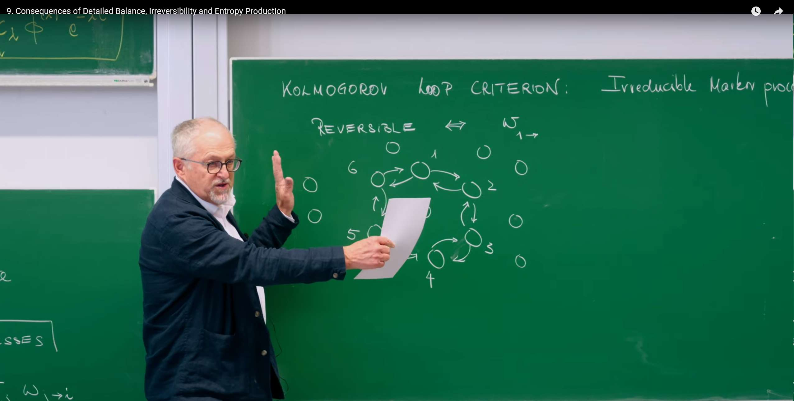
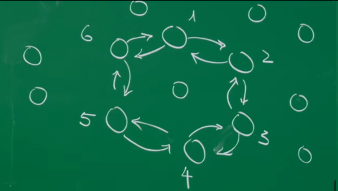
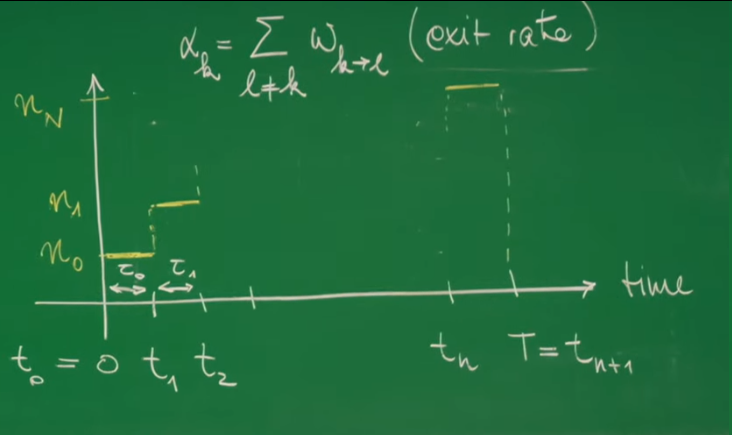
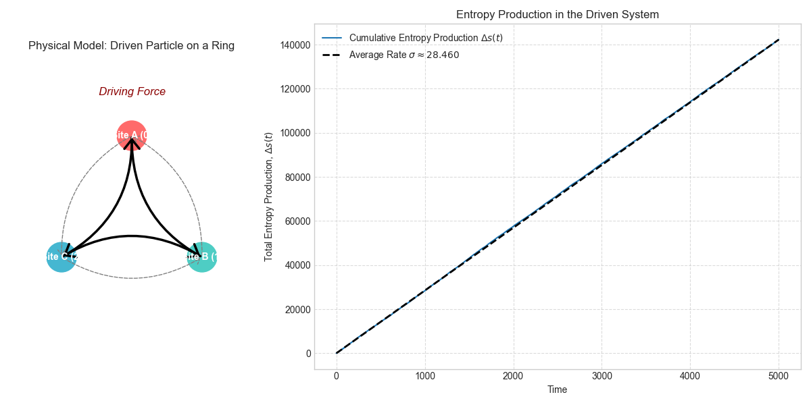

# 引言

这节课是随机过程理论学习中的一个关键节点。在前几讲中，我们已经建立了主方程 (Master Equation) 这一核心框架，它描述了系统在不同状态间跳转的概率如何随时间演化。现在，我们将从单纯描述"如何"演化，深入到探讨其背后更深层次的物理"为什么"，即这些演化过程的热力学意义。

**我们将踏出平衡态的理想世界，进入一个更广阔、更真实的领域：非平衡态物理 (Non-equilibrium Physics)。**当细致平衡被打破时，系统会出现持续的概率流，就像河流中稳定的水流一样。这种单向的、不可逆的流动正是生命活动、化学反应和所有由外部能量驱动的系统的标志。我们将学习如何从单条随机轨迹出发，精确地量化这种不可逆性 (Irreversibility)，并最终定义出熵产生 (Entropy Production)。这个量，正是热力学第二定律在微观随机世界中的直接体现。

可以说，这一讲是连接微观随机事件与宏观热力学“时间之箭”的关键桥梁。

本节课的核心主题是区分两类截然不同的随机过程：

## 可逆过程 (Reversible Process)

这类过程是随机系统达到**热力学平衡 (Thermodynamic Equilibrium)** 的微观体现，其核心标志是满足**细致平衡 (Detailed Balance)** 条件。在这样的系统中，时间的“箭头”消失了，过去与未来在统计上无法区分。

我们可以从以下几个层面来理解其深刻内涵：

1.  **时间的对称性**：想象一下我们用摄像机记录下一个可逆过程的演化轨迹，然后将录像带**倒着播放**。从统计学的角度来看，倒放的影片和一个正常播放的影片是无法区分的。例如，观察一个处于平衡态的气体中的单个花粉粒（布朗运动），它在水中随机地、毫无目的地飘动。无论正放还是倒放，我们看到的都是同样杂乱无章的随机运动。这种时间上的对称性，是可逆过程最直观的特征。

2.  **微观的完美平衡**：这种宏观上的时间对称性，源于微观层面每一个独立过程都与其逆过程达到了完美的平衡。这正是**细致平衡条件**的数学表达：
    $$\pi_j w_{j \to k} = \pi_k w_{k \to j}$$
    这个公式告诉我们，在稳态下，从任意状态 $j$ 跳转到状态 $k$ 的总概率流（左侧），都**精确地**被从 $k$ 反向跳转回 $j$ 的总概率流（右侧）所抵消。这种平衡发生在**每一对**直接相连的状态之间，而非仅仅是整个系统的宏观平衡。

3.  **无净环流的“静态”平衡**：由于每一条“微观路径”都与其逆过程完全平衡，系统内部不可能存在任何持续的、净的概率环流。我们可以用一个**湖泊**来比喻：湖水处于平衡状态，宏观水位不变。在微观层面，水分子在不停运动，但从任意点A到点B的水分子流，都会被从点B到点A的分子流精确抵消。整个湖泊虽然内部高度动态，但宏观上没有任何净水流。这正是热力学平衡的本质——一个看似“寂静”，实则在微观层面“喧闹”不休的动态平衡。

4.  **简单的动力学行为**：正如讲座中所推导的，满足细致平衡的系统，其动力学演化也异常“纯粹”。系统从任意初始状态趋向平衡的过程，是一种平滑的、**无振荡的指数弛豫**。这表明系统会以最直接、最单调的方式“滑向”其最稳定的平衡态，不会出现复杂的周期性行为。


## 不可逆过程 (Irreversible Process)

这类过程打破了细致平衡的严格约束，是所有活跃的、消耗能量的**非平衡系统 (Non-equilibrium Systems)** 的共同特征。正是这种不平衡，赋予了时间一个明确的方向，是我们体验到的“时间之箭”在微观世界的起源。

1.  **时间的非对称性**：对于一个不可逆过程，正放和倒放的录像在统计上是**截然不同**的。想象一个细胞内的分子马达沿着微管“行走”，它消耗ATP提供的能量，稳定地朝一个方向运动。如果我们倒放这个录像，会看到一个分子马达“反向”行走，并在这个过程中“合成”ATP——这在物理上是不可能自发发生的。这种统计上的非对称性，为时间赋予了明确的方向。

2.  **持续的微观流动**：不可逆性的根源在于细致平衡被打破，即 $\pi_j w_{j \to k} \neq \pi_k w_{k \to j}$。这意味着在状态 $j$ 和 $k$ 之间，存在一个**净的概率流**。当这些净流在系统中形成一个或多个闭合循环时（即不满足柯尔莫哥洛夫循环准则），系统就处在一个**非平衡稳态 (Non-Equilibrium Steady State, NESS)**。

3.  **由能量驱动的“动态”平衡**：我们可以用一条**河流**来比喻这种状态。河流的水位可以是稳定的（稳态），但这需要有源源不断的水从上游流入（能量输入）。在河流的任何一个截面，流入和流出的水量相等，维持了水位的稳定（这对应于比细致平衡更弱的“全局平衡”条件）。然而，河水整体有一个明确的下游方向，存在着**净的水流**。生命系统，如一个活细胞，就是这样一个由持续的新陈代谢（能量流）维持的、高度有序的非平衡稳态。

4.  **熵的持续产生**：这种单向的、不可逆的流动是有代价的，这个代价就是**熵的持续产生**。正如讲座中所定义的，我们可以通过比较一条正向轨迹 $\gamma$ 与其逆向轨迹 $\bar{\gamma}$ 的发生概率，来精确量化这种不可逆性。其对数比值，即**熵产生** $\Delta s[\gamma] = \ln(P[\gamma]/P[\bar{\gamma}])$，总是非负的。对于一个非平衡稳态系统，其**平均熵产生速率** $\sigma$ 是一个大于零的常数，它衡量了系统维持其动态活动所需要付出的、向环境中“耗散”能量的速率。这个量，正是热力学第二定律在随机过程层面最精确的数学表达。

# 1. 细致平衡

热平衡这一物理条件会给系统的数学描述带来强大的约束，使得其动态行为变得异常简洁和可预测。

## 1.1 再探主方程：随机过程的游戏规则


讲座从回顾主方程开始，这是我们整个理论体系的基石。

$$
\frac{d\mathbf{p}(t)}{dt} = Q \cdot \mathbf{p}(t)
$$

这个方程描述了在一个连续时间的马尔可夫过程中，概率如何随时间演化。我们可以将其写成分量的形式，以便更清晰地理解其物理意义：

$$
\frac{dp_n(t)}{dt} = \sum_{m \neq n} (p_m(t) w_{m \to n} - p_n(t) w_{n \to m})
$$

**物理意义**：这个形式清楚地展示了状态 $n$ 的概率 $p_n(t)$ 随时间的变化，是由一个"流入项"和一个"流出项"共同决定的。

**流入项 (Gain Term)**: $\sum_{m \neq n} p_m(t) w_{m \to n}$ 表示从所有其他状态 $m$ 跳转到状态 $n$ 的总速率。

**流出项 (Loss Term)**: $\sum_{m \neq n} p_n(t) w_{n \to m} = p_n(t) \sum_{m \neq n} w_{n \to m}$ 表示从状态 $n$ 跳转到任何其他状态的总速率。

Q-矩阵的另一个重要性质是其**列和为零**：

$$
\sum_n Q_{nm} = 0
$$

**物理意义**：这个性质是**概率守恒**的数学体现。$Q_{mm} = -\sum_{n \neq m} w_{m \to n}$ 是从状态 $m$ 流出的总速率，而 $\sum_{n \neq m} Q_{nm} = \sum_{n \neq m} w_{m \to n}$ 是流入到其他所有状态的总速率。两者相加为零，意味着粒子离开状态 $m$ 后，必然会进入某个其他状态 $n$，总概率始终保持为1。


## 1.2 细致平衡原理：平衡态的标志

对于一类特殊的过程，即**可逆过程 (Reversible Processes)**，系统会达到一个非常特殊的稳态，这个稳态由**细致平衡 (Detailed Balance, DB)** 条件定义。

$$
\pi_i w_{i \to j} = \pi_j w_{j \to i}
$$

$\pi_i$ 和 $\pi_j$ 是系统处于状态 $i$ 和 $j$ 的稳态概率。
$w_{i \to j}$ 是从 $i$ 到 $j$ 的转移速率。
$\pi_i w_{i \to j}$ 是在稳态下，单位时间内从状态 $i$ 跳转到状态 $j$ 的**概率流 (Probability Flux)**。

**物理意义**：细致平衡不仅仅是一个数学公式，它是一个深刻的物理陈述，即**微观可逆性原理**。在热平衡状态下，任何两个状态之间的概率流都是双向且完全相等的。从 $i$ 到 $j$ 的流量被从 $j$ 到 $i$ 的流量精确抵消。这意味着净概率流 $J_{ij} = \pi_i w_{i \to j} - \pi_j w_{j \to i}$ 对所有状态对 $(i,j)$ 都精确为零。我们可以将其比作一条繁忙的双向街道，向北行驶的车辆数量恰好等于向南行驶的车辆数量，因此没有净交通流。

**重要辨析：细致平衡是稳态的充分非必要条件**

**稳态 (Steady State)** 的定义是概率分布不随时间变化，即 $\frac{d\mathbf{p}(t)}{dt} = 0$，也就是 $Q \cdot \boldsymbol{\pi} = 0$。

**细致平衡 (Detailed Balance)** 是一个更强的条件。如果细致平衡成立，我们可以证明稳态条件也必然成立。然而，反过来不一定。系统可以处于一个概率分布恒定，但内部存在持续的、非零的净概率流的稳态。这种状态被称为**非平衡稳态 (Non-Equilibrium Steady State, NESS)**，我们将在第二部分详细探讨。

因此，细致平衡定义了所有稳态中的一个特殊子集——**平衡态**。

## 1.3 对称性的力量：简化系统动力学

细致平衡条件的一个强大推论是，它允许我们通过一个相似变换，将通常不对称的 Q-矩阵**对称化** 。定义一个新的矩阵 $\tilde{Q}$：

$$
\tilde{Q}_{mn} := \pi_m^{-1/2} Q_{mn} \pi_n^{1/2}
$$

如果系统满足细致平衡，那么这个新的 $\tilde{Q}$ 矩阵是**对称**的，即 $\tilde{Q}_{mn} = \tilde{Q}_{nm}$。

**推导过程**：

对于非对角元素 ($m \neq n$)，我们有 $Q_{mn} = w_{n \to m}$。

$$
\tilde{Q}_{mn} = \pi_m^{-1/2} w_{n \to m} \pi_n^{1/2}
$$

利用细致平衡条件 $w_{n \to m} = w_{m \to n} \frac{\pi_n}{\pi_m}$，代入上式：

$$
\tilde{Q}_{mn} = \pi_m^{-1/2} (w_{m \to n} \frac{\pi_n}{\pi_m}) \pi_n^{1/2} = \pi_m^{1/2} w_{m \to n} \pi_n^{-1/2}
$$

另一方面，我们计算 $\tilde{Q}_{nm}$：

$$
\tilde{Q}_{nm} = \pi_n^{-1/2} Q_{nm} \pi_m^{1/2} = \pi_n^{-1/2} w_{m \to n} \pi_m^{1/2}
$$

比较两式，我们发现 $\tilde{Q}_{mn} = \tilde{Q}_{nm}$，证明了其对称性。

这个数学上的"技巧"为何如此重要？因为它揭示了平衡系统动力学的深刻物理特性：

1.**实数特征值**：对称矩阵（或更广义的厄米矩阵）保证其所有特征值都是实数。在我们的问题中，Q-矩阵的特征值为 $-\lambda$。这意味着弛豫速率 $\lambda$ 都是实数。


2.**非振荡弛豫**：特征值为实数，意味着系统向平衡态的演化过程是纯粹的指数衰减，而不会出现振荡。主方程的通解可以写成特征模式的叠加：
$$
p(t) = \sum_{\lambda} c_{\lambda} \Phi(\lambda) e^{-\lambda t}
$$

其中 $\lambda > 0$（对于非稳态模式），这代表了系统从任意初始状态向唯一稳态 $\boldsymbol{\pi}$（对应于 $\lambda = 0$ 的模式）的弛豫过程是平滑的、非振荡的。


3.**正交基底**：对称矩阵的特征向量构成一个完备的正交基底。这意味着任何初始概率分布都可以唯一地分解为这些基本"弛豫模式"的线性组合。


总之，Q-矩阵的可对称化是平衡系统不存在内在循环动力学的数学体现，它将抽象的马尔可夫过程与保守系统的物理学联系起来。

## 1.4 柯尔莫哥洛夫循环准则：一个直观的平衡态判据






除了代数形式的细致平衡条件，还有一个等价的、更直观的几何判据——**柯尔莫哥洛夫循环准则 (Kolmogorov's Loop Criterion)** 。该准则指出，一个不可约的马尔可夫过程是可逆的（即满足细致平衡），当且仅当对于状态空间中的**任何闭合循环**，顺时针方向的转移速率之积等于逆时针方向的转移速率之积。

$$w_{1 \to 2} w_{2 \to 3} \cdots w_{N \to 1} = w_{1 \to N} w_{N \to N-1} \cdots w_{2 \to 1}$$

**直观理解**：以一个简单的三状态系统 $\{1, 2, 3\}$ 为例，此准则要求：

$$
w_{1 \to 2} w_{2 \to 3} w_{3 \to 1} = w_{2 \to 1} w_{3 \to 2} w_{1 \to 3}
$$

如果这个等式不成立，例如顺时针的乘积大于逆时针，就意味着系统内部存在一个持续的、顺时针方向的**净概率环流 (Net Probability Circulation)**。这种净环流是不可逆性的根本标志。只要系统中存在哪怕一个循环不满足此准令，系统就必然处于非平衡状态，其稳态必须由外部能量输入来维持。

这个准则为我们提供了一个强大的视觉工具，它将不可逆性与状态空间中的"循环"直接联系起来，为我们接下来量化熵产生和通量奠定了概念基础。


# 2. 超越平衡态 —— 不可逆性与时间之箭

在这一部分，我们将告别简洁的平衡世界，进入更为普遍的非平衡领域。这些系统是活跃的、动态的，并且具有明确的时间方向。我们的目标是量化这种"**方向性**"。

## 2.1 当平衡被打破：非平衡稳态 (NESS)

当细致平衡条件不被满足时，系统仍然可以达到一个稳态，即概率分布不随时间改变 $\frac{d\mathbf{p}(t)}{dt} = 0$。然而，此时系统内部存在持续的、非零的净概率流 $J_{ij} = \pi_i w_{i \to j} - \pi_j w_{j \to i} \neq 0$。这就是**非平衡稳态 (Non-Equilibrium Steady State, NESS)** 。

一个绝佳的类比是喷泉：水池中的水位（对应概率）保持恒定，但这并不是因为水是静止的，而是因为水泵在持续地将水抽上高处，水又不断地流回水池。这个过程维持了一个动态的平衡，需要持续的能量输入（水泵做功）来抵抗重力（耗散）。同样，生命系统、电路、以及所有执行功能的分子机器都工作在 NESS 状态。

## 2.2 正向与反向轨迹

为了量化不可逆性，我们需要比较系统演化的一条**正向轨迹 (Forward Trajectory)** 与其**时间反演后的反向轨迹 (Backward Trajectory)** 发生的概率。



首先定义一条正向轨迹 $\gamma$ 为一个状态序列和在每个状态的停留时间：

$$\gamma: 0 \xrightarrow{\tau_1} 1 \xrightarrow{\tau_2} \cdots \xrightarrow{\tau_n} n$$

这条轨迹的概率（严格来说是概率密度）$P[\gamma]$ 是如何构建的呢？它由一系列事件概率的乘积构成：

1. **初始概率**: 首先，系统在时刻 $t=0$ 处于状态 $0$ 的概率是 $\pi_0$。

2. **等待概率**: 在状态 $k$ 停留时间 $\tau_k$ 而不发生跳转的概率。这是一个泊松过程，其概率为 $e^{-\alpha_k \tau_k}$，其中 $\alpha_k = \sum_{\ell \neq k} w_{k \to \ell}$ 是离开状态 $k$ 的总速率，也叫**出射速率 (exit rate)** 。

3. **跳转概率**: 发生一次从 $k$ 到 $k+1$ 跳转的概率正比于转移速率 $w_{k \to k+1}$。

将这些部分组合起来，我们得到正向轨迹的概率：

$$P[\gamma] = \pi_0 \cdot e^{-\alpha_0 \tau_0} \cdot w_{0 \to 1} \cdot e^{-\alpha_1 \tau_1} \cdot w_{1 \to 2} \cdots w_{n-1 \to n} \cdot e^{-\alpha_n \tau_n}$$

类似地，我们可以定义时间反演的轨迹 $\bar{\gamma}$，它从状态 $n$ 开始，逆序经过相同的状态，最终回到状态 $0$。其概率为：

$$P[\bar{\gamma}] = \pi_n \cdot e^{-\alpha_n \tau_n} \cdot w_{n \to n-1} \cdots w_{1 \to 0} \cdot e^{-\alpha_0 \tau_0}$$


## 2.3 量化不可逆性：沿路径的熵产生

不可逆性的核心在于正向和反向轨迹的概率不再相等。我们可以通过计算它们的比值来量化这种不对称性：

$$\frac{P[\bar{\gamma}]}{P[\gamma]} = \frac{\pi_n e^{-\alpha_n \tau_n} w_{n \to n-1} \cdots w_{1 \to 0} e^{-\alpha_0 \tau_0}}{\pi_0 e^{-\alpha_0 \tau_0} w_{0 \to 1} \cdots w_{n-1 \to n} e^{-\alpha_n \tau_n}}$$

一个非常深刻的结果是，所有与停留时间相关的指数项 $e^{-\alpha_k \tau_k}$ 都被精确地消掉了！这告诉我们，不可逆性（以及后续定义的熵产生）的根源在于**状态之间的跳转**，而不是在某个状态上的等待。

简化后，我们得到：

$$\frac{P[\bar{\gamma}]}{P[\gamma]} = \frac{\pi_n}{\pi_0} \cdot \frac{w_{n \to n-1} w_{n-1 \to n-2} \cdots w_{1 \to 0}}{w_{0 \to 1} w_{1 \to 2} \cdots w_{n-1 \to n}}$$

基于这个比值，我们可以定义沿轨迹 $\gamma$ 的**总熵产生 (Total Entropy Production)** $\Delta s[\gamma]$：

$$\Delta s[\gamma] = \ln \frac{P[\bar{\gamma}]}{P[\gamma]}$$

这个对数比值的形式并非偶然，它与信息论中的**相对熵 (Kullback-Leibler Divergence)** 有着深刻的联系。

**物理意义**：$\Delta s[\gamma]$ 量化了我们区分正向轨迹和反向轨迹的能力。

 如果 $\Delta s[\gamma] \gg 0$，意味着 $P[\gamma] \gg P[\bar{\gamma}]$，正向过程比反向过程更容易发生，时间之箭的方向非常明确。

如果系统满足细致平衡，那么平均而言，这个比值会是1，$\Delta s[\gamma]$ 会在0附近波动，表明过程是时间对称的。

**信息论视角**：熵产生可以被看作是我们通过观察轨迹来判断时间流向所获得的信息量。一个不可逆的过程会不断产生信息，从而区分过去和未来。

## 2.4 解构熵：系统与环境


总熵产生可以被分解为两个有明确物理意义的部分：

$$\Delta s[\gamma] = \ln\left(\frac{\pi_n}{\pi_0}\right) + \sum_{k=1}^{n} \ln\left(\frac{w_{k \to k-1}}{w_{k-1 \to k}}\right)$$


我们将这两项分别定义为：

1. **系统熵变 (System Entropy Change)**: 

$$
(\Delta s)_{\text{system}} = \ln\left(\frac{\pi_n}{\pi_0}\right) = -\ln \pi_n - (-\ln \pi_0)
$$

这一项只依赖于轨迹的初末状态，而与中间经过的路径无关。这是**状态函数 (State Function)** 的典型特征。它代表了系统自身信息熵的变化（以玻尔兹曼熵 $S = -k_B \ln p$ 的形式）。

2. **环境熵变 (Environment Entropy Change)**: 

$$
(\Delta s)_{\text{env}} = \sum_{k=1}^{n} \ln\left(\frac{w_{k \to k-1}}{w_{k-1 \to k}}\right)
$$

这一项是轨迹中每一步跳转贡献的总和。如果从状态0到状态n换一条不同的路径，这个值就会改变。这是**路径函数 (Path Function)** 的特征，类似于经典热力学中的热和功。它代表了为了驱动这条轨迹发生，系统与环境之间交换的熵（通常以热量的形式）。

这个分解是随机热力学的基石，它将宏观热力学第二定律在单条微观轨迹的层面上进行了精确的重述：

$$
\Delta s_{\text{total}} = \Delta s_{\text{sys}} + \Delta s_{\text{env}}
$$


## 2.5 平均熵产生速率 $\sigma$

对于一个处于非平衡稳态 (NESS) 的系统，我们更关心的是其长期、持续的熵产生能力。这通过**平均熵产生速率 (Average Entropy Production Rate)** $\sigma$ 来衡量。

$$\sigma = \lim_{T \to \infty} \frac{1}{T} \langle \Delta s[\gamma] \rangle$$

这里的 $\langle \cdot \rangle$ 表示对所有在时间 $T$ 内可能发生的轨迹进行平均。在长时间极限下，系统熵变 $(\Delta s)_{\text{system}}$ 的贡献会因其仅依赖于初末状态而被平均掉，起主导作用的是环境熵变。

经过推导，可以得到一个极其优美的最终表达式：

$$
\sigma = \frac{1}{2} \sum_{i,j} (\pi_i w_{i \to j} - \pi_j w_{j \to i}) \ln\left(\frac{\pi_j w_{j \to i}}{\pi_i w_{i \to j}}\right)
$$

这个公式也可以写作：

$$
\sigma = \sum_{i < j} J_{ij} \ln \left( \frac{w_{i \to j}}{w_{j \to i}} \right)
$$

**深刻的物理结构**：这个表达式具有**（通量）x（热力学力）**的普适结构，这是所有不可逆过程耗散理论的核心。

**通量 (Flux)**: $J_{ij} = \pi_i w_{i \to j} - \pi_j w_{j \to i}$ 是状态间的净概率流。

**热力学力 (Thermodynamic Force)**: $A_{ij} = \ln\left(\frac{w_{j \to i}}{w_{i \to j}}\right)$ 是驱动该通量产生的"**力**"。

**非负性**：利用不等式 $(x-y)\ln(x/y) \geq 0$，可以证明 $\sigma \geq 0$。等号成立的唯一条件是，对所有的状态对 $(i,j)$，净通量 $J_{ij} = 0$。这恰恰就是细致平衡的条件。

因此，任何偏离热平衡的系统（任何 NESS）都必然是一个持续产生熵的"机器"。$\sigma$ 就是维持其非平衡结构和功能所必须付出的、不可避免的热力学代价。


# 3. Python 模拟


## 3.1 模拟一个可逆系统：粒子在三势阱中的热运动

想象一个微观粒子（例如胶体颗粒）浸润在恒温的热浴中，并被限制在一个具有三个稳定深度的“势阱”（Potential Well）中运动。由于来自周围液体分子的随机碰撞（热涨落），这个粒子有足够的能量跳越势阱之间的“能垒”，从而在三个状态（**阱A**、**阱B**、**阱C**）之间随机跃迁。由于整个系统与一个单一温度的热浴达到平衡，它必然满足细致平衡条件，是一个完美的可逆过程。

**实现思路**:

1.  **构建能量景观**: 我们设定三个势阱的能量深度 ($E_A, E_B, E_C$) 和它们之间的能垒高度。
2.  **计算速率**: 跃迁速率由**阿伦尼乌斯定律**给出，即从一个深阱跳到一个浅阱要比反向过程容易得多。从状态 $i$ 到 $j$ 的速率 $w_{i \to j} \propto \exp(-\frac{\Delta E_{\text{barrier}}}{k_B T})$。
3.  **理论稳态**: 在热平衡下，粒子在每个势阱中被发现的概率遵循**玻尔兹曼分布**，即 $\pi_i \propto \exp(-\frac{E_i}{k_B T})$。能量越低的势阱，粒子待在里面的概率越高。
4.  **分析与验证**: 我们将运行 Gillespie 模拟，并验证其轨迹在统计上没有净的环流，且最终的占据概率精确地收敛到理论上的玻尔兹曼分布。


```python
import numpy as np
import matplotlib.pyplot as plt
from collections import Counter

def gillespie_simulation(Q, initial_state, T_max):
    """
    Simulates a continuous-time Markov process using the Gillespie algorithm.
    
    Args:
        Q (np.array): The transition rate matrix (Q_ij = w_j->i).
        initial_state (int): The starting state.
        T_max (float): The maximum simulation time.
        
    Returns:
        tuple: A tuple containing lists of times, states, and transitions.
    """
    num_states = Q.shape[0]
    states = np.arange(num_states)
    
    current_state = initial_state
    t = 0.0
    
    time_points = [t]
    state_trajectory = [current_state]
    transitions = []

    while t < T_max:
        rates_out = np.array([Q[j, current_state] for j in states if j != current_state])
        total_rate_out = np.sum(rates_out)
        
        if total_rate_out == 0:
            break

        dt = np.random.exponential(1.0 / total_rate_out)
        t += dt
        if t >= T_max:
            break
            
        possible_next_states = [j for j in states if j != current_state]
        probabilities = rates_out / total_rate_out
        next_state = np.random.choice(possible_next_states, p=probabilities)
        
        transitions.append((current_state, next_state))
        current_state = next_state
        
        time_points.append(t)
        state_trajectory.append(current_state)
        
    return time_points, state_trajectory, transitions

# --- 1. Reversible System: Particle in a Triple-Well Potential ---
print("--- Simulating Reversible System (Thermal Equilibrium) ---")

# Physical Parameters (in units of k_B*T, so k_B*T=1)
E = np.array([-1.5, -2.0, -0.5]) # Energy of wells A, B, C
E_barrier_base = 0.5 # Energy barrier height relative to the higher well
prefactor = 1.0 # Arrhenius prefactor

# Calculate theoretical steady-state (Boltzmann distribution)
Z = np.sum(np.exp(-E))
pi_theory = np.exp(-E) / Z

# Calculate transition rates from energy landscape (Arrhenius law)
# w_ij = A * exp(-(E_barrier_ij - E_i))
rates = {}
rates[(0, 1)] = prefactor * np.exp(-(E_barrier_base + max(E[0], E[1]) - E[0])) # A -> B
rates[(1, 0)] = prefactor * np.exp(-(E_barrier_base + max(E[0], E[1]) - E[1])) # B -> A
rates[(1, 2)] = prefactor * np.exp(-(E_barrier_base + max(E[1], E[2]) - E[1])) # B -> C
rates[(2, 1)] = prefactor * np.exp(-(E_barrier_base + max(E[1], E[2]) - E[2])) # C -> B
rates[(2, 0)] = prefactor * np.exp(-(E_barrier_base + max(E[2], E[0]) - E[2])) # C -> A
rates[(0, 2)] = prefactor * np.exp(-(E_barrier_base + max(E[2], E[0]) - E[0])) # A -> C

# Construct the Q-matrix
Q_rev = np.zeros((3, 3))
for (i, j), rate in rates.items():
    Q_rev[j, i] = rate
for i in range(3):
    Q_rev[i, i] = -np.sum(Q_rev[:, i])

# Verify Kolmogorov's loop criterion
prod_clockwise = rates[(0,1)] * rates[(1,2)] * rates[(2,0)]
prod_counter_clockwise = rates[(0,2)] * rates[(2,1)] * rates[(1,0)]
print("Kolmogorov's Loop Criterion Check:")
print(f"  Clockwise rate product = {prod_clockwise:.4f}")
print(f"  Counter-clockwise rate product = {prod_counter_clockwise:.4f}")
print(f"  Ratio (should be 1.0): {prod_clockwise / prod_counter_clockwise:.4f}\n")

# Run a long simulation
T_max_rev = 200000
times, states, transitions = gillespie_simulation(Q_rev, 0, T_max_rev)

# Analyze net flux
transition_counts = Counter(transitions)
clockwise_jumps = transition_counts.get((0,1),0) + transition_counts.get((1,2),0) + transition_counts.get((2,0),0)
counter_clockwise_jumps = transition_counts.get((0,2),0) + transition_counts.get((2,1),0) + transition_counts.get((1,0),0)

print(f"In a simulation of T={T_max_rev}:")
print(f"  Total clockwise jumps: {clockwise_jumps}")
print(f"  Total counter-clockwise jumps: {counter_clockwise_jumps}")
print("The counts are very close, indicating no net probability flux.\n")

# Calculate simulated steady-state distribution
occupancy_times = np.zeros(3)
for i in range(len(times) - 1):
    occupancy_times[states[i]] += times[i+1] - times[i]
occupancy_times[states[-1]] += T_max_rev - times[-1]
pi_simulated = occupancy_times / T_max_rev

print("Steady-State Distribution (Boltzmann) Comparison:")
print(f"  Theoretical pi = {np.round(pi_theory, 4)}")
print(f"  Simulated pi   = {np.round(pi_simulated, 4)}")

# --- Visualization ---
plt.style.use('seaborn-v0_8-whitegrid')
fig = plt.figure(figsize=(12, 9))
gs = fig.add_gridspec(2, 2)

# Plot 1: Potential Energy Landscape
ax1 = fig.add_subplot(gs[0, :])
x_coords = np.linspace(-1, 5, 500)
# A simple polynomial to represent a triple-well potential visually
U = 0.1 * (x_coords**6 - 12*x_coords**5 + 47*x_coords**4 - 60*x_coords**3 + 16*x_coords**2 + 10*x_coords)
# Adjust wells to roughly match energy levels E
U -= np.min(U)
U[x_coords < 1.5] += E[0] - np.min(U[x_coords < 1.5]) + 2.5
U[(x_coords >= 1.5) & (x_coords <= 3.5)] += E[1] - np.min(U[(x_coords >= 1.5) & (x_coords <= 3.5)]) + 2.5
U[x_coords > 3.5] += E[2] - np.min(U[x_coords > 3.5]) + 2.5

ax1.plot(x_coords, U, color='black', linewidth=2.5)
ax1.set_title('Physical Model: Particle in a Triple-Well Potential')
ax1.set_xlabel('Position (arbitrary units)')
ax1.set_ylabel(r'Potential Energy $U(x)$')
ax1.text(0.5, E[0]+2.8, 'Well A (State 0)', ha='center')
ax1.text(2.5, E[1]+2.8, 'Well B (State 1)', ha='center')
ax1.text(4.5, E[2]+2.8, 'Well C (State 2)', ha='center')
ax1.set_yticks([]) # Hide y-axis ticks for a cleaner look

# Plot 2: Trajectory
ax2 = fig.add_subplot(gs[1, 0])
state_labels = ['Well A (0)', 'Well B (1)', 'Well C (2)']
t_display_limit = min(500, T_max_rev)
display_indices = np.where(np.array(times) <= t_display_limit)
ax2.step(np.array(times)[display_indices], np.array(states)[display_indices], where='post')
ax2.set_title(f'Sample Trajectory (First {t_display_limit} time units)')
ax2.set_xlabel('Time')
ax2.set_ylabel('State')
ax2.set_yticks([0, 1, 2])
ax2.set_yticklabels(state_labels)
ax2.set_ylim(-0.5, 2.5)

# Plot 3: Steady-State Distribution
ax3 = fig.add_subplot(gs[1, 1])
ax3.bar(state_labels, pi_simulated, color='cornflowerblue', edgecolor='black', label='Simulation Result')
ax3.plot(state_labels, pi_theory, 'ro', markersize=10, label=r'Theory (Boltzmann $\pi$)')
ax3.set_title('Steady-State Probability Distribution')
ax3.set_ylabel('Probability')
ax3.set_ylim(0, max(np.max(pi_theory), np.max(pi_simulated)) * 1.2)
ax3.legend()
for i, p in enumerate(pi_simulated):
    ax3.text(i, p, f'{p:.3f}', ha='center', va='bottom', fontsize=10)

plt.tight_layout()
plt.show()

```
运行代码输出：
```
--- Simulating Reversible System (Thermal Equilibrium) ---
Kolmogorov's Loop Criterion Check:
  Clockwise rate product = 0.0498
  Counter-clockwise rate product = 0.0498
  Ratio (should be 1.0): 1.0000

In a simulation of T=200000:
  Total clockwise jumps: 69792
  Total counter-clockwise jumps: 69734
The counts are very close, indicating no net probability flux.

Steady-State Distribution (Boltzmann) Comparison:
  Theoretical pi = [0.3315 0.5465 0.122 ]
  Simulated pi   = [0.3318 0.5461 0.122 ]

```


**上图 (Physical Model)** 显示了系统的物理规则：一个粒子在具有三个不同深度势阱的能量景观中运动。势阱B最深（最稳定），而势阱C最浅（最不稳定）。

**左下图 (Sample Trajectory)** 展示了系统的微观动态：在热能的驱动下，粒子在三个势阱之间进行着永不停歇的随机跳跃。

**右下图 (Steady-State Probability)** 揭示了系统的宏观统计结果：经过长时间的演化，粒子在每个势阱中停留的时间比例（蓝色条形图）与基于其能量深度预测的理论玻尔兹曼分布（红色圆点）完全吻合。粒子在最深的势阱B中停留的时间最长，在最浅的势阱C中停留的时间最短。

总而言之，该图直观地证明了物理规则（能量景观）如何决定微观的随机行为，并最终涌现出一个可预测的、稳定的宏观平衡态。


## 3.2 模拟一个不可逆系统：受驱动力作用的环状系统

**物理模型**: 想象一个带电粒子被束缚在三个离散的站点（**站点A**、**站点B**、**站点C**）构成的环上。现在，我们施加一个恒定的环形电场（非保守力）。这个电场会驱动带电粒子倾向于沿一个方向（例如，顺时针）运动。虽然热涨落仍然允许粒子偶尔“逆流而上”，但整体上会形成一个持续的、净的粒子流。这个系统为了维持这个稳态“电流”，必须持续从外部电场获取能量，并以热量的形式耗散掉，因此它是一个典型的非平衡稳态 (NESS)。

**实现思路**:

1.  **构建模型**: 我们直接设定顺时针的跳转速率（$w_{cw}$）远大于逆时针的速率（$w_{ccw}$），以模拟外部驱动力。
2.  **验证与模拟**: 该速率设置明显违反柯尔莫哥洛夫准则。我们运行 Gillespie 模拟。
3.  **分析**:
    * 统计顺逆时针的跳转次数，预期会观察到巨大的差异，这便是**净概率电流**的证据。
    * 计算并绘制**累积熵产生**随时间变化的图像。对于这个被驱动的的系统，该曲线应呈线性增长，其斜率即为平均熵产生速率 $\sigma$。

```python
import numpy as np
import matplotlib.pyplot as plt
from collections import Counter
import matplotlib.patches as patches

def gillespie_simulation(Q, initial_state, T_max):
    """
    Simulates a continuous-time Markov process using the Gillespie algorithm.
    
    Args:
        Q (np.array): The transition rate matrix (Q_ij = w_j->i).
        initial_state (int): The starting state.
        T_max (float): The maximum simulation time.
        
    Returns:
        tuple: A tuple containing lists of times, states, and transitions.
    """
    num_states = Q.shape[0]
    states = np.arange(num_states)
    
    current_state = initial_state
    t = 0.0
    
    time_points = [t]
    state_trajectory = [current_state]
    transitions = []

    while t < T_max:
        rates_out = np.array([Q[j, current_state] for j in states if j != current_state])
        total_rate_out = np.sum(rates_out)
        
        if total_rate_out == 0:
            break

        dt = np.random.exponential(1.0 / total_rate_out)
        t += dt
        if t >= T_max:
            break
            
        possible_next_states = [j for j in states if j != current_state]
        probabilities = rates_out / total_rate_out
        next_state = np.random.choice(possible_next_states, p=probabilities)
        
        transitions.append((current_state, next_state))
        current_state = next_state
        
        time_points.append(t)
        state_trajectory.append(current_state)
        
    return time_points, state_trajectory, transitions

# --- 2. Irreversible System: Driven Particle on a Ring ---
print("--- Simulating Irreversible System (Non-Equilibrium Steady State) ---")
Q_irrev = np.zeros((3, 3))

# Define rates that model a strong clockwise driving force
w_cw = 10.0  # High rate for clockwise jumps
w_ccw = 0.5   # Low rate for counter-clockwise jumps

w01_i, w12_i, w20_i = w_cw, w_cw, w_cw
w10_i, w21_i, w02_i = w_ccw, w_ccw, w_ccw

# Populate Q-matrix
Q_irrev[1, 0] = w01_i; Q_irrev[0, 1] = w10_i
Q_irrev[2, 1] = w12_i; Q_irrev[1, 2] = w21_i
Q_irrev[0, 2] = w20_i; Q_irrev[2, 0] = w02_i

for i in range(3):
    Q_irrev[i, i] = -np.sum(Q_irrev[:, i])
    
# Verify violation of Kolmogorov's criterion
prod_clockwise_i = w01_i * w12_i * w20_i
prod_counter_clockwise_i = w02_i * w21_i * w10_i
print("Kolmogorov's Loop Criterion Check:")
print(f"  Clockwise rate product = {prod_clockwise_i:.4f}")
print(f"  Counter-clockwise rate product = {prod_counter_clockwise_i:.4f}")
print("The products are unequal, confirming the system is irreversible.\n")

# Run simulation
T_max_irrev = 5000
times_irrev, states_irrev, transitions_irrev = gillespie_simulation(Q_irrev, 0, T_max_irrev)

# Count jumps to show net flux
transition_counts_i = Counter(transitions_irrev)
clockwise_jumps_i = transition_counts_i.get((0,1),0) + transition_counts_i.get((1,2),0) + transition_counts_i.get((2,0),0)
counter_clockwise_jumps_i = transition_counts_i.get((0,2),0) + transition_counts_i.get((2,1),0) + transition_counts_i.get((1,0),0)

print(f"In a simulation of T={T_max_irrev}:")
print(f"  Total clockwise jumps: {clockwise_jumps_i}")
print(f"  Total counter-clockwise jumps: {counter_clockwise_jumps_i}")
print("A strong net clockwise probability current is observed.\n")

# Calculate and plot cumulative entropy production
rates_map = {
    (0,1): w01_i, (1,0): w10_i, 
    (1,2): w12_i, (2,1): w21_i, 
    (2,0): w20_i, (0,2): w02_i
}
entropy_production = 0.0
cumulative_entropy = [0.0]
entropy_times = [0.0]

for i in range(len(transitions_irrev)):
    start, end = transitions_irrev[i]
    ds_env = np.log(rates_map[(start, end)] / rates_map[(end, start)])
    entropy_production += ds_env
    cumulative_entropy.append(entropy_production)
    entropy_times.append(times_irrev[i+1])

# Calculate average entropy production rate, sigma
avg_sigma = cumulative_entropy[-1] / entropy_times[-1]
print(f"Simulated average entropy production rate (sigma) ~ {avg_sigma:.4f}")

# --- Visualization ---
plt.style.use('seaborn-v0_8-whitegrid')
fig = plt.figure(figsize=(12, 6))
gs = fig.add_gridspec(1, 2, width_ratios=[1, 2])

# Plot 1: System Diagram
ax1 = fig.add_subplot(gs[0])
pos = {0: (0, 1), 1: (0.866, -0.5), 2: (-0.866, -0.5)}
ax1.scatter([p[0] for p in pos.values()], [p[1] for p in pos.values()], s=1000, c=['#FF6B6B', '#4ECDC4', '#45B7D1'])
labels = ['Site A (0)', 'Site B (1)', 'Site C (2)']
for i, p in pos.items():
    ax1.text(p[0], p[1], labels[i], ha='center', va='center', color='white', fontweight='bold')

# Arrows for rates
# Clockwise (strong)
ax1.add_patch(patches.FancyArrowPatch(pos[0], pos[1], connectionstyle="arc3,rad=.3", color="black", arrowstyle='->,head_length=10,head_width=8', linewidth=2.5))
ax1.add_patch(patches.FancyArrowPatch(pos[1], pos[2], connectionstyle="arc3,rad=.3", color="black", arrowstyle='->,head_length=10,head_width=8', linewidth=2.5))
ax1.add_patch(patches.FancyArrowPatch(pos[2], pos[0], connectionstyle="arc3,rad=.3", color="black", arrowstyle='->,head_length=10,head_width=8', linewidth=2.5))
# Counter-clockwise (weak)
ax1.add_patch(patches.FancyArrowPatch(pos[1], pos[0], connectionstyle="arc3,rad=.3", color="gray", arrowstyle='->,head_length=5,head_width=4', linewidth=1, linestyle='--'))
ax1.add_patch(patches.FancyArrowPatch(pos[2], pos[1], connectionstyle="arc3,rad=.3", color="gray", arrowstyle='->,head_length=5,head_width=4', linewidth=1, linestyle='--'))
ax1.add_patch(patches.FancyArrowPatch(pos[0], pos[2], connectionstyle="arc3,rad=.3", color="gray", arrowstyle='->,head_length=5,head_width=4', linewidth=1, linestyle='--'))

ax1.text(0, 1.5, 'Driving Force', ha='center', fontsize=12, style='italic', color='darkred')
ax1.set_xlim(-1.5, 1.5); ax1.set_ylim(-1.5, 2.0)
ax1.set_aspect('equal'); ax1.axis('off')
ax1.set_title('Physical Model: Driven Particle on a Ring')


# Plot 2: Cumulative Entropy Production
ax2 = fig.add_subplot(gs[1])
ax2.plot(entropy_times, cumulative_entropy, '-', label=r'Cumulative Entropy Production $\Delta s(t)$')
ax2.plot(entropy_times, avg_sigma * np.array(entropy_times), 'k--', linewidth=2, label=fr'Average Rate $\sigma \approx {avg_sigma:.3f}$')
ax2.set_title('Entropy Production in the Driven System')
ax2.set_xlabel('Time')
ax2.set_ylabel(r'Total Entropy Production, $\Delta s(t)$')
ax2.legend()
ax2.grid(True, linestyle='--', alpha=0.7)

plt.tight_layout()
plt.show()
```
运行代码输出

```
--- Simulating Irreversible System (Non-Equilibrium Steady State) ---
Kolmogorov's Loop Criterion Check:
  Clockwise rate product = 1000.0000
  Counter-clockwise rate product = 0.1250
The products are unequal, confirming the system is irreversible.

In a simulation of T=5000:
  Total clockwise jumps: 50008
  Total counter-clockwise jumps: 2508
A strong net clockwise probability current is observed.

Simulated average entropy production rate (sigma) ~ 28.4600
```



这个例子展示了一个由外部驱动力维持的**非平衡稳态 (Non-Equilibrium Steady State)** 的核心特征。

**左图 (Physical Model):** 展示了我们的物理模型：一个粒子在环状的三个站点间运动，并受到一个恒定的“驱动力”作用。这个力使得粒子顺时针跳转的速率（粗黑箭头）远大于逆时针跳转的速率（细虚线箭头）。这在物理上代表了一个持续消耗能量来维持定向运动的系统，它从根本上**打破了细致平衡**。

**右图 (Entropy Production): 不可逆性的代价** 它显示了系统**累积熵产生**随时间的变化。我们可以清晰地看到：总熵产生（蓝色实线）随着时间的推移，在涨落中**持续地、线性地增加**。这与可逆系统（熵产生平均为零）形成了鲜明对比。熵产生的增加不是随机的，而是遵循一个非常稳定的平均速率，即图中虚线所示的斜率 $\\sigma$（这里约为 28.46）。

# 结论

这节课教授正式带领我们从平衡到非平衡物理的转变。本节的核心要点如下：

**平衡态**由**细致平衡**定义，其标志是没有净概率流 ($J_{ij} = 0$)，平均熵产生速率为零 ($\sigma = 0$)，其动力学在时间上是可逆的。其数学上的简洁性（Q-矩阵可对称化）反映了其物理上的"寂静"。

**非平衡态**则打破了细致平衡，其特征是存在持续的净概率流 ($J_{ij} \neq 0$)，熵产生速率恒为正 ($\sigma > 0$)，因而具有明确的时间方向性。

通过引入轨迹熵的概念，我们得以在单分子、单轨迹的微观层面精确地定义和量化热力学量，如系统熵、环境熵和总熵产生。最终得到的平均熵产生速率公式 $\sigma = \sum J \cdot A$ 揭示了所有耗散过程的普遍结构。

这些概念远非理论上的抽象，它们是理解我们所处动态世界的基本语法。熵的持续产生，是所有具备功能和方向性的过程所必须付出的、不可避免的物理代价。我们看到它在微观尺度上驱动着生命本身：它是细胞内的分子马达拖着货物沿轨道行走的能量消耗，是离子泵逆浓度梯度工作、维持神经电位的根本机制，也是整个新陈代谢网络将食物转化为有序生物结构的基础。在宏观尺度上，它同样无处不在：它是计算机处理信息时必须散发热量的原因，是化学反应（如燃烧）不可逆地释放能量的体现，是电流在电路中稳定流动的标志，甚至是地球上太阳能驱动天气系统形成壮丽风暴的引擎。

最终，这揭示了一个深刻的物理学真理：任何一个想要在远离“热寂”（即完美平衡态）的条件下维持其复杂结构和功能的系统，都必须持续地从环境中汲取能量并以熵的形式耗散掉。在非平衡的世界里，熵的产生并非仅仅是混乱和衰败的标志，更是复杂性、功能性乃至生命本身得以存在的必要条件。

